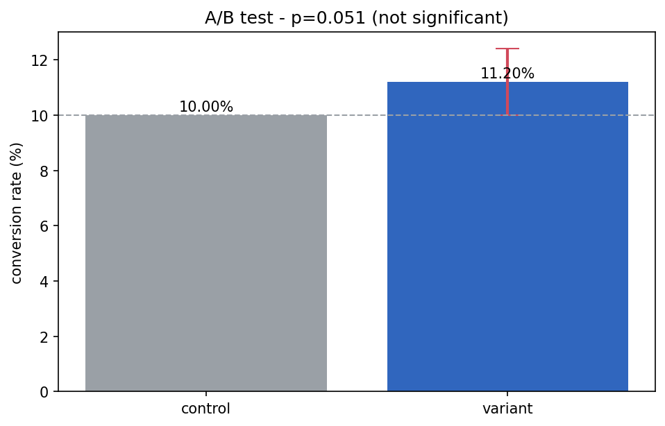

# A/B Test Calculator

[](https://colab.research.google.com/github/phoebefu6/phoebe-the-builder/blob/main/analytics-accelerator/ab-test-calc/demo.ipynb)
[](https://mybinder.org/v2/gh/phoebefu6/phoebe-the-builder/main?labpath=analytics-accelerator/ab-test-calc/demo.ipynb)

> Stop eyeballing significance. Enter your A/B numbers, get a proper two-proportion z-test - p-value, confidence interval, and a clear verdict - plus a sample-size planner.

## Business Impact
- **Before:** "Variant looks higher, ship it." Teams act on noise and chase phantom lifts.
- **After:** A rigorous test gives a p-value + CI + a yes/no verdict, and tells you how much traffic you need *before* you start.
- **Estimated ROI:** Fewer bad ship decisions; experiments that are actually powered.

## Tech Stack
Python, scipy (stats), Streamlit, pandas, matplotlib (notebook), Docker.

## Demo

**[Run the interactive demo notebook →](demo.ipynb)** - pre-rendered with outputs, or click the Colab/Binder badges above.



Run the calculator:
```bash
pip install -r requirements.txt
streamlit run app.py
```

## How it works
- `abtest.py` - `run_ab_test` (two-proportion z-test: pooled SE for the test, unpooled for the CI, two-sided p-value, verdict) and `required_sample_size` (visitors per variant to detect a given lift at a chosen power).
- `app.py` - Streamlit: inputs, a significant/not banner, metrics, a rates chart, and a sample-size planner.

## The trap it catches
A **+12% relative lift** (500/5000 → 560/5000) feels like a clear win - but its p-value is **0.051**, just over 0.05. Not significant. The calculator flags exactly this so you don't ship noise. A confidence interval that crosses 0 means "could be no difference."

## Edge case handled
Impossible inputs (zero sample size, conversions greater than visitors) raise a clear error instead of producing a garbage statistic.

## Platform note
The `abtest.py` core is UI-free and mountable as an **A/B Test** app on the platform shell (Analytics category).

## Learning Connection
Built while studying **Streamlit + statistics** (Month 3: Analytics Accelerator).
Applies: hypothesis testing (two-proportion z-test), confidence intervals, statistical power / sample-size calculation, and separating the stats core from the UI.

## Impact Note
- **Who benefits:** Product, growth, and marketing teams running experiments.
- **Potential risks:** A z-test assumes independent visitors and adequate sample size; it doesn't handle peeking (checking results repeatedly inflates false positives) or multiple variants without correction. Treat it as the core check, not the whole experimentation discipline.
