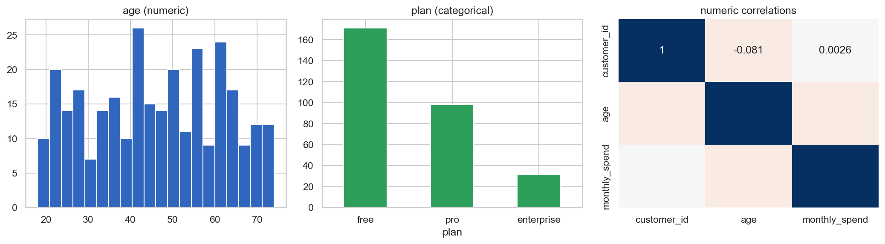

# Auto-EDA Dashboard

[](https://colab.research.google.com/github/phoebefu6/phoebe-the-builder/blob/main/analytics-accelerator/auto-eda/demo.ipynb)
[](https://mybinder.org/v2/gh/phoebefu6/phoebe-the-builder/main?labpath=analytics-accelerator/auto-eda/demo.ipynb)

> Drop in a CSV, get the whole first-look in seconds - shape, missingness, dtypes, distributions, correlations, and the quality problems worth a human's attention.

## Business Impact
- **Before:** Analysts spend ~2 hours hand-profiling every new dataset before they can trust it.
- **After:** Upload a CSV, get a structured profile + auto quality flags instantly, then start the real analysis.
- **Estimated ROI:** ~2 hrs saved per new dataset; fewer "garbage in" surprises later.

## Tech Stack
Python, pandas, numpy, Streamlit, seaborn/matplotlib (notebook), Docker.

## Demo

**[Run the interactive demo notebook →](demo.ipynb)** - pre-rendered with outputs, or click the Colab/Binder badges above.



Run the dashboard:
```bash
pip install -r requirements.txt
streamlit run app.py
```

## How it works
- `profiler.py` - the engine. `_infer_kind` assigns a **semantic type** (numeric / categorical / text / boolean / datetime / empty) beyond the raw dtype. `profile_column` gives type-appropriate stats. `quality_flags` surfaces problems. `profile_dataframe` ties it together; `numeric_correlations` adds a correlation matrix.
- `app.py` - Streamlit: overview metrics, quality flags first, per-column table, distributions, correlation heatmap.

## Quality flags it catches
| Flag | Severity | Meaning |
|------|----------|---------|
| ≥50% missing | error | column is mostly empty |
| ≥20% missing | warning | meaningful missingness |
| constant column | warning | single value - no signal |
| near-unique category | info | looks like an ID, not a category |
| duplicate rows | warning | exact-duplicate records |

## Edge case handled
**Object columns aren't all the same.** A string column might be a *category* (few values) or free *text* (mostly unique). The profiler splits them by cardinality ratio, so a high-cardinality string is flagged as an ID/text rather than charted as a category.

## Platform note
The `profiler.py` core is UI-free and mountable as an **Auto-EDA** app on the platform shell (Analytics category). For a full standalone HTML report, `ydata-profiling` is the heavyweight industry tool; this core is the fast, embeddable version.

## Learning Connection
Built while studying **Streamlit** + **data profiling** (Month 3 kickoff: Analytics Accelerator).
Applies: semantic type inference, automated data-quality checks, separating a reusable profiling core from the UI.

## Impact Note
- **Who benefits:** Analysts and data scientists onboarding new datasets.
- **Potential risks:** Heuristic typing (the 0.5 cardinality threshold) can mislabel edge cases - treat flags as guidance. Profiling very wide/large frames is memory-bound; sample first if needed.
