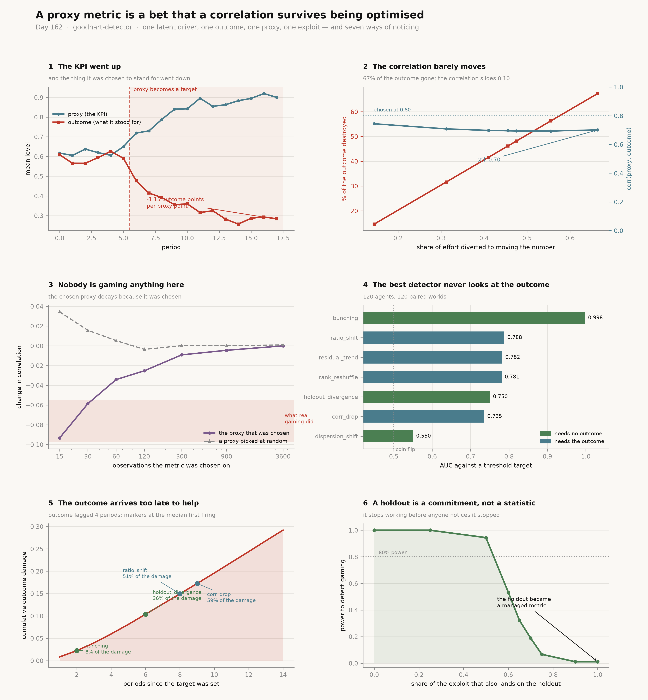

# Goodhart Detector

[](https://colab.research.google.com/github/phoebefu6/phoebe-the-builder/blob/main/analytics-engineering-bi/goodhart-detector/demo.ipynb)
[](https://mybinder.org/v2/gh/phoebefu6/phoebe-the-builder/main?labpath=analytics-engineering-bi/goodhart-detector/demo.ipynb)

> A proxy metric gets picked because it correlates with the outcome somebody cares about. It becomes a target. It goes up. A year later nobody can say whether the outcome followed, and the honest answer is that the correlation which justified the choice was measured before anyone was paid for the number, and has carried no information since.

**Day 162 - Analytics Engineering & BI.** One latent driver, one outcome, one proxy, one exploit. Seven detectors, 200 paired worlds each, a measured null for every one of them, 34 tests, and a notebook that rebuilds every figure from numpy and scipy.



> **The KPI improved and every proxy point cost 1.15 outcome points.** In a world where the proxy correlated **0.80** with the outcome before it became a target, 46% of effort moved to the exploit; the proxy rose 0.22 and the outcome fell 0.26.
>
> **The correlation is a terrible alarm.** Two thirds of the outcome can be destroyed while `corr(proxy, outcome)` slides from 0.80 to 0.70. Every 0.01 of correlation lost is worth **6.9%** of the outcome — a quarterly review comparing 0.80 to 0.70 does not call that a break.
>
> **The correlation falls when nobody games anything.** A proxy chosen as best-of-12 on 15 observations decays **-0.0967** with the exploit switched off entirely — as large as the drop maximal gaming produced (-0.0978). `corr_drop` fires on that clean world **35%** of the time against a nominal 5%. A randomly chosen candidate does not decay at all: the decay is caused by the choosing.
>
> **The detector that wins never looks at the outcome.** `bunching` scores AUC **0.999** against a quota and reaches 80% power at **75 agents**, where `corr_drop` needs **2,400**. It fires at period 2 with 8% of the damage done; `corr_drop` fires at period 9 with 59% done, because the outcome is reported late — which is the reason somebody proxied it.
>
> **Negative result: it is not portable.** `bunching` is worth exactly nothing (AUC 0.500) against a "make it go up" target, because there is no line to bunch against. Detection has to be chosen against the shape of the target, not installed once.

## Business Impact

- **Before:** a proxy KPI is adopted on a correlation, targeted, and reviewed by looking at whether it went up. When somebody eventually asks whether it still means anything, the check is a correlation against an outcome that arrives months late — and that check is unpowered, uncalibrated, and confounded by the selection that chose the metric.
- **After:** the metric carries the sample it was chosen on (which bounds how much of any later decay is the winner's curse), a detector matched to whether the target is a line or a direction, that detector's measured false-positive rate rather than its nominal one, and the agent count it needs to reach 80% power.
- **Estimated ROI:** on a quota, moving from `corr_drop` to `bunching` cuts the damage accrued before the first alarm from **59% to 8%** of the window's total, and drops the org size needed for 80% power from 2,400 agents to 75.

## Where this sits

Third build in **KPI governance and target setting**, after [`target-setter`](../target-setter/) (Day 159) and [`guardrail-metric`](../guardrail-metric/) (Day 160). `target-setter` asked where the number came from. `guardrail-metric` asked what stops you hitting it the wrong way. This one asks whether the number still means what it meant when you picked it.

The KPI plumbing was already here: [`kpi-tracker`](../../analytics-accelerator/kpi-tracker/) and [`kpi-tree`](../kpi-tree/) track and decompose, [`metric-catalog`](../metric-catalog/) and [`metrics-layer`](../metrics-layer/) define, [`metric-diff`](../metric-diff/) and [`metric-alerting`](../metric-alerting/) watch for movement. All six assume the metric means what it says.

It is **not** [`model-drift-detector`](../../ai-agent-workshop/model-drift-detector/) (Day 49), which watches a model's inputs shift underneath it — here nothing drifts, people respond. It is not [`calibration-checker`](../../ml-engineering-toolkit/calibration-checker/) (Day 78). Nearest in spirit is the decision-support arc: [`decision-log`](../../mini-saas-products/decision-log/), [`pre-mortem`](../../mini-saas-products/pre-mortem/), [`expected-value-calc`](../../mini-saas-products/expected-value-calc/), [`cost-of-delay`](../../mini-saas-products/cost-of-delay/).

## What it does

Eight sections in `evidence.py`. Every number below is printed by it and asserted in `test_goodhart.py`.

### 1. A world where the answer is known

Goodharting cannot be graded on real data, because with real data nobody knows whether the harm was there. So the harm is written down. Each agent splits its effort between doing the work and moving the number:

```
latent quality   L = skill + kappa*(1 - u)
outcome          y = a_y*L        + N(0, sigma_y)
proxy            p = beta*L + gamma*u + N(0, sigma_p)
```

`u` is the share of effort diverted to the exploit. Diverting one unit buys `gamma - beta*kappa` = **+0.50** proxy points and destroys `a_y*kappa` = **0.60** outcome points. The exploit pays **1.83x** what honest work pays *on the proxy*, and that single inequality is the whole of Goodhart's law here. Nothing downstream is allowed to see `u` or `skill`.

With nobody gaming, `corr(proxy, outcome)` = **0.8000**. This is a good proxy, and it is good for a real reason: it loads on the same latent driver the outcome loads on.

| regime | u (mean) | proxy observed | proxy true | outcome observed | outcome true |
|---|---:|---:|---:|---:|---:|
| continuous ("make it go up") | 0.456 | +0.2214 | +0.2279 | **-0.2552** | -0.2735 |
| threshold ("clear the line") | 0.033 | +0.0102 | +0.0167 | -0.0017 | **-0.0200** |

**Exchange rate: -1.15 outcome points per proxy point** (closed form -1.20).

**On a quota, the aggregate cannot see the harm.** True damage is -0.0200 and the observed total moves -0.0017 — **11.7x smaller than the truth**, and well inside its own noise. A quota does not move the average; it moves the shape.

### 2. The correlation barely moves

| effort diverted | rho before | rho after | change | proxy move | outcome destroyed |
|---:|---:|---:|---:|---:|---:|
| 0.145 | 0.7990 | 0.7440 | -0.0550 | +0.0658 | 14.7% |
| 0.312 | 0.7990 | 0.7083 | -0.0907 | +0.1496 | 31.7% |
| 0.456 | 0.7990 | 0.6951 | -0.1039 | +0.2214 | 46.2% |
| 0.555 | 0.7990 | 0.6936 | -0.1054 | +0.2712 | 56.3% |
| 0.664 | 0.7990 | 0.7012 | -0.0978 | +0.3257 | **67.3%** |

Two thirds of the outcome gone; the correlation slides one decimal place. **Each 0.01 of correlation is worth 6.9% of the outcome.** The relationship is not even monotone — at the heaviest gaming the correlation *recovers* slightly, because by then almost everyone is gaming and the diverted effort is no longer what distinguishes agents.

### 3. The correlation drops when nobody games (winner's curse)

A metric becomes *the* metric because it correlated best out of several candidates. The winner's measured correlation is its true correlation plus whatever noise helped it win, and that noise does not come back next period. Twelve candidates, **the exploit switched off entirely**:

| observations it was chosen on | chosen proxy | random proxy | `corr_drop` fires |
|---:|---:|---:|---:|
| 15 | **-0.0967** | +0.0221 | **0.350** |
| 30 | -0.0576 | +0.0156 | 0.240 |
| 60 | -0.0377 | +0.0019 | 0.203 |
| 120 | -0.0234 | -0.0004 | 0.198 |
| 300 | -0.0107 | -0.0017 | 0.100 |
| 900 | -0.0046 | -0.0001 | 0.068 |
| 3600 | -0.0008 | +0.0004 | 0.003 |

The mildest gaming in section 2 destroyed 14.7% of the outcome and moved the correlation -0.0550. **Selection alone, with nobody gaming, moves it -0.0967** — larger than that, and equal to what *maximal* gaming produced. A randomly chosen candidate does not decay.

`corr_drop`'s false-positive rate stays above nominal out to **120 observations**. The test itself is fine — on a proxy nobody chose it sits at 0.035. The inflation is entirely the selection.

**So "the correlation fell" is not evidence of Goodharting unless you know how much data the metric was picked on.** Nobody records this. It is one integer.

### 4. Seven detectors, with a measured null

120 agents — a realistic branch network. At the 600-agent default every outcome-based detector scores AUC 1.000 against a continuous target and the table says nothing.

| detector | needs | false pos | power | power @ calibrated | AUC |
|---|---|---:|---:|---:|---:|
| `bunching` | — | 0.020 | **0.980** | 0.990 | **0.999** |
| `ratio_shift` | outcome | 0.045 | 0.355 | 0.355 | 0.781 |
| `residual_trend` | outcome | **0.175** | 0.565 | 0.350 | 0.779 |
| `rank_reshuffle` | outcome | 0.020 | 0.200 | 0.280 | 0.768 |
| `holdout_divergence` | — | 0.015 | 0.085 | 0.285 | 0.751 |
| `corr_drop` | outcome | 0.035 | 0.150 | 0.225 | 0.734 |
| `dispersion_shift` | — | 0.000 | 0.005 | 0.065 | 0.538 |

**`residual_trend` has the best raw power in the table and over-fires by 3.5x.** It fits its baseline on the pre-period and then ignores that fit's own error. At its empirical critical value it is worth 0.350, not 0.565 — behind `ratio_shift`. Any detector shipped without a measured null is quoting a power it does not have.

**Negative result: `bunching` does not port.** AUC 0.999 on a quota, **0.500** on "make it go up". It reads the shape of the distribution around a line, and a direction has no line. And it needs the agent to see the metric before it is recorded — true of a quota or a scorecard, false of anything measured server-side.

### 5. The outcome arrives too late to help

Outcome reported 4 periods behind, which is *why* it was proxied:

| detector | ever fires | median period | damage by then |
|---|---:|---:|---:|
| `bunching` | 1.00 | **2** | **8%** |
| `holdout_divergence` | 0.64 | 6 | 36% |
| `ratio_shift` | 0.82 | 8 | 51% |
| `residual_trend` | 0.94 | 8 | 51% |
| `corr_drop` | 0.53 | 9 | 59% |
| `rank_reshuffle` | 0.70 | 9 | 59% |
| `dispersion_shift` | 0.03 | 12 | 84% |

An outcome-based detector **cannot be computed at all** until period 6. By the time it is computable, 36% of the window's damage is already done. This is not a statistical problem and no amount of power fixes it.

### 6. The holdout is a policy, not a statistic

`holdout_divergence` compares the target against a sibling metric nobody was told to move. It needs no outcome. It costs one metric kept off every dashboard and out of every bonus — and that discipline decays:

| share of the exploit that also lands on the holdout | power | false pos |
|---:|---:|---:|
| 0.00 | 1.000 | 0.020 |
| 0.50 | 0.940 | 0.020 |
| 0.60 | 0.513 | 0.020 |
| 0.75 | 0.060 | 0.020 |
| 1.00 | **0.007** | 0.020 |

Half the exploit leaking costs almost nothing; then it falls off a cliff between 0.50 and 0.60. **The false-positive rate never moves**, so the failure is silent — the detector does not complain, it stops seeing. A fully-managed holdout moves *with* the target again, which is exactly what a healthy metric looks like.

### 7. How many agents each detector needs

| detector | n=75 | n=150 | n=300 | n=600 | n=1200 | n=2400 | n for 80% |
|---|---:|---:|---:|---:|---:|---:|---:|
| `bunching` | 0.95 | 1.00 | 1.00 | 1.00 | 1.00 | 1.00 | **75** |
| `residual_trend` | 0.43 | 0.68 | 0.72 | 0.92 | 1.00 | 1.00 | 600 |
| `ratio_shift` | 0.22 | 0.42 | 0.53 | 0.79 | 0.99 | 1.00 | 1200 |
| `rank_reshuffle` | 0.14 | 0.27 | 0.46 | 0.71 | 0.92 | 0.99 | 1200 |
| `corr_drop` | 0.12 | 0.17 | 0.28 | 0.53 | 0.78 | 0.97 | 2400 |
| `holdout_divergence` | 0.10 | 0.18 | 0.35 | 0.51 | 0.79 | 0.96 | 2400 |
| `dispersion_shift` | 0.00 | 0.01 | 0.00 | 0.03 | 0.11 | 0.17 | >2400 |

Read the row, not the name. A detector that reaches 0.80 only at thousands of agents is not available to a team with forty branches, whatever its AUC says.

### 8. What survives

1. The proxy did its job and the outcome fell — **1.15 outcome points per proxy point**, from a proxy that correlated 0.80 before it was targeted.
2. **A correlation drop is not evidence.** Selection on a short history reproduces the drop maximal gaming causes, with nobody gaming.
3. **The detectors available in time are the ones that never look at the outcome.**
4. **None of them ports.** `bunching` is first on a quota and worthless on a direction; `holdout_divergence` works on both and dies the moment the holdout leaks.
5. **Nothing detects Goodharting from the KPI alone.** Every detector that worked needed a second series the target did not control — an outcome, a sibling metric, or the shape around a line. A single number going up carries no information about whether to trust it.

## What this does not do

- **It is a simulation, not an estimator.** It measures what detectors can do in a world whose answer is known. Pointed at real data it will report a statistic; the world's true `u` is not available to check it against, which is the whole problem.
- **One exploit, linear.** Real gaming is many exploits with different costs. The bang-bang effort split is a corner solution of a linear problem — correct for the model, and simpler than reality.
- **Agents do not learn from each other beyond a fixed adoption hazard**, and nobody is caught or punished.
- **`bunching` assumes the agent can see the metric before it lands.** Untrue for server-side measures, where only `holdout_divergence` remains.

## Tech Stack

Python 3.10+, numpy, scipy, pandas, matplotlib, Streamlit, pytest, ruff. No data files, no network, no API keys. `evidence.py` runs in ~2 minutes and writes `results.json`.

## Demo

**[Run the interactive demo notebook →](demo.ipynb)** — pre-rendered with outputs, or click the Colab/Binder badges above to run it live.

```bash
pip install -r requirements.txt
python evidence.py          # the whole argument, eight sections
python -m pytest -q         # 34 tests
python make_chart.py        # regenerate the hero figure
streamlit run app.py        # move the exploit and watch the detectors
```

## Learning Connection

Built while working through KPI governance for the CDAIO track. Applies: Goodhart's law as a statement about *relative cost of two paths* rather than about metrics; the winner's curse in metric selection; power and calibration under a measured null; bunching / density-discontinuity tests from applied economics; and the distinction between a statistic and an organisational commitment.

## Impact Note

- **Who benefits:** anyone who has to defend a KPI to a board, or is about to attach a bonus to one.
- **Potential risks:** the detectors here fire on *any* structural change in how a proxy relates to its outcome, and a legitimate process improvement looks similar. Treat a firing as a question, not a verdict — particularly `bunching`, which is nearly perfect at detecting that agents are managing to a line and says nothing about whether that is bad. Do not use this to accuse individuals; it measures aggregate behaviour and has no per-agent power at all.
