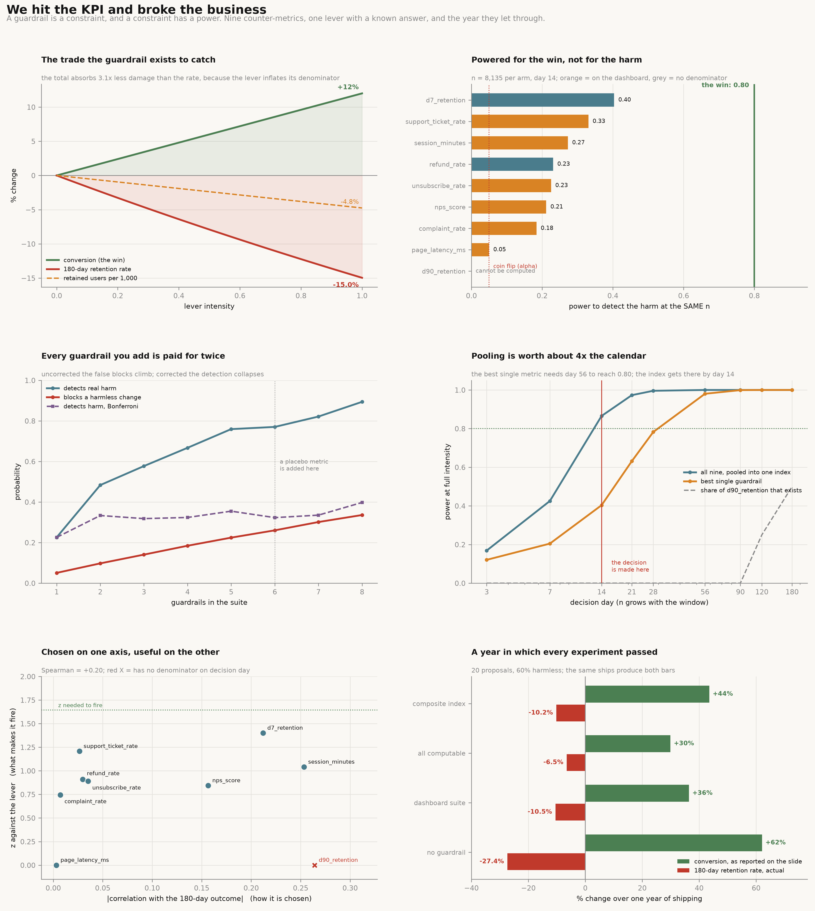

# Guardrail Metric

[](https://colab.research.google.com/github/phoebefu6/phoebe-the-builder/blob/main/analytics-engineering-bi/guardrail-metric/demo.ipynb)
[](https://mybinder.org/v2/gh/phoebefu6/phoebe-the-builder/main?labpath=analytics-engineering-bi/guardrail-metric/demo.ipynb)

> Every experiment review has a checklist of counter-metrics. Somebody confirms none of them moved, and the change ships. A year later conversion is up and the business is worse, and each one of those experiments passed. The checklist was never wrong — it was never powered. A guardrail is not a second metric. It is a constraint, and a constraint has a threshold, a maturity and a power, and almost nobody computes the third one.

**Day 160 - Analytics Engineering & BI.** Nine counter-metrics, one growth lever with a known answer, 20,000 simulated experiments, a year of shipping re-run 2,000 times, 31 tests, and a notebook that rebuilds every figure from numpy and scipy.



> **The experiment is powered 0.80 for the win and 0.33 for the harm.** Sized for a +12% lift the way every experiment is sized, the best counter-metric on the dashboard reaches a third of that power against a change that costs 15% of the retention rate. To notice the harm as reliably as the win, it needs **4.2x** the sample.
>
> **The metric that best predicts the outcome has a denominator of exactly zero on decision day.** `d90_retention` ranks first of nine on correlation with the 180-day outcome. On day 14, `(14 - 90)` is negative: no user has been enrolled long enough to have a value. It is on the checklist and it cannot be computed.
>
> **Adding a guardrail can make you less safe.** A placebo metric the lever provably cannot touch moves the false-block rate on a harmless change from 0.227 to 0.265, and — once the suite is corrected for its own size — moves detection of real harm from 0.355 to **0.326**. Worse on both counts.
>
> **The fix is free and it is not a new metric.** Pooling the same nine numbers into one directional index instead of testing them one at a time moves detection of an ordinary change from 0.195 to 0.403 at an identical false-block rate. The clever half — weighting by causal sensitivity — adds 4.1 more points. The free half is worth **5x** the costly half.

## Business Impact

- **Before:** a counter-metric goes on the ship checklist because it correlates with churn. Nobody computes the probability that it would fire if the harm were real, whether it has a denominator on decision day, or what happens to the suite's false-alarm rate when a tenth metric is added. A clean checklist is read as evidence of safety.
- **After:** every guardrail carries its power, its maturity and the sample it would need to be worth trusting. The suite is replaced by a single pooled index, which costs nothing and is measurably better. "No significant change" is reported as *not measured* until a margin is stated and cleared.
- **Estimated ROI:** in the simulated year, the suite most teams run recovers **62%** of the retention damage it exists to prevent while refusing **26%** of harmless changes. At its own best threshold it beats running no guardrail at all by **0.47** points of retained users. The composite built from the same nine metrics is worth **+5.99**.

## Where this sits

Second build in **KPI governance and target setting**, after [`target-setter`](../target-setter/) (Day 159). The KPI plumbing was already here — [`kpi-tracker`](../../analytics-accelerator/kpi-tracker/) and [`kpi-tree`](../kpi-tree/) track and decompose, [`metric-catalog`](../metric-catalog/) and [`metrics-layer`](../metrics-layer/) define, [`metric-diff`](../metric-diff/) and [`metric-alerting`](../metric-alerting/) watch for movement. `target-setter` asked where the number came from. This one asks what stops you hitting it the wrong way.

It is **not** an A/B calculator. [`ab-test-calc`](../../analytics-accelerator/ab-test-calc/) and [`sample-size-calc`](../../data-science-cookbook/sample-size-calc/) size and evaluate the *primary* test; the argument here is that sizing the primary test is exactly what leaves the counter-metrics unpowered. It is not [`llm-guardrails`](../../llmops-genai-platform/llm-guardrails/) (Day 84), which filters model output.

Nearest neighbour in spirit is the decision-support arc — [`decision-log`](../../mini-saas-products/decision-log/), [`pre-mortem`](../../mini-saas-products/pre-mortem/), [`expected-value-calc`](../../mini-saas-products/expected-value-calc/), [`cost-of-delay`](../../mini-saas-products/cost-of-delay/).

## What it does

Ten sections in `evidence.py`. Every number below is printed by it and asserted in `test_guardrails.py`.

### 1. A world where the answer is known

A guardrail cannot be graded against real data, because with real data nobody knows whether the harm was there. So the harm is written down. A growth lever at intensity $a$ does two ordinary things:

$$\text{conversion}(a) = p_0(1 + \lambda a), \qquad V(a) = 1000\left[p_0 r_{\text{good}}\left(1 - \delta\,\alpha a\right) + p_0\lambda a\, r_{\text{marg}}\right]$$

It buys incremental conversions whose users retain at 8% against an ordinary converter's 62%, and it makes the product pushier for 35% of everyone, which costs them retention. Five constants, and both mechanisms drive every guardrail in the catalogue — nothing is typed in twice.

| intensity | conversion | reported lift | retained/1k | volume change | 180d ret. rate | rate change |
|---:|---:|---:|---:|---:|---:|---:|
| 0.00 | 0.1000 | 0.0% | 62.00 | 0.00% | 0.6200 | 0.00% |
| 0.50 | 0.1060 | +6.0% | 60.53 | −2.38% | 0.5710 | −7.90% |
| 1.00 | 0.1120 | **+12.0%** | 59.05 | −4.75% | 0.5273 | **−14.96%** |

**The aggregate metric hides the harm.** Retained users per 1,000 fall 4.75%; the retention *rate* falls 14.96% — **3.1x as much** — because the lever inflates the denominator with exactly the users who will not retain. A total absorbs a great deal of damage to a rate before it visibly moves.

### 2. The experiment is powered for the win and not for the harm

Sized the way every experiment is sized — enough to detect the lift you hope for — the same $n$ gives this against the harm you hope to avoid:

| guardrail | denominator on day 14 | z | power | n for 80% | multiple |
|---|---:|---:|---:|---:|---:|
| `d7_retention` | 407 | 1.40 | 0.404 | 25,638 | 3.2x |
| `support_ticket_rate` *(dashboard)* | 7,554 | 1.21 | 0.331 | 34,514 | 4.2x |
| `session_minutes` *(dashboard)* | 7,554 | 1.04 | 0.273 | 46,429 | 5.7x |
| `refund_rate` | 639 | 0.91 | 0.231 | 60,822 | 7.5x |
| `unsubscribe_rate` *(dashboard)* | 6,973 | 0.89 | 0.225 | 63,473 | 7.8x |
| `nps_score` *(dashboard)* | 105 | 0.84 | 0.212 | 70,658 | 8.7x |
| `complaint_rate` *(dashboard)* | 6,973 | 0.74 | 0.184 | 90,672 | 11.1x |
| `page_latency_ms` *(placebo)* | 8,135 | 0.00 | 0.050 | unreachable | — |
| `d90_retention` | **0** | — | **cannot be computed** | unreachable | — |

The whole catalogue tops out at **50%** of the power the experiment was built to have, and the metrics actually on the checklist top out at **41%**. `page_latency_ms` is a metric the lever provably cannot move, and it fires at exactly alpha — it is a coin, included as a negative control that validates the harness.

### 3. "No significant change" is not "no harm"

| | probability |
|---|---:|
| A maximally harmful change clears the dashboard checklist | **0.235** |
| A completely harmless change clears the dashboard checklist | 0.734 |

The tick is not worthless, but it is nowhere near what a review treats it as: it is roughly three times more likely under harmlessness, on a change costing 15% of the retention rate.

The honest reading of "no significant change" is **not measured**. To actually *prove* the harm is smaller than a stated bound — a non-inferiority test at a margin of intensity 0.2 — takes **536,910 per arm, 66x the experiment**. At the sample actually run, a genuinely clean change can be proved clean only 8.8% of the time.

### 4. Adding a guardrail can make you less safe

| k | metric added | false block | detects harm | Bonferroni detect |
|---:|---|---:|---:|---:|
| 1 | `unsubscribe_rate` | 0.049 | 0.228 | 0.228 |
| 5 | `session_minutes` | 0.227 | 0.754 | **0.355** |
| 6 | `page_latency_ms` *(placebo)* | **0.265** | 0.766 | **0.326** |
| 8 | `d7_retention` | 0.336 | 0.890 | 0.401 |

Adding a metric with zero causal sensitivity raises false blocks **and** lowers corrected detection. A guardrail that cannot fire for a real reason is not free.

The false-block column is not an artefact of correlated metrics: the observed 0.3365 matches $1-(1-0.05)^8 = 0.3366$ to four decimal places, because under the null these guardrails are near-independent (largest pairwise correlation 0.007). Every one you add multiplies the chance something harmless trips.

**The dilemma has no clean fix.** Uncorrected, the suite blocks 33.6% of harmless changes. Corrected, detection of a maximally harmful change falls from 0.890 to 0.401. Both are consequences of running many underpowered tests instead of one powered one.

### 5. What a 14-day window can even see

Users enrol uniformly, so a metric needing $m$ days of exposure is observable for $(D-m)/D$ of them. One rule, applied to every guardrail.

| decision day | n/arm | d7 observable | d90 observable | best single | pooled index |
|---:|---:|---:|---:|---:|---:|
| 7 | 4,067 | 0% | 0% | 0.205 | 0.419 |
| **14** | **8,135** | **50%** | **0%** | **0.404** | **0.858** |
| 28 | 16,270 | 75% | 0% | 0.783 | 0.994 |
| 56 | 32,540 | 88% | 0% | 0.980 | 1.000 |
| 180 | 104,592 | 96% | 50% | 1.000 | 1.000 |

The best single guardrail does not reach 80% power until **day 56** — 4x the window the decision is made in — while the pooled index gets there by day 14. **Pooling nine metrics that are already being collected is worth about 4x the calendar, and costs nothing.**

`d90_retention` stays at a zero denominator until day 90 and is still only 50% observable in a 180-day experiment. No window a growth team will accept makes the best predictor measurable.

### 6. One ship is fine. Twenty is not.

20 proposals a year, 60% genuinely harmless, 2,000 simulated years. A change ships if the win is significant *and* the guardrail policy clears it.

| policy | ships/yr | harmful | caught | reported lift | 180d ret. rate | retained users |
|---|---:|---:|---:|---:|---:|---:|
| no guardrail | 7.61 | 3.03 | 0.0% | +62.1% | −27.36% | +31.3% |
| dashboard suite | 4.59 | 1.19 | 60.9% | **+36.4%** | **−10.49%** | +27.5% |
| all computable | 3.79 | 0.77 | 74.5% | +29.9% | −6.51% | +25.3% |
| composite index | 5.57 | 1.24 | 59.1% | +43.6% | −10.16% | **+37.3%** |

The slide adds up to +36.4% of conversion. The retention rate is 10.5% lower. Both come from the same shipped experiments, and **every one of them passed.**

**The ship filter selects for harm.** Mean proposed intensity is 0.50; mean *shipped* intensity is 0.60, because reaching significance on the win requires the aggressive version of the change. The filter deciding what ships is correlated with the thing the guardrail is meant to catch.

### 7. Choosing a guardrail by correlation chooses the wrong one

In practice somebody correlates every available metric against churn and takes the top of the list.

| guardrail | \|corr\| with 180d outcome | rank | causal z | rank | runnable day 14 |
|---|---:|---:|---:|---:|:--|
| `d90_retention` | 0.2649 | **1** | 0.00 | 8 | **NO** |
| `session_minutes` | 0.2514 | 2 | 1.04 | 3 | yes |
| `d7_retention` | 0.2131 | 3 | **1.40** | **1** | yes |
| `support_ticket_rate` | 0.0281 | 7 | 1.21 | 2 | yes |

Spearman between the two rankings is **+0.201 (p = 0.604)** — with nine metrics, not distinguishable from zero. The metric an analyst picks first cannot be measured at all on decision day; the metric with the most causal sensitivity is third by correlation. **Predicting the outcome and responding to the lever are different properties, and only the second one makes a guardrail fire.**

### 8. The guardrail's alpha is not the win's alpha

Priced in one unit — 180-day retained users at year end, conversion volume times retention rate — so blocking a harmless change and shipping a harmful one both cost something real. Baseline with no guardrail: **+31.33%**.

| alpha | clean blocked | harmful caught | composite: retained users | dashboard suite: retained users |
|---:|---:|---:|---:|---:|
| 0.01 | 1.0% | 35.4% | +36.28% | **+31.80%** ← its best |
| 0.05 | 5.5% | 59.1% | **+37.32%** ← its best | +27.49% |
| 0.20 | 20.1% | 80.2% | +32.67% | +9.79% |
| 0.50 | 49.2% | 92.8% | +20.31% | +0.60% |

**NEGATIVE RESULT for the obvious thesis:** 0.05 is not automatically wrong. For the well-powered composite the optimum *is* 0.05 and the curve is nearly flat across 0.01–0.10, so a strong guardrail does not need its threshold tuned at all.

And the direction reverses the intuition. A weak guardrail does not want a *looser* threshold to compensate — it wants the tightest one swept, because raising its sensitivity buys false blocks faster than it buys detection. Its year-end curve is monotone down across the whole range: there is no setting at which it earns its place.

**The number that ends the argument:** the dashboard suite *at its own optimum* is worth **+0.47** points of retained users against running no guardrail whatsoever. The composite built from the same nine metrics is worth **+5.99**. The metrics were never the problem. Testing them one at a time was.

### 9. What actually helps, at an equal false-block rate

Every policy tuned to block exactly 10% of harmless changes, so they are compared on detection rather than on twitchiness.

| policy | n/arm | day | detect a=1.0 | detect a=0.4 | 180d ret. rate |
|---|---:|---:|---:|---:|---:|
| dashboard suite, any fires | 8,135 | 14 | 0.488 | 0.195 | −18.11% |
| all computable, any fires | 8,135 | 14 | 0.564 | 0.228 | −16.67% |
| **composite, equal weights** | 8,135 | 14 | 0.890 | **0.403** | −8.55% |
| composite, sensitivity-weighted | 8,135 | 14 | 0.928 | 0.444 | −6.98% |
| composite + 4x the sample | 32,540 | 14 | 1.000 | 0.823 | −2.17% |
| composite + 56-day window | 32,540 | 56 | 1.000 | **0.905** | −1.46% |

At full intensity most policies sit near the ceiling; the column that separates them is **a = 0.4**, the ordinary unremarkable change that ships most often and does most of the cumulative damage.

**NEGATIVE RESULT:** sensitivity weighting is the expensive half of the idea — it needs an estimate of how hard the lever moves each metric, the one thing nobody has — and it is worth **4.1 points** against the **20.8 points** that pooling with *equal* weights already delivered. The free half is worth **5x** the costly half.

Cost-matched at 4x the baseline users: 4x the sample in a 14-day window reaches 0.823; the same users spent on a 56-day window reach 0.905. Calendar and sample are not interchangeable — the window buys maturity as well as n — but the gap is 8.2 points, not an order of magnitude.

### 10. What a guardrail has to carry

1. **A threshold it could actually cross.** Powered 0.80 on the win, 0.33 on the harm. That gap is what the tick measures.
2. **A denominator that exists on decision day.** Maturity is arithmetic, not diligence.
3. **Sensitivity to the lever, not correlation with the outcome.** Spearman +0.201.
4. **A margin, not a null.** Proving a bound takes 66x the sample.
5. **One test, not nine.** 0.195 → 0.444 at a matched false-block rate.
6. **Its own alpha, set by its own power.** 0.05 is not wrong everywhere — it is unexamined everywhere.
7. **A year-end number.** +36.4% on the slide, −10.5% on the retention rate.

## Tech Stack

Python 3.12, numpy, scipy, matplotlib, Streamlit, pytest, ruff, Docker. No dataset and no API: the world is simulated from five constants so the true answer is known and every claim is checkable.

## Demo

**[Run the interactive demo notebook →](demo.ipynb)** — pre-rendered with outputs, or click the Colab/Binder badges above to run it live.

```bash
pip install -r requirements.txt
python evidence.py                 # the full ten-section study
python -m pytest test_guardrails.py -q   # 31 tests pinning every number
python make_chart.py               # regenerate the hero figure
streamlit run app.py               # set an experiment, read the power
```

## How it is built

| file | what it holds |
|---|---|
| `guardrails.py` | the world, the nine-guardrail catalogue, maturity, the analytic power model, the simulator, the decision rules |
| `evidence.py` | the ten sections; every printed number is derived, none typed |
| `test_guardrails.py` | 31 tests — analytic claims exactly, simulated claims to Monte Carlo tolerance |
| `make_chart.py` | the six-panel hero figure, PNG + SVG |
| `app.py` | Streamlit: pick a suite and a window, see what could fire |
| `build_notebook.py` | generates `demo.ipynb`, which re-implements a compact engine so Colab needs nothing else |

Correlation between guardrails is **generated, not assumed**: within a replication every annoyance metric conditions on the same realised count of annoyed users, and every converter metric on the same realised marginal converters. The composite's null is then calibrated by simulation rather than assumed to be unit variance — which is how we learn it comes out at 1.005, a *result* of near-independence rather than a premise.

The simulator is checked against a closed-form power model for all nine guardrails, and every guardrail is checked to hold its false-positive rate at 0.050 under the null.

## Learning Connection

Built while studying experimentation platforms and decision quality. Applies: statistical power as a design constraint rather than a post-hoc statistic, family-wise error across a metric suite, non-inferiority testing, composite indices over correlated signals, and the difference between a metric that predicts an outcome and a metric that responds to an intervention.

## Impact Note

- **Who benefits:** anyone who signs off experiments against a counter-metric checklist — growth, product analytics, experimentation platform teams, and the people who inherit the year.
- **Potential risks:** the world here is simulated, and the specific numbers are properties of these constants. What transfers is the *method* — compute the power, check the denominator exists, pool instead of splitting — not the figure 0.33. Reporting a real guardrail's power requires an effect size somebody is willing to defend, and picking a self-serving one makes any guardrail look adequate. The composite index is strictly better here partly *because* these guardrails are near-independent; correlated guardrails would narrow the gap, which is the first thing to check before adopting it.
