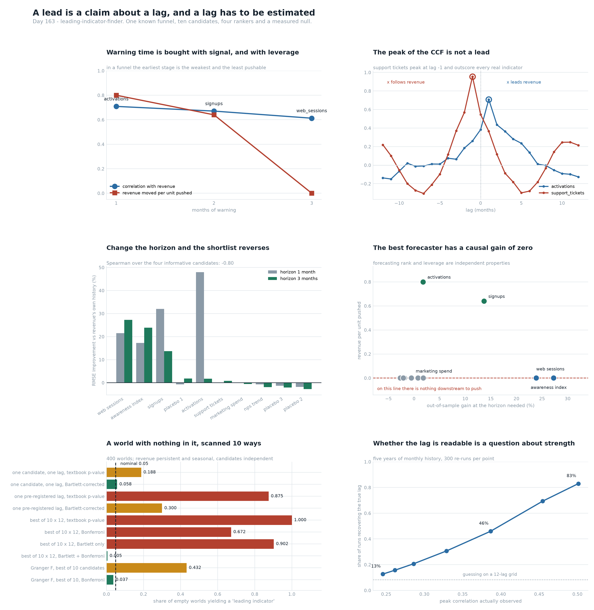

# Leading Indicator Finder

[](https://colab.research.google.com/github/phoebefu6/phoebe-the-builder/blob/main/analytics-engineering-bi/leading-indicator-finder/demo.ipynb)
[](https://mybinder.org/v2/gh/phoebefu6/phoebe-the-builder/main?labpath=analytics-engineering-bi/leading-indicator-finder/demo.ipynb)

> Revenue lands a month after anyone could have done something about it, so somebody builds a table of candidate upstream metrics, correlates each against revenue at a few lags, sorts by the biggest number and puts the top three on a dashboard. Nothing in that table says how much warning the winner actually gives, whether the relationship would survive knowing revenue's own history, or whether pushing the metric would move anything at all.

**Day 163 - Analytics Engineering & BI.** One funnel whose true leads and causal gains are known, ten candidates, four rankers, a rolling-origin backtest, a do-operator, a measured null over 400 empty worlds, 34 tests, and a notebook that rebuilds every figure from numpy and scipy.



> **The peak of the cross-correlation function is not a lead.** `support_tickets` are *caused by* revenue a month later. Their peak correlation is **+0.955 at lag -1** - higher than any real indicator here - so any scan that takes the biggest absolute correlation over a symmetric lag window reports a follower as the strongest leading indicator in the business.
>
> **Respecting the sign is not enough.** Revenue is persistent, so a metric tracking last month's revenue also tracks this month's: `support_tickets` still post **+0.365 at lag +1**. Only conditioning on revenue's own history kills it (Granger p = 0.37).
>
> **Change the horizon and the shortlist reverses.** At h=1 the winner is `activations` (**+47.99%** RMSE improvement over revenue's own history). At h=3 it collapses to **+1.76%, p=0.256** - it leads by one month, so it cannot be read early enough to matter - and `web_sessions`, the weakest of the three real signals, wins at **+27.25%**. Spearman between the two rankings over the four informative candidates: **-0.80**.
>
> **The best forecaster has a causal gain of exactly 0.000.** `web_sessions` is a sensor: it reads demand without being part of the chain, so there is nothing downstream of it to push. The metric with the most leverage (`activations`, 0.80 revenue per unit) gives the least warning. In a funnel those two properties are ordered against each other.
>
> **A correlation scan finds a leading indicator in 100% of empty worlds.** Ten candidates x twelve lags, textbook p-value, revenue persistent and seasonal and the candidates drawn independently: **1.000**. One candidate at one pre-registered lag already fires **0.188**. Bonferroni alone leaves **0.672**; a Bartlett effective-sample correction alone leaves **0.902**; both together reach **0.005**. Each looks adequate in isolation.
>
> **Negative result: the lag is the easy part.** With a real signal, five years of monthly data recovers the true lag **78-99%** of the time and twenty years recovers it always. What governs readability is strength, not history: at r ~ 0.25 the reported lag is right **13%** of the time on a twelve-lag grid.
>
> **Negative result: lag stability is not a free screen.** It scores the four unrelated series 0.28-0.68 and every real indicator above 0.90 - and gives the calendar-only metric a **perfect 1.00**, because a confounded relationship is stable precisely when the confounder is.

## Business Impact

- **Before:** a leading-indicator table ranked by correlation. It cannot distinguish a leader from a follower, does not say how much warning the winner gives, is scored against zero rather than against revenue's own history, has a false-positive rate near 1 on autocorrelated series, and says nothing about whether the metric can be moved.
- **After:** each candidate carries the horizon it was tested at, its out-of-sample improvement over revenue's own history, a Diebold-Mariano p-value on the loss differential, and an explicit `watch` / `watch, cannot pull` / `drop` verdict. Screening is Granger + Bonferroni rather than a cross-correlation table.
- **Estimated ROI:** on this world, 6 of 10 candidates correlate with future revenue above 0.30, **3** survive a horizon-matched backtest, and **1** of those can actually be moved. The dashboard that ships the correlation ranking puts a metric that follows revenue at the top and a metric with zero leverage second.

## Where this sits

Fourth build in **KPI governance and target setting**, after [`target-setter`](../target-setter/) (Day 159), [`guardrail-metric`](../guardrail-metric/) (Day 160) and [`goodhart-detector`](../goodhart-detector/) (Day 162). `target-setter` asked where the number came from, `guardrail-metric` what stops you hitting it the wrong way, `goodhart-detector` whether it still means what it meant. Day 162 established that a proxy's correlation drop is *not* evidence and that the detectors which arrive in time are the ones needing no outcome. This one takes the next step: the outcome arrives too late to act on, so which upstream metric predicts it, and with how much warning.

The KPI plumbing was already here - [`kpi-tracker`](../../analytics-accelerator/kpi-tracker/) and [`kpi-tree`](../kpi-tree/) track and decompose, [`metric-diff`](../metric-diff/) and [`metric-alerting`](../metric-alerting/) watch for movement. All of them report a metric after it has moved.

It is **not** [`ts-forecaster`](../../data-science-cookbook/ts-forecaster/), which fits a model to one series; the question here is which *other* series to include and at what lag. It is not [`correlation-explorer`](../../data-science-cookbook/correlation-explorer/) (no lags, no horizon, no null). Nearest in spirit is [`stat-test-advisor`](../../data-science-cookbook/stat-test-advisor/) - which test to run - and the decision-support arc [`decision-log`](../../mini-saas-products/decision-log/), [`pre-mortem`](../../mini-saas-products/pre-mortem/), [`expected-value-calc`](../../mini-saas-products/expected-value-calc/), [`cost-of-delay`](../../mini-saas-products/cost-of-delay/).

## Tech Stack

Python 3.10+, numpy, scipy, pandas, matplotlib, Streamlit, pytest. No data files, no API keys, no network.

## What it does

Eight sections in `evidence.py`. Every number below is printed by it and asserted in `test_leadlag.py`.

### 1. A world where the lead is known

Leading indicators cannot be graded on real data, because with real data nobody knows the true lead. So it is written down as a funnel:

```
a_t = phi*a_{t-1} + eps            latent demand
s_t = c_s*a_{t-1} + eps            signups
v_t = c_v*s_{t-1} + eps            activations
y_t = c_y*v_{t-1} + season + eps   revenue
```

Revenue at `t` is driven by demand at `t-3`, so awareness leads by 3, signups by 2 and activations by 1. Around the funnel sit six metrics that correlate with revenue and carry nothing usable: a **sensor** reading demand without being part of the chain, a metric that **follows** revenue, a metric sharing only a **calendar**, a **random walk** and two unrelated AR(1) series. No ranker sees a latent variable, the true lead or the causal gain.

Because each stage passes on a fraction of the one before it, the earliest warning is mechanically the weakest signal *and* the smallest lever:

| months of warning | metric | r with revenue | revenue per unit pushed |
|---:|---|---:|---:|
| 1 | activations | 0.709 | **0.80** |
| 2 | signups | 0.670 | 0.64 |
| 3 | web_sessions | **0.612** | 0.00 |

Ranking candidates by strength therefore prefers the one that gives the least warning. That is arithmetic, not a flaw in any particular tool.

### 2. Four rankers, one world, four answers

| metric | lead-scan | \|CCF\| peak | prewhitened | Granger p |
|---|---:|---:|---:|---:|
| support_tickets | +0.365 @1 | **+0.955 @-1** | +0.122 @4 | 0.37 |
| activations | +0.709 @1 | +0.709 @1 | +0.764 @1 | 2.2e-60 |
| signups | +0.670 @2 | +0.670 @2 | +0.620 @2 | 1.2e-38 |
| web_sessions | +0.612 @3 | +0.612 @3 | +0.417 @3 | 1.5e-24 |
| awareness_index | +0.605 @3 | +0.605 @3 | +0.400 @3 | 1.3e-21 |
| marketing_spend | +0.596 @1 | +0.596 @1 | +0.208 @3 | 0.11 |
| placebo_3 | +0.222 @8 | +0.222 @8 | +0.099 @10 | 0.63 |
| placebo_1 | +0.194 @4 | -0.326 @11 | +0.105 @4 | 0.18 |
| placebo_2 | +0.067 @9 | +0.093 @-8 | +0.124 @6 | 0.90 |
| nps_trend | -0.029 @12 | -0.156 @-10 | +0.108 @3 | 0.16 |

The unsigned scan beats the best real indicator by **+0.247** with a metric that follows revenue.

`marketing_spend` shares only a calendar with revenue and lands within **0.112** of the best real indicator on the raw scan. Strip the two annual harmonics and the level and it falls to **+0.208**. Raw and prewhitened rankings correlate at Spearman +0.855 and still order **6 of 45** candidate pairs differently.

### 3. The horizon is part of the question

Standing in month `t` we know revenue and every candidate up to `t`, so forecasting `h` months ahead can only use candidate readings at lags of `h` or more. A metric whose lead is shorter than the horizon cannot be read early enough to help. The backtest is rolling-origin against revenue's own three lags plus two annual harmonics, and **the lag is re-chosen on each training window** - choosing it once on the full series is the leak that makes every candidate look useful.

| metric | h=1 gain | DM p | h=3 gain | DM p |
|---|---:|---:|---:|---:|
| web_sessions | +21.49% | 0.000 | **+27.25%** | 0.000 |
| awareness_index | +17.24% | 0.000 | +23.84% | 0.000 |
| signups | +32.00% | 0.000 | +13.66% | 0.000 |
| placebo_1 | -0.69% | 0.684 | +1.79% | 0.220 |
| activations | **+47.99%** | 0.000 | +1.76% | 0.256 |
| support_tickets | -0.04% | 0.510 | +0.77% | 0.347 |
| marketing_spend | +0.03% | 0.488 | -0.52% | 0.690 |
| nps_trend | -0.73% | 0.731 | -1.89% | 0.776 |
| placebo_3 | -1.33% | 0.953 | -2.08% | 0.868 |
| placebo_2 | -1.86% | 0.963 | -2.73% | 0.976 |

Spearman between the two columns is +0.77 over all ten - which looks reassuring and is carried entirely by the six distractors sitting at the bottom of both. Over the four candidates that carry information it is **-0.80**.

All six distractors are rejected on this criterion, and `placebo_1` posts a *positive* +1.79%. A positive percentage is not a finding; the test on the loss differential is.

### 4. Predicting it and being able to move it

The do-operator, run in the simulator with common random numbers, so the comparison carries no sampling noise: add 1.0 to a metric at every period, before anything downstream reads it, and measure revenue.

| metric | h=3 OOS gain | dY/dX measured | closed form |
|---|---:|---:|---:|
| web_sessions | +27.25% | **0.000** | 0.000 |
| awareness_index | +23.84% | 0.000 | 0.000 |
| signups | +13.66% | 0.640 | c_v*c_y = 0.640 |
| activations | +1.76% | 0.800 | c_y = 0.800 |
| every distractor | <= +1.79% | 0.000 | 0.000 |

Nothing observational separates those two columns. The only thing that does is an intervention, which is why a leading-indicator scan is a forecasting result and never a plan.

### 5. A world with nothing in it, scanned ten ways

400 worlds. Revenue persistent (phi=0.70) and seasonal, because real revenue is; the ten candidates drawn independently of it. Any indicator found here is false by construction, so these are measured false-positive rates against a nominal 0.050.

| method | AR(1) candidates | random-walk candidates |
|---|---:|---:|
| one candidate, one lag, textbook p | 0.188 | 0.300 |
| one candidate, one lag, Bartlett | 0.058 | 0.003 |
| one pre-registered lag, any of 10 | 0.875 | 0.870 |
| one pre-registered lag, Bartlett | 0.300 | 0.062 |
| **best of 10 x 12, textbook p** | **1.000** | 0.993 |
| best of 10 x 12, Bonferroni | 0.672 | 0.595 |
| best of 10 x 12, Bartlett | 0.902 | 0.145 |
| best of 10 x 12, Bartlett + Bonferroni | 0.005 | 0.000 |
| **Granger F, best of 10** | **0.432** | 0.420 |
| Granger F, best of 10, Bonferroni | 0.037 | 0.045 |

Most of the damage is done before any scanning happens: two autocorrelated series share far fewer independent facts than they have rows, and the textbook p-value assumes they share all of them. Bonferroni addresses the multiplicity and leaves 0.672; Bartlett addresses the autocorrelation and leaves 0.902.

**Granger is a different story.** Conditioning on revenue's own lags removes the autocorrelation at the source, so it arrives already calibrated: 0.432 over ten candidates against the **0.401** a perfect 5% test gives over ten tries, and 0.037 with Bonferroni. The cheap screen is Granger plus Bonferroni, not a cross-correlation table.

Bartlett is far more effective on random walks at one lag (0.062 vs 0.300) - not because it handles unit roots, but because a lag-1 autocorrelation near 1 collapses its effective sample size to the floor. It over-corrects the nonstationary case and under-corrects the stationary one, which is the case a real KPI is in.

### 6. The lag is a point estimate

300 re-runs per row.

| history | metric | true lag | exact | within 1 |
|---|---|---:|---:|---:|
| 60 months | activations | 1 | 0.993 | 0.993 |
| 60 months | signups | 2 | 0.960 | 0.967 |
| 60 months | web_sessions | 3 | 0.780 | 0.853 |
| 240 months | all three | - | 1.000 | 1.000 |

**Negative result:** when the indicator is real, the lag is the easy part, and the common worry about pinning it is misplaced. What governs readability is strength. Sweeping sensor noise at 60 months - five years, the length most teams have:

| peak r observed | 0.501 | 0.454 | 0.387 | 0.329 | 0.286 | 0.261 | 0.246 |
|---|---:|---:|---:|---:|---:|---:|---:|
| true lag recovered | 0.830 | 0.693 | 0.460 | 0.307 | 0.207 | 0.157 | 0.127 |

Above r ~ 0.45 the lag is worth reading. At r ~ 0.33 it is right 31% of the time on a twelve-lag grid, so publishing it publishes a draw from that grid. Print the peak correlation next to the lag and a reader can tell which case they are in.

### 7. Lag stability is not a free screen

If the estimated lag wanders between windows there is probably nothing there - cheap, needs no p-value and no outcome. Rolling 96-month windows, step 6, share of windows agreeing on the modal lag:

| the four real indicators | the four unrelated series | shared calendar only |
|---|---|---|
| 0.96 - 1.00 | 0.28 - 0.68 | **marketing_spend 1.00** |

**Negative result:** it filters noise and waves confounding through, with a perfect score for a metric sharing nothing with revenue but a calendar. A confounded relationship is stable precisely because the confounder is. Use it to drop obviously dead candidates cheaply, never as the criterion. (Overlapping windows share most of their data, which flatters every row.)

### 8. What the table should say

| metric | r@lag | Granger p | OOS gain (h=3) | DM p | verdict |
|---|---:|---:|---:|---:|---|
| web_sessions | +0.612 | 1.5e-24 | +27.25% | 0.000 | watch, cannot pull |
| awareness_index | +0.605 | 1.3e-21 | +23.84% | 0.000 | watch, cannot pull |
| signups | +0.670 | 1.2e-38 | +13.66% | 0.000 | **watch AND pull** |
| placebo_1 | +0.194 | 0.18 | +1.79% | 0.220 | drop |
| activations | +0.709 | 2.2e-60 | +1.76% | 0.256 | correlated, no lead value |
| support_tickets | +0.365 | 0.37 | +0.77% | 0.347 | correlated, no lead value |
| marketing_spend | +0.596 | 0.11 | -0.52% | 0.690 | correlated, no lead value |
| nps_trend | -0.029 | 0.16 | -1.89% | 0.776 | drop |
| placebo_3 | +0.222 | 0.63 | -2.08% | 0.868 | drop |
| placebo_2 | +0.067 | 0.90 | -2.73% | 0.976 | drop |

The table is horizon-specific and says so: at h=1 the same data puts `activations` first at +47.99%; here it is fifth. Nothing about the metric changed, only the amount of warning being asked for.

## Demo

**[Run the interactive demo notebook →](demo.ipynb)** - pre-rendered with every output and chart, or click the Colab/Binder badges above to run it live.

```bash
pip install -r requirements.txt
python evidence.py                       # the full run, ~17s
python -m pytest test_leadlag.py -q      # 34 assertions, ~5s
python make_chart.py                     # rebuild the six-panel figure
streamlit run app.py                     # pick a horizon and re-rank
```

The Streamlit app hides the two truth columns behind a checkbox, which is the honest presentation: nothing on screen says which metrics can be moved until you reveal what only an intervention could tell you.

## Learning Connection

Built while working through time-series causality and forecast evaluation - Granger's 1969 formulation, Box-Jenkins prewhitening, Bartlett's effective-sample correction for autocorrelated series, and Diebold-Mariano tests on loss differentials. Applies: writing a simulator whose answer is known so a method can be graded rather than argued about, and separating a forecasting claim from a causal one.

## Impact Note

- **Who benefits:** anyone about to publish a leading-indicator table, and anyone about to act on one.
- **Potential risks:** the funnel here is linear, stationary and free of feedback from revenue back into the funnel. Real funnels have all three, and feedback in particular makes the sign question harder rather than easier. The verdicts are demonstrations of a procedure on a known world, not defaults to copy onto a real metric tree.
