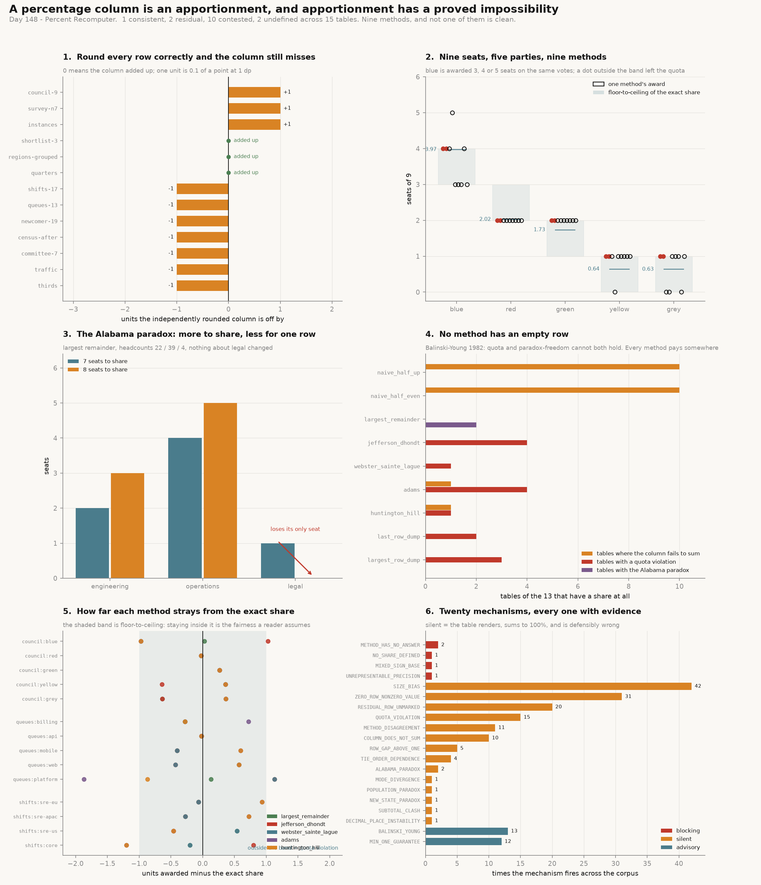

# Percent Recomputer

[](https://colab.research.google.com/github/phoebefu6/phoebe-the-builder/blob/main/analytics-engineering-bi/percent-recomputer/demo.ipynb)
[](https://mybinder.org/v2/gh/phoebefu6/phoebe-the-builder/main?labpath=analytics-engineering-bi/percent-recomputer/demo.ipynb)

> Round three equal rows to one decimal place and the column reads 99.9%. Every row is correct. The usual reaction is to pick a row and add the missing tenth - and that reaction is the interesting part, because choosing which row absorbs it is an **apportionment** decision, the same decision as handing out seats in a parliament. Apportionment has a proved impossibility at the centre of it, so there is no correct method to switch to. There is a choice between two named failure modes, and the only wrong move is making it by accident.

**Day 148 - Analytics Engineering & BI.** Nine methods over one table, four verdicts, twenty finding types, 43 tests, and a notebook that re-implements the whole engine independently and agrees with it to the unit. The three apportionment paradoxes are demonstrated on tables located by exhaustive search, not quoted from a textbook.



> **Balinski and Young (1982):** no apportionment method can both stay within the quota - every row gets the floor or the ceiling of its exact share - and avoid the Alabama paradox, where *raising* the total takes a unit away from a row.

## Business Impact

- **Before:** a dashboard prints `share = round(100 * n / total, 1)` per row. Once in a while the column reads 99.9% or 100.1%, someone adds the residual to the biggest row, and the ticket closes. The chart is now correct to the eye and one specific row is misstated by up to a full unit, unmarked.
- **After:** the same table is run through nine methods. Where they agree, the verdict is `consistent` and the method choice does not matter. Where they disagree, the report names the rows and the size of the gap - and on the bundled 9-seat council table that gap is **2 seats out of 9 for the largest party**, not a tenth of a point.
- **Estimated ROI:** the whole 15-table corpus audits in under a second. The number worth the time: **145 silent findings** across the corpus - every one a table that renders successfully, sums to 100%, and is defensibly wrong. **One table in fifteen is consistent**, and it is the one whose denominator divides its budget exactly.

## Relationship to Day 143

[`currency-rounder`](../../data-engineering-pro/currency-rounder/) (Day 143) asked *which row absorbs the residual* and answered it for money: allocate the total, name the row that took the cent, refuse a total the currency cannot express. This build takes the next question - **is any allocation rule fair** - and the answer is a proved no. New ground here: the published apportionment methods and their biases, the three paradoxes, quota violation, and the three failures that belong to percentages rather than to money (a denominator too small for the decimal place, a two-level table that cannot be consistent at both levels, and a signed base).

## What it does

Twenty mechanisms. Every number below is printed by `evidence.py`.

### 1. The column that does not add up

```
row                         exact share    printed
alpha                             100/3      33.3%
beta                              100/3      33.3%
gamma                             100/3      33.3%
                                        ----------
total                               100      99.9%
```

Rounding is a **per-row** operation; adding to 100 is a **joint** constraint on all rows at once. No improvement to the rounding function fixes that - only a method that hands out the whole budget deliberately. A percentage column at one decimal place *is* an apportionment of 1000 units, so the same code runs both cases in this repo.

### 2. Nine methods, one table, and a two-seat spread

Nine council seats from five vote counts:

```
method                 kind                     allocation      sums  in quota
naive_half_up          independent rounding     (4, 2, 2, 1, 1) NO    yes
naive_half_even        independent rounding     (4, 2, 2, 1, 1) NO    yes
largest_remainder      apportionment (quota)    (4, 2, 2, 1, 0) yes   yes
jefferson_dhondt       apportionment (divisor)  (5, 2, 2, 0, 0) yes   no
webster_sainte_lague   apportionment (divisor)  (3, 2, 2, 1, 1) yes   yes
adams                  apportionment (divisor)  (3, 2, 2, 1, 1) yes   yes
huntington_hill        apportionment (divisor)  (3, 2, 2, 1, 1) yes   yes
last_row_dump          residual hack            (4, 2, 2, 1, 0) yes   yes
largest_row_dump       residual hack            (3, 2, 2, 1, 1) yes   yes

exact shares: ['3.971', '2.023', '1.733', '0.640', '0.634']
verdict: contested; rows in dispute: ('blue', 'yellow', 'grey'); widest gap 2 seats
```

Blue wins **3, 4 or 5** of the 9 seats depending on which correct method ran. D'Hondt gives it 5, above the ceiling of its own share - a quota violation, and the reason large parties lobby for D'Hondt. The two smallest parties get a seat under four methods and nothing under one.

### 3. The Alabama paradox: more to share, less for one row

A 7-seat committee allocated by headcount, grown to 8:

```
row              7 seats   8 seats    quota at 7  quota at 8
engineering            2         3         2.369       2.708
operations             4         5         4.200       4.800
legal                  1         0         0.431       0.492
```

`legal`'s exact share went **up** (0.431 → 0.492) and its seat count went to zero. Nothing about legal changed. Named for the 1880 US census, where Alabama held 8 seats in a 299-seat House and 7 in a 300-seat House.

### 4. The population paradox: the faster grower loses

```
row        before    after   growth  seats before  seats after
north         302      434   43.7%             7            7
east           25       27    8.0%             0            1
south         259      325   25.5%             6            5
```

`south` grew 25.5% and lost a seat. `east` grew 8.0% and gained one. Same method, same 13 seats, and the slower-growing row won.

Every divisor method is immune to this by construction (`jefferson_dhondt`, `webster_sainte_lague`, `huntington_hill`, `adams` all report no paradox on this pair). That immunity is exactly what they pay for with quota violations - the two halves of the theorem.

### 5. The new-state paradox: a newcomer moves rows it never touched

Four regions over 19 seats. Add a fifth region worth 103, *with its own 6 extra seats* so nothing is taken from the table:

```
centre   4 -> 3
hills    2 -> 3
```

Two rows that did not change, and whose ratio to each other did not change, swap a seat because a third row joined. Named for Oklahoma joining the Union in 1907, when New York lost a seat to Maine.

### 6. The scoreboard: no method has an empty row

Over the 13 corpus tables that have a share at all:

```
method                 kind                     fails to sum  quota  alabama
naive_half_up          independent rounding               10      0        0
naive_half_even        independent rounding               10      0        0
largest_remainder      apportionment (quota)              0      0        2
jefferson_dhondt       apportionment (divisor)            0      4        0
webster_sainte_lague   apportionment (divisor)            0      1        0
adams                  apportionment (divisor)            1      4        0
huntington_hill        apportionment (divisor)            1      2        0
last_row_dump          residual hack                      0      2        0
largest_row_dump       residual hack                      0      3        0
```

`largest_remainder` is the only method that never leaves the quota and the only one with the Alabama paradox. The divisor methods are the exact mirror image. **Every row has a nonzero entry**, and that is not a property of this corpus - it is the theorem, with witnesses. The witnesses for Sainte-Laguë and Huntington-Hill were found by search specifically because a paradox-free method *must* violate quota somewhere:

```
council-9  (9 units)
  jefferson_dhondt       blue       awarded   5, exact share   3.971  (+1.029)
queues-13  (13 units)
  jefferson_dhondt       platform   awarded  10, exact share   8.869  (+1.131)
  webster_sainte_lague   platform   awarded  10, exact share   8.869  (+1.131)
  adams                  platform   awarded   7, exact share   8.869  (-1.869)
shifts-17  (17 units)
  huntington_hill        core       awarded   9, exact share  10.200  (-1.200)
  adams                  core       awarded   9, exact share  10.200  (-1.200)
```

A reader assumes without being told that a row owed 8.87 units gets 8 or 9. Sainte-Laguë gives it 10. That is not rounding, it is a different rule.

### 7. Three failures that belong to percentages, not to seats

**a) The precision does not exist.** Seven respondents:

```
denominator 7, so the only shares that exist are multiples of 14.29 points:
[0.0, 14.286, 28.571, 42.857, 57.143, 71.429, 85.714, 100.0]
the column prints ['42.9%', '42.9%', '14.3%']
```

One decimal place implies a measurement from a sample far larger than 7. `42.9%` is `3/7` dressed as precision, and no rounding method can fix a claim about the denominator.

**b) A two-level table cannot be consistent at both levels.**

```
group UK: rows sum to 39.3%, its own rounded share is 39.4%
group DE: rows sum to 60.7%, its own rounded share is 60.6%
rows: ['14.3', '18.0', '7.0', '23.1', '27.7', '9.9'] summing to 100.0%
```

Rows must sum to subtotals, subtotals to the grand total, and every printed number must be a rounding of its own share. Three constraints, one set of integers, usually no solution. Pick the level allowed to disagree and mark it.

**c) A signed base has no shares.**

```
pnl          values have mixed signs: a share of a signed total is not a share - it can
             exceed 100%, go negative, and reorder if the sign flips
zero-base    the base is zero, so no row has a share
```

Verdict `undefined`, no allocations returned. The honest answer is to refuse, not to divide.

### 8. The long tail: rows that exist and print as nothing

`traffic`: 8 sources, base 93,297, smallest row 29 sessions = 0.0311% of the base.

```
method                  that row   sums
naive_half_up               0.0%     NO
largest_remainder           0.0%    yes
jefferson_dhondt            0.0%    yes
webster_sainte_lague        0.0%    yes
adams                       0.1%    yes
huntington_hill             0.1%    yes
```

Adams and Huntington-Hill guarantee every row a unit, so they **cannot** print 0.0% for a source that exists. They pay for it with quota violations, and with having no answer at all when units are scarcer than rows - a 3-place shortlist with 5 candidates returns `METHOD_HAS_NO_ANSWER` rather than a number.

### 9. The headline run: fifteen tables

```
table             kind     rows verdict      gap disputed rows                findings
quarters          percent     4 consistent     0 -                            2
thirds            percent     3 residual       1 alpha, gamma                 7
instances         percent     5 contested      2 t3.nano, t3.micro, t3.large  14
traffic           percent     8 contested      3 organic, direct, referral,   21
survey-n7         percent     3 contested      1 yes, no, unsure              8
regions-grouped   percent     6 contested      1 berlin, hamburg              4
committee-7       seats       3 contested      1 engineering, operations, le  10
census-after      seats       3 contested      1 north, east, south           11
newcomer-19       seats       4 residual       1 west, centre, hills, coast   14
council-9         seats       5 contested      2 blue, yellow, grey           18
queues-13         seats       5 contested      3 billing, mobile, web, platf  24
shifts-17         seats       4 contested      2 sre-eu, sre-apac, sre-us, c  21
shortlist-3       seats       5 contested      0 -                            17
pnl               percent     4 undefined      0 -                            1
zero-base         percent     3 undefined      0 -                            1

{'consistent': 1, 'residual': 2, 'contested': 10, 'undefined': 2}
```

The one consistent table is `quarters`: four equal rows at one decimal place, where the denominator divides the budget exactly. Both of its findings are advisory. That is what "safe to print" looks like, and it is rare.

### 10. Twenty mechanisms, every one with evidence

```
code                         severity   fires
NO_SHARE_DEFINED             blocking       1
MIXED_SIGN_BASE              blocking       1
UNREPRESENTABLE_PRECISION    blocking       1
METHOD_HAS_NO_ANSWER         blocking       2
COLUMN_DOES_NOT_SUM          silent        10
MODE_DIVERGENCE              silent         1
METHOD_DISAGREEMENT          silent        11
ROW_GAP_ABOVE_ONE            silent         5
RESIDUAL_ROW_UNMARKED        silent        20
QUOTA_VIOLATION              silent        15
ALABAMA_PARADOX              silent         2
POPULATION_PARADOX           silent         1
NEW_STATE_PARADOX            silent         1
TIE_ORDER_DEPENDENCE         silent         4
ZERO_ROW_NONZERO_VALUE       silent        31
SIZE_BIAS                    silent        42
SUBTOTAL_CLASH               silent         1
DECIMAL_PLACE_INSTABILITY    silent         1
MIN_ONE_GUARANTEE            advisory      12
BALINSKI_YOUNG               advisory      13
```

`MODE_DIVERGENCE` is worth one more line: `round()` in Python and pandas is half-to-**even**, while SQL and spreadsheets are half-**up**. On the `instances` table every share lands on an exact half (62.5, 125, 250, 500 units), so the same data in the same language produces a different digit depending on which layer rounded it. Exact halves are not rare once the denominator is a round number.

## What to do instead

1. **Allocate, do not round.** Any apportionment method sums exactly; independent rounding failed to sum on 10 of the 13 definable tables here.
2. **Name the method in the caption.** `largest_remainder` and `webster_sainte_lague` are defensible. `round()` plus a residual on the last row is not a method.
3. **Print the decimal place the denominator can carry.** n=7 gets whole numbers.
4. **Decide which level of a grouped table is allowed to disagree**, and mark it.
5. **Refuse a signed or zero base** rather than dividing by it.

## The API

```python
from percentages import percent_table, seat_table, audit, audit_corpus, Verdict

a = audit(percent_table("sources", [("organic", 48213), ("direct", 21877), ("qr", 29)]))
a.verdict                  # Verdict.CONTESTED
a.disagreeing_rows()       # ('organic', 'qr')
a.max_row_gap()            # units, where one unit is 0.1 of a point at 1 dp
[(f.code, f.severity) for f in a.findings]
a.by_method["largest_remainder"].percents(a.table)

seats = seat_table("council", [("blue", 5709), ("red", 2908)], 9)
audit(seats).by_method["jefferson_dhondt"].units      # (6, 3)

rep = audit_corpus()       # the bundled 15 tables, or pass your own
rep.verdicts               # {'consistent': 1, 'residual': 2, 'contested': 10, 'undefined': 2}
```

The paradoxes are functions, so they can be run against your own data:

```python
from percentages import alabama, population_paradox, new_state_paradox, quota_violations

alabama(table, "largest_remainder")                    # rows that lose when the budget grows
population_paradox(before, after, "largest_remainder")  # the faster grower that lost
quota_violations(table, alloc)                          # rows outside floor-to-ceiling
```

Exact shares are `Fraction`, never floats: the quota is the one unarguable number in the file and should not be the first thing to lose precision.

## Tech Stack

Python 3.10+, standard library only for the engine (`math`, `fractions`, `dataclasses`, `enum`). Streamlit for the UI, matplotlib for the figure, pytest for the suite, Docker + GitHub Actions for CI.

- `percentages.py` - the engine: 9 methods, 4 verdicts, 20 findings, three paradox detectors
- `test_percentages.py` - 43 tests, including the theorem properties as assertions
- `evidence.py` - prints every number in this README and re-derives the paradox tables
- `make_chart.py` - the six-panel figure
- `build_notebook.py` - generates `demo.ipynb`, whose methods are written independently and cross-checked
- `app.py` - Streamlit: paste counts, see all nine columns

## Demo

**[Run the interactive demo notebook →](demo.ipynb)** - pre-rendered with outputs, or click the Colab/Binder badges above to run it live.

```bash
pip install -r requirements.txt
python -m pytest test_percentages.py -q   # 43 passed
python evidence.py                        # every table above
python make_chart.py                      # percent_audit.png, percent_demo.png
streamlit run app.py
```

## Learning Connection

Built while reading the apportionment literature (Balinski and Young's *Fair Representation*, the Huntington-Hill method as used for the US House since 1941, D'Hondt and Sainte-Laguë as used across European electoral law) and mapping it onto the mundane BI problem of a percentage column. Applies: exact rational arithmetic instead of floats, exhaustive search to produce genuine counterexamples rather than cited ones, and encoding a proved impossibility as a property test.

## Impact Note

- **Who benefits:** anyone shipping percentage tables, share-of-total charts, or any fixed-budget allocation - seats, shifts, quotas, headcount splits, ad budget by channel.
- **Potential risks:** the methods are implemented from their published rules and are faithful for the cases tested here, but a production electoral system has threshold rules, tie-break law and rounding conventions this does not model - do not use it to run an election. `size_bias` is a coarse two-half comparison and is descriptive, not a formal bias measure. The Jira-style "working" units of Day 147 have an analogue here: the corpus assumes every value is a comparable count, and a table mixing units (sessions with revenue) has no meaningful share at all, which the tool does not detect.
