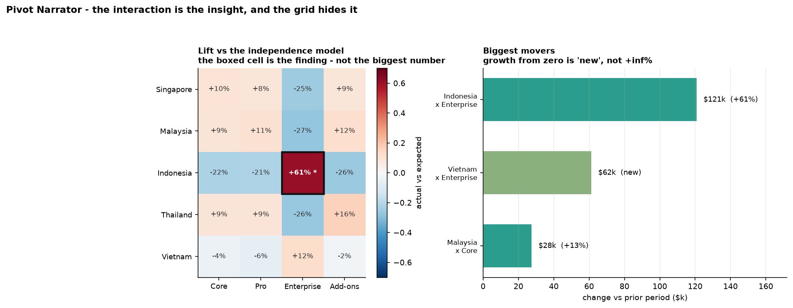

# Pivot Narrator

[](https://colab.research.google.com/github/phoebefu6/phoebe-the-builder/blob/main/analytics-engineering-bi/pivot-narrator/demo.ipynb)
[](https://mybinder.org/v2/gh/phoebefu6/phoebe-the-builder/main?labpath=analytics-engineering-bi/pivot-narrator/demo.ipynb)

> Nobody reads the pivot table.

A crosstab is a wall of numbers. The three facts a reader actually needs - what dominates, what moved, and **where the interaction is** - are all in there and none of them are legible. This writes the paragraph that should sit under the table.

**Deterministically. No LLM.** Every sentence is arithmetic with a threshold, so the same pivot always produces the same narration and every claim traces back to a cell. A summary you can't audit is worse than no summary.



## Business Impact
- **Before:** the crosstab goes in the deck, someone reads the biggest number aloud, and the actual finding stays invisible.
- **After:** six sentences under the table naming the concentration, the interaction, the movement, and the new segments - reproducible and traceable to arithmetic.
- **Estimated ROI:** on the sample, the largest cell in the table (Singapore × Core) is unremarkable while a cell **a third its size** carries the entire story. That's the difference between a review that finds something and one that doesn't.

## Tech Stack
Python · pandas · numpy · Streamlit · matplotlib - fully offline, deterministic, no model calls

## Key insight
**The insight in a crosstab is almost never the biggest number.** It's the cell that deviates most from what its own margins already imply.

The sample is built so revenue is genuinely *independent* across region and product - the base grid is an outer product of region weights and product weights - except for one planted interaction. Compare actual against `row_total × col_total / grand_total` (the same expectation a chi-square test uses) and it falls out immediately:

| | Core | Pro | Enterprise | Add-ons |
|---|---|---|---|---|
| Singapore | +10% | +8% | -25% | +9% |
| Malaysia | +9% | +11% | -27% | +12% |
| **Indonesia** | -22% | -21% | **+61%** | -26% |
| Thailand | +9% | +9% | -26% | +16% |
| Vietnam | -4% | -6% | +12% | -2% |

Singapore × Core is the largest value in the table at $454k and says nothing - Singapore is big and Core is big. Indonesia × Enterprise is $319k and is the whole finding. Eyes don't do that comparison; the margins are large and the deviation isn't.

Worth noting the rest of the matrix too: `Enterprise` reads negative for every *other* region. That's the arithmetic consequence of Indonesia absorbing Enterprise share - the margin model has to balance. Knowing that stops you reporting five findings when there's one.

**Two guards, both necessary.** Ranking by lift alone makes a noise generator. Add a tiny cell holding 0.07% of revenue and it tops the table at -84% lift, outranking the real finding. So a cell must clear a lift threshold (**is it real?**) *and* a share floor (**does it matter?**). The demo shows the table with and without the floor.

**Growth from zero is undefined, not infinite.** `Vietnam × Enterprise` went 0 → $61.5k. A naive `pct_change` emits `inf`, which renders as "+inf%" on a slide. The code writes `None` (stored as `NaN` in a float column - the point is it's *null*, never `inf`) and sets an explicit `is_new` flag. That flag drives the sentence, so the narration says **"new"** - which is the more useful statement anyway, because a segment appearing is a different event from a segment growing. Both pivots are reindexed to the **union** of periods for the same reason: a row that disappears gets reported, not silently dropped.

## What the narration says

```
revenue: $2.79M across 5 regions x 4 products

Total revenue is $2.79M. The largest region is Singapore at $1.02M (36% of the total),
followed by Indonesia at 26%. Half the total sits in 2 of 5 regions. By product, Core
leads with 41%.

Against what the row and column totals alone predict: Indonesia x Enterprise is 61%
above expectation ($319.3k vs $198.2k); Malaysia x Enterprise is 27% below expectation
($109.0k vs $149.2k); ...

The strongest interaction is Indonesia x Enterprise. Neither Indonesia's size nor
Enterprise's size explains it - it is 61% higher than the margins imply, which is the
kind of thing a grid of numbers hides in plain sight.

Against the comparison period, revenue is up 13.8% ($2.45M to $2.79M).

Biggest movers: Indonesia x Enterprise moved $121.1k (+61%); Vietnam x Enterprise is
new at $61.5k; Malaysia x Core moved $27.7k (+13%).
```

And on a genuinely independent pivot it says so plainly rather than inventing a finding:

> *No cell deviates more than 25% from what its row and column totals predict - the margins tell the whole story.*

## Demo

**[Run the interactive demo notebook →](demo.ipynb)** - pre-rendered, including the with/without-share-floor comparison and the independent-pivot control case. Or click the Colab/Binder badges.

Streamlit app (pivot and narration side by side, tunable thresholds, CSV upload):
```bash
pip install -r requirements.txt
streamlit run app.py
```

CLI:
```bash
python narrate.py
```

In a report pipeline:
```python
from narrate import narrate
n = narrate(pivot, metric="revenue", unit="$", previous=last_quarter,
            row_label="region", col_label="product")
print(n.as_text())          # the paragraph
n.facts["notable_cells"]     # the arithmetic behind every sentence
```

## Learning Connection
Built while studying automated insight generation and BI narrative design.
Applies: the independence/expected-value model, lift vs raw magnitude, materiality thresholds, concentration measures (top-N share, count-to-half), and deterministic natural-language generation.

Companions:
- **Day 107** [`kpi-tree`](../kpi-tree) - decompose the driver this surfaces
- **Day 121** [`metric-diff`](../metric-diff) - is the movement statistically significant?
- **Day 120** [`crosstab-chi2`](../../data-science-cookbook/crosstab-chi2) - test the interaction formally, same expectation model

## Impact Note
- **Who benefits:** analysts shipping recurring reports; anyone who has to put a paragraph under a crosstab; reviewers who want the finding named rather than implied.
- **Potential risks:** **lift is not significance.** The independence model says a cell deviates from its margins; it says nothing about whether that deviation could be chance. On small counts it very often could be - pair this with a chi-square or a proper test (Day 120) before acting, and treat the narration as a place to look, not a conclusion. The thresholds (25% lift, 1% share, 50% concentration) are conventions tuned on this sample, not universals. The narration is also **descriptive, not causal** - "Indonesia over-indexes on Enterprise" is a fact about the table, not an explanation, and the cause may well be something absent from the pivot entirely. Being deterministic makes it auditable, not correct.
