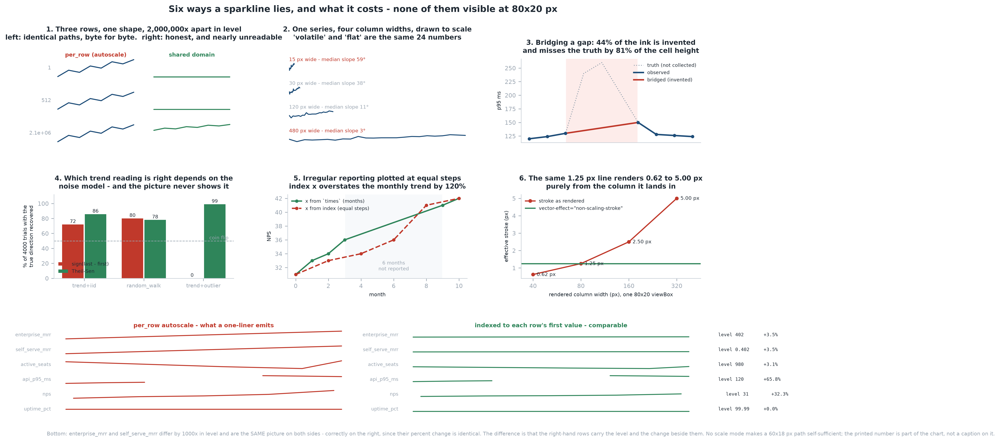

# Sparkline Generator

[](https://colab.research.google.com/github/phoebefu6/phoebe-the-builder/blob/main/analytics-engineering-bi/sparkline-gen/demo.ipynb)
[](https://mybinder.org/v2/gh/phoebefu6/phoebe-the-builder/main?labpath=analytics-engineering-bi/sparkline-gen/demo.ipynb)

> Adding a sparkline column to a table is one line of pandas. That line autoscales every row to its own min and max, which is what makes a row that grew 3.5% and a row that grew 3.5% off a base a thousand times smaller into the *same picture* - not similar, identical. A sparkline is a chart, and every chart failure applies to it. At 80x20 pixels nobody audits it.

**Day 137 - Analytics Engineering & BI.** Inline SVG trend marks with the four decisions that decide whether they tell the truth turned into named parameters: scale, aspect ratio, gaps, and the time axis. Plus a verdict that runs before anything is rendered.



## Business Impact

- **Before:** an analyst adds a trend column to a 40-row metrics table. Each cell autoscales, gaps get dropped, x positions come from the row index, and the column width comes from CSS. Every one of those is the library default. The table ships to a weekly exec review where people read level, volatility and direction off it.
- **After:** the same table, plus the domain each row was drawn against printed beside it, gaps rendered as gaps, a robust trend printed rather than implied, and a banner saying whether the rows are comparable at all.
- **Estimated ROI:** on the bundled sample table, eight rows spanning **2,000,000x** in level emit **one** path string, byte for byte. Six of the six sample rows trip at least one audit check. The row a reader would most confidently call "recovering" (`active_seats`) fell **22%** over seven weeks and has a Theil-Sen slope of **-36 seats/week**; its endpoints say up.

## What it does

Five mechanisms, in the order they matter.

### 1. Per-row autoscale does not compress level, it deletes it

`enterprise_mrr` runs around $402k. `self_serve_mrr` runs around $402. Same shape, 1000x apart. Under per-row autoscale:

```
enterprise: M0.6,19.4 L11.9,16.7 23.1,14 34.4,11.3 45.6,8.7 56.9,6 68.1,3.3 79.4,0.6
self-serve : M0.6,19.4 L11.9,16.7 23.1,14 34.4,11.3 45.6,8.7 56.9,6 68.1,3.3 79.4,0.6
identical? True
```

Not "hard to distinguish" - equal as strings. No rendering subtlety recovers it, because the information is gone before the SVG is written. Scaled to eight rows spanning a factor of two million:

```
scale mode       distinct paths  control separated     comparable
--------------------------------------------------------------------------------------
per_row                    1/8                yes             NO
shared                     6/8                 no            yes
shared_zero                5/8                 no            yes
indexed                    1/8                yes            yes
--------------------------------------------------------------------------------------
```

The `control separated` column matters: a ninth row with a genuinely *different shape* still renders differently under `per_row`. That is what makes this a statement about level rather than a broken renderer.

There is no free lunch, only a choice about which question the picture answers - and the cost of each is measurable in rendered pixels on a 20 px cell:

```
   row                           per_row     shared    indexed
   ------------------------------------------------------------
   row_0 (level 1)                 18.75       0.00      11.25
   row_3 (level 512)               18.75       0.00      11.25
   row_7 (level 2.1e+06)           18.75       6.25      11.25
   ------------------------------------------------------------
```

- **`per_row`** answers *"what shape did this row make?"* Legible, incomparable.
- **`shared`** answers *"how do these rows compare in level?"* Honest, and at this spread it draws the small rows as sub-pixel flat lines - **0.00 px** of vertical extent. Comparable, illegible.
- **`indexed`** answers *"how much did each row change, proportionally?"* Every row gets **11.25 px** and the comparison still means something. Usually the right default for a table of heterogeneous metrics.

So `resolve_domain` returns a `Domain` with the `mode` **on it**, and the shared modes **refuse to compute without the whole table** rather than quietly falling back to per-row:

```python
resolve_domain(row, "shared")            # ValueError: needs the whole table
resolve_domain(row, "shared", table=rows)  # Domain(lo=0.402, hi=1010.0, mode='shared')
```

Silently degrading to per-row is exactly how a table stops being comparable without anyone noticing.

### 2. A sparkline's steepness is a CSS property

Cleveland's result on slope judgement: accuracy peaks when the average absolute slope is near 45 degrees, and degrades in both directions - shallow degrades into "flat". A table cell picks that angle from its own geometry, not from the data.

The same 24 numbers, six column widths:

```
width        height         aspect   median slope      max slope reads as
--------------------------------------------------------------------------------------
15               20           0.75          58.8°          85.1° volatile / spiky
30               20           1.50          38.3°          79.9° clear trend
60               20           3.00          21.1°          70.0° gentle rise
120              20           6.00          10.8°          53.7° flat / stable
240              20          12.00           5.4°          34.1° flat / stable
480              20          24.00           2.7°          18.6° flat / stable
--------------------------------------------------------------------------------------
banked to 45°: width = 23.9 px (aspect 1.20), achieved median slope 45.0°
```

A responsive table therefore changes its own conclusion when the browser window is resized. Note the `max slope` column too: even in the "flat / stable" 480 px rendering one segment still reaches 18.6°, so the spikiest segment of a flat-looking sparkline is doing most of the talking.

`banked_width()` inverts the relationship and reports the cell the data actually wants. The solve is closed-form and exact: `tan` is monotone on [0, 90), so `median(tan θ) == tan(median θ)`, and horizontal spacing is proportional to the drawable width while vertical excursions are fixed by the height and the domain.

### 3. Bridging a gap is invented data drawn at full stroke weight

An API outage window: the values existed, they were not collected. The one-liner drops the NaNs and plots what remains, which joins the two sides with a straight line at full stroke weight - indistinguishable from measurement, and always monotone, so a gap over a spike renders as a clean trend.

```
rendering                subpaths     isolated   bridged gaps shape
--------------------------------------------------------------------------------------
truth (all 10 pts)              1            0              0 dip visible
observed, broken                2            0              0 gap visible
observed, bridged               1            0              1 monotone rise
--------------------------------------------------------------------------------------
the bridge is 44.0 px of the 99.5 px drawn (44% of the ink is invented) and it
misses the true path by up to 19.5 px on a 24 px tall cell (81% of the height).
direction the reader infers:  bridged = monotone UP   truth = UP then DOWN (-42% by index 6)
```

So a missing value **ends the subpath** and the next present value starts a new `M`. One `d` attribute, two subpaths, and the gap renders as a gap.

The edge case that falls out of this: a run of exactly one present value between two gaps cannot be stroked - a zero-length path draws nothing - so it is emitted as a degenerate arc instead. Without that fallback an isolated observation silently vanishes:

```
isolated observation: 1 subpath, 1 dot, d='M49.38,12 a0.62,0.62 0 1,0 1.25,0 ...'
```

### 4. The trend a sparkline invites uses two points out of n

The shape invites exactly one summary: is the right end higher than the left? That is `sign(last - first)` - the noisiest reading available.

The honest answer to "so use a robust slope instead" is that **it depends on the noise model, and the sparkline shows you neither**. Over 4000 trials per model, tuned so the endpoint reading starts near 70% in the first two rows - so the table compares estimators rather than signal-to-noise:

```
noise model            sign(last-first)          Theil-Sen       who wins
--------------------------------------------------------------------------------------
trend+iid                         72.0%              85.8%         robust
random_walk                       80.1%              78.1%       endpoint
trend+outlier                      0.0%              99.0%         robust
--------------------------------------------------------------------------------------
```

Three different lessons:

- **trend + iid noise**: the endpoints discard n-2 observations and lose **14 points** of accuracy.
- **random walk with drift**: last-minus-first is the *sufficient statistic*, and the robust slope gives back 2 points. Reaching for Theil-Sen reflexively is also wrong.
- **trend + one contaminated final reading**: the endpoint answer is **0.0%** accurate. Not noisy - inverted.

All three render as an up-and-to-the-right line in the same 80x20 cell. Hence the tool prints a slope and a direction rather than implying one:

```
endpoints say         : up
Theil-Sen trend says  : down
Theil-Sen slope       : -36.3 seats per week
first 7 weeks         : 980 -> 760 (-22%)
```

### 5. Equal steps for unequal intervals is a different series

A metric reported monthly, then not reported for six months, then reported again. Index positions put the six-month jump at the same horizontal width as a one-month step:

```
x positions        gap width px      gap slope     steepest seg     median slope
--------------------------------------------------------------------------------------
from `times`               53.2          10.0°            23.0°            12.0°
from index                 17.8          28.0°            28.0°            12.0°
--------------------------------------------------------------------------------------
Trend per month: 1.000 (time) vs 2.200 (index) - a 120% overstatement.
```

By index that segment is the **steepest** in the chart; by time it is the **shallowest** - the longest period rendered as the sharpest move, exactly backwards. Note the median slope is identical (12.0°) either way: whatever summary statistic you compute over the rendering will not catch this.

### Plus: SVG mechanics at 20 pixels tall

Four things that are invisible at this size and wrong regardless.

**Half-stroke clipping.** A value at the top of the domain sits at `y = 0`, so half its stroke renders outside the viewBox - **50% of the line's thickness**, at every extreme, for every stroke width. `pad = stroke/2` costs 6% of a 20 px cell and is not optional. A marker needs its full radius, so `pad` is `max(stroke/2, dot)`.

**Stroke scaling.** A responsive `viewBox` scales `stroke-width` along with the cell:

```
    rendered width          scale      stroke as drawn     with non-scaling
    ------------------------------------------------------------------------
    40                       0.50x                0.62px                1.25px
    320                      4.00x                5.00px                1.25px
```

An **8x** difference in visual weight from column width alone - the same data reading bolder in one place than another. `vector-effect="non-scaling-stroke"` pins it, and is the only reason responsive mode is safe.

**Coordinate precision is a much smaller lever than it looks**, which is the useful finding:

```
    precision      bytes  d= only     max err px    x500 rows note
    ------------------------------------------------------------------------------
    0                365       44          0.375     178.2 KB invisible
    1                395       74          0.050     192.9 KB invisible
    3                424      103          0.000     207.0 KB invisible
    ------------------------------------------------------------------------------
```

`precision=1` holds error to **0.05 px** and the whole knob is worth **7%** of the payload, because **321 of 395 bytes (81%)** are the wrapper - `xmlns`, `viewBox`, `title`, `aria-label`, stroke attributes. The number that actually matters is the total: **193 KB** of inline SVG for 500 rows, larger than most pages' entire HTML. Past a few hundred rows the fix is a shared `<defs>` or server-side rasterisation, not another decimal place.

**Escaping.** Row labels come from data. A label of `</title><script>x</script>` must not close the `<title>` it lands in, and `&` has to be replaced first or the other replacements re-break it.

## The sample table

Six rows of weekly SaaS telemetry, deterministic (no RNG), each carrying one lesson - and the audit fires on every one:

| row | what it is | what the audit says |
|---|---|---|
| `enterprise_mrr` | +3.5%, level ~402 | identical path to the row below |
| `self_serve_mrr` | +3.5%, level ~0.402 | 1000x smaller, same picture |
| `active_seats` | falls 22%, one big final week | endpoints disagree with the robust trend |
| `api_p95_ms` | outage window, 3 values missing | rendered as a break, not a bridge |
| `nps` | last two points 6 weeks apart | positions taken from `times`, not the index |
| `uptime_pct` | constant 99.99 | drawn flat, not expanded into a story |

```
NOT COMPARABLE ACROSS ROWS (mode=per_row) - shape only
  WARNING: row maxima span 2428x (0.416 to 1.01e+03) yet every row is autoscaled to fill
           the cell - two rows with identical shapes differ in level by that factor
  WARNING: 1 row has sign(last - first) disagreeing with the robust trend: active_seats.
           The endpoints are the noisiest reading of a sparkline and the one it invites
  note:    1 of 6 rows has missing values, rendered as breaks in the line
  note:    1 row has irregular time spacing; positions are taken from `times`, not the index
  note:    1 constant row drawn as a flat mid-height line rather than expanded to fill the cell
  note:    median rendered slope is 13 degrees at 80x20; slope judgement is most accurate
           near 45. Try banked_width() for a cell that suits the data
```

`render_table` prints the domain each row was drawn against as a column, because a sparkline separated from its domain is neither reproducible nor readable.

## Tech Stack

Python 3.10+, Streamlit, Docker. **`sparkline.py` has no dependencies beyond the standard library** - no numpy, no matplotlib, no SVG library. numpy and matplotlib appear only in the experiments and the chart. 697 lines of core, 547 lines of tests holding it to the claims above.

## Demo

**[Run the interactive demo notebook →](demo.ipynb)** - pre-rendered with all outputs, live SVG tables and the six-panel figure, or click the Colab/Binder badges above to run it live. The notebook writes `sparkline.py` and `evidence.py` to disk from embedded source, so it is self-contained without a clone step and there is no second copy of the logic to drift.

For the Streamlit app:

```bash
pip install -r requirements.txt
streamlit run app.py
```

Reproduce every number above:

```bash
python3 test_sparkline.py   # 80 tests over the core
python3 test_evidence.py    # 29 tests over the experiments
python3 evidence.py         # every table in this README
python3 make_chart.py       # the six-panel audit figure
```

## Files

| file | what it is |
|---|---|
| `sparkline.py` | scale policies, geometry, banking, gap-aware paths, SVG emission, the audit |
| `evidence.py` | the six experiments this README quotes, each seeded and parameterised |
| `test_sparkline.py` | 80 tests, including the byte-identical-path claim and the banking round-trip |
| `test_evidence.py` | 29 tests asserting the *direction* of each effect, not the noisy magnitude |
| `app.py` | Streamlit UI - verdict first, table second, per-row trend diagnostics third |
| `make_chart.py` | the six-panel audit figure |
| `build_notebook.py` | generates `demo.ipynb` with both modules embedded |

One implementation note worth stealing: the Streamlit app uses `components.html`, not `st.html`. **`st.html` sanitises the markup and strips `<svg>` entirely**, which silently empties the one column this tool exists to produce - it renders as a table of blank cells with no error anywhere.

## Learning Connection

Built while working through Cleveland's work on graphical perception - specifically the banking-to-45-degrees result on slope judgement - and Tufte on sparklines as "data-intense, design-simple, word-sized graphics".

Applies: scale-domain resolution as an explicit contract, closed-form aspect-ratio solving, robust regression (Theil-Sen) versus endpoint statistics, Monte Carlo estimator comparison under competing noise models, and hand-rolled SVG path construction with the sub-pixel accounting that goes with it.

## Impact Note

- **Who benefits:** anyone putting trend columns in a table - exec metric reviews, dbt/BI model documentation, SLO dashboards, cohort tables, monitoring summaries, investor updates.
- **Potential risks:** a shared or indexed domain is comparable but can render small rows as flat lines, and a reader who takes "flat" to mean "stable" is now wrong in the other direction - which is why the domain column is not optional. `indexed` mode divides by the first present value and is undefined when that value is zero or missing (it raises rather than guessing). The bootstrap-free trend readings here are descriptive, not inferential: Theil-Sen reports a slope, not a significance, and the noise-model experiment shows that no single estimator is correct for all series. Nothing in this tool can tell you which noise model your data is in. And the deepest limitation is structural - a sparkline is at most half a statement. The other half is the number printed beside it. If you take one thing from this build, take that: `audit_table` runs first and `render_table` prints the level, because the picture alone was never going to be enough.

---

Part of [phoebe-the-builder](https://github.com/phoebefu6/phoebe-the-builder) - Day 137, Analytics Engineering & BI.
