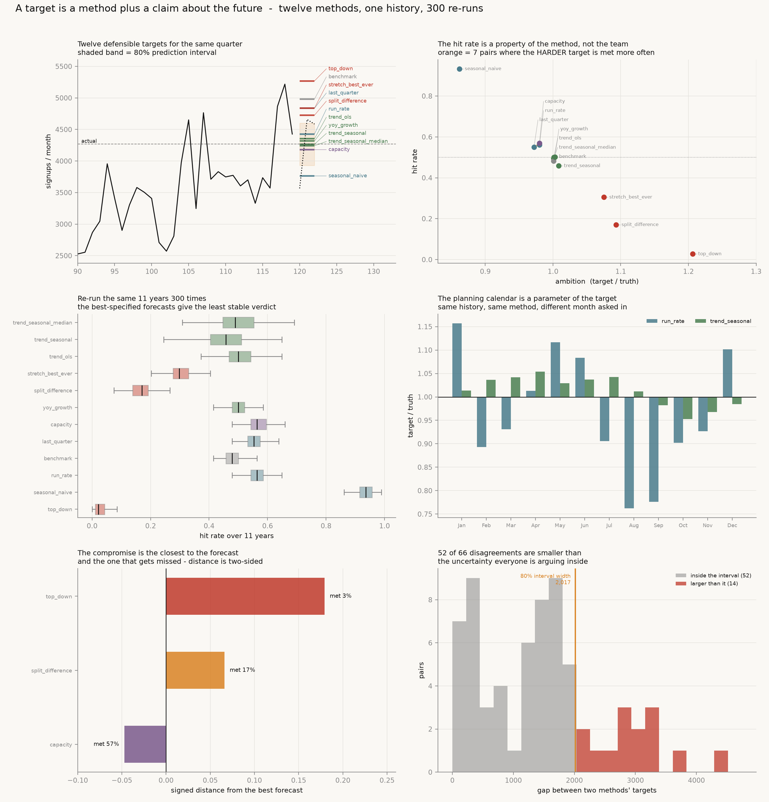

# Target Setter

[](https://colab.research.google.com/github/phoebefu6/phoebe-the-builder/blob/main/analytics-engineering-bi/target-setter/demo.ipynb)
[](https://mybinder.org/v2/gh/phoebefu6/phoebe-the-builder/main?labpath=analytics-engineering-bi/target-setter/demo.ipynb)

> Somebody asks what next quarter's number should be, and six people in the room have six defensible answers. One of them reaches the slide as a single number, and three months later that same number is used to decide whether the team did well. But a target is not a number. It is a method plus a claim about the future, and the method moves the number by more than the business does.

**Day 159 - Analytics Engineering & BI.** Twelve target-setting methods, one metric history with a known data-generating process, the same eleven years re-run **500** times, 27 tests, and a notebook that rebuilds every figure from numpy and scipy.



> **Twelve defensible targets for one quarter span 1.40x - a spread of 31.1% of the base - on a quarter that moved 11.7%.** The choice of method is a larger number than the thing being targeted.
>
> **The hit rate grades the method, not the team.** Spearman(ambition, hit rate) = **-0.91** across 500 re-runs. The same work is met 2.8% of the time under the board's target and 93.4% under "same quarter last year". Choosing which sentence to say in the meeting is worth **12.6 months** of real growth and **48 points** of hit rate.
>
> **It takes 134 quarters - 33.5 years - to tell a 0.50 hitter from a 0.65 hitter.** "We hit 8 of our last 12" has p = 0.194 against a coin.

## Business Impact

- **Before:** the target arrives as one number. Nobody records which of a dozen methods produced it, what it assumes about growth, seasonality and hiring, or how wide the uncertainty around it is. At the end of the period the same number is read as a grade, and a hit rate that is mostly a property of the method gets attributed to the team.
- **After:** the target carries its method, its claim and its interval. The hit rate is reported with the spread it has across re-runs instead of as a fact, and the three statistics that look like they measure the same thing - accuracy, ambition and being met - are separated, because two of them disagree with the third by construction.
- **Estimated ROI:** on this history the twelve methods are **31.1%** of the base apart, against a quarter that moved **11.7%**. A team graded on a hit rate can move its expected threshold bonus from 2,796 to 93,432 out of 100,000 without changing anything it does.

## Where this sits

First build in **KPI governance and target setting**. The KPI plumbing was already here - [`kpi-tracker`](../../analytics-accelerator/kpi-tracker/) (Day 22) and [`kpi-tree`](../kpi-tree/) (Day 107) track and decompose, [`metric-catalog`](../metric-catalog/) and [`metrics-layer`](../metrics-layer/) define, [`metric-diff`](../metric-diff/) and [`metric-alerting`](../metric-alerting/) watch for movement. None of them decides what the number should **be**. [`okr-tracker`](../../mini-saas-products/okr-tracker/) (Day 55) tracks progress against a target that has already been set; this one interrogates where that target came from.

It is **not** a forecaster. [`sales-forecast`](../../analytics-accelerator/sales-forecast/) and [`ts-forecaster`](../../data-science-cookbook/ts-forecaster/) predict the number. Section 4 below is about why the best forecast in the list makes one of the worst targets.

Nearest neighbour in spirit is the decision-support arc - [`decision-log`](../../mini-saas-products/decision-log/), [`pre-mortem`](../../mini-saas-products/pre-mortem/), [`expected-value-calc`](../../mini-saas-products/expected-value-calc/), [`cost-of-delay`](../../mini-saas-products/cost-of-delay/) - which score, price, choose and sequence. This one sets the bar the result will be judged against.

## What it does

Ten sections in `evidence.py`. Every number below is printed by it and asserted in `test_targets.py`.

### 1. A world where the answer is known

A target can only be scored honestly if you know what it was aiming at, so the metric is simulated from a process written down in five constants:

$$y_t = 1000 \cdot (1.0125)^t \cdot S_{t \bmod 12} \cdot e^{\varepsilon_t}, \qquad \varepsilon_t \sim N(0, 0.12^2)$$

Eleven years of monthly signups: 16.1%/year of real compounding growth, a December peak, a summer trough, proportional noise. Every target is then scored twice - against **the truth it aimed at** and against **what happened to occur**.

### 2. Twelve defensible targets for the same quarter

Each is a sentence somebody says out loud in a planning meeting. Target for months 120-122, set with everything known at month 120:

| method | target | vs last q | vs truth | provenance |
|---|---:|---:|---:|---|
| `seasonal_naive` | 11,290 | -22.2% | 0.856 | same quarter last year, flat |
| `capacity` | 12,543 | -13.6% | 0.951 | bottom-up: planned heads x recent productivity |
| `trend_seasonal_median` | 12,726 | -12.3% | 0.965 | trend + seasonality, median forecast |
| `trend_seasonal` | 12,797 | -11.8% | 0.971 | trend + seasonality, mean forecast |
| `yoy_growth` | 12,951 | -10.7% | 0.982 | last year's quarter + trailing YoY rate |
| `trend_ols` | 13,058 | -10.0% | 0.990 | log-linear trend extrapolated |
| `run_rate` | 13,281 | -8.5% | 1.007 | latest month annualised |
| `split_difference` | 14,175 | -2.3% | 1.075 | midpoint of bottom-up and top-down |
| `last_quarter` | 14,510 | 0.0% | 1.101 | repeat the quarter we just had |
| `stretch_best_ever` | 14,510 | 0.0% | 1.101 | the best quarter we have ever had |
| `benchmark` | 14,945 | +3.0% | 1.134 | last quarter + published category growth |
| `top_down` | 15,806 | +8.9% | 1.199 | last year's quarter x the board multiple |

Highest / lowest = **1.400x**. The spread is **31.1%** of last quarter. The quarter itself came in at **-11.7%**.

The twelve methods disagree by nearly three times the move being targeted.

### 3. The hit rate is a property of the method, not the team

*Ambition* is the target as a multiple of the truth it aims at - the only thing about a target that is fixed the moment it is set. Across 500 re-runs of the same eleven years:

| method | ambition | hit rate | sd | min | max |
|---|---:|---:|---:|---:|---:|
| `seasonal_naive` | 0.861 | 0.934 | 0.032 | 0.798 | 1.000 |
| `last_quarter` | 0.971 | 0.550 | 0.033 | 0.426 | 0.660 |
| `run_rate` | 0.979 | 0.559 | 0.031 | 0.468 | 0.649 |
| `capacity` | 0.979 | 0.572 | 0.036 | 0.468 | 0.670 |
| `benchmark` | 1.000 | 0.480 | 0.032 | 0.383 | 0.585 |
| `trend_seasonal_median` | 1.000 | 0.489 | 0.081 | 0.277 | 0.713 |
| `trend_ols` | 1.001 | 0.500 | 0.058 | 0.319 | 0.660 |
| `yoy_growth` | 1.002 | 0.498 | 0.037 | 0.394 | 0.628 |
| `trend_seasonal` | 1.008 | 0.453 | 0.080 | 0.234 | 0.691 |
| `stretch_best_ever` | 1.074 | 0.307 | 0.039 | 0.202 | 0.436 |
| `split_difference` | 1.093 | 0.168 | 0.036 | 0.074 | 0.298 |
| `top_down` | 1.206 | 0.028 | 0.022 | 0.000 | 0.117 |

**Spearman(ambition, hit rate) = -0.9091, p = 4.2e-05.** The hit rate runs from 0.028 to 0.934 with no change to the work.

And it is not *fully* determined by ambition: **8 of the 66 pairs are inverted** - the harder target is met more often. A target is a random variable too, so how often it is met depends on its correlation with the actual, not only on how high it sits. `capacity` is more ambitious than `last_quarter` and met 2.2 points more often, because it tracks the thing it is aiming at.

### 4. An unbiased target is missed more often than it is hit

The metric is lognormal, so the mean sits above the median by `exp(sigma^2/2) = 1.0072`. A target set at the expected value is above the middle of the distribution before anybody does any work.

| target | hit rate |
|---|---:|
| a single month at its own mean (closed form) | 0.4761 |
| oracle at the **true mean** of the quarter | **0.4857** |
| oracle at the **true median** of the quarter | 0.5244 |

No estimation is involved in those last two - they are the hit rates you get if somebody hands you the data-generating process. The quarter sum is less skewed than one month, which is why the oracle recovers part of the gap; it never reaches 0.5 at the mean.

Then the practical consequence: `trend_seasonal` and `trend_seasonal_median` are the same model with and without the skew correction. **They are 0.56% apart in the number and 3.6 points apart in the hit rate.** Nobody in the meeting will notice the 0.56%.

### 5. A hit rate is not a reproducible measurement

Re-run the same eleven years from a fresh draw of the same process and the hit rate moves. Sorted by how much:

| method | mean | sd | p05 | p95 |
|---|---:|---:|---:|---:|
| `trend_seasonal_median` | 0.489 | **0.081** | 0.362 | 0.617 |
| `trend_seasonal` | 0.453 | **0.080** | 0.330 | 0.585 |
| `trend_ols` | 0.500 | 0.058 | 0.404 | 0.596 |
| ... | | | | |
| `run_rate` | 0.559 | 0.031 | 0.510 | 0.606 |
| `top_down` | 0.028 | 0.022 | 0.000 | 0.074 |

The two **least** reproducible methods are the two **best-specified forecasts** - the ones that match the process that generated the data. Forecasting well puts the target in the middle of the distribution, which is exactly where a hit/miss verdict is most sensitive to noise. The most reproducible hit rates belong to the targets nobody would call forecasts.

So the grade carries almost no information:

- Quarters needed to tell a 0.50 hitter from a 0.65 hitter, alpha 0.05, power 0.80: **134**. That is **33.5 years**; an eleven-year-old company has 44 quarters.
- "We hit 8 of our last 12 targets": **p = 0.194** against a coin.

### 6. The planning calendar is a parameter of the target

Same history, same method - only the calendar month it is set in changes. Target as a multiple of the truth it aims at:

| method | best month | worst month | swing |
|---|---|---|---:|
| `run_rate` | Jan 1.157 | Aug 0.762 | **51.8%** |
| `last_quarter` | Jun 1.114 | Sep 0.734 | **51.8%** |
| `trend_ols` | Jun 1.169 | Oct 0.860 | 35.8% |
| `trend_seasonal` | Apr 1.054 | Oct 0.953 | **10.6%** |

`run_rate` annualises the latest month, so it inherits that month's seasonality and carries it into a quarter with a different one. Moving the planning meeting from August to January changes the number by half, on identical history. Only the method that models seasonality is nearly indifferent to when it is asked.

### 7. Top-down and bottom-up do not reconcile, and the midpoint is achievable by neither

The board wants 1.40x on last year. The headcount plan adds one head every six months. Top-down sits above bottom-up at **98.9%** of origins, by a mean of **24.5%**. The meeting ends by splitting the difference - which is above capacity and below the board at that same 98.9% of origins. It is not a third position; it is the two objections added together.

Then two statistics that look like they measure the same thing disagree:

| | \|distance\| from best forecast | signed distance | hit rate |
|---|---:|---:|---:|
| `capacity` | 7.1% | **-4.7%** | **0.572** |
| `split_difference` | **6.7%** | +6.6% | 0.168 |
| `top_down` | 17.9% | +17.9% | 0.028 |

**The compromise is the closest of the three to the best available forecast and it is met 3.4x less often.** Distance to a forecast is two-sided; being met is one-sided. Capacity sits *below* the forecast and the midpoint sits *above* it, so the number that wins the accuracy slide is the one that will be missed. Any accuracy statistic that takes an absolute value has thrown away the only thing a target cares about.

### 8. A hit-rate incentive pays for the choice of method

Two sentences, both said out loud in planning meetings, both defensible, nothing about the work different between them:

| | ambition | hit rate |
|---|---:|---:|
| "same quarter last year, flat" | 0.861 | **0.934** |
| "trend plus seasonality" | 1.008 | **0.453** |

The softer target is **17.0%** lower. At 1.25%/month of real trend growth that is **12.6 months** of growth - so choosing which sentence to say is worth more than a year of the growth the target exists to encourage, and 48 points of hit rate. Against a 100,000 threshold bonus the twelve methods are worth from **2,796** to **93,432** in expectation.

### 9. What a stretch target would have to pay

A threshold bonus pays B if the target is met and nothing if it is not, so the expected value of trying is `p x B`:

| target | p | payout multiple needed to match `trend_seasonal` |
|---|---:|---:|
| `trend_seasonal` | 0.453 | 1.00x |
| `stretch_best_ever` | 0.307 | **1.48x** |
| `top_down` | 0.028 | **16.2x** |

Stretch targets are not paid at 1.5x and board targets are never paid at 16x. Under a threshold bonus the harder target is worth *less* to attempt, which is the opposite of what setting it was for.

### 10. Most of the argument is inside the prediction interval

An 80% interval for the quarter is **11,789 to 13,806** - a width of 2,017, or **15.8%** of the point forecast. Against the 66 pairwise gaps between the twelve methods:

- pairs closer together than the interval: **52 of 66 (78.8%)**
- targets that fall inside the interval: 6 of 12

Fifty-two of the sixty-six disagreements in that meeting are smaller than the uncertainty everybody is arguing inside.

### 11. Negative result: averaging the twelve improves the forecast and not the target

| | hit | mape | ambition |
|---|---:|---:|---:|
| ensemble (mean of 12 targets) | 0.436 | 0.081 | 1.015 |
| best single (`trend_seasonal_median`) | 0.489 | 0.065 | 1.000 |

Averaging does what averaging always does: the ensemble is **3rd of 13 on accuracy**, better than ten of the twelve inputs. It still fails as a target. Its ambition is 1.015, because four of the twelve inputs are not estimates of one quantity - they are estimates of what somebody *wants*, and the mean inherits the wanting. The ensemble is met less often than **9 of the 12** methods it averages.

And one last separation: **Spearman(accuracy rank, hit-rate rank) = 0.049**. Accuracy and being met are close to unrelated. A target can be the best estimate of the future and one of the least often met.

## What a target is

A target is a method plus a claim about the future. Three things travel with a defensible one, and a single number carries none of them:

1. **the method** - which of the twelve sentences produced it, written down
2. **the claim** - what it assumes about growth, seasonality and resourcing
3. **the interval** - because 52 of the 66 disagreements are smaller than it

And one thing to stop doing: grading a team on a hit rate. It takes 134 quarters to tell a 0.50 hitter from a 0.65 hitter, and no company has 33 years.

## Tech Stack

Python 3.12, numpy, scipy, pandas, matplotlib, Streamlit, pytest, Docker, GitHub Actions. No data files, no API keys, no network.

| file | what it is |
|---|---|
| `targets.py` | the engine: DGP, twelve methods, rolling-origin backtest, multi-path re-runs |
| `evidence.py` | the ten-section audit; prints every number the README quotes |
| `test_targets.py` | 27 tests, re-measured on a **different** seed set than the audit uses |
| `make_chart.py` | the six-panel hero, PNG + SVG |
| `build_notebook.py` | generates `demo.ipynb`, embedding `targets.py` verbatim so the two cannot drift |
| `app.py` | Streamlit: the world on sliders, hit rates re-run live |

## Demo

**[Run the interactive demo notebook →](demo.ipynb)** - pre-rendered with outputs, or click the Colab/Binder badges above to run it live.

```bash
pip install -r requirements.txt

python evidence.py            # the full ten-section audit
pytest test_targets.py -q     # 27 assertions behind every number
python make_chart.py          # regenerate the hero figure
streamlit run app.py          # the world on sliders
```

The Streamlit app puts the simulated world under the analysis on controls - noise, real growth, seasonal amplitude, the board multiple, the hiring plan, the bonus - and re-runs the hit rates live. The twelve methods never change, and neither does the conclusion.

## Learning Connection

Built while working through **KPI governance and target setting**, the second-weakest capability domain in this catalog's coverage audit. Applies: rolling-origin backtesting, lognormal mean-median separation and the skew correction, Spearman rank correlation, two-proportion power analysis, prediction intervals for a sum of lognormals, and the discipline of reporting a statistic with the spread it has across re-runs rather than the single value one draw happened to give.

Two findings in here were corrections to what the build set out to show. The compromise target was expected to be *further* from the best forecast than the bottom-up number; it is closer, and section 7 says so and explains why that makes it worse. The ensemble was expected to be mediocre on accuracy; it is third of thirteen, and section 11 says so before explaining why it is still a bad target.

## Impact Note

- **Who benefits:** anyone who has to set, defend, or be judged against a periodic number - finance, product, RevOps, and the teams downstream of them.
- **Potential risks:** the metric here is simulated, deliberately. The numbers are exact statements about *this* process, not universal constants - a metric with fat tails, autocorrelation, or a real regime change will move them. What transfers is the method: set the target every defensible way, score the hit rate across re-runs rather than once, and never read a hit rate as a grade. Nothing in here says the softest target is the right one; the point is that the choice is being made silently and then charged to somebody's performance review.
