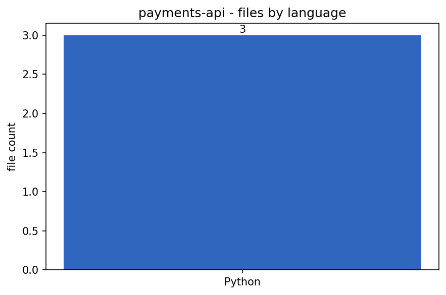

# Auto-README Generator

[](https://colab.research.google.com/github/phoebefu6/phoebe-the-builder/blob/main/automation-suite/auto-readme/demo.ipynb)
[](https://mybinder.org/v2/gh/phoebefu6/phoebe-the-builder/main?labpath=automation-suite/auto-readme/demo.ipynb)

> Scan any repo into a structured profile and generate a README - by template offline, or with Claude for richer prose. Wire it into GitHub Actions to auto-open a docs PR on every push.

## Business Impact
- **Before:** Repos ship with no README. New engineers reverse-engineer setup from source; onboarding drags.
- **After:** One command (or one Action) produces a structured README - languages, deps, entry points, Docker, run commands.
- **Estimated ROI:** Faster onboarding + every repo documented with zero ongoing effort.

## Tech Stack
Python, Anthropic SDK (Claude, optional), GitHub Actions, Docker.

## Demo

**[Run the interactive demo notebook →](demo.ipynb)** - pre-rendered with outputs, or click the Colab/Binder badges above.



Run as a CLI:
```bash
pip install -r requirements.txt
python main.py . -o README.md       # offline deterministic template
python main.py . --llm              # Claude (needs ANTHROPIC_API_KEY), falls back to template
```

## How it works
- `scanner.py` - walks the tree, detects the dominant language, parses `requirements.txt` / `package.json`, flags Docker / tests / entry points. **Deterministic, offline.**
- `generator.py` - `render_readme_template` (no API) or `generate_readme_claude` (lazy-imports the SDK; only the **profile** is sent to Claude, never your whole codebase).
- `main.py` - CLI wrapper, CI-friendly.

## Auto-docs in CI (the headline use case)
Copy [`auto-readme-action.example.yml`](auto-readme-action.example.yml) into a target repo at `.github/workflows/auto-readme.yml`. On every push it regenerates the README and opens a PR. Set `ANTHROPIC_API_KEY` as a repo secret to enable Claude; without it, the template path runs.

## Edge case handled
The Claude path **falls back to the template** when no API key is present - the tool never crashes for lack of a key, so it's safe to run anywhere (CI, a teammate's laptop, the demo notebook).

## Learning Connection
Built while studying **GitHub Actions for CI/CD** (Month 2).
Applies: composing a workflow with `permissions`, secrets, and an auto-PR action; designing a tool that degrades gracefully between LLM and offline modes.

## Impact Note
- **Who benefits:** Teams with many under-documented repos.
- **Potential risks:** Generated docs are a starting point - review before merging, especially LLM prose, which can over-claim features. The profile is heuristic (language by extension, deps by manifest).
