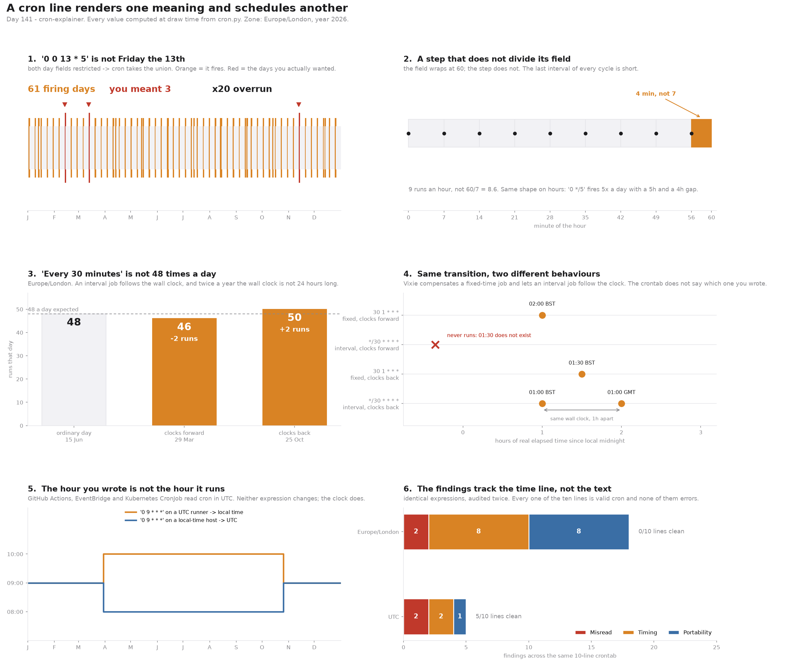

# Cron Explainer

[](https://colab.research.google.com/github/phoebefu6/phoebe-the-builder/blob/main/automation-suite/cron-explainer/demo.ipynb)
[](https://mybinder.org/v2/gh/phoebefu6/phoebe-the-builder/main?labpath=automation-suite/cron-explainer/demo.ipynb)

> `0 0 13 * 5` is the line somebody writes for Friday the 13th. It fires on **61 days a year** instead of 3, because when both day fields are restricted cron takes their **union**. That is POSIX behaviour, specified and deliberate. The line is valid, `crontab` accepts it, nothing logs a warning, and the job runs twenty times more often than the person who wrote it believes.

**Day 141 - Automation Suite.** A reader that answers the two questions a cron expression does not: *what does this actually mean*, and *when does it actually run*. Seven finding types across three severities, every one of them computed from a generated schedule on a real IANA time line rather than pattern-matched off the string.



## Business Impact

- **Before:** a crontab in a repo. Ten lines, each one plausible, each one reviewed by somebody who read it left to right and nodded. One of them fires twenty times more often than intended, one drops a run every March and doubles one every October, one is `0 9 * * *` on a GitHub Actions runner and lands an hour late for eight months of the year.
- **After:** the same ten lines, plus the list of which ones mean something other than they read - before the schedule ships, not after the on-call figures out why the report ran on a Tuesday.
- **Estimated ROI:** on the bundled 10-line sample crontab, **18 findings across all 10 lines**, of which **2 are outright misreadings** and **8 change the instant the job runs**. Every one of the ten lines is valid cron; **none of them errors**. Audited against UTC instead, the same ten lines produce **5 findings and 5 clean lines** - the text did not change, the time line did.

## What it does

Five mechanisms. Three of them have no fix at the expression level, and the tool says so rather than quietly rewriting your line.

### 1. Restricting both day fields makes the schedule wider

The rule, from POSIX and from Vixie cron's source:

```
if day-of-month is '*' or day-of-week is '*':   fire on DOM and DOW
else:                                            fire on DOM or  DOW
```

Every other field intersects. The day fields, uniquely, union - so adding a constraint *adds* fire days:

```
expression       day rule              firing days in 2026
--------------------------------------------------------------
0 0 13 * 5       OR  (union)                   61
0 0 13 * *       AND (intersection)            12
0 0 * * 5        AND (intersection)            52
--------------------------------------------------------------
```

61 is 52 Fridays plus 12 thirteenths, minus the 3 that are both. Those 3 are the entire intended schedule. `describe()` therefore refuses to render this as an "and":

> At 00:00, on day-of-month 13 **or** on Friday (whichever comes first - cron takes the union when both are restricted).

There is a further wrinkle that changes which days fire. Vixie sets its star flag when a field *begins* with `*`, not when the field is exactly `*`. So `*/2` counts as a star and switches the rule back to an intersection:

```
0 0 13 * 5     ->  union         61 days
0 0 */2 * 5    ->  intersection  26 days
```

Two expressions that look equally restrictive, differing by a factor of two, for a reason that is in the C source rather than the man page.

### 2. A step does not wrap with its field

`*/7` on the minute field expands to 0, 7, 14 ... 56. Then the field wraps at 60 and the step does not:

```
0    7    14   21   28   35   42   49   56  |60
|----|----|----|----|----|----|----|----|---|
  7    7    7    7    7    7    7    7    4
```

"Every 7 minutes" is **9 runs an hour**, not 60/7 = 8.6, and once an hour the interval is 4 minutes. Same shape on hours: `0 */5 * * *` fires **5 times a day** with a 4-hour gap across midnight, not 24/5. A rate limiter tuned on the nominal interval sees a burst it was never sized for, once per cycle, forever.

`step_gaps()` reports this only when the step fails to tile the field - `*/15` and `*/12` return nothing.

### 3. "Every 30 minutes" is not 48 times a day

An interval job follows the wall clock, and twice a year the wall clock is not 24 hours long. `*/30 * * * *` in `Europe/London`:

```
ordinary day    15 Jun     48 runs
clocks forward  29 Mar     46 runs      -2
clocks back     25 Oct     50 runs      +2
```

Nothing in the expression changed. A daily job that reconciles against "48 batches" is wrong twice a year, in opposite directions, on dates that move.

### 4. The same transition, two different behaviours

Vixie splits jobs by whether the minute or hour field begins with `*`, and treats them differently at a transition:

| | clocks forward (01:30 does not exist) | clocks back (01:30 happens twice) |
|---|---|---|
| **fixed time** `30 1 * * *` | runs once, at the jump - 01:00 UTC, which is 02:00 local | runs **once** |
| **interval** `*/30 * * * *` | **never runs** - that wall clock does not occur | runs **twice**, an hour apart in real time |

Four different outcomes from one transition, and the crontab line does not say which class you are in - the classification is derived from the shape of the first two fields. `is_interval` computes it; `fires()` returns the actual UTC instant for each case, including `None` for the run that never happens.

This is where most cron explainers stop being honest. A skipped fixed-time job does not vanish and does not run at 01:30 - it runs at the transition instant, found here by bisecting the UTC offset change.

### 5. The hour you wrote is not the hour it runs

GitHub Actions, EventBridge and Kubernetes CronJob read cron in **UTC**. They never encounter a DST case at all, which is exactly the problem:

```
'0 9 * * *'              January          July
-----------------------------------------------------
on a UTC runner          09:00 local     10:00 local
on a local-time host     09:00 UTC       08:00 UTC
```

Both lines are correct and neither ever changes. The clock does. A digest scheduled for the start of the working day arrives an hour into it for eight months of the year, and the fix is not in the expression.

### 6 and 7. Dialect hazards

- **`DOW_DIALECT`** - Unix cron numbers days 0-6 with 0 = Sunday and accepts 7 as Sunday too. Quartz numbers them 1-7 with 1 = Sunday. `0 3 * * 7` is Sunday here and Saturday there; the same digits, a different day.
- **`FIELD_COUNT`** - a 6th field is *seconds* in Quartz and systemd, and a *year* in others. The parser keeps the standard five, reports which it dropped, and does not guess silently.

## How the fire times are checked

Two independent searches generate the schedule:

- `_next_naive()` jumps by field - skip the month, skip the day, skip to the next valid hour.
- `brute_naive()` tests every single minute.

They share the parsed field sets and nothing else. Over **30 expressions and 435 fire times** they produce identical output. Two real bugs surfaced this way during the build:

1. **A horizon mismatch.** The jumping search rolled its five-year window forward from each match; the scan measured from the original start. `0 0 29 2 *` returned 25 fire times from one and 1 from the other. Both are now anchored to the same `HORIZON`.
2. **Every skipped hour was being reported as a repeated one.** Under PEP 495 a *non-existent* local time carries different UTC offsets in its two folds, exactly like an *ambiguous* one - so the obvious `fold=0 vs fold=1` test cannot tell a spring-forward gap from an autumn fold. The round trip separates them: a time that does not exist comes back as a different wall clock, a time that happens twice comes back as itself. `classify_local()` now tests existence first.

The second bug is the interesting one, because the tool would have printed a confident and completely wrong DST verdict, and no test written against its own output would have caught it.

## Tech Stack

Python 3.9+, `zoneinfo` (stdlib), Streamlit, pandas, matplotlib, pytest. No cron library - the parser and both schedule generators are in `cron.py`, which is the point.

## Demo

**[Run the interactive demo notebook →](demo.ipynb)** - pre-rendered with all outputs, or click the Colab/Binder badges above to run it live.

For the app:

```bash
pip install -r requirements.txt
streamlit run app.py
```

Paste a line, pick the zone your host actually keeps, and tick the UTC-scheduler box to see what the same line does on GitHub Actions.

Reproduce every number in this README:

```bash
python3 evidence.py
```

Tests, including the cross-check:

```bash
python3 -m pytest test_cron.py -q
```

## Files

| File | What it is |
|---|---|
| `cron.py` | parser, both schedule generators, DST resolution, the seven findings |
| `test_cron.py` | 46 tests; the cross-check and the DST-instant checks are the ones that bite |
| `evidence.py` | computes every number quoted above |
| `make_chart.py` | the six-panel figure, all values computed at draw time |
| `app.py` | Streamlit front end |
| `demo.ipynb` | pre-rendered walkthrough |

## Learning Connection

Built while working through scheduling semantics in CI and orchestration - GitHub Actions `schedule`, Kubernetes `CronJob`, Airflow. Applies: reading a specification against its reference implementation instead of its documentation, and validating a generator by writing a second, slower, obviously-correct one and diffing them.

## Impact Note

- **Who benefits:** anyone reviewing a crontab, a workflow `schedule:` block, or a `CronJob` spec - especially in a team that deploys across time zones.
- **Potential risks:** the DST model follows Vixie cron. `cronie`, `systemd` timers, Quartz and the cloud schedulers each differ, and the tool names the differences rather than pretending to one truth. The union day rule and the step-wrap arithmetic are POSIX and hold everywhere. Fire times are computed from the `tzdata` on the machine running it; a stale `tzdata` gives stale transition dates, which is a real failure mode for zones that change their rules.
