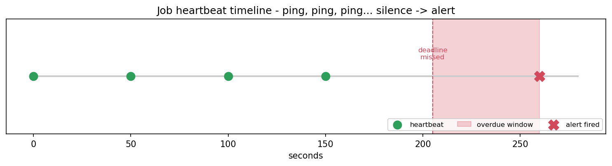

# Cron Job Monitor

[](https://colab.research.google.com/github/phoebefu6/phoebe-the-builder/blob/main/automation-suite/cron-monitor/demo.ipynb)
[](https://mybinder.org/v2/gh/phoebefu6/phoebe-the-builder/main?labpath=automation-suite/cron-monitor/demo.ipynb)

> A dead-man's-switch for scheduled jobs - heartbeat in, email out when a job goes silent. So you find out batch jobs failed before your users do.

## Business Impact
- **Before:** A cron job errors and stops; the line is still in the crontab, so nobody notices for days. Stale data, missed SLAs.
- **After:** Each job pings on every successful run. Miss the deadline and you get one email alert per outage - no spam, no silence.
- **Estimated ROI:** Hours of incident lag eliminated; failures caught in minutes, not days.

## Tech Stack
Python, FastAPI, smtplib (email), Pydantic, Docker.

## Demo

**[Run the interactive demo notebook →](demo.ipynb)** - pre-rendered with outputs, or click the Colab/Binder badges above.



Run the service:
```bash
pip install -r requirements.txt
uvicorn api:app --reload
```
Open `http://localhost:8000` for the live dashboard, or `/docs` for Swagger.

## How it works
- `monitor.py` - pure logic. A job is **overdue** when `now > last_ping + interval + grace`. Every method takes `now` explicitly, so it's fully deterministic and unit-testable.
- `alerter.py` - sends email via SMTP when `SMTP_HOST` (+ creds) are set; otherwise **dry-runs** and prints the alert. Works with zero secrets.
- `api.py` - register jobs, receive `/ping/{name}` heartbeats, expose `/status`, and `/check` (which a scheduler hits to evaluate + alert).

## API
| Method | Path | Purpose |
|--------|------|---------|
| POST | `/jobs` | Register a job + its expected interval |
| POST | `/ping/{name}` | Heartbeat - call on every successful run |
| GET | `/status` | All jobs + state (healthy / overdue / pending) |
| POST | `/check` | Evaluate overdue jobs and fire alerts |

## Edge case handled
**Alert once per outage.** `alerts_to_fire` tracks the last-alerted time and only re-fires after a recovery ping - so a multi-hour outage pages you once, not every check cycle.

## Learning Connection
Built while studying **FastAPI** + **GitHub Actions for CI/CD** (Month 2).
Applies: heartbeat/dead-man's-switch monitoring pattern, SMTP email with graceful dry-run fallback, designing pure logic separate from the web layer for testability.

## Impact Note
- **Who benefits:** Data engineers and platform teams running scheduled pipelines.
- **Potential risks:** In-memory state resets on restart - back it with Redis/DB for production. Alerts are only as good as the jobs' honesty about pinging; instrument the *success* path, not just process start.
