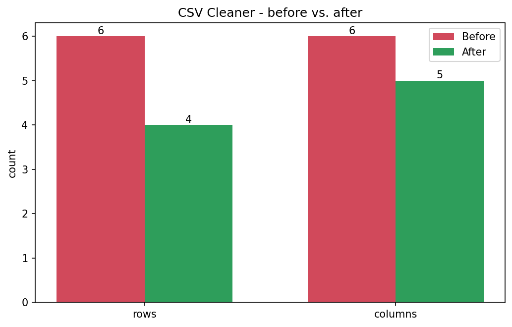

# CSV Cleaner

[](https://colab.research.google.com/github/phoebefu6/phoebe-the-builder/blob/main/automation-suite/csv-cleaner/demo.ipynb)
[](https://mybinder.org/v2/gh/phoebefu6/phoebe-the-builder/main?labpath=automation-suite/csv-cleaner/demo.ipynb)

> Turn a messy CSV export into a tidy, analysis-ready file - with an auditable report of every change.

## Business Impact
- **Before:** Analysts hand-fix every export - trimming spaces, renaming columns, deleting blank rows, hunting duplicates. ~20 min per file, error-prone.
- **After:** One command cleans headers, whitespace, null-tokens, empty rows/cols, duplicates, and numeric types - and prints what it changed.
- **Estimated ROI:** ~2-3 hrs/week saved across recurring exports.

## Tech Stack
Python, pandas, argparse (CLI), Docker.

## Demo

**[Run the interactive demo notebook →](demo.ipynb)** - pre-rendered with outputs, or click the Colab/Binder badges above.



Run as a CLI:
```bash
pip install -r requirements.txt
python main.py --demo                 # clean a bundled messy sample
python main.py messy.csv              # -> messy.cleaned.csv
python main.py messy.csv -o tidy.csv  # custom output
```

Or with Docker:
```bash
docker build -t csv-cleaner .
docker run --rm -v "$PWD":/data csv-cleaner /data/messy.csv
```

## What it cleans
- **Headers** - trimmed, lowercased, snake_cased, collisions de-duped (`amount`, `amount_1`).
- **Whitespace** - stripped from every string cell.
- **Null-tokens** - `N/A`, `-`, `#N/A`, `null`, `none`, `?` become real NaN.
- **Empty rows & columns** - dropped.
- **Duplicate rows** - dropped.
- **Numeric coercion** - columns that are ≥90% numbers are converted to numeric.

Every run prints a change report (rows in/out, drops, coercions) so the cleanup is auditable.

## Edge case handled
Columns are only coerced to numeric when **≥90%** of non-null values parse as numbers - so a mostly-text column with a stray number is left as text, not silently mangled.

## Learning Connection
Built while studying **Docker Essential Training** (Month 2 kickoff).
Applies: CLI design with argparse, containerizing a tool with an `ENTRYPOINT`, volume-mounting data into a container.

## Impact Note
- **Who benefits:** Analysts and data engineers handling recurring CSV exports.
- **Potential risks:** Aggressive null-token matching could blank a legitimate `"-"` value; review `NULL_TOKENS` in `cleaner.py` for your domain. Numeric coercion is best-effort - check the report before trusting downstream.
