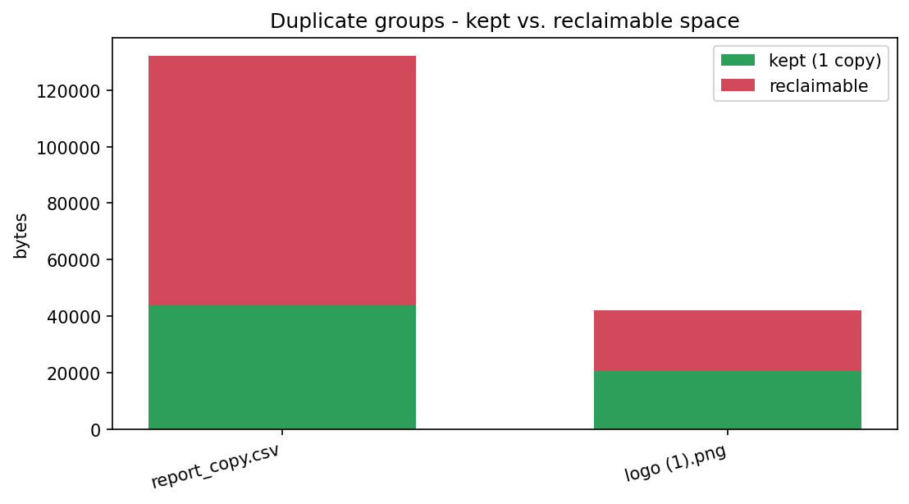

# Duplicate File Finder

[](https://colab.research.google.com/github/phoebefu6/phoebe-the-builder/blob/main/automation-suite/duplicate-finder/demo.ipynb)
[](https://mybinder.org/v2/gh/phoebefu6/phoebe-the-builder/main?labpath=automation-suite/duplicate-finder/demo.ipynb)

> Find byte-identical files hiding under different names - efficiently - and reclaim the space. So a shared drive full of duplicates stops costing you storage.

## Business Impact
- **Before:** Shared drives accumulate gigabytes of identical files under different names. Nobody cleans them; storage bills climb.
- **After:** One command lists every duplicate group, biggest waste first, and (opt-in) deletes the extras while keeping one copy.
- **Estimated ROI:** Reclaim storage; faster backups; cleaner drives.

## Tech Stack
Python (stdlib only - no runtime deps), argparse (CLI), Docker.

## Demo

**[Run the interactive demo notebook →](demo.ipynb)** - pre-rendered with outputs, or click the Colab/Binder badges above.



Run as a CLI:
```bash
python main.py /path/to/folder            # report (safe, dry run)
python main.py /path/to/folder --json     # machine-readable
python main.py /path/to/folder --delete   # remove extras, keep one per group
python main.py --demo                     # try it on a generated sample tree
```

## How it works - three cheapening passes
Hashing every file is slow. We narrow candidates before doing expensive reads:
1. **Group by size** - a unique size can't have a duplicate (just a `stat`).
2. **Partial hash** (first 4 KB) within each size group - one small read.
3. **Full SHA-256** only within partial-hash collisions - the full read, rarely needed.

So a file with a unique size, or a unique first-4KB, is **never fully hashed**. Fast even on large trees.

## Edge case handled
**Deletion is opt-in and safe.** Without `--delete` it's a pure report (dry run). With `--delete` it always **keeps the first file in each group** and only removes confirmed byte-identical copies. Symlinks are skipped, so it won't follow links out of the tree.

## Platform note
The `finder.py` core is UI-free and mountable as a **storage-hygiene** app on the platform shell.

## Learning Connection
Built while studying **file systems & hashing** (Month 2).
Applies: content hashing (SHA-256), multi-pass optimization to avoid unnecessary I/O, safe-by-default destructive operations (dry run + keep-one).

## Impact Note
- **Who benefits:** Anyone managing shared drives, backups, or media libraries.
- **Potential risks:** `--delete` is irreversible - review the dry-run report first. "Identical content" is not always "safe to delete" (two files may be intentionally duplicated); the tool keeps one copy per group, but judgment on *which* matters for your case.
