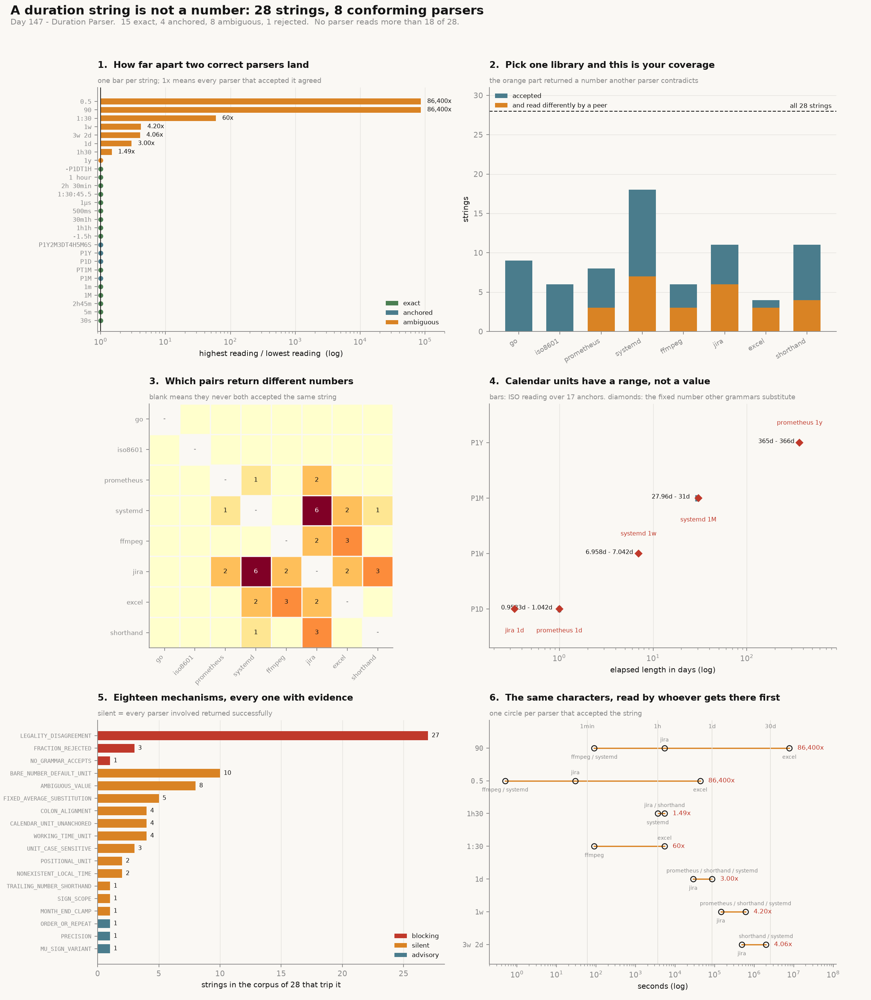

# Duration Parser

[](https://colab.research.google.com/github/phoebefu6/phoebe-the-builder/blob/main/automation-suite/duration-parser/demo.ipynb)
[](https://mybinder.org/v2/gh/phoebefu6/phoebe-the-builder/main?labpath=automation-suite/duration-parser/demo.ipynb)

> `parse(text) -> timedelta` cannot answer the question people actually have about a duration string, which is not "how long is this" but "does the parser at the other end of this pipe agree with me". Three of the eight parsers modelled here accept `1h30`. They return 3630, 5400 and 5400 seconds. Nobody is wrong, nobody raises, and a `timedelta` has room for one number.

**Day 147 - Automation Suite.** A duration reader that returns a **verdict over every reading a conforming parser could produce** instead of a number. Eight grammars (four specifications, two tool formats, two conventions), four verdicts, eighteen finding types, 89 tests, and a notebook that re-implements the whole engine independently and agrees with it to the value.



## Business Impact

- **Before:** a service reads `timeout: 90` from config with one library, a downstream job reads the same field with another, and both start successfully. One waits 90 seconds. One waits 90 minutes. Neither logs anything.
- **After:** the audit reports that `90` is accepted by 4 of 8 parsers with **three different values, 86,400x apart** - 90 seconds (ffmpeg, systemd), 5,400 seconds (Jira reads a bare number as minutes), and 7,776,000 seconds (a spreadsheet time cell, whose serial unit is the day). The verdict is `ambiguous` before anything runs.
- **Estimated ROI:** the whole 28-string corpus audits in well under a second. The number worth the time is this: **the best single parser reads 18 of 28 strings, and 7 of those 18 it reads differently from another parser that also accepted them**. Picking one library does not fix this; it hides it.

## What it does

Eighteen mechanisms. Several have no fix at the parser level, and the tool says so rather than returning a slightly different number.

### 1. The title question: `1h30`

```
grammar      reading         kind
go           refused         missing unit in duration '1h30'
iso8601      refused         not a PnYnMnWnDTnHnMnS duration
prometheus   refused         units must be y,w,d,h,m,s,ms, descending, each once
systemd        3,630s        specification   -> 1h + 30 *seconds* (default unit)
ffmpeg       refused         not [-][HH:]MM:SS[.m]
jira           5,400s        tool format     -> 1h + 30 minutes (bare number = minutes)
excel        refused         not [-]h:mm[:ss] and not a serial number
shorthand      5,400s        convention      -> trailing number steps one unit down
```

Five refuse it. Three accept it and produce two values. systemd's rule (a unitless component takes the default unit, which is seconds) and Jira's rule (a bare number is minutes) are both documented, both applied correctly, and 1,770 seconds apart. The person who typed `1h30` meant 5,400 and had no way to say so.

### 2. The same digits, five orders of magnitude apart

`duration: 90`, in JSON, with no unit and no schema:

```
systemd            90s
ffmpeg             90s
jira            5,400s
excel       7,776,000s
```

Ratio 86,400 - which is what a unit mismatch of one-day-per-second looks like when you write it as a number. `0.5` in the same field spans the same 86,400x, from 500ms to 12 hours.

### 3. One shift key, and one letter that moves

```
systemd     '1m' =           60s      '1M' =    2,630,016s   factor 43,834
iso8601   'PT1M' =           60s     'P1M' =  ~2,592,000s    factor 43,200
```

In systemd the difference between a minute and a month is **case**: `M` is a month of 30.44 days, `m` is a minute. In ISO 8601 the same letter carries the same collision **positionally** - `M` before the `T` is months, after it is minutes. Neither reads as a typo in review, and `git diff` shows one character.

### 4. Colon fields fill from opposite ends

```
'1:30'      ffmpeg        90s   (fields fill from the right: SS, MM:SS, HH:MM:SS)
'1:30'      spreadsheet 5,400s (fields fill from the left: h:mm)
'1:30:45'   ffmpeg      5,445s
'1:30:45'   spreadsheet 5,445s   -> agree
```

60x apart on two fields, identical on three. That asymmetry is why the bug survives testing: whichever example someone writes a test around, half the inputs behave.

### 5. The headline run

28 duration strings from one repository - a Prometheus rule file, a systemd timer, an ffmpeg call in a Makefile, a Jira worklog export, a timesheet CSV, and a JSON API field. Every one of them is somebody's correct input.

```
string           verdict    readers         low         high  x-grammar
'30s'            exact            5         30s          30s  1
'5m'             exact            5        5min         5min  1
'2h45m'          exact            5       2.75h        2.75h  1
'1h30'           ambiguous        3      1.008h         1.5h  1.488
'1:30'           ambiguous        2      1.5min         1.5h  60
'90'             ambiguous        4      1.5min          90d  86,400
'0.5'            ambiguous        4       500ms          12h  86,400
'1M'             exact            1      30.44d       30.44d  1
'1m'             exact            5        1min         1min  1
'P1M'            anchored         1      27.96d          31d  1
'PT1M'           exact            1        1min         1min  1
'P1D'            anchored         1         23h          25h  1
'1d'             ambiguous        4          8h          24h  3
'1w'             ambiguous        4         40h           7d  4.2
'1y'             ambiguous        2        365d       365.2d  1.001
'P1Y'            anchored         1        365d         366d  1
'P1Y2M3DT4H5M6S' anchored         1      428.1d       430.2d  1
'-1.5h'          exact            2       -1.5h        -1.5h  1
'1h1h'           exact            4          2h           2h  1
'30m1h'          exact            4        1.5h         1.5h  1
'500ms'          exact            4       500ms        500ms  1
'1µs'            exact            2     0.001ms      0.001ms  1
'1:30:45.5'      exact            2      1.513h       1.513h  1
'2h 30min'       exact            1        2.5h         2.5h  1
'3w 2d'          ambiguous        3      5.667d          23d  4.059
'1 hour'         exact            1          1h           1h  1
'-P1DT1H'        exact            1        -25h         -25h  1
'forever'        rejected         0           -            -  -
```

`{'exact': 15, 'anchored': 4, 'ambiguous': 8, 'rejected': 1}`

The 15 `exact` results split in a way that matters:

- **10** are exact with two or more parsers agreeing. These are the only strings that are actually portable.
- **5** are exact only because exactly one parser could read them at all: `1M`, `PT1M`, `2h 30min`, `1 hour`, `-P1DT1H`. Agreement among one parser is not agreement, it is a monopoly, so the report separates them (`CorpusReport.lonely()`).

### 6. Pick one library, as every codebase does

```
grammar     kind             accepts   of   silently differs
go          specification          9   28                  0
iso8601     specification          6   28                  0
prometheus  specification          8   28                  3
systemd     specification         18   28                  7
ffmpeg      tool format            6   28                  3
jira        tool format           11   28                  6
excel       convention             4   28                  3
shorthand   convention            11   28                  4
```

`silently differs` counts the strings a parser accepted **and read differently from another parser that also accepted them** - the failures with no exception attached.

Two results fall out of this table:

- **No grammar reads more than 18 of 28.** There is no library choice that makes a mixed repository parse.
- **Two grammars score 0 in the last column, for opposite reasons.** Go accepts 9 strings, *all nine* are also accepted by at least one other parser, and it agrees with them on all nine - it never contradicts anybody, having refused the other 19 outright. It has no unit above the hour, on the stated grounds that a day is not a fixed length; the parser with the smallest grammar is the one that never returns a wrong number, and those are the same fact. ISO 8601 also scores 0, but it is the **sole** reader of all 6 strings it accepts - the mandatory `P` prefix means it never overlaps anyone. A zero in that column can mean "always agrees" or "never meets", and a coverage metric cannot tell them apart, which is why the pair table below exists.

### 7. Which pairs disagree

```
pair                        strings both accept and read differently
jira vs systemd                                                   6
excel vs ffmpeg                                                   3
jira vs shorthand                                                 3
excel vs jira                                                     2
excel vs systemd                                                  2
ffmpeg vs jira                                                    2
jira vs prometheus                                                2
prometheus vs systemd                                             1
shorthand vs systemd                                              1
```

19 of the 28 pairs never disagreed - almost entirely because they never both accepted the same string. Agreement and non-overlap look identical in a coverage metric and are opposites in practice, so the tool counts them separately.

### 8. Calendar units have a range, not a value

The ISO readings resolved from each of 17 anchor instants (12 month starts, a 31st, both US DST transition days, a spring-forward gap time, and 28 Feb of a non-leap year), in `America/New_York`:

```
P1D      23h from 2024-03-09 12:00        25h from 2024-11-02 12:00   spread 2h
P1W   6.958d from 2024-03-09 12:00     7.042d from 2024-11-01 00:00   spread 2h
P1M   27.96d from 2023-02-28 00:00        31d from 2024-01-01 00:00   spread 3.042d
P1Y     365d from 2024-03-09 12:00       366d from 2024-01-01 00:00   spread 25h
```

And the fixed numbers the other grammars substitute for the same words:

```
prometheus  1d   =        24h      systemd  1M  =  30.44d
prometheus  1y   =       365d      systemd  1y  =  365.2d
jira        1d   =         8h
```

These are exact, so nothing ever flags them. That is the trade: a fixed substitution is never anchored and never right - a `1d` retention window keeps an hour more or less than a day twice a year, and a `1M` of 30.44 days is wrong in every month of the year.

Two further distortions live in the calendar arithmetic itself, and both are reported:

- **`MONTH_END_CLAMP`** - 31 Jan + 1 month is 29 Feb 2024, so the operation is not injective and subtracting the month again lands on 29 Jan. Two different starting dates now share one result.
- **`NONEXISTENT_LOCAL_TIME`** - 02:30 on 9 Mar + 1 day asks for 02:30 on 10 Mar, which did not happen in New York. Nothing raises: `zoneinfo` resolves the gap with `fold=0`, the elapsed count comes out as a clean 86,400, and the instant displays as 03:30. The failure is invisible in the number *and* in the exception.

### 9. Eighteen findings, every one with evidence in the corpus

```
code                         severity  fires  description
NO_GRAMMAR_ACCEPTS           blocking      1  no modelled grammar accepts the text
LEGALITY_DISAGREEMENT        blocking     27  at least one grammar accepts it and at least one refuses
FRACTION_REJECTED            blocking      3  a fraction is legal in one grammar and illegal in another
AMBIGUOUS_VALUE              silent        8  two grammars accept it and return different numbers
UNIT_CASE_SENSITIVE          silent        3  changing the case of a unit letter changes the value
POSITIONAL_UNIT              silent        2  the same letter means different units in different positions
BARE_NUMBER_DEFAULT_UNIT     silent       10  a unitless number was given a unit by the parser
TRAILING_NUMBER_SHORTHAND    silent        1  a trailing unitless number reads two ways
COLON_ALIGNMENT              silent        4  colon fields fill from the right in one grammar, the left in another
SIGN_SCOPE                   silent        1  a leading minus over several components
CALENDAR_UNIT_UNANCHORED     silent        4  the length depends on the instant you start from
MONTH_END_CLAMP              silent        1  adding a month clamps the day number, so it is not invertible
NONEXISTENT_LOCAL_TIME       silent        2  the wall-clock result names a local time that never happened
FIXED_AVERAGE_SUBSTITUTION   silent        5  a calendar unit was replaced by a fixed average
WORKING_TIME_UNIT            silent        4  a day means working hours, not elapsed hours
ORDER_OR_REPEAT              advisory      1  order or repetition is legal in one grammar and not another
PRECISION                    advisory      1  the value is near a representation limit
MU_SIGN_VARIANT              advisory      1  two distinct Unicode characters spell the microsecond unit
```

`silent` is the severity that matters. `blocking` means a parser refused and somebody will read a stack trace; `silent` means every parser involved returned successfully and they returned different numbers.

`LEGALITY_DISAGREEMENT` firing on 27 of 28 strings is not noise - it is the finding. Exactly one string in a real config dump is read the same way by every parser modelled, and it is `forever`, which they all refuse.

### 10. The one shape with no ambiguity left

```
30s        agreed by 5 grammars: ffmpeg, go, prometheus, shorthand, systemd
5400s      agreed by 5 grammars: ffmpeg, go, prometheus, shorthand, systemd
86400s     agreed by 5 grammars: ffmpeg, go, prometheus, shorthand, systemd
2592000s   agreed by 5 grammars: ffmpeg, go, prometheus, shorthand, systemd
```

Integer seconds, no calendar unit, no colon, no bare number. `safe_form()` emits it. It is also unreadable, which is exactly why configuration is not written that way - and why the useful return value is a verdict rather than a number.

## The API

```python
from durations import audit, audit_corpus, Verdict

a = audit("1h30")
a.verdict                 # Verdict.AMBIGUOUS
a.distinct_values()       # (3630.0, 5400.0)
a.spread_ratio            # 1.488...
[r.grammar for r in a.accepted]   # ['systemd', 'jira', 'shorthand']
[(f.code, f.severity) for f in a.findings]

rep = audit_corpus()      # the 28-string corpus, or pass your own list
rep.verdicts              # {'exact': 15, 'anchored': 4, 'ambiguous': 8, 'rejected': 1}
rep.lonely()              # exact only because one parser could read it
rep.disagreements         # {('jira', 'systemd'): 6, ...}
```

A `Reading` splits into `exact_s` and `nominal` (months, days) precisely because the second half has no length until `resolve(anchor)` is given an instant:

```python
from datetime import datetime
from zoneinfo import ZoneInfo
from durations import parse_iso

r = parse_iso("P1D")
r.resolve(datetime(2024, 3, 9, 12, tzinfo=ZoneInfo("America/New_York")))   # 82800.0
r.resolve(datetime(2024, 11, 2, 12, tzinfo=ZoneInfo("America/New_York")))  # 90000.0
```

## Tech Stack

Python 3.10+, standard library only for the engine (`re`, `datetime`, `zoneinfo`, `calendar`, `dataclasses`, `enum`). Streamlit for the UI, matplotlib for the figure, pytest for the suite, Docker + GitHub Actions for CI.

- `durations.py` - the engine: 8 grammars, 4 verdicts, 18 findings, calendar resolution over an anchor set
- `test_durations.py` - 89 tests, including the cross-grammar disagreements pinned as assertions
- `evidence.py` - prints every number quoted above; nothing in this README is typed by hand
- `make_chart.py` - the six-panel figure
- `build_notebook.py` - generates `demo.ipynb`, whose readers are written independently and cross-checked against the engine
- `app.py` - Streamlit: one string, or a whole config dump

## Demo

**[Run the interactive demo notebook →](demo.ipynb)** - pre-rendered with outputs, or click the Colab/Binder badges above to run it live.

```bash
pip install -r requirements.txt
python -m pytest test_durations.py -q   # 89 passed
python evidence.py                      # every table above
python make_chart.py                    # duration_audit.png, duration_demo.png
streamlit run app.py
```

## Learning Connection

Built while working through duration handling in Prometheus, systemd, Go and ISO 8601 for the FDE portfolio's automation track. Applies: reading primary specifications rather than library docs, modelling several conforming implementations side by side, timezone-aware calendar arithmetic with `zoneinfo` (DST gaps, month-end clamping, PEP 495 fold semantics), and designing a return type that can express disagreement.

## Impact Note

- **Who benefits:** anyone whose config passes duration strings between services written in different stacks - a Prometheus rule, a Go service flag, an ISO field in a JSON API, and a timesheet export in the same repository.
- **Potential risks:** the eight grammars are *models* of their rule sets, not the implementations themselves, and two of them (`excel`, `shorthand`) are conventions rather than published specs - the `kind` field on every `Grammar` says which is which. A parser not modelled here may read your string a ninth way. The Jira day (8h) and week (5d) are the defaults and are per-instance settings. Anchor spreads use `America/New_York`; a zone with a different or absent DST rule gives different numbers, which is the point.
