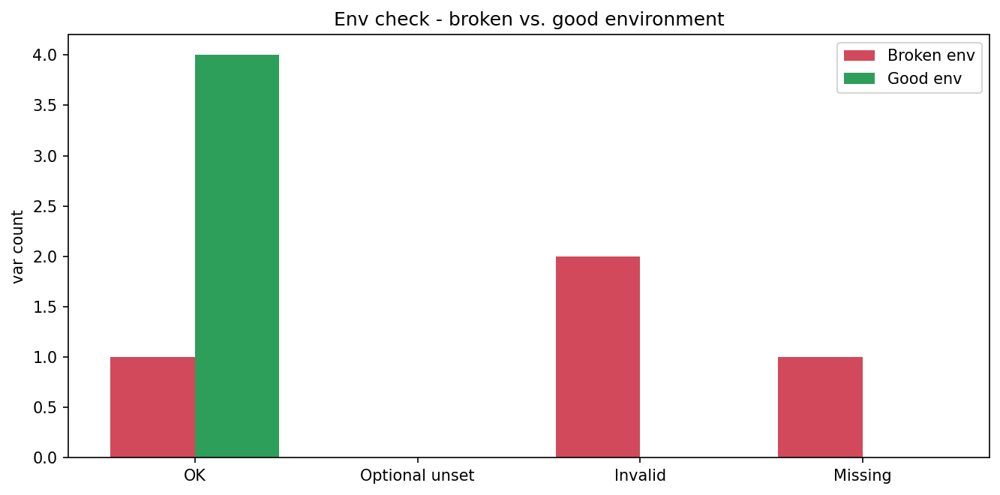

# Environment Variable Checker

[](https://colab.research.google.com/github/phoebefu6/phoebe-the-builder/blob/main/automation-suite/env-checker/demo.ipynb)
[](https://mybinder.org/v2/gh/phoebefu6/phoebe-the-builder/main?labpath=automation-suite/env-checker/demo.ipynb)

> A pre-flight check for environment variables - declare what your app needs, validate it before you ship, and fail the deploy if anything's missing or malformed.

## Business Impact
- **Before:** Deploys blow up at runtime because `DATABASE_URL` was never set or `PORT` is a typo. Rollback, scramble, repeat.
- **After:** One command validates presence **and shape** (via regex) before release. Bad environment → non-zero exit → CI/deploy halts.
- **Estimated ROI:** Failed-deploy incidents and 2am rollbacks largely eliminated.

## Tech Stack
Python (stdlib only - zero runtime deps), argparse (CLI), Docker.

## Demo

**[Run the interactive demo notebook →](demo.ipynb)** - pre-rendered with outputs, or click the Colab/Binder badges above.



Run as a CLI:
```bash
python main.py --demo                                  # bundled example (exits 1)
python main.py --schema .env.schema                    # check the live environment
python main.py --schema .env.schema --env-file .env    # check a .env file
```

## Schema format
One variable per line:
```
DATABASE_URL=required:^postgres://     # required, must be a Postgres URL
API_KEY=required                        # required, any value
PORT=optional:^\d+$                     # optional, but digits-only if set
DEBUG=optional:^(true|false)$           # optional flag
```
`required|optional` controls presence; the optional `:regex` asserts the value's shape.

## Use it as a deploy gate
```yaml
# in CI, before the deploy step
- run: python main.py --schema .env.schema
```
A non-zero exit stops the pipeline before a misconfigured release goes out.

## Edge case handled
**Empty string ≠ set.** A var present but blank (`API_KEY=`) is treated as missing, not satisfied - catching the classic "the secret exists but didn't render" failure.

## Learning Connection
Built while studying **Docker Essential Training** (Month 2).
Applies: stdlib-only CLI design, exit codes as a CI contract, containerizing a check that mounts host config, regex-based validation.

## Impact Note
- **Who benefits:** Anyone deploying services with required configuration.
- **Potential risks:** The schema is only as complete as you make it - an undeclared-but-required var won't be caught. Keep the schema in sync with the app. Regexes validate shape, not correctness (a well-formed but wrong URL still passes).
