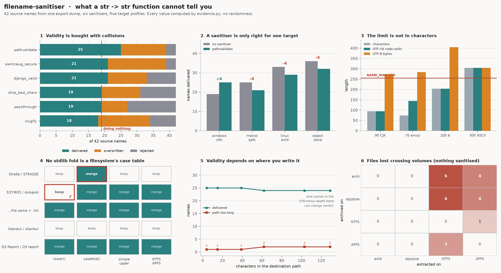

# Filename Sanitiser

[](https://colab.research.google.com/github/phoebefu6/phoebe-the-builder/blob/main/automation-suite/filename-sanitiser/demo.ipynb)
[](https://mybinder.org/v2/gh/phoebefu6/phoebe-the-builder/main?labpath=automation-suite/filename-sanitiser/demo.ipynb)

> `sanitise(name) -> str` is the wrong shape, and not because of which characters are on the deny-list. A sanitiser is a **projection**: it maps a large set of source names onto the smaller set a target filesystem accepts. Projections onto smaller sets collide - that is what the word means. The only question is whether the function tells you, and one returning `str` structurally cannot: a collision is a fact about a **pair** of names, and it has one name in scope.

**Day 146 - Automation Suite.** A sanitiser that returns a **verdict on the whole corpus** instead of a string for one name. Eighteen finding types across three severities, six sanitisers modelled from published implementations, five target profiles, and a notebook that re-implements the engine independently and agrees with it to the name.



## Business Impact

- **Before:** an export job writes 42 files. Every `sanitise()` call returns a string, no call raises, and the job logs success.
- **After:** the audit reports that on Windows with the deny-list regex everyone writes, **19 of the 42 arrive as themselves**. Twelve are silently overwritten by another row in the same batch, and eleven fail. The twelve are the problem: a rejected write fails and raises somewhere, an overwritten one *succeeds* and a file is simply gone.
- **Estimated ROI:** the whole audit runs on a list of names in well under a second, before anything is written. The single most useful number it produces is that **doing nothing delivers 19 files and the deny-list regex also delivers 19** - it bought four fewer rejections (15 → 11) by merging four more names (8 → 12), for net zero, and traded loud failures for silent ones doing it. Two of the five real sanitisers tested deliver no more files than not sanitising at all.

## What it does

Eighteen mechanisms. Several have no fix at the sanitiser level, and the tool says so rather than returning a slightly different string.

### 1. Four names, one file, four successful writes

The smallest complete failure. Four filenames differing in one character, and that character is on every deny-list:

```
source        strip_bad_chars     django_valid    slugify
a:b.txt       a_b.txt             ab.txt          a-b.txt
a*b.txt       a_b.txt             ab.txt          a-b.txt
a?b.txt       a_b.txt             ab.txt          a-b.txt
a|b.txt       a_b.txt             ab.txt          a-b.txt
```

Four distinct sources, one distinct target, under all three. Mapping N forbidden characters onto 1 replacement merges every pair that differed only there - and *deleting* them, as Django does, merges strictly more than replacing. No implementation had the information to warn you: each was handed one name and asked for one string.

### 2. The headline run

42 filenames from one export dump, target `windows-ntfs`, destination `C:\data`. Every source lands in exactly one bucket, so the three columns sum to 42:

```
sanitiser          delivered  overwritten  rejected  distinct out
passthrough               19            8        15            40
strip_bad_chars           19           12        11            37
django_valid              21           12         9            37
werkzeug_secure           21           18         3            33
pathvalidate              25           14         3            35
slugify                   18           16         8            30
```

`distinct out` is the size of the codomain. It falls as the sanitiser rewrites more, and every name it loses is two sources merging. `slugify` produces the most legal names and the fewest distinct ones.

**Doing nothing delivers 19.** `strip_bad_chars` also delivers 19 - it traded four rejections for four overwrites. `slugify` delivers 18, one *fewer* than not sanitising. That is not a bug in either: collision count is monotone in how much a projection throws away, and neither fixes a device name or a length.

### 3. Overwritten is the dangerous column, and it is not the one that errors

| bucket | what happens | who finds out |
|---|---|---|
| `rejected` | the write fails | whoever reads the exception |
| `overwritten` | the write **succeeds** onto a file another source already claimed | nobody |

`delivered + overwritten + rejected` sums to the corpus exactly, with no remainder. That accounting is the whole reason the function has to take the set: a `str` return value can express "I changed your name" and cannot express "I gave two of your names the same one".

### 4. With no sanitiser at all, five groups still merge

Run `passthrough` - rewrite nothing - against `windows-ntfs`:

```
key                 sources
'CON'               'CON', 'CON.'
'MONTHLY REPORT'    'monthly report.', 'monthly report'
'Q3 REPORT.CSV'     'Q3 Report.csv', 'Q3 report.csv'
'ÖLÜM.TXT'          'Ölüm.txt', 'ölüm.txt'
'ΣΙΣΥΦΟΣ.TXT'       'ΣΙΣΥΦΟΣ.txt', 'σισυφοσ.txt'
```

Three by case-folding, two by the trailing-dot strip, **zero caused by a sanitiser**. Every one of these names is already legal, already distinct, and the volume merges them anyway. This is the class of failure a per-name function is not merely bad at but structurally blind to, and it is why `collision_reason()` reports *which rule* merged a pair - because for these five the answer is "none that you control".

### 5. The same sanitiser is correct on one target and destructive on three

`pathvalidate` is written against Win32's rules: a deny-list, device names, `MAX_PATH`. Applied unconditionally, which is what every codebase does:

```
target              nothing  pathvalidate   change  what the target actually needs
windows-ntfs             19            25       +6  deny-list, devices, MAX_PATH
macos-apfs               25            21       -4  nothing but ':' and NFD folding
linux-ext4               33            29       -4  nothing but '/' and NUL
object-store             36            32       -4  nothing
```

**+6 on the target it was written for, -4 on all three others.** On a permissive byte-exact volume every rewrite is pure loss: there was nothing to fix, and the rewrite still merged names.

Sanitising happens at **upload** time. The target is chosen at **write** time. The function is called before the answer it needs exists, which is why it is a pure function of the name in the first place - and why that is the wrong signature rather than an unfortunate one.

### 6. Reserved device names survive extensions

The most-missed rule in Win32 naming. The lookup is on the stem **before the first dot**, evaluated *after* trailing dots and spaces are stripped:

```
name           win32 opens    lookup stem   reserved?
'CON'          'CON'          CON           YES
'CON.txt'      'CON.txt'      CON           YES
'con.tar.gz'   'con.tar.gz'   CON           YES
'CON.'         'CON'          CON           YES
'CON '         'CON'          CON           YES
'aux.tar.gz'   'aux.tar.gz'   AUX           YES
'CONS.txt'     'CONS.txt'     CONS          -
'COM10.csv'    'COM10.csv'    COM10         -
```

Opening any of the first six gives you a character device, not a file. The check is exact on the stem, not a prefix - `CONS` and `COM10` are ordinary names, and a reserved word in the *extension* position is irrelevant.

Of the six implementations, **two handle device names** (`werkzeug_secure`, `pathvalidate`). The other four return a name Windows will not open, as a `str`, with nothing to indicate it.

### 7. Neither `lower()` nor `casefold()` is any filesystem's case table

The mechanism where the sanitiser is **more destructive than the filesystem it protects you from**.

Case-insensitive volumes fold with a **1:1** case table - NTFS compares through `$UpCase`, a table of single-code-unit mappings; APFS's is likewise 1:1. `str.casefold()` implements **full** Unicode case folding, which expands `ß` to `ss`.

```
a                b                 lower()  casefold()  simple_upper   NTFS/APFS
Straße.txt       STRASSE.txt             -       merge             -   keeps apart  ← wrong
ΣΙΣΥΦΟΣ          σισυφοσ                 -       merge         merge   merges       ← wrong
ΣΙΣΥΦΟΣ.txt      σισυφοσ.txt         merge       merge         merge   merges
İstanbul.txt     istanbul.txt            -           -             -   keeps apart
Q3 Report.csv    Q3 report.csv       merge       merge         merge   merges
```

Row 1: a dedupe built on `casefold()` merges two files the volume keeps apart, and deletes one of them.

**Rows 2 and 3 are the same two stems.** `lower()` changes its answer when an extension is appended, because the final-sigma rule fires only when the sigma ends a word - so `ΣΙΣΥΦΟΣ` lowercases to `…ος` and `ΣΙΣΥΦΟΣ.txt` to `…οσ.txt`. It is wrong on row 2 and right on row 3 for a reason that has nothing to do with any filesystem: whether a dot followed the name.

The two standard-library functions err in **opposite directions** on ordinary text - `casefold` over-merges, `lower` under-merges - so choosing between them is not the fix. `fold_simple_upper` matches the volume on every row, and the test suite pins the property that makes it a model at all: it preserves length for every code point in the BMP, because a 1:1 table cannot expand.

### 8. The limit is in bytes. Sanitisers count characters.

`NAME_MAX` is 255 **bytes** on ext4 and APFS, and 255 **UTF-16 code units** on NTFS. Neither is characters, and the two disagree with each other:

```
probe                     chars  utf-8 B  utf-16 CU  ext4 (255B)  NTFS (255CU)
90 CJK characters            94      274         94  REJECT       ok
70 emoji                     74      284        144  REJECT       ok
300 ASCII                   304      304        304  REJECT       REJECT
200 precomposed é           204      404        204  REJECT       ok
```

90 CJK characters is a legal NTFS filename and too long for ext4. Every character-counting length check gets one of these rows wrong, and which one depends on a target it was never given.

### 9. Truncating to fit is a second, separate bug

```
probe                             bytes  cut at 255  U+FFFD?  keeps .ext?
CJK, 3 bytes each                   274      aligns        -  naive NO / safe yes
the same, after a 2-char prefix     276      SPLITS      yes  naive NO / safe yes
emoji, 4 bytes each                 284      SPLITS      yes  naive NO / safe yes
precomposed é, 2 bytes each         404      SPLITS      yes  naive NO / safe yes
```

255 is divisible by 3, so a name of pure 3-byte characters aligns and `name.encode()[:255]` looks correct. Prepend two ASCII characters and the same code on the same name emits U+FFFD - **a legal filename character**, so the write succeeds and the name is quietly corrupt. The bug lives in the arithmetic between the limit and the encoding, so it passes whichever input the test happened to use.

And truncation is a *prefix*, which throws away exactly the field that distinguished two report names:

```
a: 'Regional Sales …xxxxx-EMEA.csv'  (296 chars)
b: 'Regional Sales …xxxxx-APAC.csv'  (296 chars)
truncated to 255 bytes -> IDENTICAL
```

`TRUNCATION_COLLISION` is therefore a separate finding from the length one - the length failure is loud, and the usual remedy for it is silent.

### 10. Validity is a property of `(name, target, destination)`

Identical corpus, identical sanitiser, identical target. Only the destination moves:

```
destination depth  delivered  path too long
           4 ch         25              1
          15 ch         25              1
          62 ch         24              2
         103 ch         24              2
         129 ch         24              2
```

`MAX_PATH` is 260 *including* the terminating NUL, so 259 usable for the whole path; a OneDrive- or Teams-synced folder spends half of that before the filename starts. How many names move is a property of this corpus rather than of `MAX_PATH` - only names in the 259-minus-depth band can change verdict - but a pure function of the name cannot see the destination at all.

### 11. `a:b.txt` is not a filename with a colon in it

It is a **drive-relative path**: `b.txt` in the current directory of drive `A:`. Passing it through unchanged does not create an oddly-named file, it writes somewhere else entirely - which is *why* `:` is forbidden rather than merely discouraged.

This one was found by disagreement. The notebook re-implements the engine independently, and delivered one more file than `sanitise.py` did; the extra file was `a:b.txt`. Drive letters are a single character, so `ab:c.txt` is not drive-relative and is reported only as a forbidden character.

### 12. Names made only of dots and spaces have no writable form

`...` and `   ` clear the deny-list, are the right length, and are not devices. Win32 strips trailing dots and spaces, which reduces both to the empty string, so there is no name left to open. Before this was handled the audit filed them as an ordinary collision onto an empty key - reporting two names merging into a file that cannot exist.

### 13. A round trip between volumes loses files with nothing sanitised

```
built on      opened on         entries  on disk  lost
linux-ext4    macos-apfs             42       38     4
linux-ext4    windows-ntfs           42       36     6
macos-apfs    linux-ext4             38       38     0
```

The archive is valid. `unzip` reports no error. The file count on disk is lower than the count in the archive. The direction is **not symmetric**: byte-exact is the finer partition, so going *to* it never loses anything, and building on it and opening elsewhere is what loses six.

### 14. Confusables, which no filesystem and no index will catch

`report‐2024.pdf` with U+2010 HYPHEN and `report-2024.pdf` with U+002D are distinct bytes on every filesystem, so they are `portable` everywhere - and render identically. A `UNIQUE` index is satisfied; a human choosing which to open is not. Reported at `INFO`, because there is nothing to fix and something to know.

## The verdict

Three values, about whether the corpus survives the round trip:

| verdict | meaning |
|---|---|
| `portable` | every name is writable on every target, and the mapping from sources to targets is injective on every target |
| `lossy` | every name is writable, but two sources land on one file somewhere. The write succeeds and a file is gone. |
| `rejected` | at least one name cannot be written at all |

The same corpus, three targets:

```
corpus                            windows    macos      ext4       why
q3.csv, q4.csv                    portable   portable   portable   ordinary names
Report.csv, report.csv            lossy      lossy      portable   differ only by case
café.txt, cafe+U0301.txt          portable   lossy      portable   differ only by normalisation
report., report                   lossy      portable   portable   differ only by a trailing dot
CON.txt                           rejected   portable   portable   reserved device name
a×300                             rejected   rejected   rejected   over NAME_MAX
report‐2024.pdf, report-2024.pdf  portable   portable   portable   confusable hyphens
```

Rows 2-4 each fail on a **different set of volumes** - the case pair on Windows and macOS, the normalisation pair on macOS alone (NTFS is byte-exact for normalisation, so it keeps NFC and NFD apart exactly as ext4 does), the trailing-dot pair on Windows alone. In all three the names are legal and already distinct, so there is no single safe name to rewrite them to, and a function that cannot see the target cannot even know which rule applies.

`portable` is a claim that the bytes survive. **It is not an all-clear**: the last row is `portable` everywhere and is two files a person cannot tell apart. Read the findings.

## Findings

| code | severity | fires when |
|---|---|---|
| `PATH_TRAVERSAL` | critical | the sanitised name is still a path: a separator, a `..`, or a drive letter |
| `CONTROL_CHARACTER` | critical | a control character survives; NUL cannot be encoded in a POSIX name at all |
| `RESERVED_DEVICE_NAME` | critical | the stem before the first dot is a Win32 device; the extension does not help |
| `BYTE_LENGTH_EXCEEDED` | critical | over `NAME_MAX` in the target's unit, which is not characters |
| `PATH_LENGTH_EXCEEDED` | critical | the full path at this destination is too long; the name alone is legal |
| `SANITISER_EMPTIED_NAME` | critical | nothing left to write - the sanitiser returned `""`, or Win32 strips the name to nothing |
| `COLLISION_AFTER_SANITISE` | critical | two sources reach one target; the write succeeds and a file is gone |
| `CASE_FOLD_COLLISION` | critical | the names differ only by case and the volume folds them; no sanitiser involved |
| `NORMALISATION_COLLISION` | critical | one file on a normalisation-insensitive volume, two on a byte-exact one |
| `TRAILING_STRIP_COLLISION` | critical | differ only by a trailing dot or space, which Win32 removes from both |
| `TRUNCATION_COLLISION` | critical | cutting to fit produced a target another source already claimed |
| `TRAILING_DOT_OR_SPACE` | warning | Win32 opens a different name than the one you asked for |
| `RESERVED_CHARACTER` | warning | contains a character this target rejects |
| `PATH_SUBMITTED_AS_NAME` | warning | the source was a path; flattening it is itself a merge |
| `CASE_TABLE_DISAGREEMENT` | warning | the three fold models disagree, so the answer depends on the volume's table |
| `EXTENSION_MASQUERADE` | warning | double extension ending in an executable type |
| `CONFUSABLE_PAIR` | info | renders identically, distinct on every filesystem |
| `LEADING_DASH_OR_DOT` | info | reads as a CLI flag, or is hidden on POSIX |

## What actually fixes it

The failures that lose data are relations between names. A function that sees one name cannot report them, however good its deny-list.

- **Sanitise the corpus, not the name.** Take the list, return the mapping *and* the collisions. This is the only change that addresses the class rather than an instance.
- **Pass the target and the destination in.** Validity is a property of all three. A sanitiser that does not know where the file is going is guessing, and guesses wrong in the direction of destroying information (§5).
- **Never dedupe filenames with `casefold()` or `lower()`.** Neither is a case table; they err in opposite directions on ordinary text (§7). Model the volume, or compare the bytes and let the filesystem answer.
- **Count length in the target's unit, and reserve the extension before truncating.** Then check whether the truncation collided (§8, §9).
- **Prefer a content-addressed name and store the original separately.** A hash is injective in practice, legal everywhere, and immune to every mechanism above; the display name then lives in a database column where case, normalisation and length are your problem rather than the filesystem's.

## Tech Stack

Python 3.9+ standard library for the engine (`re`, `unicodedata`, `dataclasses`, `enum`, `collections`) - no dependencies. matplotlib for the figure, Streamlit for the app, pytest for the suite, Docker for deployment.

## Verification

`test_sanitise.py` - **228 tests**, all passing. The groups that earn their place:

**The partition invariant.** `delivered + overwritten + rejected` must equal the corpus size, and the three sets must be disjoint, for every sanitiser against every profile. This caught the first version reporting **6 and 10 for the same quantity**: `compare()` derived `overwritten` as a residual while `Report.lost` counted merge groups, so the two drifted. The fix was one `partition()` computed once, with an assertion at the call site.

**`fold_simple_upper` preserves length across the BMP.** It claims to model a 1:1 case table, so it must not expand for any of the ~63,000 non-surrogate code points below U+10000. A table that expands is not 1:1, and the whole §7 argument rests on that distinction.

**The notebook as an independent implementation.** `demo.ipynb` re-implements the core rather than importing it, so Colab needs nothing but matplotlib - which makes it a second opinion. It found the `a:b.txt` drive-relative bug in §11 by delivering one more file than the engine, and it now agrees on all six sanitisers' partitions to the name.

Two claims were also removed from `evidence.py` for failing under their own output: `lower()` does *not* keep the sigma pair apart once `.txt` is appended (§7 row 3), and a 255-byte cut does *not* split pure 3-byte CJK, because 255 is divisible by 3 (§9).

```bash
python3 -m pytest test_sanitise.py -q     # 228 tests
python3 evidence.py                       # every number in this README, computed
python3 make_chart.py                     # regenerate the figure
python3 build_notebook.py                 # regenerate demo.ipynb
```

## Demo

**[Run the interactive demo notebook →](demo.ipynb)** - pre-rendered with outputs, or click the Colab/Binder badges above to run it live.

For the Streamlit app:

```bash
pip install -r requirements.txt
streamlit run app.py
```

The app takes a **list** of filenames, a target, a destination and a fold model, and returns the verdict, the findings, and where each name lands. There is deliberately no single-name input box - that interface is the bug.

## Learning Connection

Built while studying filesystem and encoding semantics for the FDE track. Applies: Unicode case folding versus case mapping, normalisation forms, UTF-8 and UTF-16 length units, Win32 path resolution, and the difference between a function that transforms a value and one that reports a relation.

Rules modelled from Microsoft's Win32 file-naming documentation (reserved device names, the forbidden set, trailing dot and space stripping, `MAX_PATH`), POSIX `NAME_MAX`/`PATH_MAX`, and Apple's description of APFS case- and normalisation-insensitive comparison. Sanitiser behaviour is written from the documented steps of Django's `get_valid_filename`, Werkzeug's `secure_filename` and `pathvalidate.sanitize_filename` - models, not vendored code. The point is that the published implementations disagree with each other on ordinary input, and that the disagreements are structural rather than incidental.

## Impact Note

- **Who benefits:** anyone writing a file whose name came from outside - an upload, an export, a report title, a spreadsheet cell. Which is nearly everyone, usually via a copied regex.
- **Potential risks:** the profiles are models. Real volumes are configurable in ways the five profiles do not cover - NTFS can be mounted case-sensitively, ext4 can enable casefolding per-directory, APFS can be formatted case-sensitive, and Win32 long paths change `MAX_PATH` - so a profile that does not match the volume gives a confident wrong answer, and `fold_simple_upper` approximates `$UpCase` from Python's full case mappings rather than reading the volume's actual table. The three verdicts describe whether names survive and deliberately say nothing about whether a human can distinguish them; treating `portable` as an all-clear is the mistake §14 is about. Every number here comes from `evidence.py` and can be re-derived; nothing is random.
