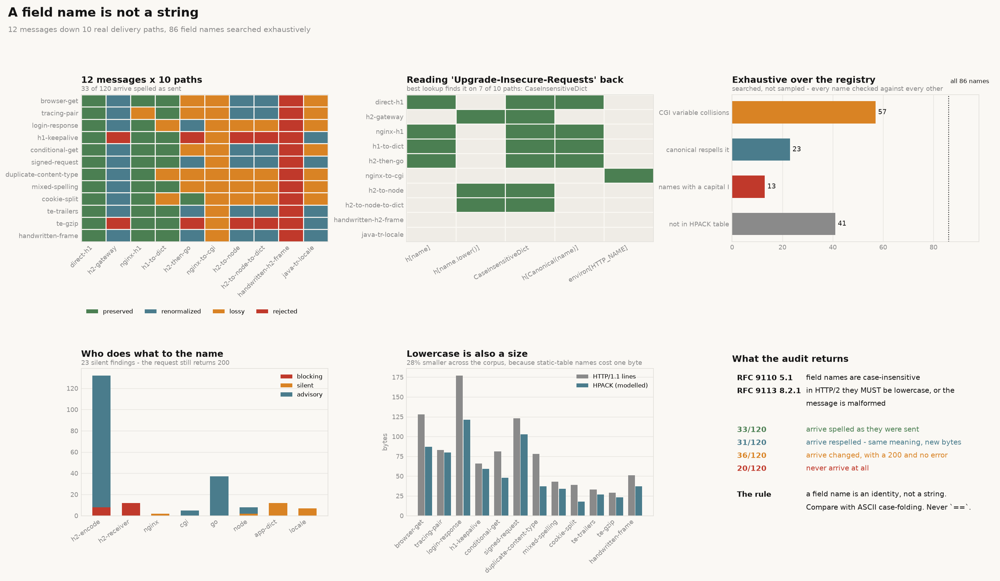

# Header Casing

[](https://colab.research.google.com/github/phoebefu6/phoebe-the-builder/blob/main/automation-suite/header-casing/demo.ipynb)
[](https://mybinder.org/v2/gh/phoebefu6/phoebe-the-builder/main?labpath=automation-suite/header-casing/demo.ipynb)

> `headers["X-Request-Id"]` is the wrong shape, and not for style reasons. RFC 9110 makes field names case-insensitive; RFC 9113 makes them lowercase on an HTTP/2 wire or the message is malformed. So the spelling that reaches your handler is a property of the **path the message took**, not of the code that sent it - and a dict keyed by the name as typed disagrees with HTTP twice over: it holds two entries for one field, and one entry for two field lines HTTP keeps apart.

**Day 149 - Automation Suite.** Twelve messages down ten real delivery paths, eight hops, four verdicts, 86 field names searched exhaustively, 54 tests, and a notebook that rebuilds the whole engine from scratch and agrees with it on every count.



> **RFC 9110 §5.1** - field names are case-insensitive.
> **RFC 9113 §8.2.1** - in HTTP/2, field names MUST be lowercase; a message containing an uppercase field name MUST be treated as malformed.

## Business Impact

- **Before:** a service reads `req.headers["X-Tenant-Id"]`. It works in dev over HTTP/1.1. In production the request crosses an HTTP/2 gateway, the name arrives as `x-tenant-id`, and the lookup returns nothing. The request succeeds with a null tenant. Nothing logs an error, because nothing went wrong - a lookup missed.
- **After:** the same message is pushed down ten modelled paths and each one reports what arrived. Of **120 message x path deliveries, 33 arrive spelled as they were sent**. **36 arrive changed** - a field dropped, a duplicate discarded, two field names merged into one - and **not one of those 36 produces an error**. That is the column the audit exists for.
- **Estimated ROI:** the whole corpus audits in under a second. The number worth the time: **29 silent findings** against 20 blocking ones. The blocking ones you would have found from the stack trace. The silent ones ship.

## Relationship to Days 144, 146 and 147

The Day 144 [`slug-collider`](../slug-collider/) asked what collisions a slugifier creates, [`filename-sanitiser`](../filename-sanitiser/) (Day 146) found that `casefold()` and `lower()` err in opposite directions against a real case table, and [`duration-parser`](../duration-parser/) (Day 147) found eight conforming readings of one string. All three share a shape: an operation that looks total is not.

New ground here is that the transform is not yours. A slugifier is a function you call; a field name is rewritten by hops you do not own and cannot see - a gateway, a proxy default, a runtime's duplicate policy, a locale. The audit therefore runs over a *path*, and the verdict is about the path rather than about a function.

## What it does

Nineteen mechanisms. Every number below is printed by `evidence.py`.

### 1. One field, two spellings, and a dict that holds both

```
  wire: X-Api-Key    value: k1
  wire: X-API-KEY    value: k2

  [app-dict] split-identity: one field 'x-api-key' occupies 2 dict entries:
             ['X-API-KEY', 'X-Api-Key']
```

RFC 9110 §5.1 says those are one field. `Dict[str, str]` says two, and every lookup finds at most one of them. This is the failure that has no error path at all: both entries are present, both are readable, and the code reads the wrong one.

### 2. Four verdicts, computed over the whole path

| verdict | meaning | is `headers[name]` correct? |
|---|---|---|
| `preserved` | every field arrived with the same name bytes, in order | yes |
| `renormalized` | identical meaning, different bytes or order | only with a case-folded lookup |
| `lossy` | a field, a duplicate or an identity did not survive | no, and there is no error to catch |
| `rejected` | a hop must treat the message as malformed | no message arrived |

```
preserved       33 of 120  27.5%
renormalized    31 of 120  25.8%
lossy           36 of 120  30.0%
rejected        20 of 120  16.7%
```

The 33 preserved deliveries come from 5 of the 10 paths, and each of those either does nothing to the name or was handed a message whose names were already lowercase. Nothing on the public internet guarantees `preserved`.

### 3. The spoofable trace header, down every path

Sent: a trace id the proxy set, plus the same id underscored by the client. `X_Request_Id` is a perfectly legal field name - `_` is a tchar under RFC 9110 §5.6.2.

```
path                   verdict        arrived
direct-h1              preserved      X-Request-ID, X_Request_Id, X-Forwarded-For
h2-gateway             renormalized   x-request-id, x_request_id, x-forwarded-for
nginx-h1               lossy          X-Request-ID, X-Forwarded-For
h2-then-go             lossy          X-Forwarded-For, X-Request-Id, X_request_id
nginx-to-cgi           lossy          HTTP_X_REQUEST_ID, HTTP_X_FORWARDED_FOR
handwritten-h2-frame   rejected       -- rejected --
java-tr-locale         lossy          x-request-ıd, x_request_ıd, x-forwarded-for
```

nginx drops the client's copy, because `underscores_in_headers off` is the default. Take nginx out of the path and CGI merges the two names onto one variable:

```
HTTP_X_REQUEST_ID = "from-proxy, from-client"
```

So "turn `underscores_in_headers on` to fix my missing header" is a security change, not a config tweak: it is what stands between a client and a header the proxy believes it owns.

### 4. Exhaustive: every field name that shares a CGI variable with another

Searched, not sampled. For each of the 86 names, its underscore twin is generated - also a legal token - and every pair is checked.

```
registry names checked:         86
of those, hyphenated:           57
distinct colliding field pairs: 57
```

**Every hyphenated field name has one.** `Accept-Encoding` + `Accept_Encoding` -> `HTTP_ACCEPT_ENCODING`, and so on for all 57. The mapping in PEP 3333 and RFC 3875 §4.1.18 is one-way, so the collision is structural rather than a bug in any one implementation.

### 5. Exhaustive: registered names that canonicalisation cannot reproduce

`go_canonical` here is Go's `textproto.CanonicalMIMEHeaderKey`, which is also what Python's `email` package does: uppercase the first letter and each letter after a hyphen, lowercase the rest.

```
23 of 86 names change spelling under the canonical rule
14 of them are IANA-registered names

  ALPN                 -> Alpn          ETag         -> Etag
  CDN-Cache-Control    -> Cdn-...       IM           -> Im
  Content-MD5          -> Content-Md5   MIME-Version -> Mime-Version
  Sec-WebSocket-Key    -> Sec-Websocket-Key
  WWW-Authenticate     -> Www-Authenticate
```

Canonical is not the registry, and the two title-casing rules people reach for disagree with **each other** the moment a digit or an underscore appears:

```
name           str.title()      canonical
P3P            P3P              P3p
X-2FA-Token    X-2Fa-Token      X-2fa-Token
X_Request_Id   X_Request_Id     X_request_id
```

`str.title()` capitalises after any non-letter, digits included. Go only after a hyphen. Two services that both look like they are "just title-casing the header" produce different bytes.

### 6. Exhaustive: the names a locale-sensitive lowercase destroys

```
13 of 86 names contain a capital I

  If-Match             -> ıf-match
  If-Modified-Since    -> ıf-modified-since
  MIME-Version         -> mıme-version
  X-Request-ID         -> x-request-ıd
```

`ı` (U+0131) is not a tchar, so the result is not a legal field name and **no correct lookup can recover it**. This is Java's `String.toLowerCase()` with no `Locale.ROOT`, or C `tolower()` after `setlocale`, on a machine set to `tr_TR`. The audit reports it as a `lossy` delivery, not a rejected one, because the message still moves.

### 7. The lookup matrix: does your line of code still find the field?

Five styles of lookup, one field, ten paths.

```
path                  h[name]  h[lower]  case-folded  h[Canonical]  environ[HTTP_]
direct-h1             found    .         found        found         .
h2-gateway            .        found     found        .             .
h2-then-go            found    .         found        found         .
nginx-to-cgi          .        .         .            .             found
h2-to-node            .        found     found        .             .
java-tr-locale        .        .         .            .             .
```

The case-folded lookup is the only one that is ever right by construction: it works on **7 of 10 paths**, and the three where it fails are the three where the name has stopped being a field name - CGI renamed it, a Turkish lowercase put a non-token character in it, or the message never arrived.

### 8. The field that cannot be a dictionary entry

RFC 9110 §5.3 permits joining same-name field lines with commas only where the value is a comma-separated list. `Set-Cookie` is not, because its own value contains commas in the `Expires` date.

```
h2-to-node             set-cookie lines arriving: 2 of 2   verdict lossy
h2-to-node-to-dict     set-cookie lines arriving: 1 of 2   verdict lossy
nginx-to-cgi           set-cookie lines arriving: 1 of 2   verdict lossy
```

Node gets this right - `req.headers['set-cookie']` is an array. The `Dict[str, str]` one hop later does not, and the finding is `last-write-wins`: the session cookie is gone and the CSRF cookie is what the application sees.

Node's duplicate policy is three policies: `set-cookie` becomes an array, `cookie` joins with `"; "`, 19 named fields **discard** their duplicates keeping the first, everything else joins with `", "`. A duplicate `Content-Type` is therefore silently thrown away, not concatenated.

### 9. Casing is also a size

The HPACK static table (RFC 7541 Appendix A) has 61 entries and every name in it is lowercase. An indexed name costs about one byte; anything else pays its own length on every request.

```
HPACK static table entries covering the registry: 45
names that pay for themselves on every request:   41

browser-get: 128 bytes as HTTP/1.1 field lines, 87 modelled HPACK bytes
across the corpus: 931 -> 674 bytes, 27.6% smaller
```

The model is deliberately a model - no Huffman coding - so it measures the *difference* casing makes, not a real frame size. `X-Request-ID` is not in the table; `content-type` is.

### 10. Three ways a message stops being a message

```
h1-keepalive        h2-forbidden-field   'Connection' is connection-specific;
                                         RFC 9113 8.2.2 makes it malformed
te-gzip             h2-forbidden-field   'TE' with any value but "trailers"
handwritten-frame   malformed-uppercase  'Content-Type' has an uppercase byte;
                                         RFC 9113 8.2.1 - MUST be malformed
```

`TE: trailers` is the one documented exception and the engine encodes it as an exception, not as an allowlist entry: `TE: gzip` on the same connection is malformed.

### 11. Per-name advice

```
X_Request_Id
  - identity is 'x_request_id': compare with ASCII case-folding, never `==`
  - contains `_`: nginx drops it by default and CGI merges it with the `-`
    spelling - rename it
  - not in the HPACK static table, so it costs its own bytes on every request
  - has an `I`: any locale-sensitive lowercase mangles it
  - a canonicalising stack re-spells it 'X_request_id'
```

## The verdict names, and why there are four

Three would not be enough. `renormalized` and `lossy` look the same from the application - the bytes changed - but they are different decisions. `renormalized` is safe for anything that reads the field, and fatal for anything that **signs or fingerprints** it: an AWS SigV4 canonical request lists `SignedHeaders` by lowercase name, and a TLS/HTTP fingerprint depends on order that `http.Header` cannot preserve. `lossy` is never safe. Collapsing them would hide the one case where a correct lookup still gives the wrong answer.

## Tech Stack

Python 3.9+ (`from __future__ import annotations` throughout), standard library only in the engine - `re`, `dataclasses`, `enum`, `typing`. Streamlit for the front end, matplotlib for the figures, pytest for the 54 tests. No network, no API keys, no HTTP client: the hops are models of documented behaviour, so the whole thing runs offline and deterministically.

## Demo

**[Run the interactive demo notebook →](demo.ipynb)** - pre-rendered with outputs, or click the Colab/Binder badges above to run it live. The notebook rebuilds the spelling rules, all eight hops, the verdicts and all three exhaustive searches from nothing, then checks its own counts against the ones published here:

```
quantity         published   this notebook   agree
names                   86              86   yes
collisions              57              57   yes
respelled               23              23   yes
dotless                 13              13   yes
preserved               33              33   yes
renormalized            31              31   yes
lossy                   36              36   yes
rejected                20              20   yes
```

For the Streamlit app - paste a header block, pick a path, see what arrives and which lookups still find it:

```bash
pip install -r requirements.txt
streamlit run app.py
```

```bash
python evidence.py          # every number in this README
python -m pytest -q         # 54 tests
python make_chart.py        # regenerate both figures
```

## Learning Connection

Built while working through **Docker Essential Training** and **FastAPI** material on LinkedIn Learning, in the Month 2 automation-suite line.

Applies: reading normative specification language (`MUST`, `MAY`) and encoding it as executable rules rather than prose; modelling a distributed path as a composition of transforms so a failure can be attributed to a hop; and choosing a return type - a verdict over a path, plus severity-ranked findings - that can express "this succeeded and is wrong".

## Impact Note

- **Who benefits:** anyone whose request crosses a boundary they do not own - a CDN, an API gateway, an ingress controller, a language runtime. Particularly anyone debugging a header that "works locally".
- **Potential risks:** the hops are **models of documented behaviour, not the implementations**. Real nginx, Go, Node and HTTP/2 stacks have versions, configuration and bugs; the HPACK figure omits Huffman coding and is a comparison, not a frame size. Use the audit to know what to go and check, not as a substitute for checking. The CGI collision is a real spoofing primitive - the responsible use is auditing your own `underscores_in_headers` setting, and the engine deliberately ships no request-sending code.
