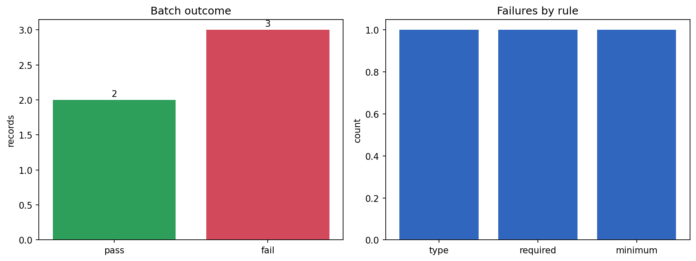

# JSON Schema Validator

[](https://colab.research.google.com/github/phoebefu6/phoebe-the-builder/blob/main/automation-suite/json-validator/demo.ipynb)
[](https://mybinder.org/v2/gh/phoebefu6/phoebe-the-builder/main?labpath=automation-suite/json-validator/demo.ipynb)

> A FastAPI microservice that validates JSON payloads against a schema and returns every error at once - so broken API contracts surface before they corrupt data.

## Business Impact
- **Before:** A producer drops a field or flips a type; downstream consumers silently break. Debugging is one error per round-trip.
- **After:** POST a schema + payload, get back **all** violations with JSON-paths in one shot. Infer a starter schema from a sample to onboard fast.
- **Estimated ROI:** Hours saved per integration bug + fewer bad records reaching production.

## Tech Stack
Python, FastAPI, Pydantic, jsonschema (Draft 7), Docker.

## Demo

**[Run the interactive demo notebook →](demo.ipynb)** - pre-rendered with outputs, or click the Colab/Binder badges above.



Run the microservice:
```bash
pip install -r requirements.txt
uvicorn api:app --reload
```
Then open:
- `http://localhost:8000` - built-in test form
- `http://localhost:8000/docs` - interactive Swagger UI

## API
| Method | Path | Body | Returns |
|--------|------|------|---------|
| GET | `/health` | - | `{"status":"ok"}` |
| POST | `/validate` | `{"schema": {...}, "data": {...}}` | `{valid, error_count, errors[]}` |
| POST | `/infer` | `{"sample": {...}}` | inferred Draft-7 schema |

Example:
```bash
curl -X POST localhost:8000/validate -H "Content-Type: application/json" \
  -d '{"schema":{"type":"object","properties":{"id":{"type":"integer"}},"required":["id"]},"data":{"id":"x"}}'
```

## Edge case handled
A **malformed schema** is reported as a normal error response, never raised - the service stays up and the caller always gets clean JSON.

## Learning Connection
Built while studying **FastAPI** fundamentals (Month 2).
Applies: request models with Pydantic v2 (including aliasing the reserved `schema` key), JSON responses, Swagger docs, containerizing a web service.

## Impact Note
- **Who benefits:** Backend and data-platform teams enforcing API contracts.
- **Potential risks:** `infer_schema` marks every key as required and is a *starting point* - review before enforcing. Validating very large payloads is CPU-bound; add limits before public exposure.
