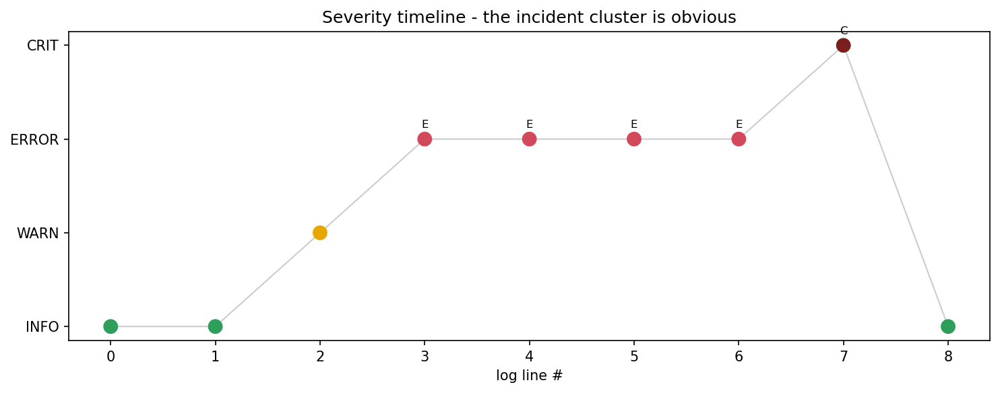

# Log Parser & Alerter

[](https://colab.research.google.com/github/phoebefu6/phoebe-the-builder/blob/main/automation-suite/log-parser/demo.ipynb)
[](https://mybinder.org/v2/gh/phoebefu6/phoebe-the-builder/main?labpath=automation-suite/log-parser/demo.ipynb)

> Stop grepping logs by hand. Parse mixed-format logs into structured records, see the severity breakdown and top errors, and fire alerts when errors spike.

## Business Impact
- **Before:** Engineers `grep`/`tail` through raw logs across formats, eyeballing for problems. Incidents hide in the noise.
- **After:** Paste logs, get structured records + a level breakdown + the noisiest errors + alert rules that fire on a spike.
- **Estimated ROI:** Faster incident triage; problems surface in seconds instead of a manual scroll.

## Tech Stack
Python, regex, Streamlit, pandas, matplotlib (notebook). Stdlib parsing core - no heavy deps.

## Demo

**[Run the interactive demo notebook →](demo.ipynb)** - pre-rendered with outputs, or click the Colab/Binder badges above.



Run the dashboard:
```bash
pip install -r requirements.txt
streamlit run app.py
```

## How it works
- `parser.py` - the engine. Each line is tried against **JSON → generic `LEVEL` → Apache/nginx access log → keyword fallback**, normalizing severity to a number (`INFO`=20 … `CRITICAL`=50). `summarize` aggregates levels + top errors. `evaluate_rules` is a small alert engine (severity floor + count threshold + optional substring → fired/quiet).
- `app.py` - Streamlit UI: upload/paste, metrics, level chart, top-error table, full parsed table, and a live alert-rule panel.

## Supported formats
| Format | Example |
|--------|---------|
| Generic timestamped | `2026-06-20 10:16:23 ERROR database connection timeout` |
| JSON logs | `{"timestamp":"...","level":"ERROR","message":"..."}` |
| Apache/nginx access | `127.0.0.1 - - [...] "GET /api HTTP/1.1" 500 1320` (status → severity) |
| Keyword fallback | any line containing a level word |

## Edge case handled
**Mixed formats in one stream.** Real systems emit JSON from one service and plain text from another. The parser detects per-line, so a single file with all three formats still produces uniform, comparable records.

## Platform note
The parsing core is UI-free and pure - it's designed to drop in as an **Observability** module on the future platform shell (the governed workspace for the DA/DE/DS/AI-engineer team), where log/alert rules become a shared, access-controlled app rather than a standalone tool.

## Learning Connection
Built while studying **Log Parsing & Monitoring** patterns (Month 2).
Applies: multi-format parsing with layered regex, severity normalization, a threshold-based alert-rule engine, and separating pure logic from the Streamlit layer for reuse.

## Impact Note
- **Who benefits:** On-call engineers, SREs, and data teams triaging pipeline logs.
- **Potential risks:** Regex parsing is best-effort - exotic formats fall to the keyword/unparsed bucket; extend `parser.py` for your stack. Alert thresholds need tuning to your baseline to avoid noise.
