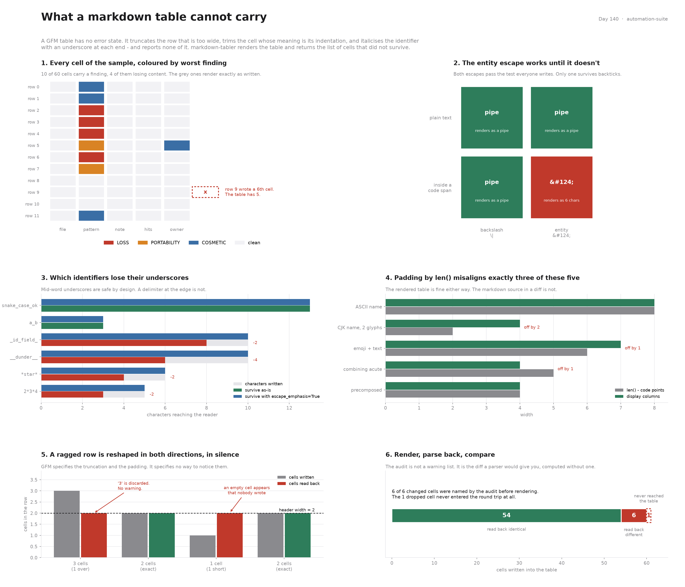

# Markdown Tabler

[](https://colab.research.google.com/github/phoebefu6/phoebe-the-builder/blob/main/automation-suite/markdown-tabler/demo.ipynb)
[](https://mybinder.org/v2/gh/phoebefu6/phoebe-the-builder/main?labpath=automation-suite/markdown-tabler/demo.ipynb)

> Turning a DataFrame into a markdown table is one line. That line is also a lossy encoder, and the GitHub Flavored Markdown table extension has no error state to say so. A row with one cell too many has the excess ignored. A cell whose meaning is its indentation is trimmed. A cell reading `_id_field_` is italicised and loses both underscores. All three are specified behaviour, all three are silent, and the table renders perfectly either way.

**Day 140 - Automation Suite.** A renderer that returns two things: the markdown table, and the list of cells whose content did not survive being put in it. Seven finding types across three severities, every one of them verified by rendering a table, parsing it back with a real GFM parser, and diffing the cells.



## Business Impact

- **Before:** a code-review bot posts its findings as a markdown table in a pull request comment. The regex column contains pipes, the identifier column contains underscores, one finding is about leading whitespace, and last month somebody added a sixth field to the export. The comment renders. It renders every time.
- **After:** the same table, plus a list naming each cell that changed and by how much - before it is posted, not after somebody notices a number looked wrong.
- **Estimated ROI:** on the bundled 12-row sample, **10 of 60 cells** carry a finding, **4 of them losing content**, and **none of them raise**. An eleventh cell is not in the rendered table at all. A round trip through a parser finds **6 changed cells and the audit had named all 6** before rendering - plus that dropped cell, the fifth loss, which no round trip can find because it never reached the table.

## What it does

Seven mechanisms. Three of them have no fix, and the tool says so instead of quietly substituting something.

### 1. Two escapes for a pipe. One of them works in both places.

A pipe splits the row unless it is escaped. The two candidates are the backslash `\|` and the HTML entity `&#124;`, and both pass the test everyone writes:

```
context              wanted       backslash      entity
------------------------------------------------------------------------------
plain text           a|b          'a|b'          'a|b'
inside a code span   `a|b`        'a|b'          'a&#124;b'
------------------------------------------------------------------------------
```

Entity references are not recognised inside a code span, so `&#124;` stops being a pipe and becomes six visible characters. This is not an obscure corner: a code span is *where a pipe usually is*. Regexes, shell pipelines, union types, alternations.

`escape_cell()` therefore always emits the backslash, and `audit_cell()` raises `ENTITY_IN_CODE` when the input already contains the entity form inside backticks - because at that point somebody has already tried to fix this, and their fix does not work.

### 2. The row that is one cell too long

GFM specifies the reshape precisely. A row with more cells than the header has the excess **ignored**; a row with fewer has empty cells **inserted**. Both are silent:

```
source:                          parsed back:
    | a | b |                        ['a', 'b']
    | --- | --- |                    ['1', '2']     <- '3' is gone
    | 1 | 2 | 3 |                    ['4', '']      <- this blank is not in the data
    | 4 |
```

A widened export drops its new last column and nobody sees an error. The inserted blank is indistinguishable from a genuine empty value, which is worse than a gap: it is a gap that looks like data.

This is the one failure a round trip can never show you, because the content never enters the table. It has to be caught before rendering, which is why `render()` audits first and reshapes second.

### 3. Emphasis eats identifiers, but only some of them

A column of column-names or config keys meets markdown's inline emphasis rules. `_` opens emphasis only at a word boundary; `*` opens it almost anywhere:

```
written          reader sees      verdict     with escaping
------------------------------------------------------------------
snake_case_ok    'snake_case_ok'  same        'snake_case_ok'
a_b              'a_b'            same        'a_b'
_id_field_       'id_field'       -2 chars    '_id_field_'
__dunder__       'dunder'         -4 chars    '__dunder__'
*star*           'star'           -2 chars    '*star*'
2*3*4            '234'            -2 chars    '2*3*4'
------------------------------------------------------------------
```

`snake_case_ok` survives by design - that carve-out exists precisely so identifiers are not mangled - and `_id_field_` does not. The italic is not the problem; the missing characters are. The reader sees `id_field` and the underscores that marked it private are gone.

`escape_emphasis=True` recovers all four. It is **off by default**, because escaping rewrites source that a human then reads in a diff, and being told is not the same as having it done to you. Note that the escaper covers the whole delimiter run at each edge: escaping one underscore per side of `__dunder__` leaves `_dunder_`, which is still emphasis.

### 4. Two things with no escape at all

**Leading and trailing whitespace** is trimmed by the renderer:

```
input          reads back     verdict
--------------------------------------------
'  indent'     'indent'       CHANGED
'trail  '      'trail'        CHANGED
'\tab'         'ab'           CHANGED
```

A linter reporting `'  indent'` and one reporting `'indent'` produce the same table. There is no escape for this. The only faithful container is a code span - `` `  indent` `` does keep the spaces - but that changes how the cell looks, and that is a visual decision about somebody else's table. `EDGE_SPACE` is raised at `LOSS` and the decision is left with the caller.

**A line break** cannot be in a table row, because a row is a line. The three options are an HTML `<br>`, a flatten, or a truncation:

```
policy    cell source              html enabled          html disabled
------------------------------------------------------------------------------
br        'retry<br>then alert'    retry<br>then alert   retry&lt;br&gt;then alert
space     'retry then alert'       retry then alert      retry then alert
strip     'retry'                  retry                 retry
```

With inline HTML disabled - which docs pipelines, static site generators and comment sanitisers routinely do - the `<br>` arrives as four visible characters mid-sentence. So `NEWLINE` is `PORTABILITY` under `br` and `LOSS` under the other two: **the severity depends on the policy you chose, not on the data.**

### 5. Padding is a display-width problem, not a `len()` problem

Padding changes nothing about what renders - HTML does not care about the whitespace. It changes whether the person reading the raw markdown in a diff can see the columns:

```
value            len()  columns  note
--------------------------------------------------------------
'Ana Ruiz'       8      8        ASCII
'陈伟'            2      4        2 CJK glyphs           <- disagree
'🚦 flag'        6      7        emoji + text           <- disagree
'café'           4      4        precomposed e-acute
'cafe' + U+0301  5      4        combining acute        <- disagree
```

Three of five disagree, and they are exactly the rows a Western-locale test fixture never contains. `display_width()` counts East Asian Wide and Fullwidth as two columns, combining marks and ZWJ as zero, and takes the East Asian *Ambiguous* class as a parameter - Greek, Cyrillic and box-drawing are one column in a Western font and two in a CJK font, and there is no correct answer without knowing the reader's font.

### 6. Alignment is a column property, so it is inferred per column

There is no per-cell alignment in GFM; it lives once, in the delimiter row. `infer_alignment()` right-aligns a column when every non-empty value reads as a number (including currency prefixes, thousands separators, percentages and accounting parentheses) and left-aligns otherwise. A column of mixed numbers and `n/a` gets left, because one of them has to lose.

### 7. The reconciliation

The audit's claim is not "these things might go wrong". It is: **this is the diff a parser would give you.** So `evidence.py` renders the sample, parses it back through markdown-it-py, and compares every cell:

```
54 of 60 cells read back byte-identical; 6 differ, 0 of those unpredicted.

row   column    written                read back            audit said
------------------------------------------------------------------------------
0     pattern   '`a|b`'                'a|b'                PIPE
2     pattern   '`&#124;`'             '&#124;'             ENTITY_IN_CODE
3     pattern   '_id_field_'           'id_field'           EMPHASIS
4     pattern   '2*3*4'                '234'                EMPHASIS
5     pattern   'retry\nthen alert'    'retrythen alert'    NEWLINE
6     pattern   '  indent'             'indent'             EDGE_SPACE
------------------------------------------------------------------------------
```

Rows 0 and 2 are the honest edge of that comparison: their difference is the backticks, which are markdown syntax rather than cell content, so the code span is doing its job - the audit has something to say about both anyway. Row 5's read-back is what tag-stripping does to a rendered `<br>`; with HTML enabled the break is real.

And row 9's sixth cell is not in the list at all, because it is not in the table. `RAGGED_EXTRA` is the only record that it ever existed.

## The findings

| code | severity | what it means |
| :--- | :--- | :--- |
| `RAGGED_EXTRA` | LOSS | cells past the header width, dropped by the renderer with no warning |
| `EMPHASIS` | LOSS | a `*` or `_` run that italicises and eats its delimiters (COSMETIC when escaped) |
| `EDGE_SPACE` | LOSS | leading or trailing whitespace, trimmed and not representable |
| `ENTITY_IN_CODE` | LOSS | `&#124;` inside a code span, which renders as six characters |
| `NEWLINE` | PORTABILITY / LOSS | multi-line content; severity follows the policy chosen |
| `RAGGED_SHORT` | PORTABILITY | empty cells inserted, indistinguishable from real blanks |
| `BACKSLASH_END` | PORTABILITY | a trailing backslash against the closing pipe; renderers differ |
| `EMPTY_HEADER` | PORTABILITY | legal, but leaves the column unnameable to anything reading the table back |
| `WIDE_GLYPH` | COSMETIC | code points ≠ display columns, so `len()` padding misaligns the source |
| `PIPE` | COSMETIC | pipes escaped as `\|` |

Severity is about consequence, not about how unusual the input is:

- **LOSS** - the rendered table does not contain what you put in.
- **PORTABILITY** - it renders here, but not under every conforming renderer.
- **COSMETIC** - the output is right; the markdown source is misaligned.

## Tech Stack

Python 3.9+, `markdown-it-py` (GFM parser, for the round trips), `unicodedata` (display width), Streamlit, matplotlib, pandas, Docker. The core module has no hard dependency on the parser - it is used to *verify* the audit, not to compute it.

## Demo

**[Run the interactive demo notebook →](demo.ipynb)** - pre-rendered with outputs, or click the Colab/Binder badges above to run it live.

```bash
pip install -r requirements.txt
streamlit run app.py
```

Paste a CSV, flip the policies, and watch the findings change - including the round trip against a real parser, live.

From the command line:

```bash
python3 evidence.py      # the seven mechanisms, round-tripped through a parser
python3 test_tabler.py   # 38 tests, no pytest required
python3 make_chart.py    # regenerate the figure from the current code
```

As a library:

```python
import tabler

res = tabler.render(df.values.tolist(), df.columns, escape_emphasis=True)
print(res.markdown)

if res.loses_data:
    for f in res.by_severity(tabler.LOSS):
        print(f.code, f.where, f.column, f.detail)
```

## Learning Connection

Built while studying **Docker Essential Training** and **GitHub Actions for CI/CD** on LinkedIn Learning.

Applies: the habit of asking what a format *cannot* represent before writing the converter. Most of this project is the answer to one question - "what happens to this cell if I do the obvious thing?" - asked seven times against a real parser instead of against the specification. Twice the parser disagreed with what the documentation implied, and both times the parser was what shipped.

## Impact Note

- **Who benefits:** anyone generating markdown tables from data - CI bots posting results into pull requests, docs pipelines rendering config references, notebook exports, LLM tool output.
- **Potential risks:** the audit describes GFM as markdown-it-py implements it. Other renderers differ, particularly on inline HTML and on trailing backslashes - which is what the `PORTABILITY` severity exists to say. `escape_emphasis` rewrites the source, so a downstream tool doing its own escaping will double up; the option is off by default for that reason. And a clean audit means the table carries the data, not that the table is the right way to show it: 40 columns of floats survives every check here and is still unreadable.
