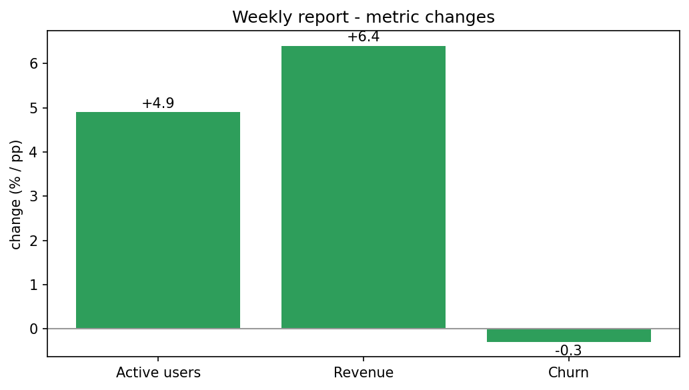

# Markdown → PDF Report

[](https://colab.research.google.com/github/phoebefu6/phoebe-the-builder/blob/main/automation-suite/md-to-pdf/demo.ipynb)
[](https://mybinder.org/v2/gh/phoebefu6/phoebe-the-builder/main?labpath=automation-suite/md-to-pdf/demo.ipynb)

> Write the weekly report in Markdown, get a branded, print-ready PDF - cover header, styled tables, page numbers. No more hand-formatting in Word.

## Business Impact
- **Before:** Someone reformats the same report in Word every week - hours of fiddling, inconsistent styling.
- **After:** Write Markdown once, run one command, get a consistent branded document every time.
- **Estimated ROI:** ~2 hrs/week saved per recurring report; consistent, on-brand output.

## Tech Stack
Python, markdown, WeasyPrint (PDF), matplotlib (notebook), Docker.

## Demo

**[Run the interactive demo notebook →](demo.ipynb)** - pre-rendered with outputs, or click the Colab/Binder badges above.



Run as a CLI:
```bash
pip install -r requirements.txt
python main.py --demo                                          # styled report from a sample
python main.py report.md -o weekly.pdf --title "Weekly Metrics" --author "Phoebe"
python main.py report.md --html-only                           # force styled HTML
```

## How it works
- `report.py` - `md_to_report_html` wraps your markdown in a branded template (cover, typography, table styling, A4 print rules + page numbers). `html_to_pdf` renders via WeasyPrint. `convert` ties it together with a graceful fallback.
- `main.py` - CLI with `--title`, `--subtitle`, `--author`, `--html-only`, `--demo`.

## The graceful fallback (edge case handled)
WeasyPrint needs native libraries (pango/cairo). Where they're missing - a plain Mac, a minimal container - the tool **writes the styled HTML instead of crashing**, and tells you why. CI, Colab, and the provided Docker image install the libs and produce real PDFs. So the tool *always* yields a deliverable.

```bash
# Debian/Ubuntu, for real PDFs:
apt-get install -y libpango-1.0-0 libpangocairo-1.0-0 libgdk-pixbuf-2.0-0
```

## Platform note
The `report.py` core is UI-free and mountable as a **Reports** app on the platform shell (Analytics category) - turn any dataset summary into a governed, shareable branded report.

## Learning Connection
Built while studying **document generation & reporting automation** (Month 2).
Applies: markdown → HTML → PDF pipeline, print CSS (`@page`, page counters), and designing a tool that degrades gracefully when an optional native dependency is missing.

## Impact Note
- **Who benefits:** Anyone producing recurring formatted reports (ops, product, finance).
- **Potential risks:** PDF output depends on system libs; verify they're present in your deploy target. The template is opinionated - adjust `REPORT_CSS` for your brand.
