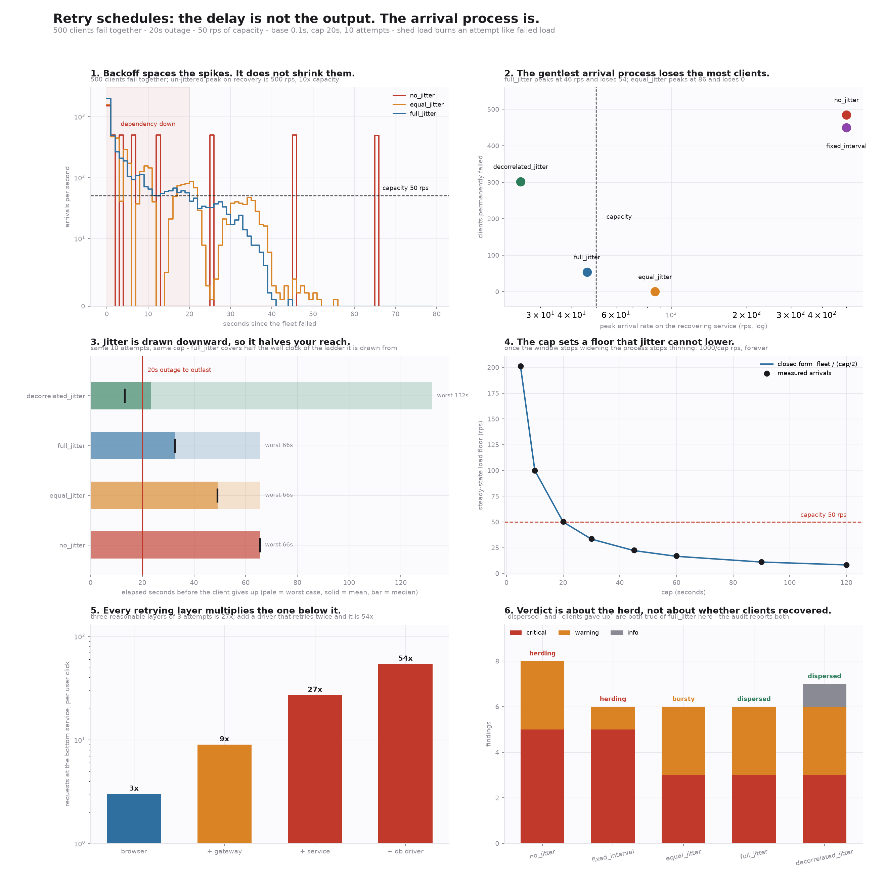

# Retry Schedule

[](https://colab.research.google.com/github/phoebefu6/phoebe-the-builder/blob/main/automation-suite/retry-schedule/demo.ipynb)
[](https://mybinder.org/v2/gh/phoebefu6/phoebe-the-builder/main?labpath=automation-suite/retry-schedule/demo.ipynb)

> `backoff(attempt)` returns a number of seconds. That is the whole interface, and it is the wrong shape for the problem. When 500 clients fail at the same instant - the only time retries matter - each of them runs the same deterministic function over the same attempt counter and picks the same moment to come back. Exponential backoff spreads those moments further and further apart, which lowers the *total* work the dependency absorbs and leaves the *peak* at 500. Peak is what takes the service down the second time, and none of that fits in a float.

**Day 145 - Automation Suite.** A retry schedule that returns a **verdict on the arrival process** instead of a delay for one client. Ten finding types across three severities, five published backoff algorithms modelled from their documented steps, and a fleet simulator cross-checked against integer-arithmetic bucketing that found two real bugs in this code before it shipped.



## Business Impact

- **Before:** a dependency is down for 20 seconds and recovers on its own. 500 clients are retrying it with textbook capped exponential backoff.
- **After:** the audit reports that **485 of those 500 clients end up permanently failed** - not by the outage, but by their own retries, which arrive 500-at-once against 50 rps of capacity, get shed, and burn the attempt budget doing it. The outage lasted 20 seconds. The schedule ran for 65.5.
- **Estimated ROI:** the whole audit runs on a config, not on production, in under a second, and returns **33 findings across the five policies - 19 critical**. The single highest-value number it produces is the load floor: with a 20-second cap and 500 clients, the arrival process settles at **50 rps forever**, which is the entire capacity of the service being retried. That number is `fleet / cap`. Jitter does not appear in it, and every mitigation people reach for is a jitter change.

## What it does

Ten mechanisms. Most have no fix at the backoff-function level, and the tool says so rather than returning a slightly different random number.

### 1. Backoff moves total work. It does not move the peak

Capped exponential backoff, base 0.1 s, cap 20 s. Every client in the fleet computes this:

```
attempt   delay (s)   arrives at   clients arriving
       0        0.10         0.10                500
       1        0.20         0.30                500
       2        0.40         0.70                500
       3        0.80         1.50                500
       4        1.60         3.10                500
       5        3.20         6.30                500
       6        6.40        12.70                500
       7       12.80        25.50                500
       8       20.00        45.50                500
       9       20.00        65.50                500
```

The gaps double. The height of every spike is 500. Backoff is a statement about the *average* rate over a window, and outages are not decided by averages - they are decided by the instant of maximum concurrency, which capped exponential backoff leaves exactly where it found it, at `fleet`.

### 2. The headline run

500 clients fail together. The dependency is down for 20 s, then serves 50 rps. Requests above capacity are **shed**, and a shed request burns an attempt exactly like a failed one - the step most retry discussions skip, and the one that turns a spike into a spiral.

```
policy                   reqs  wasted  peak rps  waves  recovered  gave up  clear at    verdict
no_jitter                4985    3500       500      3         15      485     65.5s    herding
fixed_interval           4775       0       500      9         50      450    200.0s    herding
equal_jitter             4388    3805        86      1        500        0     55.1s     bursty
full_jitter              4679    4206        46      0        446       54     44.6s  dispersed
decorrelated_jitter      4742    4544        25      0        198      302     39.5s  dispersed
```

`no_jitter` leaves **485 of 500 clients permanently failed** by an outage the dependency recovered from by itself. The retries were the outage.

### 3. The gentlest arrival process loses the most clients

Read that table twice - once ranked by peak, once by clients lost. They rank in opposite directions.

| policy | peak on recovery | clients lost |
|---|---|---|
| `decorrelated_jitter` | 25 rps | 302 |
| `full_jitter` | 46 rps | 54 |
| `equal_jitter` | 86 rps | **0** |
| `no_jitter` | 500 rps | 485 |

`full_jitter` never exceeds capacity at all and still loses 54 clients. `equal_jitter` overshoots to 86 rps for one stretch and loses nobody. The published comparison that made full jitter the default measured *total work* and *completion time* under contention; under a **fixed attempt budget against an outage of fixed length**, the objective is different and so is the winner.

This is why the verdict and the findings are reported separately. `dispersed` is a claim about the arrival process - *the retries will not take the recovering service down again*. It is not a claim that anybody recovered. Both are true of `full_jitter` here, and the audit prints both.

### 4. Why: jitter is drawn downward, so it halves your reach

Full jitter draws `uniform(0, window)`. The ladder is unchanged; the expected delay is half of it. Same 10 attempts, same cap, half the wall clock:

```
policy                  worst case   expected    median   covers the 20s outage?
no_jitter                     65.5       65.5      65.5                     yes
fixed_interval               200.0      200.0     200.0                     yes
equal_jitter                  65.5       49.1      49.0                     yes
full_jitter                   65.5       32.8      32.5                     yes
decorrelated_jitter          132.0       23.3      13.2                      NO
```

Nobody sizes an attempt budget by simulating it. They count attempts, multiply by the ladder, and get 65.5 s. Adding jitter silently spends half of that, and adding *decorrelated* jitter spends four fifths of it for the median client.

### 5. For the walk, the mean describes a client that does not exist

Four of the five policies are **ladders**: the window for attempt *n* depends only on *n*. `decorrelated_jitter` is a **random walk** - each window is set by the previous *draw* - so a client that draws low early stays low for the rest of the schedule, while a rare high walk drags the mean up for everyone.

```
policy                     mean   median      p10      p90  med/mean
equal_jitter               49.1     49.0     42.9     55.5     100%
full_jitter                32.7     32.5     20.3     45.4     100%
decorrelated_jitter        23.1     13.2      4.0     60.0      57%
```

Sums of independent uniforms concentrate, so mean and median agree for the ladders. The walk's median is 57% of its mean - which is why `SKEWED_BUDGET` fires for exactly one policy instead of always.

And the closed form for that mean is not merely unhelpful, it is wrong. `E[d_n] = min(cap, (base + 3·E[d_{n-1}]) / 2)`, iterated, is what a careful person writes. `min` is concave, so Jensen's inequality runs the wrong way - `E[min(cap, X)] ≤ min(cap, E[X])` - and substituting the mean into the truncation over-estimates, compounding over the walk:

```
  cap (s)   naive recurrence   sampled mean   overstated by
        5               24.0           14.2            69%
       20               33.0           23.3            42%
       60               33.0           29.4            12%
   no cap               33.0           34.6            -5%
```

With no cap the recurrence is linear and exact. **The cap is what breaks it, and the cap is the part everyone adds.** `Schedule.expected_total()` samples for that policy and keeps the broken version under `naive_recurrence_total()` so the two can be compared.

### 6. The cap is a load floor, not a safety valve

This one has no fix at the policy level at all.

Once `base · 2ⁿ` reaches the cap, the jitter window **stops widening**, so the arrival process **stops thinning**. Each client settles into firing every `cap · factor` seconds indefinitely, and `fleet` clients doing that is an aggregate rate of `fleet / (cap · factor)` - for full jitter, `2·fleet / cap`.

Closed form against the measured process (capacity forced to zero, so nothing is admitted and only the arrivals are visible):

```
  cap (s)   predicted floor   measured rps
        5               200            201
       10               100            100
       20                50             51
       30                33             34
       60                17             17
```

A 20-second cap on a 500-client fleet is **50 rps of steady load, forever** - exactly the capacity of the service being retried, with nothing left for the users who never failed. Lowering it means raising the cap (slower recovery for everyone) or shrinking the fleet. It does not mean more jitter; `fleet` and `cap` are the only symbols in the expression.

### 7. Every retrying layer multiplies the one below it

```
browser 3                                 3x
browser 3 -> gateway 3                    9x
browser 3 -> gateway 3 -> service 3      27x
+ a db driver that retries twice         54x
```

54 requests reach the database for one click. Each layer chose a reasonable number in isolation and nobody owns the product. This is what a client-side retry budget - gRPC's `retryThrottling`, a token bucket that only refills on success - exists to bound, and it bounds it by capping *requests*, not by reshaping delays.

### 8. A scheduler tick wider than the jitter window undoes the jitter

Jitter computed in floating-point seconds and then handed to a 1-second timer wheel or a cron is quantised back into shared slots:

```
 attempt    window     drawn   after tick   collapsed?
       0      0.10     0.062         1.00          YES
       1      0.20     0.148         1.00          YES
       2      0.40     0.318         1.00          YES
       3      0.80     0.754         1.00          YES
       4      1.60     1.184         2.00            -
```

For the first four attempts the entire window is narrower than one tick, so every client in the fleet rounds to the same instant. The randomness was computed and then discarded by the scheduler.

### 9. Non-monotonicity is the feature

`decorrelated_jitter` draws `uniform(base, 3·prev)`, which can return a *shorter* delay than the previous one. It looks like a bug and gets "fixed" with a `max()` against the previous delay - which restores the correlation the algorithm exists to break. Reported as `INFO`, explicitly labelled as by-design, so nobody patches it out.

### 10. What the schedule spends before the service is even back

For the four policies whose first retry lands inside the outage, between **70% and 96%** of all requests arrive while the dependency is still down - 70% for `no_jitter`, 87% for `equal_jitter`, 90% for `full_jitter`, 96% for `decorrelated_jitter`. Connection attempts against a dead socket are nearly free for the client and are still real load on whatever sits in front of it: the load balancer, the proxy, the service mesh, the thing holding a connection table for all of them.

`fixed_interval` is the exception at 0%, and only by coincidence - its 20 s interval happens to equal the outage, so its first retry lands the instant the service returns. Change either number and it joins the others. This is the one place where the dumbest policy in the set scores best on a metric, which is a reasonable reminder that a single metric is not a ranking.

## The verdict

Three values, about the arrival process only:

| verdict | meaning |
|---|---|
| `dispersed` | peak arrival rate on the recovering service stays inside its capacity |
| `bursty` | peak exceeds capacity, but the schedule self-clears - one stretch, no client lost |
| `herding` | peak exceeds capacity and the shed load re-synchronises into another spike; the retries are now the outage |

`dispersed` is not `healthy`. Read the findings.

## Findings

| code | severity | fires when |
|---|---|---|
| `SYNCHRONOUS_WAVE` | critical | the policy is deterministic, so the fleet retries in unison |
| `PEAK_OVER_CAPACITY` | critical | peak arrivals on the recovering service exceed what it serves |
| `CLIENTS_GAVE_UP` | critical | clients exhausted their attempts, including on shed load |
| `BUDGET_SHORTER_THAN_OUTAGE` | critical | expected elapsed time is shorter than the outage to be outlasted |
| `DEADLINE_OVERRUN` | critical | the schedule runs past the caller's deadline; later attempts are work nobody awaits |
| `RETRY_AMPLIFICATION` | critical / warning | nested layers multiply into the bottom service |
| `CAP_PLATEAU` | critical / warning | the window stops widening; reports the resulting load floor |
| `OUTAGE_HAMMERING` | critical / warning | share of requests spent on a dependency known to be down |
| `JITTER_SHORTENS_COVERAGE` | warning | jitter pulls expected reach below the outage the worst case would have covered |
| `SKEWED_BUDGET` | warning | median client covers materially less than the mean |
| `CLOCK_ALIGNMENT` | warning | jitter window narrower than the scheduler tick |
| `BUDGET_UNDERUSE` | info | worst case uses under half the available deadline |
| `NON_MONOTONE_BY_DESIGN` | info | decorrelated jitter decreased; documented, not a defect |

## What actually fixes it

The arrival process is `fleet / cap`. Jitter only decides its shape.

```
retrying clients  peak rps  recovered  gave up  clear at    verdict
             500        86        500        0     55.1s     bursty
             250        43        250        0     45.5s  dispersed
             100        18        100        0     38.7s  dispersed
              50        12         50        0     38.2s  dispersed
```

- **Cap the fleet, not just the delay.** A client-side retry budget reduces the numerator, which is the only term that moves the floor.
- **Retry at one layer.** Amplification is a product; give the layer with the context to decide the retry and make the rest pass the error through.
- **Size the budget against the median and against the outage you must outlast**, not against the ladder you would have had without jitter.
- **Check the jitter survives the scheduler.**

## Tech Stack

Python 3.9+ standard library for the engine (`random`, `heapq`, `math`, `dataclasses`, `enum`) - no dependencies. matplotlib for the figure, Streamlit for the app, pytest for the suite, Docker for deployment.

## Verification

`test_retry.py` - **60 tests**, all passing. The two that earn their place:

**An integer-arithmetic reference for the bucketing.** The obvious reference - loop over buckets, test `i*width <= t < (i+1)*width` - is itself wrong. `i * width` does not tile the real line: with width `0.1`, bucket 199 ends at `20.000000000000004` while bucket 200 begins at `20.0`, so they overlap and a value on the edge matches both. The test scales times to integers instead, which has no float grid at all. It caught the simulator filing every arrival on a bucket edge one bucket early - and because deterministic policies put the *whole fleet* on that edge, the histogram was wrong in a way that still looked plausible.

**Monte Carlo against every closed form.** `expected_total`, `worst_case_total` and `steady_state_rate` are each checked against sampling from the process they claim to describe. That is what surfaced the Jensen error in §5: the recurrence passed inspection and failed the sampler by 42%.

```bash
python3 -m pytest test_retry.py -q     # 60 tests
python3 evidence.py                    # every number in this README, computed
python3 make_chart.py                  # regenerate the figure
```

## Demo

**[Run the interactive demo notebook →](demo.ipynb)** - pre-rendered with outputs, or click the Colab/Binder badges above to run it live.

For the Streamlit app:

```bash
pip install -r requirements.txt
streamlit run app.py
```

## Learning Connection

Built while studying distributed-systems reliability patterns for the FDE track. Applies: retry semantics, arrival-process modelling, discrete-event simulation, load shedding, and the difference between an average and a peak.

Policy algorithms modelled from the AWS Architecture Blog post *Exponential Backoff And Jitter* (Marc Brooker, 2015) and gRPC's `retryThrottling` in the service-config specification. They are models written from documented steps, not vendored code - the point is that the published algorithms disagree with each other on ordinary input, and that the disagreements are structural.

## Impact Note

- **Who benefits:** anyone configuring a retry in a client library, a service mesh, a job runner, or a cron - which is nearly everyone, usually by copying a snippet.
- **Potential risks:** the simulator is a model, and its conclusions are only as good as its assumptions - a fixed-length outage, instant failure detection, uniform clients, per-bucket shedding, and no circuit breaker. Real fleets have staggered failure detection and correlated client populations, both of which change the numbers. The three verdicts describe the arrival process alone and deliberately say nothing about whether clients recovered; treating `dispersed` as an all-clear is exactly the mistake §3 is about. Every number here comes from `evidence.py` against a fixed seed and can be re-derived.
