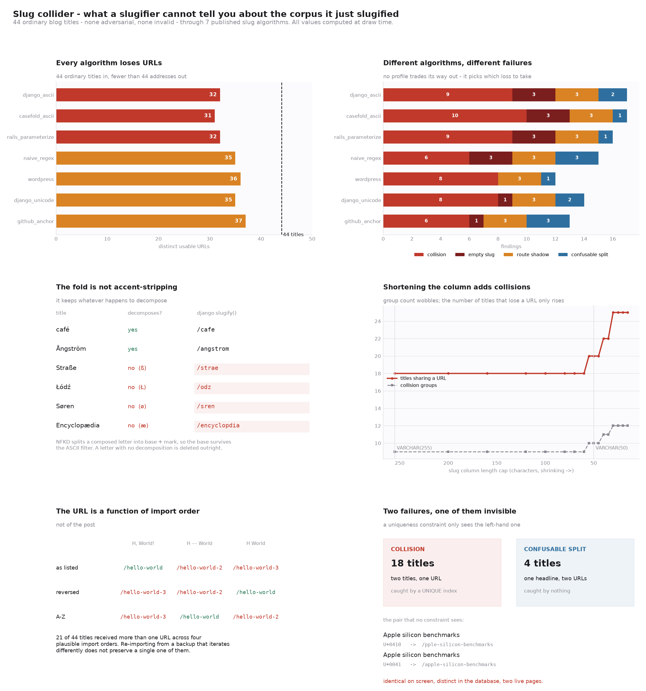

# Slug Collider

[](https://colab.research.google.com/github/phoebefu6/phoebe-the-builder/blob/main/automation-suite/slug-collider/demo.ipynb)
[](https://mybinder.org/v2/gh/phoebefu6/phoebe-the-builder/main?labpath=automation-suite/slug-collider/demo.ipynb)

> `slugify("Node.js at scale")` and `slugify("NodeJS at scale")` both return `nodejs-at-scale`. Neither call is wrong. Neither raises. The second post gets `-2`, or overwrites the first, or fails an insert at 2am in a bulk import - decided by code nobody wrote deliberately. A slug function's return type is a string, and none of that fits in a string.

**Day 144 - Automation Suite.** A slugifier that returns a **verdict on the corpus** instead of a string for one title. Eight finding types across three severities, seven published slug algorithms modelled from their documented steps, and a collision detector cross-checked against an independent O(n²) scan over 28 profile × cap combinations.



## Business Impact

- **Before:** 44 titles go into a CMS. 44 rows come out. Nobody counts the URLs.
- **After:** on this corpus, Django's default `slugify()` produces **32 distinct usable URLs from 44 titles**. Three titles slugify to the empty string. Three claim a reserved route segment. Nine pairs share an address. Two pairs render identically on screen and get *different* addresses, which no uniqueness constraint will ever flag.
- **Estimated ROI:** the audit runs on a title export in under a second and reports **17 findings, 15 of them critical**, before the import instead of after the 404s. The single highest-value number it produces is the migration diff: switching from `django_ascii` to `django_unicode` changes **13 of 44 URLs**, and switching by moving one line of code (`lower()` to `casefold()`) changes 1 - which is the one that ships unreviewed.

## What it does

Eight mechanisms. Most of them have no fix at the slug-function level, and the tool says so rather than quietly rewriting your title.

### 1. The fold is not accent-stripping

Django's `slugify()` normalises NFKD, then drops every non-ASCII byte. The usual description is "it strips accents". That is not the algorithm.

NFKD decomposes a *composed* letter into a base plus a combining mark, so `é` becomes `e` + U+0301 and the `e` survives. A letter with **no decomposition** has nothing to fall back to and is deleted:

```
title           NFKD                      slug            deleted
------------------------------------------------------------------
café            'café'              cafe            -
Ångström        'Ångström'    angstrom        -
Straße          'Straße'                  strae           ß
Łódź            'Łódź'        odz             Ł
Søren           'Søren'                   sren            ø
Encyclopædia    'Encyclopædia'            encyclopdia     æ
```

`Straße` becomes `strae`. `Łódź` becomes `odz`. These are the ordinary spelling of ordinary words in German, Polish and Danish, and the fold is inconsistent *within the same script*: `Å` works, `Ø` does not.

It also does more than fold. NFKD is *compatibility* decomposition, so it rewrites semantics too - `Ⅻ lessons` becomes `xii-lessons` and `①②③ steps` becomes `123-steps`.

### 2. Where you lowercase decides whether two titles collide

`str.lower()` is a 1:1 mapping. `str.casefold()` applies the full Unicode case-folding table, which expands `ß` to `ss`. So moving one line changes what survives the ASCII filter:

```
title                 lower() first     casefold() first
--------------------------------------------------------
Straße                strae             strasse
STRASSE               strasse           strasse
Weiß                  wei               weiss
```

Which means:

| | `Straße oder Strasse` | `STRASSE ODER STRASSE` | outcome |
|---|---|---|---|
| `lower()` first | `/strae-oder-strasse` | `/strasse-oder-strasse` | two live pages |
| `casefold()` first | `/strasse-oder-strasse` | `/strasse-oder-strasse` | UNIQUE violation |

One of those is caught by the database. The other is caught by nobody. The choice between them is a line ordering, and it is not in any style guide.

### 3. Two byte strings, one text, two URLs

`café` is four characters with `é` as U+00E9, or five with `e` followed by U+0301. Both render identically. Both are the same text under Unicode's own definition of canonical equivalence. They are different Python strings.

macOS filesystems hand back NFD. Most Linux tooling and most web forms hand back NFC. A title pasted out of Finder and the same title typed into the CMS are different bytes:

```
profile                normalises?   NFC      NFD      split?
--------------------------------------------------------------
django_ascii           yes           cafe     cafe     -
django_unicode         yes           café     café     -
naive_regex            no            caf      cafe     YES
rails_parameterize     yes           cafe     cafe     -
wordpress              yes           cafe     cafe     -
github_anchor          no            café     cafe     YES
```

The hand-rolled `re.sub(r'[^a-z0-9]+', '-', title.lower())` - written in five seconds in a hundred thousand codebases, and correct for every title anyone tests it on - returns **`caf`** for one and **`cafe`** for the other. Three characters versus four, from a difference the author cannot see on screen.

### 4. The punctuation is the title

```
C++ for data engineers      ->  /c-for-data-engineers
C# for data engineers       ->  /c-for-data-engineers      <- same URL

Node.js at scale            ->  /nodejs-at-scale
NodeJS at scale             ->  /nodejs-at-scale           <- same URL
Node JS at scale            ->  /node-js-at-scale          <- different URL
```

`C++` and `C#` are one address. `Node.js` and `NodeJS` are one address, while `Node JS` - which a reader would call the same thing - is a separate one. The slugifier's notion of sameness is not the reader's, in both directions at once.

### 5. Four ways to lose a non-Latin title

One Japanese title, seven published algorithms, four outcomes, no errors:

```
profile                slug                                       len
----------------------------------------------------------------------
django_ascii           (empty string)                               0
casefold_ascii         (empty string)                               0
rails_parameterize     (empty string)                               0
django_unicode         データ契約の基礎                                8
github_anchor          データ契約の基礎                                8
wordpress              %e3%83%86%e3%83%bc%e3%82%bf%e5%a5%91...     72
```

- **deleted** - the row needs a fallback that the slug function does not define, and *every* such title lands in the same bucket, so the fallback is what actually assigns those URLs
- **`?`-collapsed** - Rails transliterates through a table and replaces unknown characters with `?`, which becomes hyphens, which strip to nothing
- **encoded** - WordPress percent-encodes: unique, permanent, and 72 characters of hex
- **preserved** - readable, and non-ASCII in a URL

### 6. The failure a `UNIQUE` index cannot catch

A collision is two titles sharing one URL. A constraint sees it, an import warns, somebody fixes it.

The inverse is two titles that render identically and share nothing:

```
'Аpple silicon benchmarks'   first char U+0410 CYRILLIC CAPITAL LETTER A
   django_ascii    -> /pple-silicon-benchmarks
'Apple silicon benchmarks'   first char U+0041 LATIN CAPITAL LETTER A
   django_ascii    -> /apple-silicon-benchmarks
```

The verdict on that pair is `injective` - every slug is distinct, no constraint fires, no import warns, and nothing in a list view distinguishes the two rows. Note also that the Cyrillic one silently *loses its first letter*, so the URL is not merely different, it is wrong.

`CONFUSABLE_SPLIT` catches this by folding case and a subset of the Unicode confusables table into a skeleton and comparing skeletons, not slugs. On the corpus it finds 2 pairs that no other check reaches.

### 7. Shortening the column adds collisions

`VARCHAR(255)` to `VARCHAR(50)` is a migration reviewed for storage, not for URLs:

```
cap          255   200   120    80    60    50    40    30    25    20    15
groups         9     9     9     9     9    10    11    12    12    12    12
titles hit    18    18    18    18    18    20    22    25    25    25    25
distinct      32    32    32    32    32    31    30    28    28    28    28
```

Watch the right number. **Group count wobbles** - shrinking the cap merges two groups as often as it creates a new one, so a monitor on group count reports improvement while things get worse. Titles-hit only rises.

`TRUNCATION_COLLISION` is reported separately from `COLLISION` because the fix is different: one is a title change, the other is a schema change.

### 8. The URL is a function of import order

Every CMS resolves collisions by suffixing. That makes the address a property of *who was inserted first*:

```
                'Hello, World!'   'Hello --- World'   'Hello World'
as listed       /hello-world      /hello-world-2      /hello-world-3
reversed        /hello-world-3    /hello-world-2      /hello-world
sorted A-Z      /hello-world-3    /hello-world        /hello-world-2
```

Across four plausible import orders of the full corpus - as listed, reversed, alphabetical, reverse-alphabetical - **21 of 44 titles received more than one URL**. Restoring from a backup that iterates differently does not preserve them. Nothing errors; the old ones 404.

And deletion does not promote the runner-up, because stored slugs persist:

```
deleted_had          hello-world
runner_up_before     hello-world-2
runner_up_after      hello-world-2     <- not promoted
newcomer_gets        hello-world       <- inherits every inbound link
```

The bare slug is simply free, and the next post to claim it inherits every bookmark, backlink and cached search result that pointed at the deleted one. This is link rot that looks like a working page.

## How the findings are checked

Two things are verified rather than assumed.

**The collision detector, against a second one.** `audit()` groups by hashing slugs into a dict. The test suite re-derives the same groups with an O(n²) pairwise scan that shares nothing with it except the profile function. Over **7 profiles × 4 caps = 28 combinations and 248 collision groups**, they agree in every case.

**Two properties every slugifier is assumed to have.**

- *Idempotence* - `slugify(slugify(x)) == slugify(x)`. Every CMS re-runs the slugifier when a post is edited; if this fails, a no-op edit moves a live URL. It **holds for all 7 profiles on all 44 titles**, and it is not free: it holds because each profile's output is already a fixed point of its own character filter. The shape that breaks it is a slugifier that percent-encodes without skipping existing escapes, which double-encodes on the second pass (`%e5%8c%97` becomes `%25e5%258c%2597`).
- *Canonical equivalence* - two strings that are the same text must get the same slug. This **fails** for `naive_regex` and `github_anchor`, which is mechanism 3 above, found by the property rather than by a hand-written case.

One real modelling bug surfaced this way during the build. `deletion_promotes_nobody()` originally re-derived the whole assignment after the delete, which *promoted* the runner-up to the bare slug - the opposite of what a database does, since stored slugs persist and nothing re-slugifies on a neighbour's deletion. The test asserted the newcomer inherits the freed URL and failed, which was the model being wrong rather than the assertion. It now keeps the survivors' stored slugs and assigns only the newcomer.

## Tech Stack

Python 3.9+, standard library only for the core (`unicodedata`, `re`, `dataclasses`, `enum`), Streamlit, pandas, matplotlib, pytest. No slugify library - the seven profiles are in `slug.py`, which is the point.

## Demo

**[Run the interactive demo notebook →](demo.ipynb)** - pre-rendered with all outputs, or click the Colab/Binder badges above to run it live.

For the app:

```bash
pip install -r requirements.txt
streamlit run app.py
```

Paste a title export, pick an algorithm, set the cap your slug column actually has, and read the migration diff before you run the migration.

Reproduce every number in this README:

```bash
python3 evidence.py
```

Tests, including the cross-check:

```bash
python3 -m pytest test_slug.py -q
```

## Files

| File | What it is |
|---|---|
| `slug.py` | seven profiles, the eight findings, the three-valued verdict, assignment and order analysis |
| `test_slug.py` | 63 tests; the cross-check and the two property tests are the ones that bite |
| `evidence.py` | computes every number quoted above |
| `make_chart.py` | the six-panel figure, all values computed at draw time |
| `app.py` | Streamlit front end |
| `demo.ipynb` | pre-rendered walkthrough |

## Learning Connection

Built while working through URL design and content migrations - Django's `slugify`, Rails' `parameterize`, WordPress permalink structures, GitHub's heading anchors. Applies: reading four published algorithms against each other instead of against their documentation, and validating a grouping by writing a second, slower, obviously-correct one and diffing them.

## Impact Note

- **Who benefits:** anyone importing content into a CMS, migrating a blog between platforms, changing a slug column's width, or shipping a multilingual site on an ASCII slugifier.
- **Potential risks:** the seven profiles are reimplementations from documented algorithms, not vendored code - they model the published behaviour of a version, and a specific release may differ in details. Treat a disagreement between this tool and your stack as a question about your stack, not as a verdict on it. The Unicode facts underneath are not version-dependent: NFKD decomposition, full case folding, and canonical equivalence are specified, and the confusables list is a deliberate subset covering Cyrillic and Greek look-alikes rather than the whole table, so `CONFUSABLE_SPLIT` under-reports by design. The reserved-route list is a default and should be replaced with your own router's segments.
