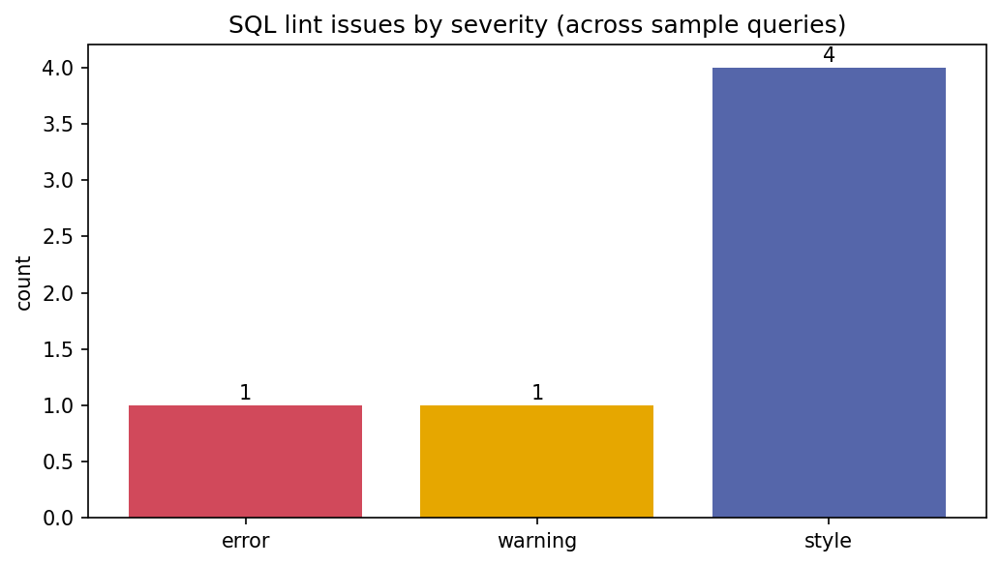

# SQL Formatter & Linter

[](https://colab.research.google.com/github/phoebefu6/phoebe-the-builder/blob/main/automation-suite/sql-formatter/demo.ipynb)
[](https://mybinder.org/v2/gh/phoebefu6/phoebe-the-builder/main?labpath=automation-suite/sql-formatter/demo.ipynb)

> A FastAPI microservice that turns unreadable SQL into a clean house style - and lints it for danger (`DELETE` with no `WHERE`) and style (`SELECT *`, implicit joins).

## Business Impact
- **Before:** SQL is inconsistent spaghetti. Reviews are slow; a `DELETE` with no `WHERE` slips through.
- **After:** One endpoint reformats to a consistent style and flags safety + style issues a formatter alone won't catch.
- **Estimated ROI:** Faster code review, fewer destructive-query incidents, consistent SQL across the team.

## Tech Stack
Python, FastAPI, sqlparse (formatting), Pydantic, Docker.

## Demo

**[Run the interactive demo notebook →](demo.ipynb)** - pre-rendered with outputs, or click the Colab/Binder badges above.



Run the microservice:
```bash
pip install -r requirements.txt
uvicorn api:app --reload
```
Open `http://localhost:8000` (test form) or `/docs` (Swagger).

## How it works
- `formatter.py` - `format_sql` (sqlparse: keyword case, clause-per-line) + `lint_sql` (our rules) + `analyze` (both in one call). Pure functions, no web layer.
- `api.py` - `/format`, `/lint`, `/analyze`, and a built-in HTML form.

## Lint rules
| Rule | Severity | Catches |
|------|----------|---------|
| `delete_no_where` / `update_no_where` | error | a `DELETE`/`UPDATE` that hits every row |
| `select_star` | warning | `SELECT *` - perf + schema-drift risk |
| `implicit_join` | style | comma joins instead of explicit `JOIN ... ON` |
| `no_semicolon` | style | missing statement terminator |
| `trailing_whitespace` | style | trailing whitespace |

## Edge case handled
**Formatting never hides danger.** A pretty-printer happily reformats `DELETE FROM users` into clean SQL - so the lint layer runs *independently* and still flags it as an error. Style and safety are separate passes on purpose.

## Platform note
The pure `formatter.py` core is designed to mount as a governed **SQL tools** app on the platform shell (Analytics category, `analyst` role) - it's already registered in `platform/registry/apps.yaml` as a roadmap app.

## Learning Connection
Built while studying **FastAPI microservices** (Month 2).
Applies: wrapping a mature library (sqlparse) behind a clean API, layering custom domain rules on top, separating format vs. lint concerns.

## Impact Note
- **Who benefits:** Analysts and engineers who read/review SQL daily.
- **Potential risks:** Lint rules are regex-based heuristics - a `DELETE` inside a string literal or comment could false-positive; treat lints as guidance, not a parser-grade guarantee.
