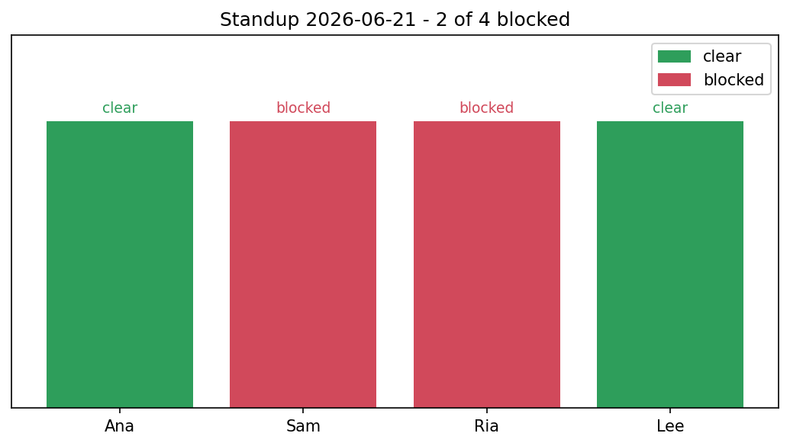

# Daily Standup Bot

[](https://colab.research.google.com/github/phoebefu6/phoebe-the-builder/blob/main/automation-suite/standup-bot/demo.ipynb)
[](https://mybinder.org/v2/gh/phoebefu6/phoebe-the-builder/main?labpath=automation-suite/standup-bot/demo.ipynb)

> One place for the team's standup. Everyone submits yesterday / today / blockers; the bot rolls it into a single digest with blockers surfaced first. No more scrolling Slack threads.

## Business Impact
- **Before:** Standup updates scatter across Slack threads, DMs, and memory. Blockers get buried; nobody has the full picture.
- **After:** One submission per person, one clean daily digest, blockers escalated to the top automatically.
- **Estimated ROI:** Shorter standups, fewer dropped blockers, an async-friendly record.

## Tech Stack
Python, FastAPI, Pydantic, Anthropic SDK (Claude, optional), Docker.

## Demo

**[Run the interactive demo notebook →](demo.ipynb)** - pre-rendered with outputs, or click the Colab/Binder badges above.



Run the service:
```bash
pip install -r requirements.txt
uvicorn api:app --reload
```
Open `http://localhost:8000` to submit updates and see the digest, or `/docs` for Swagger.

## API
| Method | Path | Purpose |
|--------|------|---------|
| POST | `/standup` | Submit/replace your update (`name`, `yesterday`, `today`, `blockers`, optional `day`) |
| GET | `/updates?day=` | Raw updates for a day |
| GET | `/digest?day=&ai=true` | The daily digest (Markdown); `ai=true` uses Claude if a key is set |

## How it works
- `standup.py` - `StandupStore` (one update per person per day, re-submit replaces), `has_blocker` (filters out "none"/"n/a"/"-"), `build_digest` (deterministic Markdown, blockers first), and `summarize_with_claude` (optional narrative, lazy SDK import).
- `api.py` - FastAPI service + a built-in submit form.

## Edge case handled
**"none" is not a blocker.** A blockers field of `none` / `n/a` / `-` / `nothing` is treated as clear, so the Blockers section only lists *real* blockers - the whole point of escalating them.

## AI is optional
With `ANTHROPIC_API_KEY` set, `/digest?ai=true` returns a narrative summary (team status + ranked blockers + themes). Without a key, it falls back to the deterministic template - the tool never requires Claude to function.

## Platform note
The `standup.py` core is UI-free and mountable as a **Team** app on the platform shell.

## Learning Connection
Built while studying **FastAPI** + **Claude API** (Month 2 finale).
Applies: aggregation + escalation logic, optional-LLM design with graceful fallback, a self-contained submit-and-view web UI.

## Impact Note
- **Who benefits:** Distributed or async engineering/data teams.
- **Potential risks:** In-memory store resets on restart - back it with a DB for real use. The AI summary should be reviewed; it can paraphrase a blocker imprecisely.
