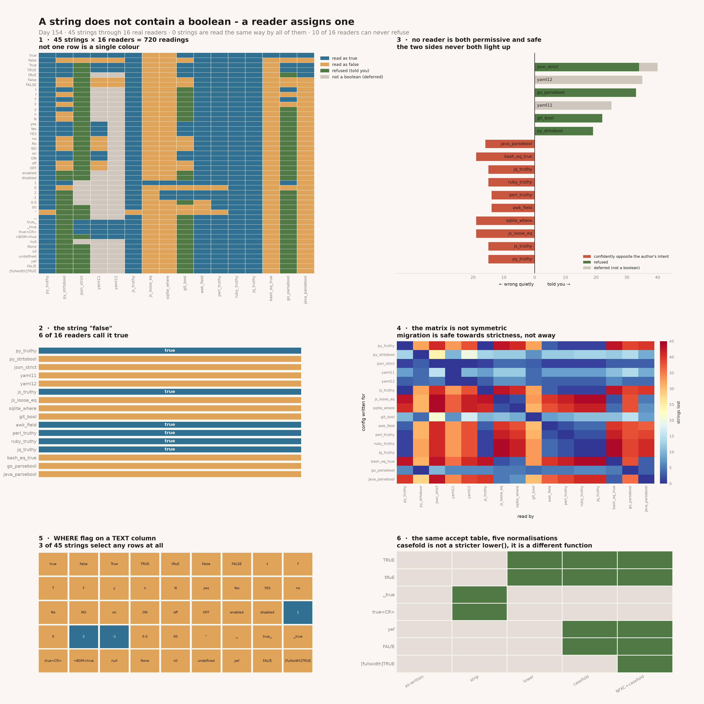

# Boolean Parser

[](https://colab.research.google.com/github/phoebefu6/phoebe-the-builder/blob/main/data-engineering-pro/boolean-parser/demo.ipynb)
[](https://mybinder.org/v2/gh/phoebefu6/phoebe-the-builder/main?labpath=data-engineering-pro/boolean-parser/demo.ipynb)

> A string does not *contain* a boolean. A reader *assigns* one — and a reader is three separate decisions: an **accept table** (which spellings mean true), a **normalisation** (case, whitespace, Unicode, applied before the lookup), and a **failure policy** (refuse, or quietly fall back to one of the two answers). The word `true` in a config file carries none of them. Sixteen layers each pick their own three, and the value changes as it crosses them.

**Day 154 — Data Engineering Pro.** 45 strings, 16 real readers, 720 readings, 47 tests, and a notebook that re-derives the grid on *your* machine and diffs it against the recording.



> **`"false"` is a true value in 6 of the 16 readers.** Not one of them is broken. Each is a *truthiness* reader — it never consulted a boolean table at all. It asked "is this string non-empty", and for `"false"` the answer is yes.
>
> **0 of 45 strings are read the same way by all sixteen.** Not `yes`. Not `1`. Not `true`.
>
> **10 of 16 readers can never refuse anything.** They return a confident boolean for every string ever handed to them, including `undefined`, a bare UTF-8 BOM and the empty string.

## Business Impact

- **Before:** a feature flag is written `true` in a `.env` file, copied into a `docker-compose.yml`, stored in a `flags` table and read by a Node service, a Go worker and a nightly `awk` job. It is on in three places and off in two, and no log line anywhere records a problem — every reader returned a valid boolean without hesitating. The ticket says "flag is flaky", it reproduces on one host and not another, and it gets closed as *cannot reproduce*.
- **After:** the value is pushed through 16 real readers at once. **Every one of the 45 corpus strings has at least one reader calling it true and another calling it false**, both confident, neither raising. The audit names which readers, so the disagreement becomes a config change rather than an outage.
- **Estimated ROI:** the audit runs in under four seconds. The number worth the time is the split between the two failure modes. **108 of 720 readings are refusals** — the good outcome, a stop at the boundary with the offending string in the message. **161 readings are confidently opposite what the author meant**, and those propagate silently. Nothing downstream can tell the two apart, because a boolean has no error channel.

## Relationship to Days 147–153

Day 147 [`duration-parser`](../../automation-suite/duration-parser/) found eight conforming readings of one duration string; Day 149 [`header-casing`](../../automation-suite/header-casing/) that a field name gets respelled by hops you do not own; Day 150 [`sort-order-drift`](../sort-order-drift/) that `ORDER BY name` is a collation rather than an order; Day 151 [`line-ending-detector`](../line-ending-detector/) that a file has no lines in it until a splitter makes them; Day 152 [`number-parser-locale`](../number-parser-locale/) that a numeric string does not contain a number until a reader assigns one; Day 153 [`unicode-width-truncator`](../unicode-width-truncator/) that "truncate to 20" does not name an operation.

This one is the smallest possible instance of that arc and the worst behaved, because **a boolean has no error channel**. Day 152's worst misreading was a number 1,000× off — but a wrong number is still a number, and it can be range-checked, logged, plotted, noticed. A wrong boolean is indistinguishable from a right one. There is no such thing as an implausible `false`.

That is also why the fix is different. Every previous day ended in *pick the right reader and say so*. This one ends in **do not store a boolean as text at all**, because with two possible values there is no reader good enough to make the round trip safe.

## What it does

Sixteen sections in `evidence.py`. Every number below is printed by it and asserted in `test_boolparse.py`.

### 1. The reader roster

Fourteen of the sixteen are real interpreters invoked at run time — not tables, not models.

| reader | stack | refuses? | where you meet it |
|---|---|---|---|
| `py_truthy` | Python 3.11 | never | `if os.environ.get("DEBUG"):` |
| `py_strtobool` | Python 3.11 | yes | `distutils.util.strtobool`, argparse recipes |
| `json_strict` | Python 3.11 | yes | a JSON request body, a JSONB column |
| `yaml11` | PyYAML 6 | yes | docker-compose, GitHub Actions, Ansible |
| `yaml12` | ruamel 1.2 | yes | a YAML 1.2 parser: Go `yaml.v3`, JS `yaml` |
| `js_truthy` | node 22 | never | `if (process.env.FLAG)` in any Node service |
| `js_loose_eq` | node 22 | never | the `== true` "fix" applied after the first bug |
| `sqlite_where` | SQLite 3.51 | never | `WHERE flag` on a TEXT column |
| `git_bool` | git 2.50 | yes | `git config --type=bool`, every `core.*` setting |
| `awk_field` | awk 20200816 | never | `awk '$3 { ... }'` over a TSV export |
| `perl_truthy` | perl 5 | never | a legacy ETL script |
| `ruby_truthy` | ruby 2.6 | never | `if flag` in Rails, Chef, Puppet |
| `jq_truthy` | jq 1.6 | never | `jq 'select(.flag)'` in a pipeline |
| `bash_eq_true` | bash 3.2 | never | `[ "$X" = true ]` in an entrypoint |
| `go_parsebool` | Go *(spec)* | yes | `strconv.ParseBool`, most Go flag parsing |
| `java_parsebool` | Java *(spec)* | never | `Boolean.parseBoolean`, Spring `@Value` |

Two are marked **`spec`**: no Go toolchain and no JRE on the build machine, so their published value tables are transcribed verbatim and pinned by tests (`test_go_parsebool_table_is_the_documented_twelve`, `test_java_parsebool_is_true_iff_equalsignorecase_true`). Everything else shells out.

**None of these is wrong.** Each is correct for the accept table it was written with.

### 2. There is no string that means true

```
strings read the same way by all 16 readers:  0  of 45

  true    ->  true=14,  false=2
  false   ->  true=6,   false=10
  1       ->  true=11,  false=2,  not-a-boolean=3
  0       ->  true=4,   false=9,  not-a-boolean=3
  yes     ->  true=9,   false=4,  refused=2,  not-a-boolean=1
```

Even `true` is not unanimous. `sqlite_where` reads it as false, and so does `js_loose_eq` — `s == true` converts **both** sides to numbers, `Number('true')` is `NaN`, and `NaN == 1` is false. `"1" == true` is true; `"true" == true` is not.

### 3. The title bug

`"false"` is read as **true** by `py_truthy`, `js_truthy`, `awk_field`, `perl_truthy`, `ruby_truthy` and `jq_truthy` — 6 of 16. All six are truthiness readers. There is no accept table anywhere in that path.

### 4. Every string flips sign somewhere

**45 of 45.** For every string in the corpus there is at least one reader calling it true and at least one calling it false, both confident, neither raising. Two services sharing a config file cannot detect this; the only artefact is behaviour.

### 5. Ten of sixteen readers cannot fail

| | refused | deferred | silently wrong |
|---|---|---|---|
| `json_strict` | 34 | 6 | 0 |
| `go_parsebool` | 33 | 0 | 0 |
| `git_bool` | 22 | 0 | 0 |
| `py_strtobool` | 19 | 0 | 0 |
| `yaml11` | 0 | 25 | 0 |
| `yaml12` | 0 | 35 | 0 |
| `js_loose_eq` · `sqlite_where` · `bash_eq_true` | 0 | 0 | 19 |
| `java_parsebool` | 0 | 0 | 16 |
| `py_truthy` · `js_truthy` · `ruby_truthy` · `jq_truthy` | 0 | 0 | 15 |
| `awk_field` · `perl_truthy` | 0 | 0 | 14 |

**Only 4 of 16 readers ever refuse anything.** The two right-hand columns are mutually exclusive — asserted, not observed — so there is no reader in this roster that is both permissive and safe.

`java_parsebool` is the sharpest case: `Boolean.parseBoolean` returns true iff the string `equalsIgnoreCase("true")`, and **everything else is false with no error**. `parseBoolean("yes")`, `parseBoolean("1")` and `parseBoolean("ture")` are indistinguishable.

### 6. Succeeding is not deciding

`yaml11` and `yaml12` score **zero in both columns**, which is not a clean bill of health. They neither raise nor mislead because they mostly do not answer: 25 and 35 of the 45 strings come back as a `str`, an `int` or `None`. That is a fourth verdict, and it is the most dangerous one to read past — nothing failed, and nothing was decided. The decision is deferred to whichever `if value:` runs next, in a different file, with no idea what the original string was.

### 7. The Norway problem

**10 of 45 strings change meaning between YAML 1.1 and YAML 1.2** — exactly `yes/Yes/YES/no/No/NO/on/ON/off/OFF`. Under 1.1 they are booleans; 1.2 deleted them from the core schema for this reason. PyYAML implements 1.1; Go's `yaml.v3` and the JS `yaml` package implement 1.2. An unquoted `NO` in a country column is the boolean `false` in one parser and the string `"NO"` in the other, and both files are valid YAML.

A smaller finding in the same place: YAML 1.1's type repository lists `y` and `n` as booleans, and **PyYAML does not implement them** — `y` is the string `'y'`. The folklore about YAML booleans is not the same thing as any shipped parser's behaviour.

### 8. In SQLite the string `'true'` is false

SQLite has no boolean type. A TEXT value in boolean position is cast to a number, and a string that does not begin with digits casts to `0`.

**3 of 45 strings are truthy in a `WHERE` clause: `1`, `2`, `-1`.** The other 42 — every word-shaped spelling of true there is — select zero rows, in every query, forever, and SQLite never raises.

```sql
CREATE TABLE feature (name TEXT, flag TEXT);
INSERT INTO feature VALUES ('beta', 'true');

SELECT count(*) FROM feature WHERE flag;          -- 0
SELECT count(*) FROM feature WHERE flag = TRUE;   -- 0
```

(One nuance the notebook shows live: comparison against a *declared TEXT column* applies numeric affinity, so a column holding `'1'` does match `flag = TRUE` while one holding `'true'` does not. The inconsistency is worse than either rule on its own.)

### 9. awk gives two answers for the same characters

awk's **strnum** rule compares a value that looks numeric as a number — and whether it looks numeric depends on how it got in.

| string | literal in the program | `-v s=…` | input field |
|---|---|---|---|
| `0` | **true** | false | false |
| `00` | **true** | false | false |
| `0.0` | **true** | false | false |
| `0e0` | **true** | false | false |
| `false` | true | true | true |

`awk 'BEGIN { if ("0") ... }'` is true — a string constant, and a non-empty string is true. `echo 0 | awk '$0 { ... }'` is false. No other reader in the roster changes its answer based on where the string came from.

### 10. The file the value travelled in is part of the value

The author wrote `true` in all four of these. What arrived was `true` plus whatever the file format left behind.

| what arrived | why | true | false | refused |
|---|---|---|---|---|
| `true<CR>` | a `.env` saved with CRLF endings | 9 | 4 | 3 |
| `<BOM>true` | a UTF-8 BOM on line 1 | 8 | 4 | 4 |
| `␣true` | a space after the `=` | 9 | 4 | 3 |
| `true␣` | a trailing space, invisible in a diff | 9 | 4 | 3 |

`bash_eq_true`, `java_parsebool`, `js_loose_eq` and `sqlite_where` turn all four **off**. A Windows-edited `.env` silently disables every flag read by an entrypoint script.

`json_strict` handles three of the four correctly — space, trailing space and `\r` are all JSON whitespace — and refuses the BOM, which is the right answer and the only refusal in that column.

### 11. `lower()` and `casefold()` are different functions

Not a strictness ordering. One accept table, five normalisations:

| string | as-written | strip | lower | casefold | NFKC+casefold |
|---|---|---|---|---|---|
| `TRUE` | ✗ | ✗ | ✓ | ✓ | ✓ |
| `␣true` | ✗ | ✓ | ✗ | ✗ | ✗ |
| `true<CR>` | ✗ | ✓ | ✗ | ✗ | ✗ |
| `yeſ` | ✗ | ✗ | ✗ | **✓** | ✓ |
| `FALſE` | ✗ | ✗ | ✗ | **✓** | ✓ |
| `ＴＲＵＥ` | ✗ | ✗ | ✗ | ✗ | **✓** |

`"FALſE".casefold()` is `"false"`; `"FALſE".lower()` is `"falſe"`. A casefolding reader **accepts** a string a lowercasing reader refuses.

And the Turkish-I hazard from Day 149 reaches exactly one literal here — checked live through node's `toLocaleLowerCase`, not a transcribed table. `DISABLED` lowercases to `dısabled` in a `tr` locale and matches nothing. The twelve core literals (`true false t f yes y no n on off 1 0`) are immune **only because not one of them contains the letter I**. That is luck, not design: the day a vocabulary grows to include `disabled`, one locale breaks it.

### 12. Written for one reader, read by another — and it runs one way

Take the strings a reader reads *confidently* — the spellings somebody would plausibly write into a config authored against it — then count how many a second reader fails to reproduce. **240 ordered pairs; 8 lose nothing.**

The matrix is **not symmetric**, and that is the actionable part:

| A | B | A → B | B → A |
|---|---|---|---|
| `py_truthy` | `json_strict` | **41** | **1** |
| `ruby_truthy` | `go_parsebool` | 39 | 6 |
| `js_truthy` | `git_bool` | 32 | 10 |
| `yaml11` | `yaml12` | 10 | 0 |

Migrating a config *from* a permissive reader *to* a strict one breaks almost everything; the reverse direction is nearly free. **Migrations have a safe direction, and it points at strictness.** Tighten the reader first, then move the config — not the other way round.

### 13. Exactly two reader pairs agree on everything

`py_truthy == js_truthy` and `ruby_truthy == jq_truthy`. Two of the 120 unordered pairs. The second one is the more instructive: Ruby and jq agree because **both are true for all 45 strings** — Ruby's only falsy values are `nil` and `false`, jq's are `false` and `null`, and a string is never either. Perfect agreement, zero information.

## Tech Stack

Python 3.11 · node 22 · git 2.50 · SQLite 3.51 · awk · perl 5 · ruby 2.6 · jq 1.6 · bash · PyYAML 6 · ruamel.yaml (pinned to YAML 1.2) · matplotlib · pandas · Streamlit · pytest · ruff

## Demo

**[Run the interactive demo notebook →](demo.ipynb)** — pre-rendered with all outputs, or click the Colab/Binder badges above to run it live.

The notebook is self-verifying: it carries the build machine's 720 readings baked in so every cell renders on GitHub, then **re-derives as many readers as your machine can actually run and diffs the two**. On the build machine, 8 of the 16 re-derived live with zero drift.

```bash
pip install -r requirements.txt

python evidence.py          # all sixteen sections, under 4 seconds
python -m pytest -q         # 47 tests, every README number asserted
python make_chart.py        # boolean_audit.png + .svg
streamlit run app.py        # paste a string, watch sixteen readers disagree
```

The Docker image installs node, git, awk, perl, ruby, jq and sqlite3, because the readers are real.

## Learning Connection

Built while working through type coercion at ingestion boundaries — the sixth in the Day 147–154 arc on values that are assigned meaning by a reader rather than carrying it. Applies: subprocess-driven differential testing across language runtimes, YAML 1.1 vs 1.2 schema resolution, SQLite type affinity, POSIX awk strnum semantics, JavaScript abstract equality, Unicode case folding vs lowercasing, and locale-sensitive casing via ECMA-402.

## What to do about it

1. **Name the accept table in the schema**, not in the code that reads it. `true|false` is a defensible table. So is git's. `bool(s)` is not a table.
2. **Choose the normalisation deliberately.** Strip first — all four residue cases in §10 are a stripping bug — then `casefold()`, not `lower()`, and NFKC only if fullwidth input is possible.
3. **Refuse.** A reader that returns `false` for an unrecognised string has thrown away the only fact it had: that nobody knows what the value means. Only 4 of these 16 can do that.
4. **Do not store a boolean as text.** A `BOOLEAN` column, or an `INTEGER` holding 0 and 1, is never parsed by anybody. That is the whole fix; everything above is what it costs not to do it.

## Impact Note

- **Who benefits:** anyone who owns a config value read by more than one runtime — platform and data engineers, anyone maintaining a `.env`, a compose file or a flags table, and anyone who has closed a "flag is flaky" ticket as *cannot reproduce*.
- **Potential risks:** the roster is 16 readers, not all of them. Absence from this list is not evidence a reader agrees. The two `spec` readers are transcriptions, not executions — pinned by tests against their published contracts, but a Go or Java release that changed those contracts would not be caught here. And every count is specific to the versions in §1: a PyYAML that adopts YAML 1.2, or a different libc's awk, moves the numbers. The tests assert the exact figures precisely so that a change fails loudly instead of leaving this page quietly wrong.
