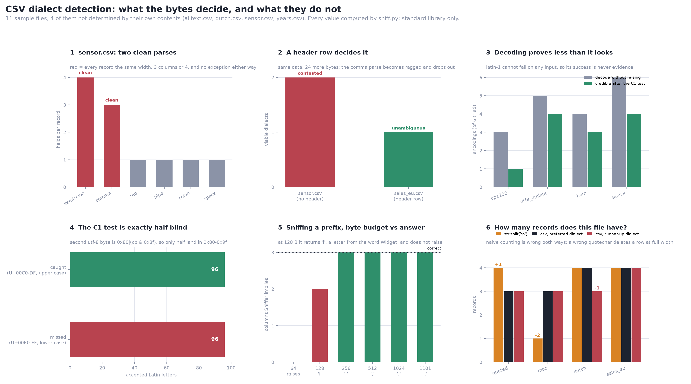

# CSV Dialect Sniffer

[](https://colab.research.google.com/github/phoebefu6/phoebe-the-builder/blob/main/data-engineering-pro/csv-dialect-sniffer/demo.ipynb)
[](https://mybinder.org/v2/gh/phoebefu6/phoebe-the-builder/main?labpath=data-engineering-pro/csv-dialect-sniffer/demo.ipynb)

> `csv.Sniffer().sniff()` returns a `Dialect` or raises `csv.Error`. It has no third answer. So a file that two different dialects parse *perfectly* - every record the same width, nothing ragged, no exception - gets one of them, and the other one is never mentioned. The answer it gives is a tie-break presented as a detection.

**Day 142 - Data Engineering Pro.** A dialect detector that enumerates every viable parse instead of returning one, and separates three verdicts: **unambiguous** (exactly one candidate parses the file cleanly), **contested** (several do, and the bytes cannot choose), **undetermined** (none do). Plus the four things a delimiter guess will not tell you: which encoding, whether a header exists, what a record is, and how much of the file was actually looked at.



## Business Impact

- **Before:** a nightly loader calls `pd.read_csv(path, sep=None, engine="python")` on partner exports so it can "handle any delimiter." Three vendors send comma files, one sends a European semicolon file with comma decimals, and one switched spreadsheet tools last month and now sends a BOM. Every load succeeds. Row counts are stable. Column counts are stable per vendor. One vendor's revenue has been a third of what it should be since the day they onboarded.
- **After:** every candidate dialect is enumerated and scored, the file is labelled decided or not decided *before* a table is rendered, and the questions the bytes do not answer are listed as questions rather than filled in.
- **Estimated ROI:** on the bundled 11-file corpus, **ten** distinct failure modes each produce a plausible result and **nine of the ten never raise**. **Four of the 11 files are not determined by their own contents.** One file loses a record while keeping its column count exactly right. One returns a `Dialect` whose delimiter is the letter `i`.

## What it does

Eight mechanisms. Every number below is printed by `evidence.py`.

### 1. Two parses, both clean, different widths

`sensor.csv` is four records from a German ERP. The delimiter is `;` and `1,50` is one and a half:

```
2024-01-01;12;1,50;18,00
2024-01-02;8;2,25;18,00
2024-01-03;15;1,20;18,00
2024-01-04;9;2,00;18,00
```

Every candidate delimiter, scored:

```
delimiter     fields  consistent  viable  why
------------------------------------------------------------------------------
tab           1       100%        no      delimiter yields 1 field(s) per record
space         1       100%        no      delimiter yields 1 field(s) per record
comma         3       100%        yes     4 records x 3 fields, no ragged rows
colon         1       100%        no      delimiter yields 1 field(s) per record
semicolon     4       100%        yes     4 records x 4 fields, no ragged rows
pipe          1       100%        no      delimiter yields 1 field(s) per record
------------------------------------------------------------------------------
verdict: CONTESTED - 2 dialects parse the file cleanly, implying 3 or 4 columns
csv.Sniffer().sniff() picks: ','  ->  3 columns
```

Both viable parses are **100% consistent across all four records**. Nothing is ragged, nothing is null, nothing raises:

```
comma     -> ['2024-01-01;12;1', '50;18', '00']
semicolon -> ['2024-01-01', '12', '1,50', '18,00']
```

Sniffer picks the comma. Downstream, `18,00` has become a column called `00` and every price has been split across two fields. The per-row width check passes, the not-null check passes, and the column *names* pass too because there are no names.

### 2. A header row is 24 bytes and it settles it

The same data with `day;units;price;total` on top:

```
sensor.csv     first line: 2024-01-01;12;1,50;18,00   contested     (comma 3 cols, semicolon 4 cols)
sales_eu.csv   first line: day;units;price;total      unambiguous   (semicolon 4 cols)
```

The header contains no comma, so under the comma dialect it is one field where the body has three - ragged, ruled out, and the contest is over. Sniffer gets `';'` right on the second file and wrong on the first, with no way for the caller to tell those two situations apart.

**Writing a header row is a data-quality control, not a formatting habit.** It is the cheapest disambiguating byte you will ever add to a file.

### 3. A successful decode is not evidence. A failed one is.

`UnicodeDecodeError` is a fact about the bytes: they are not valid in that encoding. Success is far weaker, and for some encodings it is worth nothing at all - `latin-1` maps all 256 byte values, so it decodes every file ever written.

`cp1252.csv`, a Windows export with curly quotes:

```
encoding    decodes  row 1 as decoded                      why success proves little
------------------------------------------------------------------------------
utf-8       NO       -
utf-8-sig   NO       -
cp1252      yes      '1,“Ausführung” abgeschlossen'        only 5 of 256 bytes undefined
latin-1     yes      '1,\x93Ausführung\x94 abgeschlossen'  maps all 256 byte values
utf-16      yes      ''                                    any even-length input decodes
shift_jis   NO       -
------------------------------------------------------------------------------
verdict: cp1252 - utf-8 ruled out; the only survivor left after the C1 test
```

The discriminator that works is the **C1 test**: a decode that yields characters in U+0080-U+009F is not credible, because text does not contain control codes. That is exactly the byte range where cp1252 keeps its curly quotes, so `latin-1` is disqualified on evidence rather than on preference.

And the same file's mirror image, `utf8_umlaut.csv` - genuine UTF-8 that four other encodings also decode, to four different strings, none raising:

```
utf-8       '1,Ausführung'
cp1252      '1,Ausführung'
latin-1     '1,Ausführung'
shift_jis   '1,Ausfﾃｼhrung'
```

### 4. The C1 test is blind, and blind by exactly half

A code point's second UTF-8 byte is `0x80 | (cp & 0x3f)`. So U+00C0-U+00DF land inside the C1 range and U+00E0-U+00FF do not:

```
96 of 192 accented Latin letters encode with a continuation byte in 0x80-0x9f
    caught : ÀÁÂÃÄÅÆÇÈÉÊËÌÍÎÏ
    missed : àáâãäåæçèéêëìíîï
```

Upper case is caught, lower case is not. On the sample:

```
utf-8 '1,Ausführung'   latin-1 '1,Ausführung'      C1 chars: 0  passes, and is wrong
utf-8 '2,Größe'        latin-1 '2,GröÃ\x9fe'       C1 chars: 1  DISQUALIFIED
```

`ü` slips through; `ß` does not. One caught character anywhere in the file disqualifies latin-1 for the whole file, so on real prose the test usually fires - and on a file of lower-case-only names it does not. That limit is derived from the encoding rather than measured, and it ships in the report next to the verdict.

### 5. The BOM that becomes part of a column name

```
first three bytes    : b'\xef\xbb\xbf'
read as 'utf-8'      : ['id', 'name', 'amount']
read as 'utf-8-sig'  : ['id', 'name', 'amount']

printed, identical:   id|name|amount   /   id|name|amount
compared, not:        rows[0][0] == 'id'  ->  False
                      len(rows[0][0])     ->  3   (for a two-character name)
```

U+FEFF has zero width. The name prints correctly, renders correctly in a dataframe, appears correctly in a screenshot, and compares unequal to itself. `df['id']` raises `KeyError` on a column the reader can see - which is the good case, because at least it raises.

### 6. `has_header()` returns a bool for a question the file does not answer

```
file            first line                  Sniffer   this module    basis
------------------------------------------------------------------------------
sales_eu.csv    day;units;price;total       True      header         text_over_nontext
years.csv       2019,2020,2021              False     undetermined   row0_matches_body
alltext.csv     north,widget,blue           False     undetermined   all_text
sensor.csv      2024-01-01;12;1,50;18,00    False     undetermined   row0_matches_body
------------------------------------------------------------------------------
```

There is exactly **one decidable direction**. A first row that is text where the body is numeric or dated cannot be a data row, so `header` is provable. The converse is not: a first row whose types match the body is consistent with a data row *and* with a header whose labels happen to be numbers. `2019,2020,2021` is that case, and any year-per-column pivot export looks like it.

`alltext.csv` is the mirror image - three text rows, and the first one is data. Sniffer answers `False` for both, and it is wrong about one of them; **which one is not recoverable from the file.** So this module has no `no_header` verdict at all, and a test enforces that it never emits one.

What the two answers cost on `years.csv`:

```
header=0    -> columns ['2019', '2020', '2021'], 2 data rows, sum of col 0 = 210
header=None -> columns [0, 1, 2],                3 data rows, sum of col 0 = 2229
```

A year counted as a measurement inflates column 0 by 2,019 - a number large enough to notice and specific enough to look like real data.

### 7. Sniffing a prefix, and the letter `i`

Sniffing the first kilobyte of a large file is the normal thing to do:

```
sample          Sniffer picks   its cols   this module     its cols
------------------------------------------------------------------------------
64 B            raises          -          unambiguous     3
128 B           'i'             2          unambiguous     3
256 B           ','             3          unambiguous     3
1024 B          ','             3          unambiguous     3
all (1101 B)    ','             3          unambiguous     3
------------------------------------------------------------------------------
```

At 128 bytes Sniffer returns `'i'`. Not a delimiter it was offered - a letter from the word `Widget`, because `_guess_delimiter` falls through to *any* character with a consistent per-line frequency when none of its preferred candidates has one. It does not raise. It returns a `Dialect` whose delimiter is `i`, and a two-column frame.

`late.csv` is 1,101 bytes and a 1 KB sniff sample stops at record 60. Record 61 is the only quoted field in the file:

```
61,"Bolt, hex",610
```

So the sample that chose the dialect never saw the row the dialect exists for. Prefix-truncated candidates also end mid-record, which is why `shape_of()` excludes a single trailing fragment - but only when it is last, only when the text has no terminator after it, and only when it is the sole ragged row, so a complete file with no trailing newline keeps all its records.

### 8. The wrong quotechar deletes a row and keeps the width

Dutch surnames begin with an apostrophe:

```
id,name,town
1,'t Hooft,Delft
2,'s Gravesande,Leiden
3,de Vries,Utrecht
```

```
dialect                 records    fields    consistent   nl in field
------------------------------------------------------------------------------
comma / quote='"'       4          3         100%         0
comma / quote="'"       3          3         100%         1
------------------------------------------------------------------------------
verdict: CONTESTED - all 3 columns wide but 3 or 4 records long
```

The apostrophe on `'t Hooft` opens a quoted field that runs to the apostrophe on `'s Gravesande`, absorbing the record terminator between them:

```
['1', 't Hooft,Delft\r\n2,s Gravesande', 'Leiden']
```

Four records become three, at **exactly the right column count**, 100% consistent. Every check that watches the column count passes. `fields_with_newline` is the signal that survives, and it is why the tie-break prefers the parse that keeps more records - a preference, stated as one.

### And the circularity underneath record counting

```
file            terminator   split('\n')   csv records   nl in field   delta
------------------------------------------------------------------------------
quoted.csv      \r\n         4             3             1             -1
mac.csv         \r           1             3             0             2
sales_eu.csv    \r\n         4             4             0             0
------------------------------------------------------------------------------
```

`mac.csv` uses a bare `\r`, so `str.split('\n')` returns one line for three records and `wc -l` reports 0. `quoted.csv` has a newline inside a quoted address, so the naive count is one too high. Both are wrong, in opposite directions, and neither raises.

To know whether a newline terminates a record or sits inside a field you need the quotechar - which is part of the dialect you are trying to detect. `scan_terminators()` therefore takes the quotechar as an argument instead of pretending it can be inferred first.

One more thing worth reporting rather than assuming: on a file with no quoted field, `quotechar` is **untested**. `quote='"'`, `quote="'"` and `quote=none` all produce the identical parse, so today's success says nothing about next month's export. The verdict lists which settings this file did not exercise.

### The ledger

```
failure mode                      sample            effect                        raises?
------------------------------------------------------------------------------
two clean parses, 3 vs 4 cols     sensor.csv        wrong column count            silent
utf-8 read as latin-1             utf8_umlaut.csv   Ausführung in every row      silent
latin-1 read for a cp1252 file    cp1252.csv        C1 controls in the text        silent
BOM kept as a name character      bom.csv           KeyError on a visible column   raises late
numeric header read as data       years.csv         col 0 inflated by 2019         silent
text data row read as header      alltext.csv       one row lost, names wrong      silent
apostrophe read as a quotechar    dutch.csv         1 of 4 records merged away     silent
prefix sniff picks 'i'            late.csv          1-column frame                 silent
bare \r line ending               mac.csv           3 records counted as 1         silent
newline inside a quoted field     quoted.csv        line count one too high        silent
------------------------------------------------------------------------------

7 of the 11 sample files are fully determined by their own bytes.
The other 4 are not: alltext.csv, dutch.csv, sensor.csv, years.csv
```

Nine of the ten never raise, and **all ten are reproducible** - re-running the load produces the same wrong number, so a reconciliation against yesterday agrees. That is why these survive: the failure is stable, and stability reads as correctness.

## Tech Stack

Python 3.9+, Streamlit, Docker. **`sniff.py` has no dependencies beyond the standard library** - `csv`, `io`, `re`, `codecs`, `collections`, `dataclasses`. No chardet, no pandas, no pandas dialect inference. 703 lines of core, 371 lines of tests. pandas appears only in the Streamlit app; numpy and matplotlib only in the figure.

The three verdicts are the API. `classify_delimiter()` returns `unambiguous` / `contested` / `undetermined` with every candidate attached; `probe_encoding()` returns which encodings are *ruled out* rather than which one "is" right; `classify_header()` returns `header` or `undetermined` and never claims a header is absent; `audit()` sets `decided` only when all of the above are answerable.

## Demo

**[Run the interactive demo notebook →](demo.ipynb)** - pre-rendered with all outputs and the six-panel figure, or click the Colab/Binder badges above to run it live. The notebook writes `sniff.py`, `evidence.py` and `make_chart.py` to disk from embedded source, so it is self-contained without a clone step and there is no second copy of the logic to drift.

For the Streamlit app:

```bash
pip install -r requirements.txt
streamlit run app.py
```

Reproduce every number above:

```bash
python3 test_sniff.py   # 46 tests over the core
python3 evidence.py     # every table in this README
python3 make_chart.py   # the six-panel audit figure
```

## Files

| file | what it is |
|---|---|
| `sniff.py` | `shape_of`, `classify_delimiter`, `probe_encoding`, `scan_terminators`, `classify_header`, `sample_sensitivity`, `audit`, 11-file sample corpus |
| `evidence.py` | the eight experiments this README quotes, each isolating one mechanism |
| `test_sniff.py` | 46 tests, including the claim that the module never emits a `no_header` verdict |
| `app.py` | Streamlit UI - verdict first, candidates second, parsed table last |
| `make_chart.py` | the six-panel audit figure |
| `build_notebook.py` | generates `demo.ipynb` with all three modules embedded |

The UI order is deliberate. A table rendered above the caveats reads as the answer, so the app puts the decided/not-decided banner at the top and the dataframe at the bottom, and when the header is undecidable it renders with integer column labels and says why.

One note on the tests worth stealing: they assert **structural** facts - this file is contested, this encoding is ruled out, this setting is untested - and never assert which dialect a given Python's `csv.Sniffer` returns. Sniffer's answers live in `evidence.py`, where they are the finding rather than the expectation, so a CPython change breaks the write-up and not the suite.

## Learning Connection

Built while reading the `csv` module source - `Sniffer._guess_delimiter`, its frequency-consistency scoring, and the fall-through that lets a letter win - plus RFC 4180 on what a CSV record actually is, and the Unicode standard's C1 block on why one byte range makes a decode implausible.

Applies: enumerate-then-judge instead of return-one, asymmetric evidence (a failed decode is a fact, a successful one often is not), naming the tie-break rather than burying it, reporting a heuristic's blind spot alongside its verdict, and treating sample size as part of an answer rather than an implementation detail.

## Impact Note

- **Who benefits:** anyone loading files they did not write - partner and vendor feeds, spreadsheet exports, CRM and ERP extracts, government open data, scraped downloads, anything crossing a locale boundary or arriving from a Mac.
- **Potential risks:** this tool reports; it does not repair, and its central finding is that some of these files cannot be repaired from their own contents - `sensor.csv` is 3 columns or 4 and no amount of analysis decides which. The candidate list is bounded: six delimiters and three quotechars, so a file using `~` or `\x1f` is `undetermined` rather than solved, and `escapechar`, `skipinitialspace` and multi-character delimiters are out of scope entirely. Viability requires *perfect* width consistency, so a genuinely ragged real-world file returns `undetermined` where a lenient parser would return rows. The C1 test is exactly half blind in the mojibake direction and is silent on any encoding pair that differs only in printable characters - CJK encodings especially, where the sample corpus has no coverage. Six encodings are probed, not the ~100 Python ships. The header test uses regex type inference, so a text column of numeric-looking IDs will read as `int` and shift the verdict. And a `contested` verdict is not a bug report: the honest resolution is to ask the sender what they wrote, or to require a header row from them, not to tune the heuristic until it agrees with the answer you already wanted.

---

Part of [phoebe-the-builder](https://github.com/phoebefu6/phoebe-the-builder) - Day 142, Data Engineering Pro.
