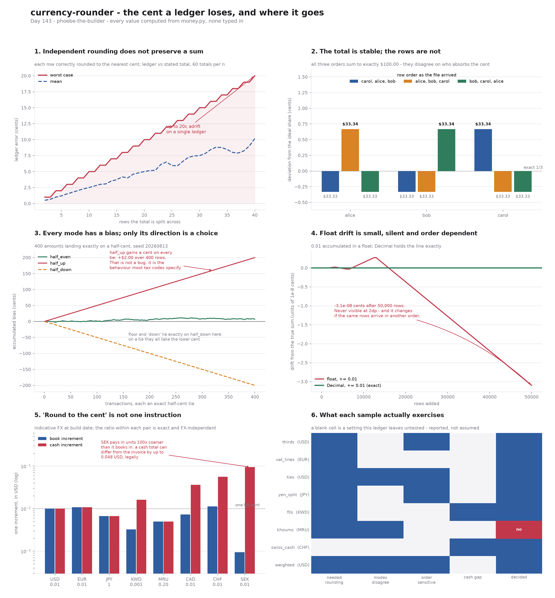

# Currency Rounder

[](https://colab.research.google.com/github/phoebefu6/phoebe-the-builder/blob/main/data-engineering-pro/currency-rounder/demo.ipynb)
[](https://mybinder.org/v2/gh/phoebefu6/phoebe-the-builder/main?labpath=data-engineering-pro/currency-rounder/demo.ipynb)

> A rounding function returns a number. It cannot return the fact that the rows no longer add up. Round every line of a ledger correctly, to the nearest cent, with the mode your language hands you by default, and the ledger can still be a cent short of its own total. No row is wrong. Nothing raises. And the error is perfectly reproducible, so a re-run reconciles against itself and agrees.

**Day 143 - Data Engineering Pro.** A money-rounding module that allocates instead of rounding independently, and separates three verdicts: **exact** (nothing was rounded away), **reconciled** (a residual existed, and the rows that absorbed it are named), **irreconcilable** (the stated total is not payable in this currency, so no set of rows can sum to it). Plus the four things a rounding call will not tell you: which row the cent landed on and why, which mode the jurisdiction requires, whether the amount exists in the currency, and whether the number you rounded was the number you typed.



## Business Impact

- **Before:** a billing job computes each line as `round(qty * unit_price * (1 + tax), 2)` and writes the invoice total as the sum. Finance reconciles the invoice total against the payment file every night and it matches, because both sides run the same code. Once a quarter a customer disputes a line by a cent, and once a year the revenue account and the tax account differ by an amount nobody can trace to a transaction.
- **After:** the residual is computed explicitly, allocated to named rows, and reported; a ledger whose stated total does not exist in its currency is refused rather than rounded into agreement; and the settings the ledger never exercised are listed as gaps rather than passed silently.
- **Estimated ROI:** on the bundled 8-ledger corpus, **eleven** distinct failure modes each produce a plausible money figure and **all eleven are silent** - none raises. **One of the 8 ledgers has no correct answer at all.** One ledger changes which row is charged depending on how the input file was sorted, while the total stays right to the cent.

## What it does

Eight mechanisms. Every number below is printed by `evidence.py`.

### 1. Every row is correctly rounded. The rows do not add up.

A $100.00 refund, split three ways:

```
row      exact share                   rounded    error
------------------------------------------------------------------------------
alice    33.33333333333333333333333      33.33 -0.00333333333333333333333333
bob      33.33333333333333333333333      33.33 -0.00333333333333333333333333
carol    33.33333333333333333333333      33.33 -0.00333333333333333333333333
------------------------------------------------------------------------------
sum      100.000000...                   99.99    -0.01
stated                                  100.00
------------------------------------------------------------------------------
```

Nothing here is a mistake. `33.3333...` really is nearer to `33.33` than to `33.34`, so every individual answer is right and the set of them is wrong. **Rounding is correct per row and not closed over addition.**

The fix is not a better mode. It is to stop rounding rows independently and **allocate**: give each row its floor, then hand the leftover increments to the rows with the largest remainders. The sum is exact by construction:

```
parts   ['33.34', '33.33', '33.33']   sum 100.00
absorbed by ['alice'] (1 increment)
verdict reconciled: independent rounding missed the total by -0.01 (-1 increment(s));
                    reallocated so the rows sum exactly
```

Worst case grows with row count - a 40-way split of a single total lands up to **20 cents** from it (panel 1).

### 2. The total is stable. The rows are not.

All three remainders in that split are equal, so *nothing in the data* says which row should absorb the cent. Position decides. Which means a sort moves money between rows:

```
order                      alice       bob     carol        sum
------------------------------------------------------------------------------
as entered                 33.33     33.33     33.34     100.00
sorted by name             33.34     33.33     33.33     100.00
reversed                   33.33     33.34     33.33     100.00
------------------------------------------------------------------------------
```

Every order sums to `100.00` exactly. No two orders agree on who paid it. The same on a weighted 25/25/50 cost allocation of $1000.02, where the two equal departments tie:

```
order                      north     south      east        sum
------------------------------------------------------------------------------
as entered                250.01    250.00    500.01    1000.02
reversed                  250.00    250.01    500.01    1000.02
------------------------------------------------------------------------------
```

A month-on-month variance report on `north` shows a $0.01 movement that is entirely an artefact of the sort order of the input file. So `Allocation` carries `tie_broken` and `order_sensitive` flags, and the UI says so in words: the tie-break is a **preference**, not a finding, and a preference that is not reported is indistinguishable from a result.

### 3. The default is not the law

Python's `round()`, `Decimal`'s default context and IEEE 754 all use **round-half-to-even**. Most tax authorities, and Excel's `ROUND()`, use **round-half-up**. They disagree on exactly half of all ties:

```
amount       cent units   half_even   half_up   agree
------------------------------------------------------------------------------
1.005             100.5        1.00      1.01      NO
1.015             101.5        1.02      1.02     yes
1.025             102.5        1.02      1.03      NO
1.035             103.5        1.04      1.04     yes
------------------------------------------------------------------------------
sum                            4.08      4.10
------------------------------------------------------------------------------

decimal default context rounding: ROUND_HALF_EVEN
round(0.5) = 0   round(1.5) = 2   round(2.5) = 2
```

`half_even` has near-zero bias over many rows, which is why it is the numerical default. `half_up` has a deliberate upward bias, which is why tax codes specify it. Over 400 tie-valued transactions the two diverge by **$2.00** (panel 3) - each mode's bias is a straight line, and only its slope is a choice.

There is a third property neither name advertises: whether a charge and its own refund cancel.

```
mode            +0.005    -0.005   sums to 0
------------------------------------------------------------------------------
half_even         0.00     -0.00         yes
half_up           0.01     -0.01         yes
half_down         0.00     -0.00         yes
ceiling           0.01     -0.00          NO
floor             0.00     -0.01          NO
down              0.00     -0.00         yes
------------------------------------------------------------------------------
```

Under an "always round up in our favour" policy, issuing a charge and then its exact refund leaves a cent behind **per transaction, permanently** - and the books balance on both days.

### 4. The float you rounded is not the number you typed

```
literal    the float actually holds
------------------------------------------------------------------------------
0.1        0.10000000000000000555111512312578270211815834045410
2.675      2.67499999999999982236431605997495353221893310546875
1.005      1.00499999999999989341858963598497211933135986328125
0.5        0.5
------------------------------------------------------------------------------

literal     round(float,2)   Decimal half_up   agree
------------------------------------------------------------------------------
2.675                 2.67              2.68      NO
1.005                  1.0              1.01      NO
0.145                 0.14              0.15      NO
8.835                 8.84              8.84     yes
1.115                 1.11              1.12      NO
------------------------------------------------------------------------------
```

`round(2.675, 2) == 2.67` looks like a rounding-mode bug and is not one. The float nearest `2.675` is *below* it, so at that value **there is no tie to break** - switching to `half_up` changes nothing, because `half_up` only fires on ties and this was never one. Reaching for a rounding mode is treating the wrong layer; the fix is to not be in binary floating point.

And the sum that will not settle:

```
sum([0.1] * 10)         = 0.9999999999999999
0.1 + 0.2               = 0.30000000000000004
Decimal('0.1') * 3      = 0.3
0.01 added 10,000 times = 100.00000000001425  (want 100.0, off by 1.43e-11)
```

At 2 decimal places that drift is invisible forever. It becomes visible only when the ledger is compared against a system that used `Decimal` - and it **changes when the same rows arrive in a different order**, because float addition is not associative (panel 4).

### 5. Rounding does not commute

Tax rounded per line then summed, versus lines summed then taxed then rounded once:

```
21% VAT, three lines                per-line 10.84   invoice-level 10.84   agree
17.5% on three 10c lines            per-line  0.06   invoice-level  0.05   DIFFER by 0.01
8.25% on seven identical lines      per-line  5.74   invoice-level  5.77   DIFFER by -0.03
```

The first basket agrees. That is what makes it dangerous: the disagreement is **intermittent**, so a test written against one basket passes and the next basket is short. Both answers are defensible - the printed invoice must show a payable amount per line, while a tax return applies one rate to one base. EU VAT rounding is set per member state rather than harmonised by the Directive, so which one is "correct" is a jurisdiction question, not an arithmetic one.

Discount and tax, in the two possible orders (15% off, 8.25% tax):

```
   gross   discount->tax   tax->discount    delta
------------------------------------------------------------------------------
   19.99           18.39           18.39     0.00
    9.95            9.16            9.15     0.01
    4.49            4.14            4.13     0.01
   12.34           11.36           11.36     0.00
   77.77           71.55           71.56    -0.01
    1.11            1.02            1.02     0.00
------------------------------------------------------------------------------
```

Three of six prices are unaffected, which is exactly how this reaches production.

And rounding twice is not rounding once - which any pipeline storing an intermediate at higher precision and rounding again at report time is doing:

```
value          ->2dp   ->3dp->2dp   ->4->3->2
------------------------------------------------------------------------------
2.4449          2.44         2.45        2.45
1.2349          1.23         1.24        1.24
0.4449          0.44         0.45        0.45
9.9949          9.99        10.00       10.00
------------------------------------------------------------------------------
```

A value below a tie is carried *onto* the tie by the earlier step and then over it.

### 6. Two decimal places is an assumption, and ISO 4217 does not share it

```
code    exp  book step  cash step note
------------------------------------------------------------------------------
USD       2       0.01       0.01 the assumed default
JPY       0          1          1 no minor unit; a 'cent' of JPY does not exist
KWD       3      0.001      0.005 1000 fils; smallest coin is 5 fils
CHF       2       0.01       0.05 books in rappen, pays in 5-rappen coins
SEK       2       0.01          1 ore coins withdrawn; cash rounds to the krona
CAD       2       0.01       0.05 penny withdrawn 2013; cash rounds to a nickel
MRU       2       0.20       0.20 5 khoums to the ouguiya: a fifth, not a hundredth
CLF       4     0.0001          - unidad de fomento, an index unit: 4 decimals
------------------------------------------------------------------------------
```

What a hardcoded `round(x, 2)` does to each:

```
code         amount   round(x,2)  payable? what broke
------------------------------------------------------------------------------
KWD        125.4567       125.46       yes 2dp is coarser than the 5-fils coin
JPY         1234.50      1234.50        NO invented a half-yen; no coin exists
MRU            6.13         6.13        NO 0.13 is not a khoums multiple
CLF         38.1234        38.12       yes index unit truncated from 4dp to 2dp
USD        125.4567       125.46       yes fine, which is why nobody notices the others
------------------------------------------------------------------------------
```

MRU and MGA are the sharp case. ISO 4217 gives them **exponent 2**, so a schema generated from the exponent stores two decimals and a validator generated from the exponent accepts `6.13`. But the ouguiya divides into **5** khoums, not 100 - the only legal cents are `.00 .20 .40 .60 .80`. The exponent describes *how many digits are printed*, not *which amounts exist*, and every tool that conflates the two accepts unpayable money.

So `Currency` carries `step` separately from `exponent`, `quantize()` rounds to a **multiple of step** rather than to a number of decimal places, and there is a third verdict for totals that no set of payable rows can reach:

```
ledger 'khoums' -> irreconcilable
stated total 19.10 is not a multiple of 0.20 in MRU; no set of payable rows sums to it
```

That is refused rather than repaired. The honest resolution is to ask the sender what amount they meant.

### 7. The books and the till settle at different totals, and both are right

A Swiss cafe bill:

```
  coffee         4.20
  pastry         3.55
  water          2.18
------------------------------------------------------------------------------
  invoice        9.93  (payable in the books, CHF 0.01)
  cash due       9.95  (smallest coin is 5 rappen)
  difference     0.02  goes to a rounding account, not to a line
------------------------------------------------------------------------------

code      invoice       cash      gap
------------------------------------------------------------------------------
CHF          9.93       9.95     0.02
CAD          9.93       9.95     0.02
SEK         99.40         99    -0.40
KWD       143.691    143.690   -0.001
USD          9.93       9.93        0   book and cash are the same unit
------------------------------------------------------------------------------
```

The invoice is not wrong and the cash is not wrong. A reconciliation that insists they match will chase a difference that is supposed to be there. SEK is the extreme: it pays in units **100x coarser** than it books in, so a cash total can legally sit up to half a krona from the invoice - and the card payment of the same basket settles at the invoice figure, so **the same basket costs a different amount depending on how it was paid**.

### 8. The ledger

```
ledger       cur   verdict               gap absorbed     naive pipeline
------------------------------------------------------------------------------
thirds       USD   reconciled          -0.01 alice        silent
vat_lines    EUR   reconciled           0.00 mouse,hub    silent
ties         USD   reconciled           0.00 a,b          silent
yen_split    JPY   reconciled             -1 east         silent
fils         KWD   reconciled          0.000 consulting   silent
khoums       MRU   irreconcilable      -0.10 -            silent
swiss_cash   CHF   exact                0.00 -            silent
weighted     USD   reconciled          -0.01 north        silent
------------------------------------------------------------------------------

7 of the 8 ledgers are decided by their own contents.
1 is not: the stated total does not exist in its currency.
```

```
failure mode                           sample       effect
------------------------------------------------------------------------------
rows rounded independently             thirds       ledger short $0.01
penny placed by row position           weighted     $0.01 variance from a sort
half_even where law says half_up       ties         4 rows, $0.02 apart
float literal rounded                  2.675        rounds down off a non-tie
float accumulation                     0.01 x 10000 1.4e-11 drift, order dependent
line tax vs invoice tax                vat_lines    return disagrees with invoice
rounding twice                         2.4449       2.45 instead of 2.44
discount before/after tax              19.99        $0.01 per order
round(x, 2) on a 3dp currency          fils         exact amount unstorable
exponent read as subdivision           khoums       unpayable amount accepted
book total compared to cash            swiss_cash   CHF 0.02 permanent difference
------------------------------------------------------------------------------
```

Every one is **silent**. None raises. And all of them are **reproducible** - re-running the job produces the same wrong number, so a reconciliation against yesterday agrees. That is why these survive: the failure is stable, and stability reads as correctness. A one-off error gets found because someone notices the number moved. These never move.

`yen_split` is worth its own line. The same three-way split in JPY leaves a residual of **1 yen** rather than 1 cent - a whole unit, 1% of the row. Rounding error is denominated in the currency's minor unit, so the same code carries a different magnitude of error per market, and the market where it is largest is the one whose currency has no minor unit at all.

## Tech Stack

Python 3.9+, Streamlit, Docker. **`money.py` has no dependencies beyond the standard library** - `decimal`, `fractions`, `dataclasses`, `typing`. No `float` anywhere in the allocation path: shares are computed as exact `Fraction`s over integer increments, so a 1/3 split of $1,000,000 lands exactly rather than nearly. 633 lines of core, 304 lines of tests, 188 assertions. pandas appears only in the Streamlit app; numpy and matplotlib only in the figure.

The three verdicts are the API. `reconcile()` returns `exact` / `reconciled` / `irreconcilable` with the residual, the naive per-row rounding it is replacing, and the rows that absorbed the difference. `allocate()` guarantees `sum(parts) == total` and **refuses** rather than approximating when the total is not payable, or when weights are negative - largest-remainder is defined for non-negative shares, so a credit line mixed into a debit allocation is an error, not a rounding question.

## Demo

**[Run the interactive demo notebook →](demo.ipynb)** - pre-rendered with all outputs and the six-panel figure, or click the Colab/Binder badges above to run it live. The notebook writes `money.py`, `evidence.py` and `make_chart.py` to disk from base64-embedded source, so it is self-contained without a clone step and there is no second copy of the logic to drift.

For the Streamlit app:

```bash
pip install -r requirements.txt
streamlit run app.py
```

Reproduce every number above:

```bash
python3 test_money.py    # 188 assertions over the core
python3 evidence.py      # every table in this README
python3 make_chart.py    # the six-panel audit figure
```

## Files

| file | what it is |
|---|---|
| `money.py` | `Currency`, `quantize`, `is_payable`, `allocate`, `reconcile`, `tax_line_level` / `tax_invoice_level`, `chain_round`, `audit`, 12-currency table, 8-ledger corpus |
| `evidence.py` | the eight experiments this README quotes, each isolating one mechanism |
| `test_money.py` | 188 assertions, including the claim that a decided verdict always sums exactly |
| `app.py` | Streamlit UI - verdict first, caveats second, table last |
| `make_chart.py` | the six-panel audit figure |
| `build_notebook.py` | generates `demo.ipynb` with all three modules embedded |

The UI order is deliberate, and it is the same rule the `csv-dialect-sniffer` build landed on: **a table rendered above the caveats reads as the answer.** So the verdict banner is at the top, "what this ledger does not settle" sits above the dataframe, and the reconciled column is labelled as reconciled rather than presented as the amounts.

One note on the tests worth stealing: they assert **structural** facts - this allocation sums exactly, this ledger is irreconcilable, this mode is symmetric, this setting was never exercised - and never assert what a particular CPython's `round()` or float repr returns. Those live in `evidence.py`, where they are the finding rather than the expectation, so a CPython change breaks the write-up and not the suite. The strongest test in the file asserts a **negative**: that no ledger under any mode ever returns a decided verdict whose rows do not sum to the stated total. If a decided verdict could still be short, the verdict would be decoration.

## Learning Connection

Built while reading IEEE 754 on default rounding (round-to-nearest-ties-to-even, and why a numerical default is a *statistical* choice rather than a legal one), the `decimal` module's context and rounding-mode semantics, ISO 4217 on currency exponents and the currencies whose real subdivision is not a power of ten, and largest-remainder apportionment - the same method used for legislative seat allocation, where the tie-break rule is written into law precisely because everyone understood it is not derivable from the data.

Applies: allocate-then-report instead of round-then-hope, exact rational arithmetic over integer minor units, naming the tie-break rather than burying it, refusing an input that has no correct answer instead of returning the nearest plausible one, and reporting which settings a given input left untested.

## Impact Note

- **Who benefits:** anyone writing billing, invoicing, payroll, tax, commission splits, refunds, revenue recognition, cost allocation, or FX settlement - and especially anyone doing it across more than one currency or more than one jurisdiction.
- **Potential risks:** this reports and allocates; it is not an accounting system and it is not tax advice. The currency table is **12 entries, hand-verified**, not the ~180 ISO 4217 assigns - an unknown code raises rather than guessing an exponent, which is the intended behaviour but means the table must be extended before use in a new market. Cash increments and the MRU/MGA fifth are correct as of the build date and are **policy, not mathematics**: countries change them (Canada in 2013, Sweden in 2010), so this data ages and a stale table is worse than no table. `allocate()` implements largest remainder with ties to the earlier index; other defensible methods (d'Hondt, Sainte-Laguë, random tie-break, always-charge-the-largest-line) give different rows different pennies and none of them is more correct - if your jurisdiction or contract specifies one, use that one. Negative weights are refused rather than handled, so mixed debit/credit allocations need splitting by sign first. The line-vs-invoice tax question is surfaced, not answered, because the answer is jurisdictional. And the deepest limit is the one the `khoums` ledger demonstrates: when a stated total does not exist in its currency, no amount of analysis produces the right answer - the resolution is to go back to whoever wrote the number, not to tune the rounding until it agrees with what you already wanted.

---

Part of [phoebe-the-builder](https://github.com/phoebefu6/phoebe-the-builder) - Day 143, Data Engineering Pro.
