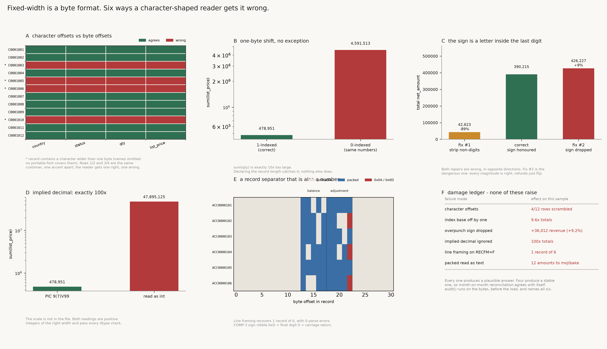

# Fixed-Width Parser

[](https://colab.research.google.com/github/phoebefu6/phoebe-the-builder/blob/main/data-engineering-pro/fixed-width-parser/demo.ipynb)
[](https://mybinder.org/v2/gh/phoebefu6/phoebe-the-builder/main?labpath=data-engineering-pro/fixed-width-parser/demo.ipynb)

> Reading a fixed-width file is one line: `pd.read_fwf(path, colspecs=...)`. That line decodes the record to a string and then slices it by *character* position. A fixed-width record is defined in *bytes*. On ASCII data the two are the same number, which is why the sample file passes, the tests pass, and the first customer with an umlaut in their name quietly moves every field after their name one column to the left - on their row only.

**Day 138 - Data Engineering Pro.** Byte-accurate flat-file parsing with the five things that decide whether a legacy record loads correctly turned into named parameters - index base, encoding, framing, sign convention, decimal scale - plus a pre-flight audit that runs on the raw bytes and reports a verdict before anything is parsed.



## Business Impact

- **Before:** a monthly customer master and an account balance extract arrive from a mainframe. Someone writes a `read_fwf` call from a column spec pasted out of a data dictionary, spot-checks the first five rows, and ships it. The spec is 1-indexed; `colspecs` is 0-indexed. The amounts are `PIC S9(7)V99` with the sign punched into the last digit. The balances are COMP-3. None of that is visible in a `head()`.
- **After:** the layout states its own conventions, the parse slices bytes, money lands as `Decimal`, and `audit()` names every hazard in the file before the load runs.
- **Estimated ROI:** on the bundled 12-record sample, **six** distinct failure modes each produce a plausible answer and **none of them raise**. Four produce a *stable* wrong answer, so a month-on-month reconciliation agrees with itself. The revenue column comes out **+9.2%** or **-89%** depending on which of the two obvious repairs you reach for; the price column comes out **exactly 100x**; a one-byte index shift makes every total **~10x**.

## What it does

Six mechanisms, in the order they bite.

### 1. Fixed-width means fixed *bytes*

Two records in the sample are the same customer twice - `Zoe Ahlstrom AB` and `Zoë Ahlström AB` - and two more are `Muller Werke` and `Müller Werke`. That is the control. A reader that gets the transliterated row right and the correctly-spelled row wrong is failing on the encoding, not on the layout:

```
 row  name                country        qty      reader
------------------------------------------------------------------------------
   1  Zoe Ahlstrom AB          SE         40       bytes
                               SE         40       chars
   2  Zoë Ahlström AB          SE         40       bytes
                               A0       4000       chars   <- diverges
   3  Muller Werke             DE        305       bytes
                               DE        305       chars
   4  Müller Werke             DE        305       bytes
                               EH       3050       chars   <- diverges
   5  陈晓贸易                 CN        900       bytes
                                1      23000       chars   <- diverges
------------------------------------------------------------------------------
character slicing is correct on 8 ASCII rows and wrong on 4 wide rows
rows with at least one wrong field: [2, 4, 5, 9]
```

`country` for the CJK row comes back as `1` - a digit borrowed from the middle of the amount field, eight bytes downstream. The failure is per-record and data-dependent, so it does not show up as a broken column. It shows up as four bad rows in a table of twelve, and the other eight are fine.

`audit()` counts this before you parse, because the check is cheap and exact - a record whose byte length differs from its decoded character length is precisely a record a character slicer will misalign:

```
WARNING 4 of 12 record(s) contain multi-byte characters. Byte offsets and character
        offsets differ on those records only, so a character-slicing reader misaligns
        every field after the first wide character - in 4 rows out of 12,
        data-dependent and invisible in a head()
```

### 2. The index base, which is not inferable from the numbers

Copybooks, data dictionaries and every hand-written column spec are **1-indexed and inclusive**. `pandas` `colspecs` are **0-indexed and half-open**. The numbers look the same either way. Reading the wrong one shifts every field one byte left - each field drops its last byte and borrows the previous field's:

```
measure                              correct           shifted     ratio
------------------------------------------------------------------------------
sum(qty)                               2,293            22,930    10.000
sum(list_price)                   478,951.25      4,591,512.72     9.587
parse errors raised                        1                28
------------------------------------------------------------------------------
```

Ten times. The signature of a lost trailing digit. Twenty-eight field errors sound like a lot until you notice they are all in the date and text fields; every numeric column parsed cleanly and is wrong.

`index_base` is a required argument on `RecordSpec` for exactly this reason. There is one other cheap defence, and it is the closest thing a flat file has to a checksum - declare the record length too:

```
SpecError: ERROR length: fields span 63 bytes, declared record length is 62
```

One integer, and every whole-record shift, dropped filler field and half-edited copybook stops being silent.

### 3. The minus sign is a letter inside the last digit

`PIC S9(7)V99 DISPLAY` punches the sign into the final digit. `+24500.00` is `00245000{`; `-1425.30` is `00014253}`. Identical magnitude, one byte apart. `int()` refuses the column, so it arrives as text, so somebody repairs it - and both obvious repairs are wrong, in opposite directions:

```
customer     bytes on disk       int()        fix #1        fix #2       correct
------------------------------------------------------------------------------
C0001001         00245000{  ValueError      2,450.00     24,500.00     24,500.00
C0001002         00081005{  ValueError        810.05      8,100.50      8,100.50
C0001007         00009800}  ValueError         98.00        980.00       -980.00
C0001011         00156007N  ValueError      1,560.07     15,600.75    -15,600.75
------------------------------------------------------------------------------
  fix #1 = regex out the non-digits.   fix #2 = decode the digit, drop the sign.

reading                                   total net_amount       error
------------------------------------------------------------------------------
byte-accurate, sign honoured                    390,215.20           -
fix #1: non-digits stripped                      42,622.72      -89.1%
fix #2: magnitude kept, sign dropped            426,227.30        9.2%
------------------------------------------------------------------------------
```

Fix #1 looks like it only strips punctuation. It does not: the overpunch character **is** the final digit, so removing it removes a significant figure and the column comes out a tenth of its true size. Fix #2 is the competent half - every magnitude is right - and is therefore the dangerous one. 3 of 12 rows are negative, worth `-18,006.05`, and flipping them overstates revenue by `36,012.10`, **exactly twice the negative balance**. Refunds, credit notes and reversals do not vanish under fix #2. They flip. The error is 2x the thing the report was built to watch.

Declared as `Int()`, the parser refuses rather than guessing, and the audit says why:

```
WARNING field net_amount is declared Int but 12 value(s) carry an overpunch sign, 3 of
        them negative. Declared unsigned, those 3 row(s) flip - and the sign character
        is also the final digit, so removing it as punctuation loses a significant
        figure too
```

### 4. Implied decimal: the scale is not in the file

`PIC 9(7)V99` stores `26000.00` as `002600000`. There is no decimal point anywhere in the record and nothing to detect:

```
 row   bytes on disk     read as int     PIC 9(7)V99
------------------------------------------------------------------------------
   0       002600000       2,600,000       26,000.00
   3       006200000       6,200,000       62,000.00
   5       018500000      18,500,000      185,000.00
------------------------------------------------------------------------------
sum, read as int                  47,895,125
sum, scale honoured               478,951.25
ratio                                    100x
```

Both readings are positive integers of the correct width. Both pass a null check, a positivity check and any dtype assertion you care to write. Scale is metadata, and if it is not in the layout it does not exist anywhere.

### 5. A record separator that is also a number

COMP-3 packed decimal stores two digits per byte with the sign in the final nibble: `0xC` positive, `0xD` negative. So **any negative amount whose last digit is 0 ends in the byte `0x0D`** - a carriage return. `-1234.50` packs to `00 01 23 45 0D`.

The account-balance sample is RECFM=F: fixed-length records, no separator byte at all, 186 bytes = 6 x 31. Split it on line breaks anyway:

```
framing        records    parse errors     total balance
------------------------------------------------------------------------------
block                6               0      1,346,587.06
lines                1               0         18,420.55
------------------------------------------------------------------------------

  record  acct        adjustment bytes    contains
------------------------------------------------------------------------------
       1  ACC0000102  000123450d          0x0D CR
       3  ACC0000104  000030010d          0x0D CR
       5  ACC0000106  000000990d          0x0D CR
------------------------------------------------------------------------------
```

One record instead of six, zero parse errors, and a total that is a real balance for a real account. Nothing anywhere reports a problem. It is not a corrupt file; it is a correct file read by something that assumes text. The same byte is what an FTP transfer in ASCII mode rewrites, which destroys the value on the wire before any parser sees it.

`frame_records(..., "auto")` picks block framing when the layout declares a packed field and the stream divides evenly, and says so.

### 6. "It decoded without errors" is not evidence

latin-1 maps all 256 byte values to a character. It never raises. Point it at COMP-3 and the column loads, has the declared width, contains no nulls and passes a not-null check:

```
acct          balance (packed)           hex     as latin-1 text
------------------------------------------------------------------------------
ACC0000101           18,420.55    001842055c       '\x18B\x05\\'
ACC0000102              902.10    000090210c         '\x90!\x0c'
ACC0000103              -45.99    000004599d         '\x04Y\x9d'
ACC0000104        1,250,000.00    125000000c '\x12P\x00\x00\x0c'
------------------------------------------------------------------------------
latin-1 errors: 0   utf-8 errors: 3
```

Under utf-8 the same bytes raise, which is the more useful outcome. And the damage is not recoverable afterwards: two digits per byte means the character view has already lost the nibble boundaries. There is no downstream cleaning step for this one.

### The ledger

```
failure mode                  effect on this sample                raises?
------------------------------------------------------------------------------
character offsets             4/12 rows scrambled                   silent
index base off by one         9.587x totals                         silent
overpunch sign dropped        +36,012.10 revenue (+9.2%)            silent
implied decimal ignored       100x totals                           silent
line framing on RECFM=F       1 record instead of 6                 silent
packed read as latin-1 text   12 amounts to mojibake                silent
------------------------------------------------------------------------------
```

All six produce a plausible wrong answer with no exception anywhere. That is the argument for a pre-flight audit on the bytes: **the failures that raise are the ones that were never going to ship.**

## Tech Stack

Python 3.10+, Streamlit, Docker. **`fwf.py` has no dependencies beyond the standard library** - no pandas, no numpy, no third-party parsing library. 757 lines of core, 455 lines of tests holding it to every claim above. pandas appears only in the Streamlit app; numpy and matplotlib only in the figure.

Field kinds: `Text`, `Int`, `Implied(scale)`, `Overpunch(scale, leading=)`, `Packed(scale)` (COMP-3), `Date(fmt)`. Framing: `lines`, `block` (RECFM=F), `auto`. Encodings: anything Python has a codec for, including `cp037` for real EBCDIC.

## Demo

**[Run the interactive demo notebook →](demo.ipynb)** - pre-rendered with all outputs and the six-panel figure, or click the Colab/Binder badges above to run it live. The notebook writes `fwf.py` and `evidence.py` to disk from embedded source, so it is self-contained without a clone step and there is no second copy of the logic to drift.

For the Streamlit app:

```bash
pip install -r requirements.txt
streamlit run app.py
```

Reproduce every number above:

```bash
python3 test_fwf.py     # 46 tests over the core
python3 evidence.py     # every table in this README
python3 make_chart.py   # the six-panel audit figure
```

## Files

| file | what it is |
|---|---|
| `fwf.py` | field kinds, `RecordSpec`, framing, byte-accurate `parse`, `parse_naive`, `audit` |
| `evidence.py` | the six experiments this README quotes, each isolating one mechanism |
| `test_fwf.py` | 46 tests, including the overpunch round-trip and the 0x0D-in-COMP-3 claim |
| `app.py` | Streamlit UI - verdict first, layout second, rows third, character-slice comparison last |
| `make_chart.py` | the six-panel audit figure |
| `build_notebook.py` | generates `demo.ipynb` with both modules embedded |

Two implementation notes worth stealing. **Money never becomes a `float`.** A flat file stores cents as integers, which is exact; converting that to binary floating point on the way in throws the exactness away for nothing, and `Decimal` costs you nothing at flat-file volumes. And **the notebook embeds each module as a JSON-encoded string literal, not a triple-quoted block** - both modules contain docstrings, so any triple-quote wrapper terminates early and the notebook fails to parse in a way that looks like a corrupt file.

## Learning Connection

Built while reading the IBM COBOL language reference on `PIC` clauses, `USAGE COMPUTATIONAL-3` and sign representation, and the `z/OS` documentation on `RECFM` record formats.

Applies: byte-level record parsing, BCD/nibble decoding, zoned-decimal sign conventions, encoding-boundary reasoning, exact decimal arithmetic, and pre-flight data contract validation as a distinct step from parsing.

## Impact Note

- **Who benefits:** anyone ingesting mainframe extracts, bank and card settlement files (many are still fixed-width), clearing-house and regulatory returns, legacy ERP exports, EDI-adjacent flat files, or any "we'll just `read_fwf` it" pipeline.
- **Potential risks:** the audit reports hazards, it does not repair them - a `WARNING` on a short record still leaves you to decide whether the row is usable, and nothing here can tell you the scale of a field the layout omits. `auto` framing is a heuristic and is wrong for a file that is both newline-delimited *and* contains packed fields; state the framing when you know it. The overpunch table implemented here is the common ASCII-exported convention, and genuine EBCDIC-native files carry the sign in the zone nibble rather than as `{`/`}` characters - decode with `cp037` first in that case. The COMP-3 sign nibbles `0xA`/`0xB`/`0xE` are accepted as valid because they appear in the wild, but they are not what a modern compiler emits, and a file full of them is a signal worth chasing rather than a file to load. And the deepest limitation is not technical: a layout is a contract with a system that in most cases no longer has anyone maintaining it. This tool makes the conventions explicit and checkable. It cannot tell you that the producer changed one last quarter.

---

Part of [phoebe-the-builder](https://github.com/phoebefu6/phoebe-the-builder) - Day 138, Data Engineering Pro.
