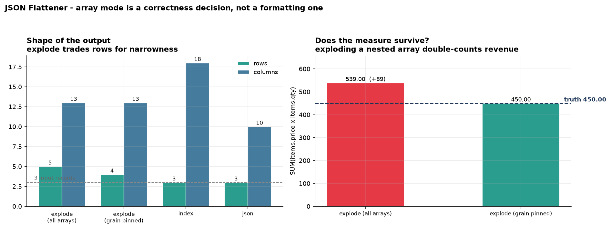

# JSON Flattener

[](https://colab.research.google.com/github/phoebefu6/phoebe-the-builder/blob/main/data-engineering-pro/json-flattener/demo.ipynb)
[](https://mybinder.org/v2/gh/phoebefu6/phoebe-the-builder/main?labpath=data-engineering-pro/json-flattener/demo.ipynb)

> Every API response is nested. Every warehouse table is flat.

The gap gets closed by hand-written, one-off unnesting code that breaks the first time a field goes missing or an array changes length. This turns nested JSON into dot-path columns and takes an explicit position on the two decisions that actually break pipelines - **arrays** and **missing keys** - then emits a type-inferred `CREATE TABLE` so the flattened shape can be landed, not just looked at.



## Business Impact
- **Before:** bespoke unnesting per payload, re-written whenever the producer adds a field. Silent wrong numbers when an array is nested inside another array.
- **After:** one flattener with a named grain, a ragged-path report, a type-conflict report, and a DDL. The row multiplier is reported, so fan-out can't happen quietly.
- **Estimated ROI:** on a **three-record** sample the naive default overstated revenue by 20%. At warehouse scale that is a metric nobody can reconcile and nobody can find.

## Tech Stack
Python (stdlib `json`) · pandas · Streamlit · matplotlib - fully offline, no schema registry required

## Key insight
**Array mode is a correctness decision, not a formatting preference.**

Flatten the sample orders with the most natural default - explode every array - then sum revenue:

| Mode | Rows (from 3) | Columns | `SUM(price × qty)` |
|---|---|---|---|
| `explode` all arrays | 5 | 13 | **539.00** ❌ (+89.00) |
| `explode`, grain pinned to `items` | 4 | 13 | **450.00** ✅ |
| `index` | 3 | 18 | array becomes `items.0.*`, `items.1.*` |
| `json` | 3 | 10 | array kept whole |

The order item `KB-01` appears **twice**, identically - once per each of its two `tags`. Exploding the nested `items.tags` array multiplied its parent's rows, so the item's price was counted twice. Nothing errored, no null appeared, and the row count rose by a plausible-looking amount. This is the most common silent bug in hand-rolled unnesting, and it's invisible unless you happen to reconcile against the source.

So the flattener detects it structurally: **two exploded paths where one is a prefix of the other is a cross join.** `stats.fanout_warning` says so in words and names the fix (`explode_paths=["items"]`), which pins the grain and keeps `tags` as queryable JSON.

Two smaller positions worth carrying over:
- **Ragged records get a UNION of columns plus a count of what was missing.** An intersection would silently drop optional fields; an error would reject normal data. And the count is the signal - a path absent in 3 of 10,000 rows is an optional field; absent in 6,000 it's a schema change nobody mentioned.
- **`int` + `float` is a widening, not a conflict** (→ `DOUBLE`). A genuine conflict widens to `VARCHAR` **with an annotation** rather than rejecting rows, so the load succeeds and the problem stays visible in the DDL.

**Edge case handled:** an empty array keeps the record as a row with nulls in the array's columns (`explode_outer` semantics) instead of dropping it - and deliberately creates *no* scalar column for the array path itself, which would collide with the `items.sku` columns other records produce and leave a half-typed wart in the DDL.

## What it reports

```
3 records -> 4 rows (1.33x), 13 columns, depth 4
exploded: items
ragged paths:  items.tags (2 of 4)   channel (2 of 4)   customer.address.zip (1 of 4)
type conflicts: total -> float + str
```

Plus the DDL:
```sql
CREATE TABLE orders_flat (
  "order_id" VARCHAR NOT NULL,
  "customer.address.zip" VARCHAR,
  "items.sku" VARCHAR,
  "items.price" DOUBLE,
  "total" VARCHAR NOT NULL,  -- mixed: float,str
  ...
);
```

## Demo

**[Run the interactive demo notebook →](demo.ipynb)** - pre-rendered, including the reconciliation that catches the double-count. Or click the Colab/Binder badges.

Streamlit app (paste JSON, pick a mode, pin the grain, get rows + schema + DDL):
```bash
pip install -r requirements.txt
streamlit run app.py
```

CLI (all three modes plus the fan-out check):
```bash
python flatten.py
```

In a pipeline:
```python
from flatten import flatten, to_ddl
rows, stats = flatten(records, array_mode="explode", explode_paths=["items"])
assert not stats.fanout_warning, stats.fanout_warning
print(to_ddl(rows, "orders_flat"))
```

## Learning Connection
Built while studying warehouse ingestion patterns and semi-structured data handling.
Applies: recursive traversal, explode vs index trade-offs, `explode_outer` semantics, schema union over ragged records, type widening, and DDL generation.

Companions:
- **Day 98** [`schema-registry`](../schema-registry) - register the shape this infers
- **Day 2** [`schema-diff`](../../data-infra-toolkit/schema-diff) - catch it when the shape changes
- **Day 100** [`data-diff`](../../data-quality-governance/data-diff)

## Impact Note
- **Who benefits:** anyone landing API responses or event payloads in a warehouse; analysts who inherited a fact table with mysteriously inflated measures.
- **Potential risks:** `explode` mode multiplies rows, so a wide nested payload can blow up memory - this loads records in memory and is sized for batch, not for streaming multi-GB files. Type inference reads the batch you give it, so a rare variant in a later batch can still change the inferred type; treat the DDL as a starting point and pin it in a registry. The generated DDL is ANSI-flavoured (`BIGINT`/`DOUBLE`/`VARCHAR`) and quotes dot paths - some engines want different types or reject `.` in column names entirely, so review before running it.
