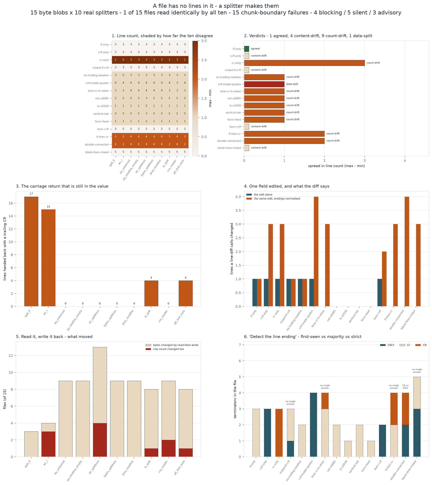

# Line-Ending Detector

[](https://colab.research.google.com/github/phoebefu6/phoebe-the-builder/blob/main/data-engineering-pro/line-ending-detector/demo.ipynb)
[](https://mybinder.org/v2/gh/phoebefu6/phoebe-the-builder/main?labpath=data-engineering-pro/line-ending-detector/demo.ipynb)

> A file has no lines in it. It has bytes. **Lines are produced by a splitter**, and every runtime ships a different one. `wc -l` counts LF bytes. Python's text mode rewrites CRLF and lone CR to LF *before your code sees the string*. `str.splitlines()` also breaks on vertical tab, form feed, NEL and U+2028. A CSV reader keeps a CRLF that sits inside quotes; `data.split(b"\n")` does not. So "how many lines is this file" has ten answers, "what is on line 2" has more, and "read it and write it back" is not the identity.

**Day 151 - Data Engineering Pro.** 15 byte blobs, 10 real splitters, 150 round-trip runs, 4 verdicts, 42 tests, and a notebook that rebuilds the splitters from scratch and asserts every headline count.



> **POSIX** defines a *line* as a sequence of characters ending in a newline; bytes after the last newline are an **incomplete line**, which is why git prints `\ No newline at end of file`.
> **Python** `open(newline=None)` (the default) is documented to translate `\r\n` and `\r` into `\n` on the way in - the translation happens before your first `if` statement.

## Business Impact

- **Before:** a partner's nightly CSV loads fine for a year. One month they switch export tools, the file arrives CRLF, and every value in the last column now ends with an invisible byte. `customer_id` still looks like `4471` in every log line. The join drops 12% of rows, the dashboard shows a dip, and three people spend a day on "the partner's data quality".
- **After:** the same bytes are pushed through 10 splitters. **10 of 15 files come back with a different line count depending on who reads them** - 0 to 3 lines for one of them. **40 lines across the corpus are handed back with a carriage return still on the end**, by 4 of the 10 splitters. **81 of 150 read-then-write runs change the bytes**, and in **11** of those the CSV row count moves afterwards, which means the rewrite landed *inside a value*.
- **Estimated ROI:** the audit runs in well under a second on a file. The number worth the time: **5 silent findings** against 4 blocking ones. A blocking one raises `ValueError`. A silent one is a row count that moved.

## Relationship to Days 146-150

Day 146 [`filename-sanitiser`](../../automation-suite/filename-sanitiser/) found the collisions a sanitiser creates, Day 147 [`duration-parser`](../../automation-suite/duration-parser/) the eight conforming readings of one string, Day 148 [`percent-recomputer`](../../analytics-engineering-bi/percent-recomputer/) that a percentage column is an apportionment, Day 149 [`header-casing`](../../automation-suite/header-casing/) that a field name is rewritten by hops you do not own, Day 150 [`sort-order-drift`](../sort-order-drift/) that `ORDER BY` returns an *undefined* order rather than a wrong one.

New ground here is that the disagreement is about **how many records exist**, and it happens before any parser runs. Day 150's tie made the order undefined but kept the rows; here the row count itself is a property of the reader. Everything downstream - a row-count reconciliation, a checksum, "we expected 4,000 records" - is measuring the splitter, not the file.

## What it does

Ten mechanisms, in thirteen sections of `evidence.py`. Every number below is printed by it.

### 1. One file, ten line counts

```
file                    split_lf      wc_l py_univer py_newlin str_split bytes_spl java_read  js_split csv_reade git_text_
cr-only                        1         0         3         3         3         3         3         1         3         1
no-trailing-newline            3         2         3         3         3         3         3         3         3         3
crlf-inside-quotes             4         4         4         4         4         4         4         4         3         4
lone-cr-in-value               3         3         4         4         4         4         4         3         3         3
nel-u0085                      2         2         2         2         3         2         2         2         2         2
double-converted               2         2         4         4         4         4         4         2         4         2
```

**10 of 15 files** get a different *count*, not a different interpretation. A classic-Mac CR-only export is **1 line** to `data.split(b"\n")`, **0 lines** to `wc -l`, and **3 lines** to every real reader.

### 2. Four verdicts

| verdict | meaning | count |
|---|---|---|
| `agreed` | same count, same bytes, from all ten | **1** of 15 |
| `content-drift` | same count, different bytes on the lines | 4 |
| `count-drift` | they do not agree how many lines there are | 9 |
| `data-split` | a terminator inside a value becomes a row | 1 |

Exactly **one file in fifteen** is read identically by every runtime here, and it is the boring one: LF, terminated, nothing exotic in a value. `content-drift` is the dangerous class - every count-based check passes, and the bytes are still different.

### 3. The carriage return that is still in the value

```
split_lf         17 lines handed back with a trailing CR   <-- CR-blind
wc_l             15                                        <-- CR-blind
js_split          4                                        <-- CR-blind
git_text_auto     4                                        <-- CR-blind
py_universal      0
py_newline_empty  0
str_splitlines    0
csv_reader        0
```

```
crlf-only, line 2:
  split_lf      b'1,Alice\r'
  py_universal  b'1,Alice'
  printed       1,Alice| vs 1,Alice|
  equal?        False
```

`int('2\r')` raises. `'Bob\r' == 'Bob'` is False. A `GROUP BY` sees two customers. And all of them print identically in a log line, an error message and a screenshot - which is why this costs a day rather than a minute.

### 4. When the terminator is the data

```
crlf-inside-quotes: id,note<CR><LF>1,"line one<CR><LF>line two"<CR><LF>2,plain<CR><LF>

  csv.reader    3 rows: ['id,note', '1,line one\r\nline two', '2,plain']
  py_universal  4 lines: ['id,note', '1,"line one', 'line two"', '2,plain']
```

Split first and parse second, and one row becomes two: the first truncated, the second short of columns. Both are valid CSV lines on their own, so nothing raises. `csv.reader` is the only splitter here that knows a quoted terminator is data.

### 5. And the other direction: `splitlines()` inventing rows

```
nel-u0085        splitlines 3, reader 2    (U+0085 NEL)
ls-u2028         splitlines 2, reader 1    (U+2028 in a JSON string)
vertical-tab     splitlines 3, reader 2    (VT in an address field)
form-feed        splitlines 2, reader 1    (FF as a page separator)
```

`str.splitlines()` breaks on LF, CR, CRLF, VT, FF, FS, GS, RS, NEL, U+2028 and U+2029. `bytes.splitlines()` uses a *different* subset - so `.decode()` before splitting changes the row count, which makes decoding a semantic operation rather than a formatting one.

### 6. Read it, write it back, compare the bytes

```
150 (file, splitter) runs
  bytes changed by the roundtrip:      81
  CSV row count changed afterwards:    11
```

The 11 are the ones that matter: a change at the end of a line is formatting, a change that moves the row count landed inside a value. Text mode is a transformation, not a read.

### 7. The diff that says every line changed

```
file                    edit alone    edit + normalise
lf-only                          1                   1
crlf-only                        1                   3   <-- whole file
crlf-inside-quotes               1                   4   <-- whole file
double-converted                 0                   4   <-- whole file
```

Same one-field edit in both columns; the right-hand one also normalises the endings, which is what `* text=auto` does the first time it is switched on. **8 of 15 files** show the whole file as changed. Review cost is the whole file, the real change is hidden inside it, and `git blame` now points at the conversion commit for every line.

### 8. `cat`, and the line that eats the next one

```
sum of the parts:  44 lines
concatenated:      43 lines
lost:              1
```

One file in the corpus ends without a terminator. Its last line is welded onto the first line of the next file, and the result parses cleanly. POSIX says a text file's last line ends with a newline; git says `\ No newline at end of file`; nothing enforces either.

### 9. A CRLF split across a read boundary

**15 (file, chunk size) combinations** where a naive chunked reader disagrees with a whole-file read. The reader is correct at most buffer sizes - it fails on the file that happens to be a few bytes longer, which is why it survives testing and breaks in production.

### 10. "Detect the line ending" has no answer for a third of these files

```
file                    CRLF   LF   CR   first  majority  strict
mixed-lf-crlf              1    2    0   LF     LF        mixed - refuses to answer
lone-cr-in-value           0    3    1   LF     LF        mixed - refuses to answer
double-converted           2    0    2   CR     CRLF      mixed - refuses to answer
blank-lines-mixed          3    2    0   CRLF   CRLF      mixed - refuses to answer
```

**5 of 15.** On `double-converted`, first-seen says `CR` and majority says `CRLF` - two published detection strategies, two different answers, same bytes. A detector that always returns a single terminator is reporting a summary as if it were a fact. The honest return value is the histogram.

### 11. Which splitters are interchangeable

Seven of the 45 pairs read all 15 files identically. The interesting one:

```
git_text_auto == js_split
```

Git's `text=auto` normalisation and JavaScript's `text.split(/\r?\n/)` agree on every file here - not because they are the same idea, but because they share the same blind spot: both handle CRLF and both leave a lone CR sitting inside the line.

## Findings

**4 blocking, 5 silent, 3 advisory.**

| severity | finding |
|---|---|
| 🔴 blocking | `split_lf` hands back 17 lines with a carriage return still on the end (4 splitters, 40 lines total) |
| 🔴 blocking | 1 file where a line terminator is data: `csv.reader` sees 3 rows, a line splitter sees 4 |
| 🔴 blocking | `str.splitlines()` finds more lines than a reader does in 4 files (VT, FF, NEL, U+2028) |
| 🔴 blocking | `cat` over these files loses 1 line: an unterminated file welds its last line onto the next file's first |
| 🟠 silent | 10 of 15 files get a different line count depending on the reader |
| 🟠 silent | 4 files where every splitter agrees on the count and not on the contents |
| 🟠 silent | read-then-write is not the identity in 81 of 150 runs; 11 move the row count |
| 🟠 silent | a one-field edit shows as 4 changed lines instead of 1 when the commit also normalises |
| 🟠 silent | a chunked reader disagrees with itself in 15 (file, chunk size) combinations |
| 🔵 advisory | `str.splitlines()` and `bytes.splitlines()` do not share a boundary set |
| 🔵 advisory | "detect the line ending" has no answer for 5 of 15 files |
| 🔵 advisory | the fix is on the write path, not the read path |

## The fix, in order of cost

1. **Read with `newline=''` and a real parser.** For CSV that is `csv.reader` over a file opened with `newline=''` - the combination the standard library documents, and the only one here that keeps a quoted terminator as data.
2. **Never `split('\n')` on a payload you did not write.** It is correct only for LF files, and it fails silently on the other two conventions.
3. **Never `splitlines()` on user-supplied text** you intend to treat as records. Eleven boundaries is a feature for source code and a bug for a name field.
4. **Write with one chosen terminator**, explicitly, and terminate the last line.
5. **Normalise once, in its own commit**, with `.gitattributes` committed alongside it - so the diff that touches every line is one reviewable commit rather than a permanent background noise.
6. **Return the histogram, not the terminator.** Detection is a diagnostic; a single answer for a mixed file is a guess with a confident interface.

## Tech Stack

Python 3.12 (`from __future__ import annotations`, 3.9-compatible typing), `csv`, `io`, matplotlib, pandas, Streamlit, pytest. The splitters are exact where the standard library provides them (`csv.reader`, `bytes.splitlines`, `str.splitlines`) and faithful models where they belong to another runtime (`BufferedReader.readLine`, `wc -l`, `git text=auto`, the JS regex).

## Demo

**[Run the interactive demo notebook →](demo.ipynb)** - pre-rendered with outputs, or click the Colab/Binder badges above to run it live.

```bash
pip install -r requirements.txt
python evidence.py          # every number in this README
python -m pytest -q         # 42 tests
python make_chart.py        # the figure above
streamlit run app.py        # paste your own bytes
```

## Learning Connection

Built while studying **Docker Essential Training** and the POSIX text-file definition, alongside the Python `io` and `csv` documentation. Applies: byte-level file handling, newline translation in text mode, streaming buffer boundaries, and why row-count reconciliation is not a data-quality check.

## Impact Note

- **Who benefits:** anyone ingesting files from a partner, anyone whose repo has just turned on `text=auto`, and anyone who has ever seen a join drop rows for no visible reason.
- **Potential risks:** the corpus is small and deliberately adversarial - it is a set of shapes to test against, not a claim about how common each shape is. Run the audit on your own bytes (`streamlit run app.py`) before quoting any of these numbers about your own pipeline.
