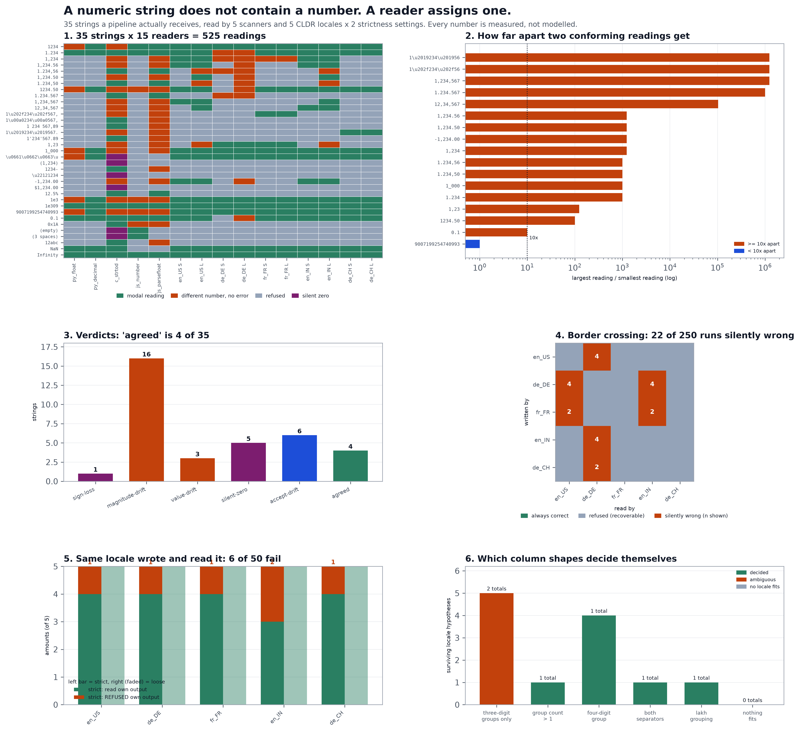

# Number Parser Locale

[](https://colab.research.google.com/github/phoebefu6/phoebe-the-builder/blob/main/data-engineering-pro/number-parser-locale/demo.ipynb)
[](https://mybinder.org/v2/gh/phoebefu6/phoebe-the-builder/main?labpath=data-engineering-pro/number-parser-locale/demo.ipynb)

> A numeric string does not contain a number. It contains characters. A **reader** assigns the number - and a reader is four things multiplied together: a symbol table, a grouping rule, a strictness setting, and whatever scanner sits underneath. `1.234` is one-point-two-three-four to a US reader and one thousand two hundred thirty four to a German one. Both readings conform. Neither is a bug. Nothing in the string says which was meant. Change any one of those four and the same bytes become a different quantity, with no error raised.

**Day 152 - Data Engineering Pro.** 35 strings, 15 readers, 525 readings, 8 verdicts, 250 border crossings, 64 tests, and a notebook that rebuilds the readers from scratch and asserts every headline number.



> **CLDR** does not define one "number format" per language; it defines a symbol table plus a grouping *pattern*. `en_IN` groups at 2,2,3 (`12,34,567`), `fr_FR` groups with U+202F NARROW NO-BREAK SPACE, `de_CH` with U+2019 RIGHT SINGLE QUOTATION MARK. Two of the five separators here are characters no keyboard produces.
> **C** `strtod` is specified as a *prefix* parser: it converts the longest initial subsequence it can and reports the rest through `endptr`. On no conversion it returns `0.0`. It has no failure channel a caller can ignore safely.
> **ECMAScript** defines the `StringNumericLiteral` of whitespace as **0**, which is why `Number("")` is `0` and not `NaN`.

## Business Impact

- **Before:** a European subsidiary's monthly amounts file loads without complaint for two years. A tooling change starts writing amounts as `1.234` instead of `1234.00`. The loader is a US-locale reader, so every amount silently divides by 1,000; the subsidiary's revenue line drops 99.9%, looks like a collapse rather than a bug, and three weeks go into "why is Germany down". No exception was raised at any point, because both readings are valid.
- **After:** the same column is pushed through 15 readers. **19 of 35 strings in the corpus have more than one defensible reading.** Only **4 of 35** are read identically by every reader that accepts them - a bare integer, `1e3`, `1e309` and the word `Infinity`. Nothing that looks like money is in that four. The worst single string is read **1,234,567x** apart. On a real border crossing - format an amount in one locale, read it in another - **22 of 250 runs return a number that is not the number written**, while 131 refuse outright.
- **Estimated ROI:** the audit runs in under two seconds on a column. The number worth the time: **22 silently wrong against 131 refused**. A refusal costs an afternoon. A silently wrong amount enters a total and stays there.

## Relationship to Days 146-151

Day 146 [`filename-sanitiser`](../../automation-suite/filename-sanitiser/) found the collisions a sanitiser creates, Day 147 [`duration-parser`](../../automation-suite/duration-parser/) the eight conforming readings of one duration string, Day 148 [`percent-recomputer`](../../analytics-engineering-bi/percent-recomputer/) that a percentage column is an apportionment, Day 149 [`header-casing`](../../automation-suite/header-casing/) that a field name is rewritten by hops you do not own, Day 150 [`sort-order-drift`](../sort-order-drift/) that `ORDER BY name` is a collation rather than an order, Day 151 [`line-ending-detector`](../line-ending-detector/) that a file has no lines in it until a splitter makes them.

New ground here is that the disagreement is about **magnitude**, and it survives every check downstream of it. Day 151's splitters disagreed about how many records exist - a row-count reconciliation catches that. Two readers of `1.234` produce the same row count, the same type, the same not-null result and the same range-check pass. The only thing that differs is the quantity, by a factor of 1,000. There is no assertion at the row level that fires.

## What it does

Fifteen mechanisms, in fifteen sections of `evidence.py`. Every number below is printed by it.

### 1. The reader roster

Nothing is modelled. `c_strtod` is libc's `strtod` through `ctypes`; `js_number` and `js_parsefloat` are a real `node` subprocess; the locale readers are Babel's CLDR tables.

| reader | accepts | refuses | character |
|---|---|---|---|
| `py_float` | 11 / 35 | 24 | C scanner, plus PEP 515 underscores and Unicode `Nd` digits |
| `py_decimal` | 11 | 24 | exact and unbounded, same lenience as `float()` |
| `c_strtod` | **35** | **0** | prefix parse, hex floats, silent `0` - no failure channel |
| `js_number` | 11 | 24 | whole-string; whitespace -> `0`; hex/bin/oct; `NaN` is a *value* |
| `js_parsefloat` | 28 | 7 | prefix parse, no hex, `NaN` when there are no leading digits |
| `en_US` / `de_DE` / `fr_FR` / `en_IN` / `de_CH` | 12-20 | 15-23 | CLDR symbols, x strict / loose grouping check |

`c_strtod` accepting all 35 is not tolerance. It is the absence of a way to say no.

### 2. The symbol table, and the two separators nobody can type

```
locale   group                  decimal              1234567.89 renders as
en_US    ','      U+002C       '.' U+002E           1,234,567.89
de_DE    '.'      U+002E       ',' U+002C           1.234.567,89
fr_FR    '\u202f' U+202F       ',' U+002C           1\u202f234\u202f567,89
en_IN    ','      U+002C       '.' U+002E           12,34,567.89
de_CH    '\u2019' U+2019       '.' U+002E           1\u2019234\u2019567.89
```

Babel 2.11 (CLDR 41) and this machine's Node 22 (ICU 73.2 / CLDR 43.1) agree on every one of these.

### 3. Verdicts

| verdict | meaning | count |
|---|---|---|
| `agreed` | every accepting reader returns the same number | **4** of 35 |
| `accept-drift` | one number, but only some readers will take it | 6 |
| `value-drift` | different numbers, under 10x apart | 3 |
| `magnitude-drift` | two readings >= 10x apart, no error raised | **16** |
| `silent-zero` | a reader hands back `0` for something that is not 0 | 5 |
| `sign-loss` | the notation means negative; no reader returns one | 1 |
| `rejected-by-all` | nobody takes it | **0** |

`rejected-by-all` is zero because `strtod` always returns something. Every string in this corpus gets at least one number.

### 4. The canonical pair

```
'1.234'   en_US -> 1.234      de_DE -> 1234        1,000 x apart
'1,234'   en_US -> 1234       de_DE -> 1.234       1,234 x apart  (parseFloat -> 1)
```

A pipeline that picks one of these is not parsing. It is guessing, once per row.

### 5. Three strings that look identical on screen

```
case            as bytes                    readers accepting
fr-nnbsp        1\u202f234\u202f567,89      4 / 15   <- the only French one
fr-nbsp         1\u00a0234\u00a0567,89      2 / 15   <- what most exports emit
fr-space        1 234 567,89                2 / 15   <- what humans type
```

The two lookalikes are accepted by **no locale reader at all** - only by the prefix parsers, which return `1`. So the correct string parses, and the visually identical ones come back as one with no complaint. Same on the Swiss side: `1’234’567.89` (U+2019) parses under `de_CH`; `1'234'567.89` with an ASCII apostrophe does not.

### 6. Prefix parsers produce the biggest errors in the corpus

```
string                 locale reading     parseFloat         strtod
1,234,567                     1234567              1              1
12,34,567                     1234567             12             12
1\u202f234\u202f567,89   1234567.89              1              1
1_000                            1000              1              1
-1,234.00                       -1234             -1             -1
```

`strtod` reports the truncation through `endptr`. A caller who checks it sees the problem. `awk`, most hand-rolled C importers, and every wrapper that returns only the `double` cannot.

### 7. The zero that was not in the file

Six strings become a silent `0`: an Arabic-Indic numeral, an accounting negative `(1,234)`, a U+2212 minus, a currency-prefixed `$1,234.00`, an empty cell and a whitespace-only cell. `strtod` produces five of them; JavaScript's `Number()` produces the last two, because the spec defines the numeric value of whitespace as 0.

A zero is the worst available failure value for an amount. It passes a not-null check, passes a numeric type check, passes a range check, and moves an average.

### 8. Three ways to write a negative, none of them read as one

| string | notation | any reader return a negative? |
|---|---|---|
| `(1,234)` | accounting parentheses | **no** - becomes `0` |
| `1234-` | SAP / COBOL trailing sign | **no** - becomes `+1234` |
| `−1234` | U+2212 MINUS SIGN | **no** - becomes `0` |
| `-1,234.00` | ASCII HYPHEN-MINUS | yes |

Only the ASCII hyphen survives. `negative_notation()` names which of these a string uses, so an unrecoverable sign becomes a finding rather than a number.

### 9. Two readers that agree on the string and not on the number

```
'9007199254740993'   py_decimal -> 9007199254740993
                     py_float, js_number, c_strtod -> 9007199254740992
```

An id one past `2^53`. Every float-backed reader returns its neighbour - off by one, no error, joining to the wrong row for the rest of time. No locale setting changes this; it is a scanner property.

### 10. The border crossing

Five amounts, rendered with a fixed 2dp pattern in five locales, read back by five locales at both strictness settings: 250 runs.

| outcome | count |
|---|---|
| correct | 97 |
| refused - loud, recoverable, the good outcome | 131 |
| **silently wrong** - a number came back and it was not the number | **22** |

Every silently wrong run is a **loose** reader stripping the other locale's decimal point as if it were a group separator:

```
wrote   read    rendered      should be        got
en_US   de_DE   '0.50'             0.50         50     <- 100x
de_DE   en_US   '1.234,50'      1234.50    1.23450     <- 1/1,000
fr_FR   en_IN   '1,23'             1.23        123     <- 100x
```

Money moves by two or three orders of magnitude and the row still looks like money.

### 11. Strict mode refusing its own locale's output

Take the diagonal of section 10 - the locale that wrote the string is the one reading it. Every cell should pass. **6 of 50 fail, and all six are strict-mode refusals.** Two distinct causes:

**a) Trailing zero cents.** Babel 2.11's strict check validates by re-formatting and comparing strings. `format_decimal` normalises `1,234.50` to `1,234.5`, the strings differ, and the parse is refused - while `1,234.5` and `1,234.56` both pass. A fixed-2dp money column hits this on every amount whose cents end in a zero.

**b) A pattern that overrides the locale's grouping.** `en_IN` groups at 2,2,3. Handed the pattern `#,##0.00` the formatter emits `1,234,567.89`; the strict reader checks against the *locale* rule rather than the pattern and refuses it. Writer and reader disagree inside a single locale.

So strict mode is not simply the safe setting. It converts a class of silent errors into refusals, **and** it refuses correct input. Round-trip your own formatter through it before turning it on - `own_output_roundtrip()` does exactly that.

### 12-13. The only question that can decide a column

"What does reader X return" is the wrong question. **Only a reader that refuses carries information.** A prefix parser accepts every string, so it never eliminates a candidate - on the money column below, 15 of 15 readers accept every row, and that fact tells you nothing.

The right question is *which locale could have written this column?* A locale survives if it reads every row.

| column shape | rows | verdict | survivors -> total |
|---|---|---|---|
| three-digit groups only | `1.234, 2.500, 3.000, 1.750` | **ambiguous** | all 5 -> `8.484` **OR** `8484` |
| a group count > 1 | `1.234.567, 89.012, 3.456` | decided | `de_DE` -> 1327035 |
| a four-digit group | `1.2345, 2.500` | decided | 4 survivors -> 3.7345 |
| both separators present | `1.234,56, 7.890,12` | decided | `de_DE` -> 9124.68 |
| lakh grouping | `12,34,567, 1,23,456` | decided | `en_IN` -> 1358023 |
| nothing fits | `1.2345,67, 9` | no-locale-fits | none |

Two structural facts do the eliminating: **a group of four digits is not a group**, and **two different separators in one value pin which is which**. Six of the seven shapes resolve. The one that does not is the money column - single three-digit groups, no four-digit group to rule out a thousands separator, no second separator to pin the decimal. Two totals come out, 1,000x apart.

That is not a tooling gap. The information is not in the file. `decide_column()` returns both totals and `decidable = False` rather than picking one.

## API

```python
import numlocale as N

# One string, every reader
row = N.read_all([N.Case("x", "1.234", "pasted")])["x"]
row["de_DE_strict"].value          # Decimal('1234')
row["en_US_strict"].value          # Decimal('1.234')

# Is this string decidable at all?
v = N.verdict_for(N.Case("x", "1,234,567", "export"), row)
v.verdict, v.ratio                 # 'magnitude-drift', Decimal('1234567')

# Which locale wrote this column?
d = N.decide_column(["1.234", "2.500", "3.000", "1.750"])
d.verdict                          # 'ambiguous'
d.totals                           # {'en_US': 8.484, 'de_DE': 8484, ...}
d.spread                           # Decimal('1000')

# Which row killed a hypothesis?
[h.killed_by for h in N.locale_hypotheses(["1.2345", "2.500"]) if not h.survives]
# ['1.2345']  -- a four-digit group rules out '.' grouping

# Does a notation carry a sign no reader will decode?
N.negative_notation("(1,234)")     # 'accounting parentheses'

# Will strict mode refuse your own formatter's output?
[c for c in N.own_output_roundtrip() if c.status != "ok"]
```

## Tech Stack

Python 3.11 - Babel 2.11 (CLDR symbol tables) - `ctypes` into libc `strtod` - a `node` subprocess for real `Number()` / `parseFloat()` - `Decimal` throughout, never `float`, for the readings themselves - matplotlib - pandas - Streamlit - pytest - ruff - Docker

## Demo

**[Run the interactive demo notebook →](demo.ipynb)** - pre-rendered with all outputs, or click the Colab/Binder badges above to run it live. The notebook rebuilds the readers from scratch (no import of `numlocale`) so it runs standalone, and asserts every headline number as it goes.

```bash
pip install -r requirements.txt

python evidence.py            # 15 sections, every claim printed from the live readers
python -m pytest -q           # 64 tests
python make_chart.py          # regenerate locale_audit.png / .svg
streamlit run app.py          # paste a string, or a whole column
```

The Streamlit app has four tabs: **One string** (15 readings plus a verdict), **A whole column** (which locale hypotheses survive), **Border crossing** (all 250 runs, and the strict-mode diagonal), **The corpus** (all 525 readings).

## Learning Connection

Built while studying data contracts and schema-on-read semantics. Applies: reading a specification for what it *permits* rather than what it usually does - CLDR's symbol tables and grouping patterns, C99 `strtod`'s `endptr` contract, and ECMAScript's `StringNumericLiteral` grammar. Each one is a documented behaviour that produces a different number from the same bytes; none of them is a bug to be fixed.

## Impact Note

- **Who benefits:** anyone loading numeric columns from a source they do not control - partner feeds, multi-region exports, spreadsheet uploads, scraped tables, ERP extracts.
- **Potential risks:** the surviving-hypothesis logic narrows candidates; it does not identify a locale from a single value, and it cannot. A column of single three-digit groups is genuinely undecidable and the tool says so - reading `decidable = False` as "pick the first survivor" reintroduces exactly the 1,000x error this audits for. The corpus is 35 strings over 5 locales; a locale not in the roster (Arabic-script digits with U+066B decimal separator, Chinese myriad grouping) is not covered. All counts are for Babel 2.11 and Node 22; the tests assert them so an upgrade fails loudly rather than quietly making this README wrong.
