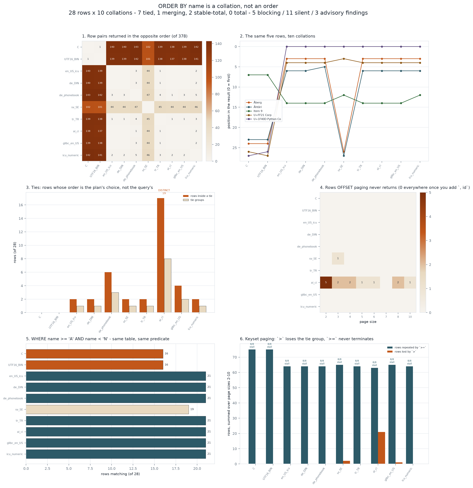

# Sort-Order Drift

[](https://colab.research.google.com/github/phoebefu6/phoebe-the-builder/blob/main/data-engineering-pro/sort-order-drift/demo.ipynb)
[](https://mybinder.org/v2/gh/phoebefu6/phoebe-the-builder/main?labpath=data-engineering-pro/sort-order-drift/demo.ipynb)

> `ORDER BY name` reads like a total order on a column. It is not. It is a **collation** applied to bytes, and a collation is three decisions the SQL never states: which sequence the characters are in, how many levels of difference count as a difference, and whether two strings that compare equal are the *same value*. The first makes two servers return the same rows in different orders. The second creates ties - and the row order inside a tie is whatever the plan produced, so paginating it drops rows with no error anywhere. The third changes how many rows a report returns at all.

**Day 150 - Data Engineering Pro.** 28 ordinary names, 10 modelled collations, 45 collation pairs, 80 pagination runs, 4 verdicts, 53 tests, and a notebook that rebuilds the keyer from scratch.



> **PostgreSQL, "Collation Support"** - a deterministic collation compares equal strings byte for byte after the collation, so `=` remains byte equality; a **nondeterministic** collation makes the collation's own equality the truth, which is what changes `DISTINCT`, `GROUP BY` and `UNIQUE`.
> **glibc 2.28** (RHEL 8, Ubuntu 18.10) changed `en_US.UTF-8` ordering. Existing PostgreSQL text indexes became invalid and needed a `REINDEX`; PostgreSQL 13+ records a collation version and warns you.

## Business Impact

- **Before:** a customer list is served with `ORDER BY name LIMIT 20 OFFSET 20`. It is correct in every test. In production one page is missing a customer, and a different customer appears on two pages. Nothing logged an error, because nothing went wrong - both pages were individually correct answers to their own query.
- **After:** the same column is pushed through 10 collations and 8 page sizes. **80 (collation, page size) runs; 72 exact, 8 wrong.** OFFSET paging **never returns 15 rows** and **returns 15 twice**. Keyset paging with `>` loses **24**; with `>=` it repeats **663** and **stalls in 80 of 80 runs** - it never terminates at all. Adding one clause, `ORDER BY name, id`, takes every one of those numbers to **0**.
- **Estimated ROI:** the whole audit runs in about two seconds. The number worth the time: **11 silent findings** against 5 blocking ones. The blocking ones raise a constraint violation or a stack trace. The silent ones are a report whose rows moved.

## Relationship to Days 143, 146, 147, 148 and 149

Day 143 [`currency-rounder`](../currency-rounder/) found that rounding a column is an allocation; Day 146 [`filename-sanitiser`](../../automation-suite/filename-sanitiser/) that a sanitiser creates collisions; Day 147 [`duration-parser`](../../automation-suite/duration-parser/) that one string has eight conforming readings; Day 148 [`percent-recomputer`](../../analytics-engineering-bi/percent-recomputer/) that a percentage column is an apportionment; Day 149 [`header-casing`](../../automation-suite/header-casing/) that a field name is an identity rewritten by hops you do not own.

New ground here is that the operation is a **comparison**, and its failure is not a wrong value - it is an **undefined** one. A tie is not an error. Both orders satisfy the query, so no engine can tell you which one you got, and re-running the query is allowed to give the other. Everything downstream of an undefined order - a page boundary, a cursor, a diff between two report runs - inherits the ambiguity, and inherits it silently.

## What it does

Ten mechanisms, in fourteen sections of `evidence.py`. Every number below is printed by it.

### 1. Ten collations, ten answers, and only one pair that agrees

```
C             Aaberg, Ahtari, Capek, Isik, Istanbul, Item 10, Item 100, Item 9, ...
en_US_icu     🐍 Python Co, aaberg, Aaberg, Åberg, Ａ Corp, Ahtari, Ähtäri, Capek, ...
de_phonebook  🐍 Python Co, aaberg, Aaberg, Åberg, Ａ Corp, Ähtäri, Ahtari, Capek, ...
sv_SE         🐍 Python Co, aaberg, Aaberg, Ａ Corp, Ahtari, Capek, Čapek, Isik, ...
```

Of **45 collation pairs, exactly 1** returns the identical row sequence (`en_US_icu` and `de_DIN` - and that is a fact about these 28 rows, not about the two collations). `ORDER BY name LIMIT 1`, which is also `MIN(name)`, has **2 distinct answers**.

### 2. Four verdicts

| verdict | meaning | is the result determined? |
|---|---|---|
| `stable-total` | deterministic forever, but the order is not linguistic | yes - and it will never change under an upgrade |
| `total` | linguistic and injective over this data | yes |
| `tied` | ties exist; row order inside a tie is the plan's choice | no, and nothing errors |
| `merging` | ties **and** nondeterministic equality | no, and the row *count* moves too |

```
stable-total   2 of 10
total          0 of 10
tied           7 of 10
merging        1 of 10
```

**No linguistic collation is `total` here**, and the reason is two rows: `José` (NFC) and `José` (NFD) are the same string in two normal forms, so every Unicode-aware collation *must* call them equal. Only the two byte orders escape the tie, by not knowing what a string is.

### 3. The tie that changes the row count

`ai_ci` models MySQL 8's **default** collation, `utf8mb4_0900_ai_ci`, and a PostgreSQL nondeterministic ICU collation. It is accent- and case-insensitive, so its ties are equality:

```
Aaberg = aaberg              Straße = Strasse
Ahtari = Ähtäri              José = José = Jose
Müller = Muller              Işık = Isik
Čapek = Capek                van der Berg = Van Der Berg
```

`COUNT(DISTINCT name)` reads **19** instead of **28**. A `UNIQUE(name)` index rejects **10 row pairs that are different strings**. Under any deterministic collation those same ties leave the row count alone - PostgreSQL still compares bytes for `=` - and only the *order* is undefined. That distinction is the whole difference between "my constraint rejected a legitimate customer" and "my report's rows moved".

### 4. Paginating a tied sort

Each page is a separate execution, so each may be handed a different physical row order: insertion order, a backward index scan, a table rewritten by `VACUUM FULL`. A stable sort preserves whatever it is given, so **inside a tie group the physical order *is* the result order**.

```
collation      page  never returned            returned twice
sv_SE             3  José                      José
ai_ci             2  aaberg, José, Işık, ...   Aaberg, Jose, Isik, ...
ai_ci             3  Ahtari, Muller            Ähtäri, Müller
ai_ci             4  Jose, Čapek               José, Capek
ai_ci             5  Işık                      Isik
ai_ci             6  Ähtäri                    Ahtari
ai_ci             8  José, Capek               Jose, Čapek
ai_ci            10  Isik                      Işık
```

Note `sv_SE` at page size 3: a **deterministic** collation, one tie group, one lost row. And note that `ai_ci` is exact at page size 7 and wrong at 6, 8 and 10 - whether a tie group straddles a boundary depends on the page size, which is exactly why the test suite passed.

```
OFFSET               15 rows never returned, 15 returned twice; 72 of 80 runs clean
OFFSET + `, id`      0 lost, 0 repeated
keyset with `>`      24 rows never returned
keyset with `>=`     663 rows repeated, 80 of 80 runs stall and never terminate
```

Keyset pagination - the standard cure for OFFSET - has its own version of the same problem. `WHERE name > $last` skips the rest of the tie group the page ended inside. `WHERE name >= $last` re-reads it. With a non-unique sort key there is no third option.

### 5. `>=` keyset paging does not terminate, ties or no ties

The last row of every page satisfies `name >= $last`, so it opens the next page, forever. This one is not about collations at all: it stalls under `C`, which has **0 ties**. A cursor needs a comparison it can strictly advance - which means a unique tiebreak, i.e. `WHERE (name, id) > ($last_name, $last_id)`.

### 6. A range predicate is collation-dependent too

```
WHERE name >= 'A' AND name < 'N'

C, UTF16_BIN   16 rows
sv_SE          19 rows
the other 7    21 rows
```

Same table, same predicate, **16 to 21 rows**. Five rows are inside the range under some collations and outside under others - `Åberg`, `aaberg`, `Ähtäri`, `Čapek`, `Ａ Corp`. Every A-M / N-Z split inherits this: shard keys, archive sweeps, alphabetical index tabs, partition bounds. `aaberg` is outside `['A','N')` under `C` for the ordinary reason that every lowercase letter sorts after every uppercase one.

### 7. Same language, two national standards

`de_DIN` (DIN 5007-1) treats `ü` as `u` with a secondary mark. `de_phonebook` (DIN 5007-2, ICU `de-u-co-phonebk`) expands it to `ue`. Both are German. They disagree on 3 row pairs here, including:

```
Müller vs Muller    (DIN: Müller then Muller;  phonebook: Mueller = Müller, then Muench, then Muller)
Muench vs Müller
```

`sv_SE` disagrees with `en_US_icu` on **44 of 378** pairs, because `å`, `ä` and `ö` are three letters *after* Z, not three accented vowels. `Åberg` moves **23 positions** between the two.

### 8. Two binary orders that are not the same binary order

`C` (UTF-8 bytes) and `UTF16_BIN` (UTF-16 code units - Java's `String.compareTo`, JavaScript's default `sort`, SQL Server's `*_BIN2` on `nvarchar`) agree across the entire BMP and disagree exactly once here:

```
Ａ Corp          max code point U+FF21   ← C puts this first
🐍 Python Co     max code point U+1F40D  ← UTF16_BIN puts this first
```

UTF-16 leads a supplementary character with a surrogate at U+D800, so everything above the BMP sorts *below* U+E000..U+FFFF. Both are "just binary", and a Java service and a PostgreSQL `C` index still disagree.

### 9. `LOWER()` is locale-dependent, so the index built on it is too

```
Istanbul   root: 'istanbul'   tr_TR: 'ıstanbul'
Işık       root: 'işık'       tr_TR: 'ışık'
Item 9     root: 'item 9'     tr_TR: 'ıtem 9'
```

**6 of 28 rows** change. A functional index on `LOWER(name)` is only valid for the `LC_CTYPE` it was built under, and two services in different locales disagree on whether `Istanbul` and `ISTANBUL` are the same name.

### 10. The one row this host's libc cannot sort at all

The model is checked against the host's own `strcoll` where the locale exists. On the machine this README was generated on:

```
en_US_icu vs en_US.UTF-8   345/349 pairs agree
de_DIN    vs de_DE.UTF-8   345/349 pairs agree
sv_SE     vs sv_SE.UTF-8   345/349 pairs agree
tr_TR     vs tr_TR.UTF-8   345/349 pairs agree

strxfrm('Åberg') -> OSError [Errno 22] in all four UTF-8 locales
strxfrm('Åberg') -> fine under C
```

One perfectly ordinary Nordic surname that this host's libc has **no sort key for**. Anything built on `strcoll` - GNU `sort`, a C extension, a locale-aware comparator - cannot place that row, so its position is whatever the error path leaves behind. The same four locales produce **3 different orders** over the rows they will accept, which is the point: the tailoring is real, and it is not a property of this model.

## Findings

**5 blocking, 11 silent, 3 advisory.**

| severity | finding |
|---|---|
| 🔴 blocking | `ai_ci`: 10 row pairs collide as one value; `COUNT(DISTINCT name)` reads 19, not 28 |
| 🔴 blocking | `C` vs `de_phonebook`: 143 of 378 row pairs come back in the opposite order |
| 🔴 blocking | keyset paging with `>=` never terminates: 80 of 80 runs stall |
| 🔴 blocking | `LOWER()` changes 6 rows when `LC_CTYPE` is `tr_TR` |
| 🔴 blocking | this host's libc has no sort key at all for `'Åberg'` |
| 🟠 silent | OFFSET pagination never returns 15 rows across the sweep, and repeats 15 |
| 🟠 silent | keyset paging with `>` drops 24 rows |
| 🟠 silent | 7 collations are `tied`: deterministic, so nothing errors - only the order is undefined |
| 🟠 silent | rows 12 and 13 are the same string; byte order calls them two |
| 🟠 silent | `WHERE name >= 'A' AND name < 'N'` returns 16 to 21 rows depending on the collation |
| 🔵 advisory | a unique tiebreak fixes all of it: 0 lost, 0 repeated, every collation, every page size |
| 🔵 advisory | `C` and `UTF16_BIN` disagree above the BMP |
| 🔵 advisory | a collation is versioned data, not a setting (glibc 2.28, every ICU upgrade) |

## The fix, in order of cost

1. **`ORDER BY name, id`.** One clause. It converts all 10 collations to a total order over this corpus and takes every pagination number to zero. Do this before anything else.
2. **Keyset paging on a composite:** `WHERE (name, id) > ($n, $i) ORDER BY name, id`. Strictly advances, so it terminates and loses nothing.
3. **Name the collation in the DDL** and pin it, rather than inheriting the cluster's `lc_collate`. `COLLATE "en-US-x-icu"` is a decision; the default is an accident of the host.
4. **Normalise on write** (NFC), because no collation can undo two spellings of one string in a byte-ordered index.
5. **Decide determinism deliberately.** A nondeterministic collation gives you the case-insensitive uniqueness people usually want *and* changes what `DISTINCT`, `GROUP BY` and `UNIQUE` mean. Both are defensible; the accident is not.
6. **Treat collation version as a migration input.** Record it (PostgreSQL 13+ does), and plan a `REINDEX` for glibc/ICU upgrades.

## Tech Stack

Python 3.12 (`from __future__ import annotations`, 3.9-compatible typing), `unicodedata`, `locale`, matplotlib, pandas, Streamlit, pytest. No PyICU: the collations are readable models, deliberately small, and checked against the host's libc where one exists. The claims are about the *structure* of the disagreement - which pairs flip, where the ties are, what pagination does to them - not about matching ICU weight for weight.

## Demo

**[Run the interactive demo notebook →](demo.ipynb)** - pre-rendered with outputs, or click the Colab/Binder badges above to run it live. The notebook rebuilds the keyer from scratch in ~40 lines and reproduces every headline count.

```bash
pip install -r requirements.txt
python evidence.py          # every number in this README
python -m pytest -q         # 53 tests
python make_chart.py        # the figure above
streamlit run app.py        # paste your own column
```

## Learning Connection

Built while studying **Advanced SQL** (DS365) and the PostgreSQL documentation on collation support. Applies: collation strength and tailoring, deterministic vs nondeterministic equality, Unicode normalisation as a write-path decision, stable sorts and undefined orders, keyset vs OFFSET pagination.

## Impact Note

- **Who benefits:** anyone who paginates a text column, ships a report that is supposed to match last week's, or runs the same query against two servers with different locales.
- **Potential risks:** the collations are models, not ICU. Use them to find *where* your data is ambiguous, then confirm the specific ordering against your actual engine (`SELECT name FROM t ORDER BY name COLLATE "de-u-co-phonebk"`). The one claim that needs no model is the fix: add the unique tiebreak.
