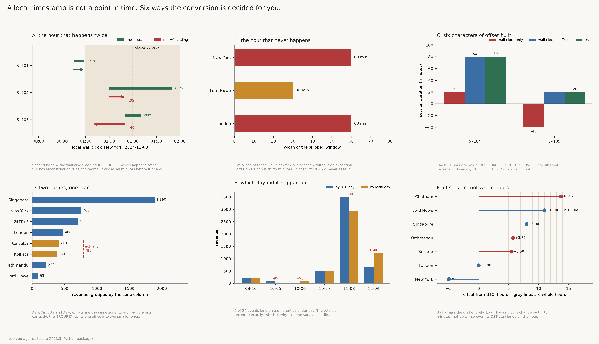

# Timezone Normalizer

[](https://colab.research.google.com/github/phoebefu6/phoebe-the-builder/blob/main/data-engineering-pro/timezone-normalizer/demo.ipynb)
[](https://mybinder.org/v2/gh/phoebefu6/phoebe-the-builder/main?labpath=data-engineering-pro/timezone-normalizer/demo.ipynb)

> Normalising a local timestamp to UTC is one line: `ts.replace(tzinfo=ZoneInfo(zone)).astimezone(utc)`. That line returns an answer for `2024-11-03 01:30` in New York, which happened twice, and for `2024-03-10 02:30`, which never happened at all. It does not raise on either. PEP 495 made both readings of an ambiguous time representable through the `fold` attribute - which is correct, complete, and precisely why the guess gets made for you in silence.

**Day 139 - Data Engineering Pro.** Explicit local-to-UTC resolution: the three-way classification of a wall-clock time, named policies instead of defaults, and a pre-flight audit covering the five things a conversion will not tell you - ambiguity, gaps, alias fragmentation, sub-hour offsets, and which tz database produced the answer.



## Business Impact

- **Before:** a support platform writes `datetime.now()` in each office's local time into a `TIMESTAMP` column, with the zone in a neighbouring column. Session durations, daily revenue and SLA breach counts are computed off it. Twice a year, for one hour, the arithmetic is wrong; every other day of the year the daily boundaries are wrong for every office east of Greenwich.
- **After:** each timestamp is classified before it is converted, the rows the input does not determine are reported as rows the input does not determine, and the tz database version is stamped next to the results.
- **Estimated ROI:** on the bundled 24-event sample, **eight** distinct failure modes each produce a plausible answer and **none of them raise**. One session comes out at **-40 minutes**. Another really lasted 80 minutes and reports 20 **under every available policy**. Six of 24 events land on a different calendar day depending on which day you mean - and the totals still reconcile exactly, which is why that one survives audits.

## What it does

Six mechanisms, and one of them is not a bug you can fix.

### 1. The hour that happens twice, and why no policy recovers it

New York, 2024-11-03. At 02:00 EDT the clock goes back to 01:00 EST, so the wall clock reads 01:00-01:59 twice, an hour apart. The sample's local strings are rendered *from* true UTC instants, so this is a recovery error, not two guesses compared:

```
session       open (local)   close (local)     truth    fold=0    fold=1
------------------------------------------------------------------------------
S-101                00:45           00:58        13        13        13
S-104                01:30           01:50        80        20        20
S-105                01:50           01:10        20       -40       -40
------------------------------------------------------------------------------
  minutes. fold=0 is Python's default for an ambiguous wall time.
```

S-101 sits entirely before the transition and every reading agrees - that is the control. S-105 comes out at **-40 minutes**: a session that closed before it opened.

But the number to sit with is S-104. It really lasted 80 minutes, and **both fold policies report 20**. It opened in the first pass of 01:00 and closed in the second, so recovering it needs `fold=0` on one row and `fold=1` on the other, chosen per row, from information the input does not contain. A global `ambiguous=` setting - in this module, in pytz, in pandas - cannot express the answer. This is not a library that needs a better default. The data is gone.

### 2. The hour that never happens

When a clock jumps forward the skipped wall-clock times do not exist. An upstream job that computes "start + 45 minutes" in *local* terms writes one anyway. Python accepts it:

```
zone                  input             fold=0 -> UTC         converted back
------------------------------------------------------------------------------
America/New_York      03-10 02:30       2024-03-10 07:30+0000 03-10 03:30
Australia/Lord_Howe   10-06 02:15       2024-10-05 15:45+0000 10-06 02:45
Europe/London         03-31 01:30       2024-03-31 01:30+0000 03-31 02:30
```

No exception in any of them. The round trip is the tell: convert the wall time to UTC and back and you get a *different* wall time, because the one you started with is not on the clock. `classify()` uses exactly that test, which is why it needs no transition table and works on zones nobody writes tests for.

**Lord Howe Island is the one to remember.** Its DST shift is thirty minutes, so its gap is half an hour wide - `02:15` does not exist but `02:30` does. Any guard written as "is the hour 02:xx suspicious" misses it, and a test suite built only on `America/New_York` never sees it.

pytz raised `NonExistentTimeError` here. `zoneinfo`, correctly, represents both readings and raises nothing, so the guard has to be yours.

### 3. Six characters of offset fix it. A stored offset does not.

The same two contested sessions, from a partner API that transmits the UTC offset next to the wall clock. Identical instants, identical local times, one extra field:

```
session        wall clock only   with offset     truth
------------------------------------------------------------------------------
S-104                       20            80        80
S-105                      -40            20        20
```

Exact, both rows, no policy required. `2024-11-03T01:30:00-04:00` and `2024-11-03T01:50:00-05:00` are different instants and say so.

That is the whole fix for events that already happened. It is not the fix for events that have not:

```
  09:00 local in America/New_York on 2024-10-15 is 09:00 EDT (-0400)
  + 30 days, carried as a zone         -> 2024-11-14 09:00 EST (-0500)
  + 30 days, carried as a fixed offset -> 2024-11-14 08:00 EST (-0500)
```

An hour apart, because the clock changed in between and a stored offset does not know that. **Store the offset to pin an instant that already happened. Store the zone to answer anything about a clock that has not run yet** - reminders, SLAs, business-hours windows, market opens, batch schedules. Storing neither is the default, and it is the only case that cannot be repaired later.

### 4. The zone identifier is not canonical

The tz database keeps renamed zones working as links, so old names keep resolving. Every conversion below is correct. The aggregate is not:

```
zone as logged               revenue   resolves to               merged revenue
------------------------------------------------------------------------------
America/New_York                 760   America/New_York                     760
Asia/Calcutta                    410   Asia/Calcutta                        790   <-- split
Asia/Kathmandu                   220   Asia/Kathmandu                       220
Asia/Kolkata                     380   Asia/Calcutta                        790   <-- split
Asia/Singapore                 1,890   Asia/Singapore                     1,890
Australia/Lord_Howe               95   Australia/Lord_Howe                   95
Etc/GMT+5                        700   Etc/GMT+5                            700
Europe/London                    480   Europe/London                        480
------------------------------------------------------------------------------
```

Bengaluru appears twice and each half looks like a smaller office. Nothing raises, nothing is null, every per-row timestamp is right. `zoneinfo` does not expose the database's `Link` records, so `same_rules()` establishes identity behaviourally - sample the offset every six hours from 1990 to 2035 and compare. Slower than reading a link table, and correct without one:

```
  Europe/Kyiv          == Europe/Kiev          True
  America/Nuuk         == America/Godthab      True
  Asia/Yangon          == Asia/Rangoon         True
  US/Eastern           == America/New_York     True
```

And the identifier that means the opposite of what it says:

```
  WARNING Etc/GMT+5 is UTC-05:00 - the POSIX sign convention is inverted
```

`Etc/GMT+5` is UTC**-**05:00. The sign follows POSIX, which is inverted relative to ISO 8601 and to every human reading it. A vendor feed labelled `Etc/GMT+5` for a US Eastern office is off by ten hours, and every resulting timestamp is perfectly valid.

### 5. Which day did it happen on

```
session  office       local time        UTC day      local day       amount
------------------------------------------------------------------------------
S-302    Singapore    2024-11-04 07:40  2024-11-03   2024-11-04           0
S-402    Bengaluru    2024-11-04 00:20  2024-11-03   2024-11-04           0
S-402    Bengaluru    2024-11-04 01:05  2024-11-03   2024-11-04         380
S-501    Kathmandu    2024-11-04 00:25  2024-11-03   2024-11-04         220
S-601    Lord Howe    2024-10-06 02:15  2024-10-05   2024-10-06           0
S-601    Lord Howe    2024-10-06 03:40  2024-10-05   2024-10-06          95
------------------------------------------------------------------------------

day             revenue by UTC day  revenue by local day       delta
------------------------------------------------------------------------------
2024-10-05                      95                     0         -95
2024-10-06                       0                    95         +95
2024-11-03                   3,510                 2,910        -600
2024-11-04                     640                 1,240        +600
------------------------------------------------------------------------------
```

Neither column is wrong. They answer different questions - "what did the platform do in this 24-hour window" and "what did each office do on its own Monday" - and a dashboard that does not say which one it shows will eventually be asked to reconcile with one that chose the other. **The totals match exactly; only the boundaries move.** That is the version of this bug that survives longest, because the control total is always right.

### 6. Offsets are not whole hours, and DST shifts are not always an hour

```
zone                    local time                offset   whole hour   DST shift
------------------------------------------------------------------------------
America/New_York        2024-11-03 07:00           -5.00         True        60m
Europe/London           2024-11-03 12:00           +0.00         True        60m
Asia/Kolkata            2024-11-03 17:30           +5.50        False         0m
Asia/Kathmandu          2024-11-03 17:45           +5.75        False         0m
Asia/Singapore          2024-11-03 20:00           +8.00         True         0m
Australia/Lord_Howe     2024-11-03 23:00          +11.00         True        30m
Pacific/Chatham         2024-11-04 01:45          +13.75        False        60m
------------------------------------------------------------------------------
```

Three of seven are not a whole number of hours from UTC, and one shifts by thirty minutes rather than sixty when its clocks change. Two things break on this: hour-of-day bucketing does not align across zones, so an "hourly" chart comparing Kathmandu with Singapore is comparing buckets offset by fifteen minutes; and any code that stores an offset as an integer number of hours, or derives one from `utcoffset().seconds // 3600`, truncates +05:45 to +05:00 - forty-five minutes, every row, one direction.

### And the tz database itself

Time zone rules are political. Iran abolished DST in 2022, Mexico in 2022, Lebanon changed its mind twice in a week in 2023. Two runs of the same code on the same input give different UTC values if the database moved underneath them, so `audit()` stamps the version with the results rather than leaving it in a comment:

```
note  resolved against tzdata 2023.3 (Python package) - record this next to the results
```

### The ledger

```
failure mode                    effect on this sample                  raises?
------------------------------------------------------------------------------
ambiguous hour, default fold    S-105 lasts -40 min, truly 20           silent
no single fold is correct       S-104 off by 60 min either way          silent
nonexistent wall time           3/3 accepted, round trip fails          silent
offset carried forward 30d      1h drift vs the zone                    silent
alias fragments GROUP BY        1 office split into 2 rows              silent
Etc/GMT+5 sign inversion        10h error, all values valid             silent
UTC day vs local day            6 of 24 events change day               silent
sub-hour offsets                3 zones misbucket by 15-45 min          silent
------------------------------------------------------------------------------
```

All eight produce a plausible answer and none raise. Six produce a *stable* one, so re-running the pipeline reproduces the same wrong number and a reconciliation against yesterday agrees. Only the negative duration announces itself, and only if somebody is looking for negatives.

## Tech Stack

Python 3.9+, Streamlit, Docker. **`tznorm.py` has no dependencies beyond the standard library** - `zoneinfo`, no pytz, no pandas, no dateutil. 582 lines of core, 396 lines of tests. pandas appears only in the Streamlit app; numpy and matplotlib only in the figure.

Policies: `ambiguous=` is `raise` | `earlier` (fold=0) | `later` (fold=1) | `flag`; `nonexistent=` is `raise` | `shift_forward` | `flag`. Single-value resolution defaults to `raise` and column normalisation defaults to `flag`, because in both hard cases the input does not determine the answer.

## Demo

**[Run the interactive demo notebook →](demo.ipynb)** - pre-rendered with all outputs and the six-panel figure, or click the Colab/Binder badges above to run it live. The notebook writes `tznorm.py` and `evidence.py` to disk from embedded source, so it is self-contained without a clone step and there is no second copy of the logic to drift.

For the Streamlit app:

```bash
pip install -r requirements.txt
streamlit run app.py
```

Reproduce every number above:

```bash
python3 test_tznorm.py   # 36 tests over the core
python3 evidence.py      # every table in this README
python3 make_chart.py    # the six-panel audit figure
```

## Files

| file | what it is |
|---|---|
| `tznorm.py` | `classify`, `resolve`, `normalize`, alias detection, day bucketing, `audit`, sample generator |
| `evidence.py` | the six experiments this README quotes, each isolating one mechanism |
| `test_tznorm.py` | 36 tests, including the claim that *no* fold policy recovers the contested sessions |
| `app.py` | Streamlit UI - single-value probe, verdict, undecidable rows first, then the column |
| `make_chart.py` | the six-panel audit figure |
| `build_notebook.py` | generates `demo.ipynb` with both modules embedded |

One note on the tests worth stealing: they assert **structural** facts - this time is ambiguous, these two identifiers agree, this round trip fails - rather than specific UTC values for arbitrary future dates. A test that hard-codes a 2035 offset is a test that will one day fail for an entirely correct reason.

## Learning Connection

Built while reading PEP 495 (`fold`, and why disambiguation was added to `datetime` rather than solved), the `zoneinfo` documentation on gaps and folds, and the IANA tz database's own `theory.html` on what a `Link` is and why zones get renamed.

Applies: wall-clock versus instant as distinct types, round-trip invariants as a classification primitive, behavioural equivalence testing, policy-as-argument instead of policy-as-default, and provenance stamping for a dependency that changes on someone else's schedule.

## Impact Note

- **Who benefits:** anyone with timestamps from more than one country - support and ops platforms, marketplaces, payroll and time-and-attendance, scheduling, SLA reporting, trading session boundaries, and any daily-revenue dashboard whose offices are not all in one zone.
- **Potential risks:** this tool reports; it does not repair, and the central finding is that some of it *cannot* be repaired - `S-104` is unrecoverable from its own data, and no setting here changes that. `shift_forward` moves a nonexistent time to a real one, which is a defensible choice and still a choice. `same_rules()` samples every six hours, so two zones that differ only for a window shorter than that inside the sampled range would be reported as identical; it also cannot distinguish a genuine alias from two zones that happen to have agreed for forty-five years and may not in future - the tz database splits zones as well as linking them. Historical conversions before the mid-20th century are only as good as the database's record of local mean time, which for much of the world is an approximation. And all of it is answered against whichever tzdata version is installed: pin it, stamp it, and re-run rather than assume a stored UTC value is still the right one.

---

Part of [phoebe-the-builder](https://github.com/phoebefu6/phoebe-the-builder) - Day 139, Data Engineering Pro.
