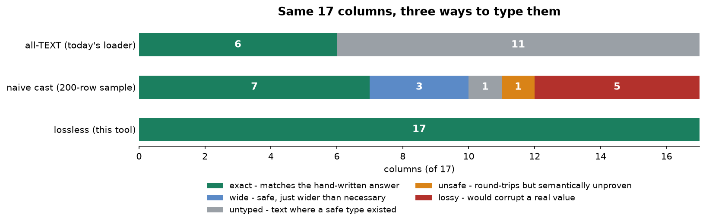

# Type Inferencer

[](https://colab.research.google.com/github/phoebefu6/phoebe-the-builder/blob/main/data-engineering-pro/type-inferencer/demo.ipynb)
[](https://mybinder.org/v2/gh/phoebefu6/phoebe-the-builder/main?labpath=data-engineering-pro/type-inferencer/demo.ipynb)

> Everything imported as string. Typing the columns is easy - typing them without silently corrupting data is the actual job.

`int("01234")` returns `1234` and raises nothing. `float("10.10")` stores 10.09999999999999964... and raises nothing. Both loads succeed, both dashboards render, and both defects surface months later as post to the wrong address or a reconciliation that is off by cents across ten million rows.

This tool infers `CREATE TABLE` DDL from raw text values under one precondition: **cast only when the cast is reversible.**



## Business Impact
- **Before:** either every column lands as `TEXT` (nothing enforced, every query casting inline, no index that helps), or a loader's auto-detect picks types from a sampled prefix and quietly corrupts the columns it gets wrong.
- **After:** DDL for Postgres / DuckDB / SQLite where every type is one the data itself proved, plus a **findings report** naming every column it refused to type and the upstream fix that would settle it.
- **Estimated ROI:** on the benchmark, **0 of 17 columns corrupted vs 5 of 17** for the naive caster - and the 5 are `zip_code`, `unit_price`, `discount_rate`, `sensor_drift` and `weight_kg`, i.e. the identifier and all the money.

## Tech Stack
Python (stdlib `decimal` / `datetime` / `re`) · Streamlit · pandas · matplotlib. No database, no network, no API key - the demo corpus is generated.

## The method

Two rules and one refusal. Everything else is bookkeeping.

| | Rule | What it catches |
|---|---|---|
| **1** | **Text-preserving** - rendering the stored value must reproduce the source text exactly | `01234` is not the integer `1234`; nor are `+5` or `1.0` the integers they parse as |
| **2** | **Value-preserving** - the stored number must equal the decimal number written | the binary float nearest `10.10` is a *different number*, so money never silently becomes a `DOUBLE` |
| **3** | **Abstain out loud** - where neither rule can settle it, stay text and file a finding | ambiguous `03/04/2026`, a 0/1 column, `"1,234.50"` |

Rule 2 is the one that surprises people. "Use DECIMAL for money" is advice you can argue with; a failing round-trip is a fact you cannot:

```
'10.10'  as DOUBLE -> DRIFTS to 10.0999999999999996447286321199499070644378662109375
'0.075'  as DOUBLE -> DRIFTS to 0.07499999999999999722444243843710864894092082977294921875
'0.1'    as DOUBLE -> DRIFTS to 0.1000000000000000055511151231257827021181583404541015625
'0.5'    as DOUBLE -> exact          # an exact binary fraction
'3.25'   as DOUBLE -> exact          # so is this one
```

So the ladder (`BOOLEAN` → integer widths → temporal → `DECIMAL` → `VARCHAR` → `TEXT`) reaches `DOUBLE PRECISION` only where a column genuinely wants it, and a currency column gets `NUMERIC(p,s)` without anyone having to remember the rule.

The one documented exception to rule 1 is surrounding whitespace: it is trimmed before inference, and the finding says so - *the inferred type only holds if the loader trims on ingest too*.

## Abstention, and why it needs to exist separately

`03/04/2026` where every day and month component is ≤ 12 **round-trips perfectly** under `%m/%d/%Y`. Rule 1 is satisfied. The cast is still wrong, because it asserts which number is the month, and the data never established that. Round-tripping is necessary, not sufficient.

So there is a third mechanism. Where the disambiguation *is* available in the data - some row with a component > 12 - it is used; where it is not, the column stays text with a warning. Same for a 0/1 column (flag, or a count that never exceeded one?) and for `"1,234.50"`, which is numeric in intent but not in form, and typing it would mean rewriting the source text.

```
[WARN ] zip_code - padded-numeric
        144/240 values are digits with a leading zero (zip code, account number, product
        code). The whole column casts to an integer cleanly and loses the padding forever -
        '01234' and '1234' are not the same identifier. Kept as text.
[WARN ] ship_date - ambiguous-date-order
        Every day and month component is <= 12, so DD/MM and MM/DD both parse and disagree
        on the actual dates. Kept as text - supply the source format instead of letting a
        loader pick one.
[WARN ] flag_01 - zero-one-ambiguous
        Column holds only 0 and 1. That is a flag or a count of at-most-one - the data cannot
        tell which. Typed SMALLINT rather than BOOLEAN; confirm with the source owner.
```

Informational findings carry the reasoning too: which value forced `DECIMAL` over `DOUBLE`, that a `VARCHAR` length is an *observed* maximum rather than a specified one, that a low-cardinality string is a `CHECK`-constraint candidate, that a column is within 20% of its integer ceiling.

## Benchmark

240-row order export, 17 columns, against a hand-written answer key. `lossy` is **measured, not asserted**: each proposed type is replayed against every row of the full column.

| Strategy | exact | wide | untyped | unsafe | **lossy** |
|---|---|---|---|---|---|
| all-TEXT (today's loader) | 6 | 0 | 11 | 0 | **0** |
| naive cast (200-row sample) | 7 | 3 | 1 | 1 | **5** |
| **lossless (this tool)** | **17** | 0 | 0 | 0 | **0** |

`wide` is broken out on purpose - `BIGINT` for an order id is safe and correct in kind, just larger than needed, and counting that as a failure would inflate the result. The naive caster's real damage is the 5 `lossy` columns plus 1 `unsafe` one:

- `zip_code` → `BIGINT`, leading zeros gone
- `unit_price`, `discount_rate`, `sensor_drift` → `DOUBLE`, drifted off the written decimal
- `weight_kg` → `BIGINT`, because the value that forces a decimal type sits at **row 210**, outside the 200-row sample
- `ship_date` → `DATE` under an assumed `%m/%d/%Y`; not lossy, just unproven

**Edge cases handled:** ① fewer than 25 rows → no `NOT NULL` and no narrowing to `SMALLINT`, because absence of nulls in a small sample is not evidence; ② a column that disagrees with itself on date order (some rows need DD/MM, others MM/DD) is a `block` finding, not a type; ③ integers beyond int64 fall through to `NUMERIC` rather than overflowing; ④ ragged rows keep the columns that only appear late in the file; ⑤ a column that is entirely `NULL`/`N/A`/`-` gets no type at all, and says so.

## Demo

**[Run the interactive demo notebook →](demo.ipynb)** - pre-rendered with outputs, or click the Colab/Binder badges above to run it live.

For the Streamlit app:
```bash
pip install -r requirements.txt
streamlit run app.py
```

Upload or paste a CSV, move the policy thresholds in the sidebar and watch the DDL and findings change, switch dialect, download the `.sql`. Or via Docker:

```bash
docker build -t type-inferencer . && docker run -p 8501:8501 type-inferencer
```

The tool's own claim is a test - CI runs it on every push:

```bash
python test_lossless.py
```

## Learning Connection
Built while studying schema design and ingestion in the Data Engineer Career Track (DS365) / IBM DE Certificate.
Applies: SQL type systems and their ceilings, exact vs binary numerics (IEEE 754 vs `NUMERIC`), dialect differences (SQLite has type affinity, not types - the DDL says so rather than pretending), and evidence-based inference with explicit abstention.

## Impact Note
- **Who benefits:** anyone standing up a warehouse table from a file drop or a SaaS export - the DDL is defensible line by line, and the findings route the genuinely ambiguous columns to the person who owns the source instead of to a guess.
- **Potential risks:** every inference is bounded by the file it saw. A `VARCHAR` length, a `NUMERIC` precision and a `NOT NULL` are all statements about *this* extract, not about the source system's contract - re-infer when the upstream schema changes, and treat the findings as questions to ask rather than a checklist to clear. `additionalProperties`-style strictness is not the goal here: the goal is that nothing gets typed on evidence that does not exist.
