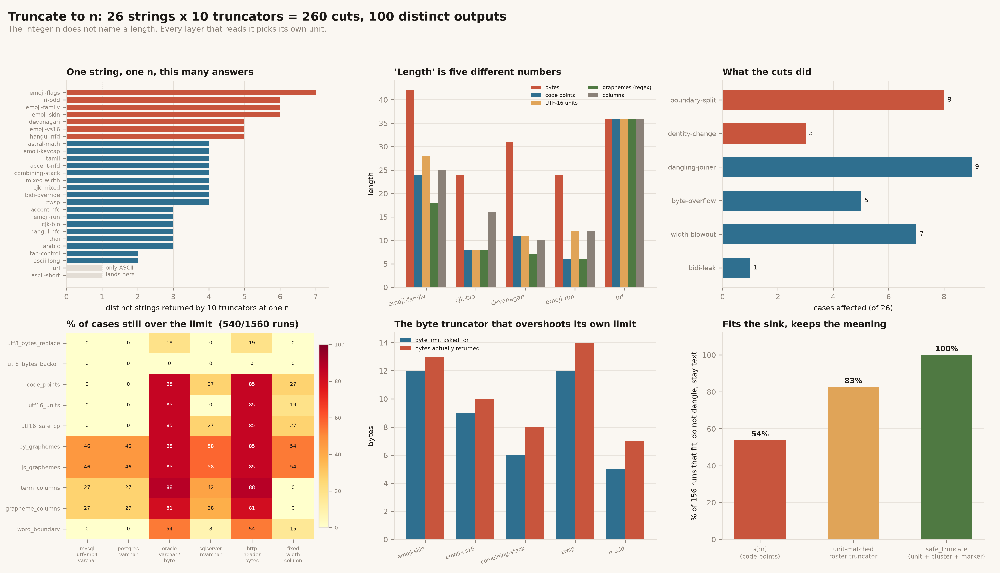

# Unicode Width Truncator

[](https://colab.research.google.com/github/phoebefu6/phoebe-the-builder/blob/main/data-engineering-pro/unicode-width-truncator/demo.ipynb)
[](https://mybinder.org/v2/gh/phoebefu6/phoebe-the-builder/main?labpath=data-engineering-pro/unicode-width-truncator/demo.ipynb)

> "Truncate to 20" does not name an operation. A truncator is three decisions - a **unit** of length, a **boundary** rule, and a **policy for the piece it removes** - and the integer 20 carries none of them. Every layer that reads that 20 picks its own unit: bytes in Go and Oracle, UTF-16 code units in Java and JavaScript, code points in Python and Postgres, grapheme clusters in a renderer, terminal columns in a report. The same call on the same string returns a different string in each of them, and two of those strings are not text at all.

**Day 153 - Data Engineering Pro.** 26 strings, 10 truncators, 260 cuts, 100 distinct outputs, 1,560 sink checks, 51 tests, and a notebook that rebuilds every truncator from scratch and asserts each headline number as it goes.



> **UAX #29** defines the grapheme cluster - the thing a user calls a character. It is a *rule set over a Unicode version*, not a fixed table, so two conforming implementations shipping different UCDs return different counts for the same string.
> **UTF-16** is a sequence of code units, not characters. A JavaScript or Java string may legally hold an **unpaired surrogate**, which is why `.slice()` can return a value with no UTF-8 encoding at all.
> **UTF-8** is self-synchronising, which is what lets a byte cut be *detected* - and the standard replacement for a broken sequence, U+FFFD, is three bytes long.

## Business Impact

- **Before:** a profile bio is capped at 20 in the form, in the API and in the column. Three different 20s. A user with an emoji or a CJK name gets a bio that renders with a black diamond, or a name that has silently lost its accent, or a row the database rejects with `Data too long for column` after the truncation was already applied. It reproduces for some users and not others, and the ticket sits open because "we already truncate it".
- **After:** the same value is pushed through 10 truncators at one N. **Only 2 of 26 corpus strings come back identical from all ten, and both are pure ASCII.** One bio at one N yields **6 different strings**. Across 1,560 truncate-then-store checks, **540 (35%) are still over the limit after being truncated to that same number**. Every one of those is a truncator whose unit is not the sink's unit.
- **Estimated ROI:** the audit runs in about two seconds over a column. The number worth the time is the split between the two failure modes: a cut that produces **invalid text** (8 of 26 cases) fails loudly at the next encode; a cut that produces a **different valid thing** (3 of 26) never fails at all. `José` becomes `Jose`, `👨‍👩‍👧‍👦` becomes `👨‍👩`, `👍🏽` becomes `👍`. Nothing in the stack raises, because there is nothing wrong with the result.

## Relationship to Days 147-152

Day 147 [`duration-parser`](../../automation-suite/duration-parser/) found the eight conforming readings of one duration string, Day 149 [`header-casing`](../../automation-suite/header-casing/) that a field name is rewritten by hops you do not own, Day 150 [`sort-order-drift`](../sort-order-drift/) that `ORDER BY name` is a collation rather than an order, Day 151 [`line-ending-detector`](../line-ending-detector/) that a file has no lines in it until a splitter makes them, Day 152 [`number-parser-locale`](../number-parser-locale/) that a numeric string does not contain a number until a reader assigns one.

Those five are all about **reading**: the bytes are fixed and the interpretation varies. This one is about **writing**, and that is the new ground. A truncator does not interpret the value, it *replaces* it - and it can replace it with something that is not text (a lone surrogate has no UTF-8 encoding, so the value cannot be stored or transmitted at all), or with something that is text and is not the same thing. Day 152's worst case was a number 1,000x off. Here the worst case is a value that no longer round-trips through the encoding that every other stage assumes.

There is also a failure mode none of the previous days had: **the operation violates its own contract**. `s.encode()[:12]` returns 13 bytes.

## What it does

Sixteen mechanisms, in sixteen sections of `evidence.py`. Every number below is printed by it.

### 1. The truncator roster

Nothing is modelled. `utf16_units`, `utf16_safe_cp` and `js_graphemes` are a real `node` subprocess (ICU 73.2 / Unicode 15.0); Python-side clusters are `regex`'s UAX #29 `\X`; widths are `wcwidth`.

| truncator | unit | where you meet it |
|---|---|---|
| `utf8_bytes_replace` | bytes | Go `s[:n]`, `head -c`, byte buffers |
| `utf8_bytes_backoff` | bytes | MySQL column overflow, ICU byte trim |
| `code_points` | code points | Python `s[:n]`, Postgres `substr`, MySQL `LEFT` |
| `utf16_units` | UTF-16 units | Java / C# / JS `substring`, SQL Server `nvarchar` |
| `utf16_safe_cp` | code points | `[...s].slice(0,n)` - the fix applied after the first bug |
| `py_graphemes` | graphemes (regex) | a Python text pipeline |
| `js_graphemes` | graphemes (ICU) | `Intl.Segmenter`, Swift `Character` |
| `term_columns` | columns | a `wcwidth` budget, a naive CLI table |
| `grapheme_columns` | columns | a cluster-safe CLI table |
| `word_boundary` | code points | teaser text, `textwrap.shorten` |

None is wrong. Each is correct for the limit it was written to protect, and unrelated to every other limit.

### 2. One bio, one N, six strings

`Family: 👨‍👩‍👧‍👦 in Perth`, n=12:

```
truncator            output                     B  cp  gr  col   finding
utf8_bytes_replace   Family: 👨                12   9   9   10   family of four -> one man
utf8_bytes_backoff   Family: 👨                12   9   9   10   family of four -> one man
code_points          Family: 👨<ZWJ>👩<ZWJ>     22  12   9   12   ends in ZERO WIDTH JOINER
utf16_units          Family: 👨<ZWJ><DD83D>    18  11  10   11   LONE SURROGATE
utf16_safe_cp        Family: 👨<ZWJ>👩<ZWJ>     22  12   9   12   ends in ZERO WIDTH JOINER
py_graphemes         Family: 👨‍👩‍👧‍👦 in         36  18  12   19
js_graphemes         Family: 👨‍👩‍👧‍👦 in         36  18  12   19
term_columns         Family: 👨<ZWJ>👩<ZWJ>     22  12   9   12   ends in ZERO WIDTH JOINER
grapheme_columns     Family:                    8   8   8    8
word_boundary        Family:                    7   7   7    7
```

Six distinct strings, ranging from 7 bytes to 36, for a single `truncate(bio, 12)`.

### 3. The limit is 20 *what?*

| string | bytes | code points | UTF-16 | graphemes (regex) | graphemes (ICU) | columns |
|---|---|---|---|---|---|---|
| `Family: 👨‍👩‍👧‍👦 in Perth` | 42 | 24 | 28 | 18 | 18 | 25 |
| `数据工程师，您好` | 24 | 8 | 8 | 8 | 8 | **16** |
| `क्षितिज नाम` | 31 | 11 | 11 | **7** | **6** | 10 |
| `https://example.com/a/very/long/path` | 36 | 36 | 36 | 36 | 36 | 36 |

The URL is the only row where the numbers agree, and it agrees because it is ASCII. A limit written as a bare integer is satisfied or violated depending on which of those columns the enforcing layer happens to count.

### 4. The same DDL, six different capacities

| sink | counts | note |
|---|---|---|
| MySQL `VARCHAR(n)` utf8mb4 | code points | characters, with a separate row byte cap |
| Postgres `varchar(n)` | code points | encoding-independent |
| Oracle `VARCHAR2(n)` | **bytes** | BYTE unless `NLS_LENGTH_SEMANTICS=CHAR` |
| SQL Server `nvarchar(n)` | UTF-16 units | astral characters cost 2 |
| HTTP header budget | bytes | bytes on the wire |
| fixed-width report cell | columns | CJK costs 2 per code point |

`VARCHAR(20)` in two of these databases holds a different amount of the same string.

### 5. Two ways a cut stops producing text

**a) A byte cut inside a multi-byte sequence** leaves a fragment; the next consumer decodes it to U+FFFD. Visible mojibake. **6 cuts** in the corpus.

**b) A UTF-16 cut inside a surrogate pair** leaves a **lone surrogate**. This is not mojibake - it is a legal JavaScript string with *no UTF-8 encoding at all*. **4 cuts**, all from `utf16_units`:

```python
>>> node_slice("Family: 👨‍👩‍👧‍👦 in Perth", 9)   # real node
'Family: \ud83d'
>>> _.encode("utf-8")
UnicodeEncodeError: 'utf-8' codec can't encode character '\ud83d': surrogates not allowed
```

It survives inside the JS process, survives `JSON.stringify`, and fails at the database write or the receiving parser - one hop away from where it was made.

### 6. The truncator that overshoots its own byte limit

`s.encode()[:n]` cuts a 4-byte emoji after its first byte. That orphan byte is decoded to U+FFFD, which **re-encodes to three bytes**.

```python
>>> s = "aa😀"
>>> cut = s.encode()[:3].decode("utf-8", "replace")   # limit: 3 bytes
>>> len(cut.encode())
5
```

| case | bytes out | limit | over by |
|---|---|---|---|
| `emoji-skin` | 13 | 12 | +1 |
| `emoji-vs16` | 10 | 9 | +1 |
| `combining-stack` | 8 | 6 | +2 |
| `zwsp` | 14 | 12 | +2 |
| `ri-odd` | 7 | 5 | +2 |

5 of 26 cases. The truncator enforcing the limit is the thing that violates it, and it does so *only* on the inputs that motivated the truncation.

### 7. Cuts that return a different valid thing

No error, no replacement character, no malformed byte. The output renders cleanly and passes every check downstream.

| meant | got | what changed |
|---|---|---|
| 👨‍👩‍👧‍👦 | 👨‍👩 | family of four -> couple, no children |
| 👨‍👩‍👧‍👦 | 👨 | family of four -> one man |
| 👍🏽 | 👍 | medium skin tone -> default yellow |
| 🇺🇸 | 🇺 | flag of the US -> a lone letter U |
| 1️⃣ | 1 | keycap 1 -> the digit 1 |
| ☕️ | ☕ | emoji coffee -> text-presentation coffee |

There is nothing wrong with any of these results. They are simply not the value that was stored. Skin tone is the one worth naming explicitly: a cut that drops the modifier does not corrupt anything, it changes a person's chosen representation of themselves back to the default, silently, on the way into the database.

### 8. What a dangling joiner does to the *next* value

**27 cuts** end in a code point that binds to whatever is concatenated after it: a ZWJ, a variation selector, a combining mark, or a lone regional indicator.

```
cut          👨‍👩‍👧<ZWJ>        1 cluster
+ 👦         👨‍👩‍👧‍👦             1 cluster   <- the original, reassembled
```

Two independently-truncated values fuse into one glyph that was in neither. The same mechanism runs the other way: append `…` to a cut ending in a combining mark and the mark lands on the ellipsis.

### 9. The same visible name, two normal forms, two truncations

`José Muñoz, Madrid` arrives as 18 code points (NFC) or 20 (NFD). It renders identically either way; macOS file APIs hand over NFD, most web forms hand over NFC, and the value does not record which.

```
n=12   NFC -> 'José Muñoz, '    12 visible characters
       NFD -> 'José Muñoz'      10 visible characters

n=9    NFC -> 'José Muño'
       NFD -> 'José Mun'        <- the tilde fell off
```

Same limit, same visible input, a different name. Nothing raised.

### 10. Two UAX #29 implementations in one pipeline

Python's `regex` (UCD 14.0) and Node's `Intl.Segmenter` (ICU 73.2 / Unicode 15.0) both implement UAX #29 correctly. The Indic conjunct rule changed between their Unicode versions:

```
क्ष     regex = 2 clusters     ICU = 1 cluster
क्षितिज नाम   regex = 7          ICU = 6
```

So an API written in Node and a worker written in Python **disagree about how many characters a Hindi name has**, inside one service, with no error anywhere. A limit of "6 characters" is two different limits depending on which process enforces it.

### 11. Fitting N units is not fitting N columns

A CJK code point is two terminal columns wide.

```
数据工程师，您好   code_points -> 12 code points, 16 columns   (n=12)
                  grapheme_columns -> 8 columns
```

Cutting a name to 12 code points for a 12-wide report cell puts 16 columns in it, and every column to the right of it shifts. **7 of 26 cases** blow the column budget while satisfying their own unit.

Width is also not always computable. `wcwidth` measures 👨‍👩‍👧‍👦 as **8 columns** - it sums the four emoji. A terminal that composes the ZWJ sequence draws **2**. A terminal that does not draws 8. Both exist; the string does not carry the answer, the renderer decides it.

### 12. A cut that leaks a bidi override

The input opens an RTL override and closes it, balance 0. A cut between the two keeps the opener and drops the closer, so the override escapes the value and reverses text belonging to whatever renders next - the neighbouring cell, the rest of the line. `safe_truncate` drops trailing clusters until the balance is zero again.

### 13. The ellipsis has to come out of the budget

One `…` costs 3 bytes, 1 code point, 1 UTF-16 unit, 1 column. Cutting to exactly N and *then* appending it is over the limit in **210 of the 230 cuts** that removed anything - which is to say, essentially always. `safe_truncate` subtracts the marker before it starts.

### 14. Truncating to 20 does not make it fit a limit of 20

10 truncators x 6 sinks x 26 cases = 1,560 runs. **540 (35%) are still over the limit.**

| sink | over limit, of 260 |
|---|---|
| `oracle_varchar2_byte` | 173 |
| `http_header_bytes` | 173 |
| `sqlserver_nvarchar` | 67 |
| `fixed_width_column` | 51 |
| `mysql_utf8mb4_varchar` | 38 |
| `postgres_varchar` | 38 |

A truncator is correct relative to one unit. Pointed at a sink counting a different unit it is not approximately right - it is unrelated.

### 15-16. The only question that decides a truncator

Not "how do I truncate safely". There is no safe cut in the abstract. The question is **what does the thing I am protecting count?** Answer that and the truncator follows.

`safe_truncate(text, n, sink)` does three things the roster truncators do not all do: measures in the sink's own unit, reserves the marker inside the budget, and never splits a cluster - then drops trailing clusters until nothing dangles and the bidi balance is zero.

| approach | of 156 runs: fits, no dangle, still text |
|---|---|
| `s[:n]` (code points) | 54% |
| the roster truncator whose unit matches the sink | 83% |
| `safe_truncate` | **100%** |

The middle row is the interesting one. Matching the unit fixes the *limit* and leaves the *meaning* broken - it still splits clusters, still drops skin tones, still leaves joiners dangling. Both halves are needed.

## API

```python
import uwidth as U

# One string, every truncator, at one n
cuts = U.cut_all(U.Case("bio", "Family: 👨‍👩‍👧‍👦 in Perth", 12, "profile"))
cuts["utf16_units"].lone_surrogate          # True - no UTF-8 encoding exists
cuts["utf8_bytes_replace"].overflows_own_limit   # a byte cut that returned more bytes than n
cuts["code_points"].dangling                # 'ZERO WIDTH JOINER'

# What did the cut turn the value into?
U.identity_change("👍🏽", "👍")               # 'medium skin tone -> default yellow'

# How long is this, really?
U.unit_spread(U.CASE_BY_NAME["cjk-bio"])    # bytes 24, code points 8, columns 16, ...

# Will the truncated value fit the thing it was truncated for?
U.fits(U.SINK_BY_NAME["oracle_varchar2_byte"], "Family: 👨‍👩", 12)   # False

# The answer
U.safe_truncate("Family: 👨‍👩‍👧‍👦 in Perth", 20, "oracle_varchar2_byte")
U.choose_truncator("sqlserver_nvarchar")    # 'utf16_units'

# Do the two segmenters in my stack agree?
U.segmenter_disagreements()                 # [('devanagari', 7, 6)]
```

## Tech Stack

Python 3.11 - `regex` (UAX #29 grapheme clusters) - `wcwidth` (terminal columns) - a real `node` subprocess for `String.slice` and `Intl.Segmenter` - `unicodedata` for normalisation and combining classes - matplotlib - pandas - Streamlit - pytest - ruff - Docker

## Demo

**[Run the interactive demo notebook →](demo.ipynb)** - pre-rendered with all outputs, or click the Colab/Binder badges above to run it live. The notebook rebuilds all the truncators from scratch (no import of `uwidth`) so it runs standalone, and asserts every headline number as it goes.

```bash
pip install -r requirements.txt

python evidence.py            # 16 sections, every claim printed from the live truncators
python -m pytest -q           # 51 tests
python make_chart.py          # regenerate truncation_audit.png / .svg
streamlit run app.py          # paste a string, see all ten cuts
```

The Streamlit app has four tabs: **One string** (ten cuts, findings, and what `safe_truncate` returns for each sink), **Will it fit?** (the 1,560-run truncate-then-store matrix), **The corpus** (all 26 cases and both censuses), **Why ten answers** (the roster, and the two segmenters that disagree).

## Learning Connection

Built while studying text encoding contracts at storage boundaries. Applies: reading a specification for what it *permits* rather than what it usually does - UAX #29's cluster rules as a function of Unicode version, UTF-16's tolerance of unpaired surrogates, UTF-8's self-synchronising property and the 3-byte replacement character that follows from it, and the CHAR/BYTE length semantics that differ across four production databases. Each one is documented behaviour that returns a different string from the same call; none is a bug to be fixed.

## Impact Note

- **Who benefits:** anyone writing user-supplied text into a bounded field - display names, bios, subject lines, product titles from partner feeds, filenames, log fields, anything with a `maxlength` on one side and a `VARCHAR(n)` on the other.
- **Potential risks:** `safe_truncate` is correct for the sinks in `SINKS` and no others; pointing it at a sink whose unit is not modelled here (a font-metric pixel width, a Twitter-style weighted count, an EBCDIC field) will produce a confident wrong answer. `wcwidth` reports the *nominal* East Asian Width; a specific terminal, font or renderer may draw a different number of columns, and section 11 shows a case where the true answer is renderer-dependent and not derivable from the string. The bidi handling clears unbalanced scopes but does not attempt to detect a spoofing attempt in the original value. The corpus is 26 strings; a script not represented here (Mongolian, Khmer with its own cluster rules, an unusual emoji sequence added after Unicode 15) is not covered. All counts are for `regex` on UCD 14.0 and Node 22 / ICU 73.2 - the tests assert them, so an upgrade fails loudly rather than quietly making this README wrong.
