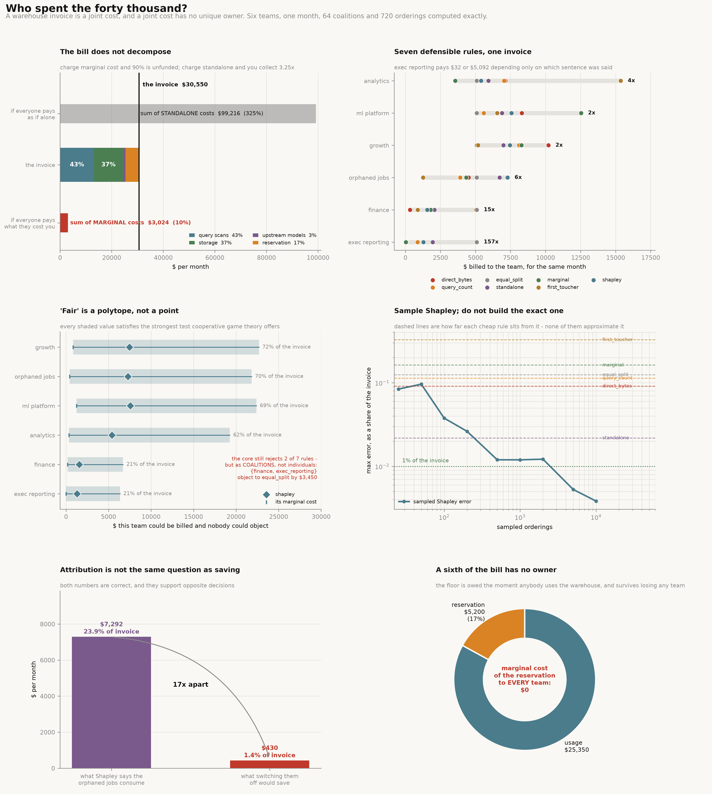

# Warehouse Cost Attribution

[](https://colab.research.google.com/github/phoebefu6/phoebe-the-builder/blob/main/data-engineering-pro/warehouse-cost-attribution/demo.ipynb)
[](https://mybinder.org/v2/gh/phoebefu6/phoebe-the-builder/main?labpath=data-engineering-pro/warehouse-cost-attribution/demo.ipynb)

> Finance forwards the warehouse bill and asks which team spent it. The question sounds like accounting and it is not. Storage is paid once however many teams need the table, an upstream model is built once for everyone who consumes it, the second read of the day costs 2% of the first, and the reservation is owed the moment anybody shows up at all. That makes the invoice a **joint cost**, and a joint cost has no unique owner — only a menu of defensible answers that disagree by more than the decisions they inform.

**Day 161 - Data Engineering.** Six teams, one month, one characteristic function, all 64 coalitions and all 720 orderings computed exactly, seven attribution methods, the core solved as a linear program, 32 tests, and a notebook that rebuilds every figure from numpy and scipy.



> **Charge every team what it costs you and 90% of the bill has no payer.** Marginal cost — the amount that stops being spent if a team stops querying, the most defensible number in the building — recovers **9.9%** of the invoice. Charge standalone cost instead and you collect **325%**. No rule is both defensible per team and exact in total.
>
> **Seven defensible rules bill one team $32 or $5,092** — a factor of **157** — and they name **three different teams** as the most expensive. The single most consequential output of a cost review is which team you go and talk to, and that is a function of the method.
>
> **"Fair" is not a point, it is a polytope, and it is 72% of the invoice wide.** The core — every allocation no coalition would walk out of — is non-empty and enormous. `growth` can be billed $820 or $22,687 with nobody having grounds to object either way. Game theory rejects the two rules people reach for first and leaves everything else.
>
> **The orphaned jobs are charged $7,292 and switching them off saves $430** — 17x apart, both correct. Attribution answers *who consumed it*. It does not answer *what would we save*. Budget decisions need the second.

## Business Impact

- **Before:** a cost review opens with one allocation, produced by whichever rule the spreadsheet already had. The number is treated as a fact, the biggest line is treated as the problem, and nobody records that a different defensible rule would have named a different team and a different amount.
- **After:** the allocation carries its method, the range of allocations that are equally defensible, and an explicit statement of the portion of the bill — here **17%** — that has no owner under any rule. Cancellation decisions are made against the *saving*, which is computed separately and is an order of magnitude smaller than the attribution.
- **Estimated ROI:** on a $30,550 month, method choice alone moves a single team's bill by up to $15,335 and moves *which* team is the target of the review. Acting on attribution instead of saving would cancel a workload charged $7,292 to realise $430.

## Where this sits

**First build in data platform economics.** A coverage audit across the 160-build catalogue found zero tools touching infrastructure cost — the artifact that keeps a data team funded, absent from an estate strong on pipelines and metrics.

It is **not** metering. [`llm-cost-tracker`](../../llmops-genai-platform/llm-cost-tracker/) (Day 85) and [`token-cost-estimator`](../../llmops-genai-platform/token-cost-estimator/) (Day 125) log and forecast per-call spend, where each call has its own separable price. Nothing here is separable — that is the entire subject.

It is **not** rounding a total. [`currency-rounder`](../currency-rounder/) (Day 143) makes a ledger's rows add to its total, and [`percent-recomputer`](../../analytics-engineering-bi/percent-recomputer/) (Day 148) treats a percentage column as an apportionment with quota paradoxes. Both divide a total that is *already known to belong* to the rows. Here the question is prior: whether it belongs to any row at all.

Nearest neighbour in spirit is the decision-support arc — [`expected-value-calc`](../../mini-saas-products/expected-value-calc/), [`cost-of-delay`](../../mini-saas-products/cost-of-delay/) — and [`guardrail-metric`](../../analytics-engineering-bi/guardrail-metric/) (Day 160), which likewise ends on a number that is a property of the method rather than the business.

## What it does

Ten sections in `evidence.py`. Every number below is printed by it and asserted in `test_costs.py`.

### 1. A month with a known answer

Everything derives from one function — `v(S)`, the invoice coalition `S` would have generated alone:

$$v(S) = F + \sum_{\text{tables } t} \Big[ c_t \cdot g_t \cdot r_{\text{scan}} + (R_t - c_t)\, g_t\, r_{\text{scan}} \kappa + s_t\, r_{\text{store}} \Big] + \sum_{m \,:\, \text{cons}(m) \cap S \neq \emptyset} D\, b_m\, r_{\text{scan}}$$

where $c_t = \min(R_t, D \cdot k)$ is the number of cold scans, $\kappa$ the cache rate and $F$ the reservation. Three joint mechanisms, one floor.

| component | $ | share | what makes it joint |
|---|---:|---:|---|
| query scans | 13,074.75 | 42.8% | the 2nd read of a table that day costs 2% of the 1st |
| storage | 11,330.00 | 37.1% | paid once, however many teams need the table |
| upstream models | 945.31 | 3.1% | built once, for everyone who consumes them |
| reservation | 5,200.00 | 17.0% | owed the moment **anybody** uses the warehouse |
| **invoice** | **30,550.06** | | |

The function is monotone, subadditive and emphatically not additive — all four asserted in the tests. Summing what each team would cost alone gives **$99,216** against an invoice of **$30,550**. The difference, **$68,666**, is the value of sharing, and it belongs to nobody.

### 2. Seven defensible rules, one invoice

| method | analytics | growth | finance | ml_platform | exec_reporting | orphaned |
|---|---:|---:|---:|---:|---:|---:|
| `direct_bytes` | 7,123 | 10,212 | 332 | 8,302 | 70 | 4,511 |
| `query_count` | 7,046 | 8,108 | 5,019 | 5,598 | 869 | 3,909 |
| `equal_split` | 5,092 | 5,092 | 5,092 | 5,092 | 5,092 | 5,092 |
| `standalone` | 5,930 | 6,986 | 2,065 | 6,897 | 1,953 | 6,720 |
| `marginal` | 3,556 | 8,282 | 1,802 | 12,534 | 32 | 4,345 |
| `first_toucher` | **15,367** | 5,193 | 876 | 6,552 | 1,299 | 1,263 |
| `shapley` | 5,395 | 7,460 | 1,554 | 7,564 | 1,285 | 7,292 |
| **spread** | 4.3x | 2.0x | 15.4x | 2.5x | **156.9x** | 5.8x |

Every column adds to the same invoice. `exec_reporting` pays between $32 and $5,092 depending on nothing but which sentence was said out loud — and the "most expensive team" is **growth**, **analytics** or **ml_platform** depending on the rule.

### 3-4. The two honest rules, and why neither can be used

| rule | what it means | recovers |
|---|---|---:|
| marginal cost | what stops being spent if this team stops querying | **9.9%** |
| the invoice | | 100% |
| standalone cost | what this team would have paid alone | **324.8%** |

Both are true per team. Neither adds up. This is not a modelling artefact — it is the definition of a joint cost, and it is why every practical rule is a normalisation of one of them and therefore a choice.

### 5. Shapley, exactly

720 orderings and 64 coalitions, computed exhaustively in 0.06s. It is the unique rule satisfying efficiency, symmetry, the dummy axiom and additivity simultaneously — and the tests verify symmetry and the dummy axiom directly by constructing a twin team and a constant-contribution ghost.

Uniqueness is a strong claim about the *method*. Section 6 is about how much weaker a claim it is about whether anybody would accept the bill.

### 6. "Fair" is a polytope, not a point

The **core** is every allocation where no group of teams is asked to pay more than that group would have cost alone. It is a linear program, so it can be not just tested but *measured*.

| team | core min | core max | width | width / invoice | shapley |
|---|---:|---:|---:|---:|---:|
| growth | 820 | 22,687 | 21,867 | **71.6%** | 7,460 |
| orphaned jobs | 430 | 21,823 | 21,393 | 70.0% | 7,292 |
| ml_platform | 1,241 | 22,400 | 21,159 | 69.3% | 7,564 |
| analytics | 352 | 19,259 | 18,907 | 61.9% | 5,395 |
| finance | 178 | 6,705 | 6,527 | 21.4% | 1,554 |
| exec_reporting | 3 | 6,343 | 6,339 | 20.8% | 1,285 |

The lower bound is exactly each team's marginal cost and the upper bound exactly its standalone cost — both asserted in the tests, and both a direct consequence of the coalition constraints.

| method | in core | worst objection | objecting coalition |
|---|---|---:|---|
| `direct_bytes` | **NO** | $44 | analytics + growth + ml_platform + orphaned |
| `equal_split` | **NO** | $3,450 | finance + exec_reporting |
| `query_count`, `standalone`, `marginal`, `first_toucher`, `shapley` | yes | — | |

`equal_split` — six teams, six ways — is rejected because finance and exec_reporting *together* would rather run their own warehouse. Nobody objects individually, which is exactly why the objection never surfaces in the meeting. The strongest fairness test in the theory rejects 2 of 7 rules and leaves 5 that still disagree by ~60x on one team.

### 7. The part of the bill that belongs to nobody

The reservation is **17.0%** of the invoice and its marginal cost to *every single team* is zero — losing any one team does not reduce it. There is no non-arbitrary way to divide it.

And the sharpest pair of numbers in the build:

| | $ | % of invoice |
|---|---:|---:|
| what Shapley says the orphaned jobs consume | 7,292 | 23.9% |
| what switching those same jobs off would save | 430 | 1.4% |
| | **17x apart** | |

Both correct. The jobs really do consume a quarter of the warehouse by any consumption measure, and turning them off really would save almost nothing, because everything they read is read by somebody else anyway. A review acting on the first number cancels the workload and never sees the saving.

### 8. The same query, priced by who ran first

One scan of `events_raw` (9,800 GB) costs **$47.85** as the first read of the day and **$0.96** as any read after it — a **50x** ratio for byte-identical work. The cost of a query is not a property of the query; it is a property of the queue.

`first_toucher` prices this honestly and the result is absurd: analytics is billed 50% of the invoice because it sorts first alphabetically, which is exactly as principled as sorting by who has the earliest cron. Any rule that charges the cold scan to whoever triggers it pays every team 50x to wait for somebody else to go first.

### 9. Does the sophistication pay?

| sampled orderings | max error | % of invoice |
|---:|---:|---:|
| 50 | 2,940 | 9.62% |
| 1,000 | 366 | 1.20% |
| 5,000 | 162 | **0.53%** |

**NEGATIVE RESULT:** the 2^n objection to Shapley is real in complexity and mostly irrelevant in practice. A few thousand sampled orderings land inside 1% of exact. Do not build the exhaustive version for a warehouse with thirty teams — sample it.

And no cheap rule approximates it. The closest, `standalone`, is still 2.2% of the invoice away on some team — **$668**, or 52% of exec_reporting's entire Shapley share. The choice is between sampling Shapley and admitting out loud that you picked a different rule.

### 10. What a cost allocation has to carry

1. **The method, named.** Seven rules, three different "most expensive team".
2. **The admission that it cannot add up.** 9.9% or 325%; never 100% and defensible.
3. **A range, not a number.** The core is up to 72% of the invoice wide.
4. **What it refuses to attribute.** 17% of the bill, marginal cost zero to everyone. Dividing it is a political act, not an accounting one.
5. **The gap between blame and saving.** 17x, on the line item that looks most actionable.
6. **The incentive it creates.** 50x to run late.
7. **Its own cost.** Sample Shapley; do not build the exact one.

## Tech Stack

Python 3.12, numpy, scipy (`linprog` for the core), matplotlib, Streamlit, pytest, ruff, Docker. No dataset and no API: the month is simulated from one characteristic function so the true structure is known and every claim is checkable.

## Demo

**[Run the interactive demo notebook →](demo.ipynb)** — pre-rendered with outputs, or click the Colab/Binder badges above to run it live.

```bash
pip install -r requirements.txt
python evidence.py                # the full ten-section study
python -m pytest test_costs.py -q # 32 tests pinning every number
python make_chart.py              # regenerate the hero figure
streamlit run app.py              # split the invoice, watch the answer move
```

## How it is built

| file | what it holds |
|---|---|
| `costs.py` | the month, the characteristic function, seven attribution methods, exact and sampled Shapley, the core as an LP |
| `evidence.py` | the ten sections; every printed number is derived, none typed |
| `test_costs.py` | 32 tests — monotonicity, subadditivity, Shapley's symmetry and dummy axioms verified directly, the core bounds proved to equal marginal and standalone cost |
| `make_chart.py` | the six-panel hero figure, PNG + SVG |
| `app.py` | Streamlit: pick methods, see the spread and the core |
| `build_notebook.py` | generates `demo.ipynb`, which re-implements a compact engine so Colab needs nothing else |

The cost game is deterministic, so almost every test asserts an exact value rather than a tolerance. The two Shapley axioms are not asserted from the literature but *demonstrated*: a twin team with identical reads and identical model consumption is constructed and shown to receive an identical share, and a ghost team contributing a constant to every coalition is shown to be billed exactly that constant.

## Learning Connection

Built while studying data platform economics and cooperative game theory. Applies: characteristic-function cost games, subadditivity, the Shapley value and its axiomatisation, the core as a linear program, Monte Carlo approximation of Shapley values, and the difference between attribution and avoidable cost.

## Impact Note

- **Who benefits:** data platform and FinOps teams who have to publish a chargeback number, and anyone about to cancel a workload because it is large in a cost report.
- **Potential risks:** the specific figures are properties of these constants — a warehouse with less sharing has a narrower core and better-behaved methods, and the notebook's section 4 exercise asks you to check exactly that. What transfers is the method: compute the marginal cost separately from the attribution, state which rule you used, and publish the range. The reverse failure is also real — presenting a wide core as licence to pick any number is not the argument here. The core rules out the two most common rules, and a stated rule applied consistently beats an unstated one applied ad hoc.
