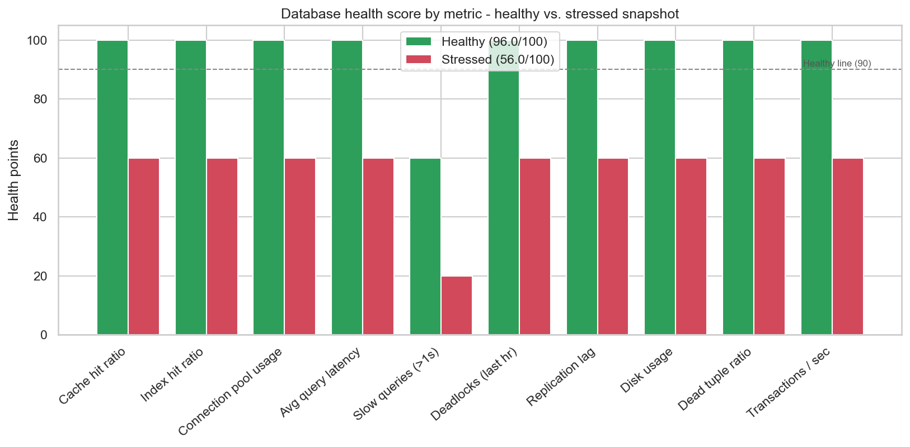

# Database Health Dashboard

[](https://colab.research.google.com/github/phoebefu6/phoebe-the-builder/blob/main/data-infra-toolkit/db-health-dashboard/demo.ipynb)
[](https://mybinder.org/v2/gh/phoebefu6/phoebe-the-builder/main?labpath=data-infra-toolkit/db-health-dashboard/demo.ipynb)

> One screen of database visibility - cache hits, latency, locks, replication lag - scored red/amber/green so problems surface before users notice.

## Business Impact
- **Before:** Teams discover DB trouble from angry users. No single view of cache hit ratio, query latency, deadlocks, replication lag, or disk pressure.
- **After:** Every metric is scored RAG against a threshold and rolled into one 0-100 health score with a plain-English grade (Healthy / Watch / Critical).
- **Estimated ROI:** ~3 hrs/week saved on manual `pg_stat_*` spelunking + earlier incident detection.

## Tech Stack
Python, Streamlit, pandas, matplotlib/seaborn (notebook charts), Docker.

## Demo

**[Run the interactive demo notebook →](demo.ipynb)** - pre-rendered with outputs, or click the Colab/Binder badges above to run it live.



For the Streamlit app:
```bash
pip install -r requirements.txt
streamlit run app.py
```
Toggle **Simulate DB under load** in the sidebar to watch the board go amber/red.

## How it works
- `health.py` - the engine: `METRIC_SPECS` (10 metrics + thresholds), a direction-aware `score_metric`, `build_report` (RAG table), and `overall_health` (0-100 roll-up).
- `app.py` - the Streamlit dashboard: health gauge, RAG metrics table, score-by-metric bar chart, and a "what to do about the reds" panel.
- Metrics are **simulated** by default so it runs anywhere. In production, swap `simulate_metrics` for live `pg_stat_database` / `pg_stat_activity` queries - the scoring layer stays identical.

## Learning Connection
Built while studying the **Data Engineer Career Track (DataCamp)** and **Monitoring & Observability** fundamentals.
Applies: database internals (cache/index hit ratios, dead tuples, replication lag), threshold-based alerting, and RAG health scoring. Caps **Month 1: Data Infrastructure Toolkit**.

## Impact Note
- **Who benefits:** On-call engineers, DBAs, and data platform teams needing at-a-glance DB health.
- **Potential risks:** Thresholds are starting defaults - tune `METRIC_SPECS` to your SLOs. A green score is only as honest as the metrics feeding it; wire it to real telemetry before trusting it on-call.
