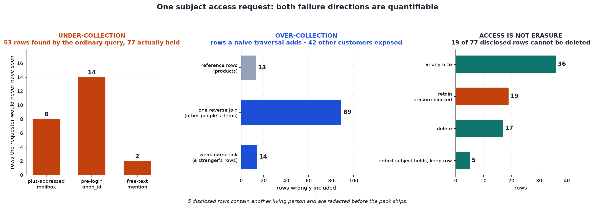

# DSAR Extractor

[](https://colab.research.google.com/github/phoebefu6/phoebe-the-builder/blob/main/data-quality-governance/dsar-extractor/demo.ipynb)
[](https://mybinder.org/v2/gh/phoebefu6/phoebe-the-builder/main?labpath=data-quality-governance/dsar-extractor/demo.ipynb)

> A subject access request arrives with one email address. Finding the rows is easy. Finding *all* of them and *only* them is the actual job - and getting it wrong fails in two opposite directions, both of which are breaches.

**Day 134 - Data Quality & Governance.** Resolve one person across an 11-table warehouse with an evidence trail, withhold what belongs to someone else, and say plainly which rows you are not allowed to delete.

## Business Impact
- **Before:** a DSAR is an analyst with a text editor writing `WHERE email = ?` against whichever tables they remember. Nobody measures what the query missed. Nobody checks whether the export contains a second person. The response ships, and the two failure modes - under-collection and over-disclosure - are both invisible until a regulator asks.
- **After:** one declarative subject map produces the disclosure pack, the withheld-third-party list, an identity audit trail a reviewer can challenge, and a separate erasure plan. On the bundled request, the ordinary query finds **53 of the 77 rows actually held** - and a naive traversal of the same schema would have exposed **89 line items belonging to 42 other customers**.
- **Estimated ROI:** replaces 3-6 hours of manual extraction per request and removes the two review steps most often skipped. GDPR gives you one month per request (Art. 12(3)); Singapore's PDPA expects 30 days. The cost of getting it wrong is the reason this is worth automating.

## What it does

Four mechanisms, in the order they matter.

### 1. Identity resolution - one person is many keys

The subject is stored four different ways. The requested address matches exactly none of the interesting ones:

| Stored spelling | `= 'amara.osei@example.com'` | Same mailbox? |
|---|---|---|
| `Amara.Osei@Example.com` (customers) | no | yes |
| `amara.osei+support@example.com` (tickets) | no | yes |
| `amara.osei+shop@example.com` (tickets) | no | yes |
| `amara.osei@example.com` (marketing) | yes | yes |

Case-folding rescues one. Nothing about `=` rescues the plus-addressed pair. Resolution then walks outward to `customer_id`, `phone`, and two `anon_id` values from before she ever logged in - each one carrying **why** it is believed to be the same person, because "the join found it" is not a defence.

The normalizer deliberately does **not** strip dots from the local part. That is a Gmail convention; applied to a corporate domain it merges two employees into one data subject, and the response mails one person's records to the other. Under-normalizing loses rows. That particular over-normalization discloses someone else's.

### 2. Abstention - the link the tool refuses to join on

There is a second Amara Osei in the customer table. Same name, different mailbox, different person. Every fuzzy-matching library on the shelf will happily merge them.

The tool records the candidate at strength `weak`, refuses to join on it, and prices the alternative:

```
HELD BACK: customer_id=C0047
           same full_name 'Amara Osei', different mailbox
           (a.osei@other-example.com) - needs a human decision

Auto-including it would have disclosed 3 orders, 3 payments and
8 line items belonging to 1 completely different person.
```

Under-collection annoys the requester. Over-resolution is a personal data breach with the requester as the recipient. Only a human should close that gap.

### 3. Scope - relatedness is not aboutness

Her orders are hers, so the line items on those orders are hers - a **subject-scoped** edge, declared once. But `order_items.product_id` points at the product catalog, and a product row is not personal data about anybody. It is *reachable* from her data, which is a different claim.

Declare that edge `reference` and the walk stops. Do not, and:

| Traversal step | Rows collected |
|---|---|
| forward to `products` | **13** reference rows, personal data about nobody |
| one step back to `order_items` | **89** line items |
| ...belonging to | **42 other customers** |

That reverse join is the mechanism behind most "we sent the wrong data" DSAR incidents.

### 4. Third-party withholding

GDPR Art. 15(4): the right to a copy *"shall not adversely affect the rights and freedoms of others."* PDPA s.21(3) and Schedule 5 carve out the same thing.

Some rows genuinely belong to two people at once - a thread another customer replied inside, a gift order carrying the recipient's address, a referral where one side is the subject and one side is not. **5 of 77 disclosed rows** are like this. You cannot drop them (they are her data). You cannot ship them raw:

```
BEFORE  author_email  jonas.berg12@example.com
AFTER   author_email  [third party - withheld under Art. 15(4)]
```

Redaction also sweeps free-text columns, and never touches the subject's own values.

### Plus: the rows no join reaches

Somebody wrote her address into the body of *someone else's* ticket:

> *"Escalated. Refund was actually issued to amara.osei@example.com in error."*

Personal data about her, held by the controller, squarely inside Art. 15 - and no join on any key will ever find it. **2 rows** here are reachable only by a free-text sweep. It is the crudest mechanism in the tool and the one most likely to need tuning; it matches on resolved identifiers rather than names, precisely because name matching is what mechanism 2 abstained from.

### And: access is not erasure

An erasure request returns a *different set of rows*. Art. 17(3)(b) yields to a legal obligation, and seven years of accounting records outrank the erasure right.

| Action | Rows | Why |
|---|---|---|
| `anonymize` | 36 | null the identifier, keep the event - deleting outright silently restates your historical traffic |
| `retain - erasure blocked` | **19** | statutory hold, with the basis and the release date named |
| `delete` | 17 | no retention obligation |
| `redact subject fields, keep row` | 5 | shared with another person - deleting would erase *their* data |

Telling a requester "your data has been deleted" while 19 rows sit under a statutory hold is its own compliance failure. The plan cites the basis and the date each hold releases.

## Measured



The baseline is not a strawman - it is a case-insensitive email match followed by a `customer_id` join, which is what most controllers actually run. It still misses **24 of 77 rows (31%)**: 8 through plus-addressed mailboxes, 14 pre-login events reachable only via `anon_id`, 2 free-text mentions.

## Tech Stack

Python 3.9+ · standard library only for the engine · Streamlit (UI) · pandas + matplotlib (reporting) · Docker

No database, no network, no LLM, no real personal data - the 11-table warehouse is generated deterministically.

## Demo

**[Run the interactive demo notebook →](demo.ipynb)** - pre-rendered with all outputs, or click the Colab/Binder badges above to run it live.

Streamlit app - change the identifier, move the retention date, and watch the disclosure pack, the withheld rows and the erasure plan change:

```bash
pip install -r requirements.txt
streamlit run app.py
```

The four guarantees, asserted (19 checks):

```bash
python3 test_dsar.py
```

CLI report:

```bash
python3 dsar.py
```

## Adapting it

The engine is generic; the **subject map** is what you replace. Declare each table once:

```python
TableSpec("crm_note", "note_id",
          keys=(KeyCol("author_email", "email"),),
          text_cols=("note_body",),          # swept for mentions
          erasure="redact")

TableSpec("dim_product", "product_sk", category="reference")   # walk stops here

TableSpec("fct_invoice", "invoice_id",
          keys=(KeyCol("customer_sk", "customer_id"),),
          retention=Retention("Tax: 7 years from invoice date", 7, "invoice_date"))
```

Resolution, abstention, redaction and the erasure plan all follow from that declaration. Review `ident.weak` before extracting - that is the human decision the tool refuses to make for you.

## Learning Connection

Built while working through data governance and privacy engineering practice.
Applies: GDPR Art. 15 (access), Art. 15(4) (third-party limit), Art. 17 (erasure and its exceptions), Art. 12(3) (one-month deadline); PDPA s.21 and Schedule 5; identity resolution with explicit confidence tiers; k-anonymity-adjacent thinking carried over from [pii-redactor](../pii-redactor) (Day 124).

## Impact Note

- **Who benefits:** privacy officers and DPOs who currently answer DSARs by hand; data engineers asked to "just pull everything about this person"; the data subject, who gets a complete answer instead of whatever one table remembered.
- **Potential risks:** the subject map is a set of legal judgements written as code - mislabel a `personal` table as `reference` and you systematically under-disclose, with no error raised. The free-text sweep will miss mentions by name or by an identifier the controller never linked. Identity resolution beyond exact matching is where over-disclosure lives, which is why weak links abstain rather than resolve; treat that hold as a real review step, not a warning to click past. Nothing here is legal advice - article and section numbers are cited so privacy counsel can check the mapping against your own obligations, and retention periods in particular are jurisdiction-specific.
