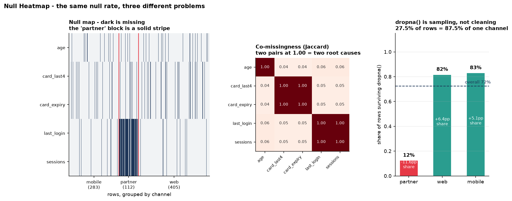

# Null Heatmap

[](https://colab.research.google.com/github/phoebefu6/phoebe-the-builder/blob/main/data-quality-governance/null-heatmap/demo.ipynb)
[](https://mybinder.org/v2/gh/phoebefu6/phoebe-the-builder/main?labpath=data-quality-governance/null-heatmap/demo.ipynb)

> `df.isna().sum()` answers the wrong question.

A per-column null count hides the only thing that matters: whether the nulls are **independent** or **correlated**. 8% missing spread evenly is a nuisance you impute. 8% missing that always lands on the *same rows* is a broken join or a late-arriving source - and `dropna()` will silently delete that entire population. That's how a customer cohort disappears from a model's training data without anyone noticing.



## Business Impact
- **Before:** null handling is decided from a column of counts. `dropna()` gets called, the log says "dropped 220 rows," and nobody checks which rows.
- **After:** the co-missingness matrix says how many root causes you actually have, the segment report says who pays for them, and the `dropna()` cost is quantified per segment before it's run.
- **Estimated ROI:** on the bundled sample, `dropna()` looks like it costs 27.5% of rows. It actually costs **87.5% of one acquisition channel**, collapsing that channel from 14.0% of the population to 2.4%. Catching that before training is the entire return.

## Tech Stack
Python · pandas · numpy · Streamlit · matplotlib - fully offline, works on any DataFrame or uploaded CSV

## Key insight
**The same null rate means three different things, and one number can't tell them apart.**

| Columns | Null rate | Jaccard | Segment spread | Verdict |
|---|---|---|---|---|
| `age` | 6% | 0.06 | 0.02 | imputable - independent nulls |
| `card_last4` + `card_expiry` | 9% | **1.00** | 0.02 | engineering bug - one join, hit everyone equally |
| `last_login` + `sessions` | 15% | **1.00** | **0.82** | governance problem - removes a population |

Both column pairs sit at Jaccard 1.00 - each is *one* root cause, not two. That already reduces five null counts to three problems. But they are not the same kind of problem, and the difference only appears on a **second, independent axis**:

- **Column lockstep (Jaccard)** tells you *how many root causes* there are.
- **Segment spread** tells you *who pays*. `last_login` is 14% complete for `partner` customers against 97% everywhere else.

The card columns are a pipeline bug: fix the join, lose no population. The activity columns are a governance issue: anything already trained on complete rows has essentially never seen a partner customer. Reporting only the first axis is how the second one ships.

**Why Jaccard and not correlation** - measured, not assumed. Both agree on perfect lockstep (each returns 1.0). The problem is in the middle: two columns sharing **half** their nulls score `phi=0.490` at a 2% null rate but `phi=0.286` at a 30% rate. Same overlap, two different numbers, because phi is base-rate dependent - and every pair in a real table has a different base rate, which is exactly when you need to compare them. Jaccard returns **0.333** for both, because it asks only the question being asked: *of the rows missing in either column, what share are missing in both?*

**Edge case handled:** two fully-complete columns have an empty union. Jaccard is 0/0 there, and the code returns **0, not 1** - calling it a perfect match would flag every clean column pair in the table as "structural."

## What it reports

- **Per-column** completeness, null count, mechanism (`complete` / `structural` / `correlated` / `scattered`), strongest co-missing partner, and segment spread
- **Co-missingness matrix** - Jaccard overlap of null positions for every pair
- **Row signatures** - the distinct null patterns, ranked. Eight signatures cover the 800-row sample; a genuinely random-missing frame produced 15 in 500 rows with a max pairwise Jaccard of 0.117
- **`dropna()` cost** - rows lost, plus per-segment retention and the percentage-point shift in population composition
- **Completeness by segment** - per column, so you can see where the gap lives

## Demo

**[Run the interactive demo notebook →](demo.ipynb)** - pre-rendered, including the phi-vs-Jaccard measurement and the bias check. Or click the Colab/Binder badges.

Streamlit app (5 tabs; upload your own CSV):
```bash
pip install -r requirements.txt
streamlit run app.py
```

CLI report:
```bash
python missingness.py
```

Before you call `dropna()`:
```python
from missingness import dropna_cost
d = dropna_cost(df, segment="channel")
assert not d.get("bias_warning"), d["bias_warning"]
```

## Learning Connection
Built while studying data quality measurement and missing-data theory (MCAR / MAR / MNAR).
Applies: Jaccard vs phi under varying base rates, co-missingness analysis, null-pattern signatures, and treating imputation and row-dropping as sampling decisions rather than cleaning steps.

Companions:
- **Day 91** [`anomaly-detector`](../anomaly-detector) - the other half of column profiling
- **Day 92** [`dq-rules-engine`](../dq-rules-engine) - turn a completeness finding into an enforced rule
- **Day 28** [`data-quality-scorecard`](../../analytics-accelerator/data-quality-scorecard)

## Impact Note
- **Who benefits:** anyone about to impute or drop nulls; data stewards who need to state completeness per segment; ML teams whose training set quietly lost a cohort.
- **Potential risks:** the mechanism labels are **heuristics on observed data, not statistical tests** - "scattered" is evidence consistent with MCAR, not proof of it, and a column can be missing-not-at-random for reasons no co-missingness matrix can see (the cause may not be in the table at all). The Jaccard thresholds (0.9 structural, 0.25 scattered) and the 0.30 segment-skew bar are conventions, not laws; tune them per dataset. The co-missingness matrix is O(columns²), so a very wide table is slow, and the segment report needs enough rows per segment value to mean anything - a segment with 5 rows will show dramatic-looking spread from noise alone.
