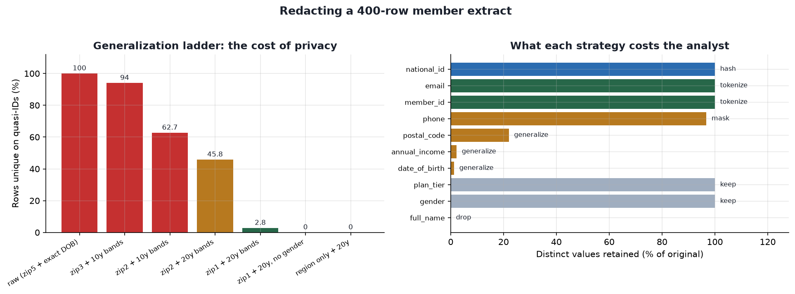

# Policy-Driven PII Redactor

[](https://colab.research.google.com/github/phoebefu6/phoebe-the-builder/blob/main/data-quality-governance/pii-redactor/demo.ipynb)
[](https://mybinder.org/v2/gh/phoebefu6/phoebe-the-builder/main?labpath=data-quality-governance/pii-redactor/demo.ipynb)

> "We masked the PII, so the extract is safe to share." Two things are usually wrong with that. The masking broke the joins, so the extract is useless and someone quietly requests the raw table instead. And the rows can still be traced to individuals, because the columns nobody thinks of as identifying - postcode, birth date, gender - single people out in combination.

**Day 124 - Data Quality & Governance.** A per-column redaction policy where the keys stay joinable, plus a re-identification score that says what is still exposed.

## Business Impact
- **Before:** Redaction is a hand-rolled `df.drop()` plus some string masking. Nobody measures whether the result is still re-identifiable, and nobody notices the join broke until an analyst reconciles a number three weeks later. The safe-looking extract gets shared outside the trust boundary.
- **After:** One declarative policy produces the redacted extract, an audit log a reviewer can actually read, a proof that referential integrity survived, and a re-identification score. On the bundled 400-row extract, stripping all five direct identifiers still leaves **63% of rows unique** on postcode + age band + gender - which is the finding that changes what you are willing to share.
- **Estimated ROI:** replaces a half-day of manual redaction and review per extract, and catches the two failure modes (broken joins, residual re-identification) before the data leaves rather than after.

## What it does

### Seven strategies, and what each one costs

| Strategy | Reversible by you | Joins survive | Cuts re-identification risk | Use when |
|---|---|---|---|---|
| `keep` | n/a | yes | no | not sensitive |
| `drop` | no | no | yes | never needed downstream |
| `nullify` | no | no | yes | schema must match, values must not |
| `mask` | no | **no** | barely | a human needs to eyeball it |
| `hash` | no | yes | no | need distinctness, never the value |
| `tokenize` | **yes, with the key** | **yes** | no | join keys |
| `generalize` | no | no | **yes** | quasi-identifiers |

Two rows carry the whole design:

**`mask` does not preserve joins.** Masking collides distinct values into one string. In the demo, masking the key at `keep_last=4` happens to survive because these IDs differ in their last four digits - but at `keep_last=2` it collapses 400 IDs into 100 and the join **fans out to 4x** the correct row count. Neither case raises an error. Whether a masked key breaks depends on your ID format rather than on your policy, which is why keys get `tokenize`.

**Only `generalize` reduces re-identification risk.** Tokenizing and hashing change what a value looks like while preserving exactly which rows share it, so the row stays just as traceable. This is the distinction most redaction scripts miss.

### The re-identification score

Every direct identifier gone, checkbox ticked - and **100% of raw rows** are still unique on postcode + birth date + gender alone. Anyone holding those three columns from another source matches them one to one. This is the Sweeney result in miniature.

The tool scores k-anonymity, counts singleton rows, and prices the fix:

| Generalization level | k | Rows unique | Suppression to reach k=5 |
|---|---|---|---|
| raw (zip5 + exact DOB) | 1 | 100% | 100% (impossible) |
| zip3 + 10y bands | 1 | 94% | 100% (impossible) |
| zip2 + 20y bands | 1 | 45.8% | 95% |
| zip1 + 20y bands | 1 | 2.8% | 11% |
| zip1 + 20y, no gender | 2 | 0% | 2.5% |
| region only + 20y | 65 | 0% | 0% |

Three findings worth the build:

- **The HIPAA-style rung is not enough here.** `zip3 + 10-year bands` leaves 94% of rows unique. That generalization has a good reputation because it is normally applied to millions of records; on a 400-row extract it does almost nothing. Scale changes the answer - the same rung drops to 2.2% unique at 50,000 rows. Copying another org's policy without checking it against your row count is how extracts leak.
- **Dropping gender buys more than any amount of postcode coarsening.** It takes unique rows from 2.8% to zero and cuts suppression cost from 11% to 2.5%. A three-value column that feels harmless was carrying most of the remaining identifying power.
- **k is the wrong headline metric.** k is the smallest class size, so one unusual person pins it to 1 no matter how good the rest is - it stayed 1 at every dataset size tested. Report **singleton share** and **suppression cost** instead; they describe how much is exposed and what fixing it costs.

### Two failure modes it catches

**The dictionary attack.** Tokenization's strength is the size of the input space, not the hash. The notebook fully reverses a tokenized `gender` column in **3 guesses**. `low_cardinality_warnings()` flags this automatically so the check lives in CI rather than in a reviewer's head.

**Silent join breakage.** `verify_join()` runs the join before and after and compares row counts, because an audit log claiming `join_safe` is not evidence.

## Tech Stack
Python · hmac / hashlib (HMAC-SHA256 keyed tokenization) · pandas · Streamlit · matplotlib · Docker

## Demo

**[Run the interactive demo notebook →](demo.ipynb)** - pre-rendered with the audit log, the ladder, the join proof and the dictionary attack. Or click the Colab/Binder badges above.



For the Streamlit app:
```bash
pip install -r requirements.txt
streamlit run app.py
```
Upload a CSV or use the bundled synthetic tables. Edit the policy per column in a grid, pick your quasi-identifiers, set a target k, and get the redacted CSV plus audit log as downloads. A random 32-byte salt is generated per session and never written to disk; rotating it re-tokenizes every table consistently, so joins keep working while old extracts stop linking to new ones.

The engine is UI-free in `redact.py` - a pipeline can import `apply_policy`, `k_anonymity`, and `low_cardinality_warnings` and fail a build when an extract misses policy. `build_notebook.py` regenerates the notebook.

## Verification
- **Join integrity proved, not asserted:** 782 rows before redaction, 782 after, across two tokenized tables. Salt rotation re-tokenizes both consistently and the join still returns 782.
- **The masking counterfactual is measured, not claimed:** `keep_last=2` gives 100 distinct IDs from 400 and a 4.0x join fanout.
- **The dictionary attack actually runs** and recovers 3/3 tokens.
- Streamlit app driven in-browser: all four sections render, the ladder chart draws, and the "suppression would delete every row" branch fires correctly at the default policy.

## Learning Connection
Built alongside the PDPA/DNC, GDPR, and AI-governance course work.
Applies: pseudonymization vs anonymization, keyed HMAC tokenization for referential integrity, k-anonymity and equivalence classes, generalization and suppression as a privacy/utility dial, quasi-identifier analysis, and the linkage-attack threat model.

## Impact Note
- **Who benefits:** data engineers and governance leads producing extracts for vendors, analysts, or non-production environments, and DPOs who need a defensible artefact rather than a verbal assurance.
- **Potential risks:** **Tokenization is pseudonymization, not anonymization - under GDPR and PDPA the output is still personal data** and still in scope. The salt is the secret that protects it; leak the salt and every low-cardinality column is reversible. k-anonymity is a floor, not a ceiling: it says nothing about **attribute disclosure**, so if everyone in an equivalence class shares a diagnosis you learn that person's diagnosis without identifying their row - l-diversity and t-closeness address that and are **not implemented here**. Suppression biases the extract toward common cases, which must be stated in the handover. Regex-free column-name-driven policy means a mislabelled column gets the wrong rule, so pair this with [pii-detector](../../data-infra-toolkit/pii-detector/) for discovery. None of this replaces a named human accountable for the release.

## Related builds
- **[pii-detector](../../data-infra-toolkit/pii-detector/)** (Day 5) - finds the PII this build then redacts
- **[access-auditor](../access-auditor/)** (Day 95) - who touched the data
- **[retention-enforcer](../retention-enforcer/)** (Day 96) - when it has to go
- **[consent-tracker](../consent-tracker/)** (Day 97) - whether you were allowed to use it
