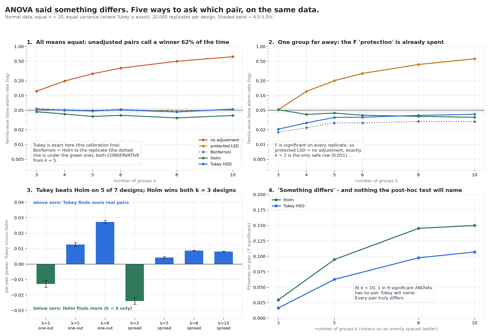

# ANOVA Says Something Differs. Which Pair?

[](https://colab.research.google.com/github/phoebefu6/phoebe-the-builder/blob/main/data-science-cookbook/anova-posthoc/demo.ipynb)
[](https://mybinder.org/v2/gh/phoebefu6/phoebe-the-builder/main?labpath=data-science-cookbook/anova-posthoc/demo.ipynb)

> The ANOVA came back significant and now someone has to say which groups differ - and the five usual ways of finding out name different pairs on the same data.



## The short version

One dataset: five groups, F test p = 0.0335. Ask which pair differs:

| procedure | pairs named |
|---|---|
| no adjustment (a t-test per pair) | A-C, A-D, A-E |
| Fisher's protected LSD | A-C, A-D, A-E |
| Bonferroni | none |
| Holm | none |
| Tukey HSD | none |

Nobody picked this dataset by hand. It is the first seed of a 5-group ladder where F is significant,
Tukey names nothing, and unadjusted t-tests name at least one pair. Every pair in the ladder truly
differs.

Every number below is a Monte Carlo rate at **20,000 replicates per design**. The data are normal,
with equal n = 20 and equal variance: the setting where Tukey's HSD is exact, so nothing here can be
blamed on a broken assumption. Each verdict is a 99% Wilson interval checked against a 4.5-5.5% band.

## What each procedure costs

**Family-wise false-alarm rate = P(at least one pair called when none differ):**

| k groups | no adjustment | protected LSD | Bonferroni | Holm | Tukey HSD |
|---:|---:|---:|---:|---:|---:|
| 3 | 0.1223 INFLATED | 0.0535 | 0.0466 | 0.0466 | 0.0524 |
| 5 | 0.2781 INFLATED | 0.0496 | 0.0374 CONSERVATIVE | 0.0374 CONSERVATIVE | 0.0482 |
| 10 | 0.6188 INFLATED | 0.0517 | 0.0390 CONSERVATIVE | 0.0390 CONSERVATIVE | 0.0527 |

**Same, but one group sits 3 SD away (F is significant on every replicate):**

| k groups | no adjustment | protected LSD | Bonferroni | Holm | Tukey HSD |
|---:|---:|---:|---:|---:|---:|
| 3 | 0.0515 | 0.0515 | 0.0179 | 0.0515 | 0.0205 |
| 4 | 0.1208 INFLATED | **0.1208 INFLATED** | 0.0220 | 0.0410 | 0.0276 |
| 10 | 0.5611 INFLATED | **0.5611 INFLATED** | 0.0294 | 0.0359 | 0.0413 |

The findings:

1. **Protected LSD protects nothing once one group is clearly different.** After F fires on the
   obvious group, LSD tests every other pair at a raw 0.05. Its column is the unadjusted column
   *to the replicate* on every row. k = 3 is the only safe case, because only one null pair is
   left. The F gate holds when every mean is equal (the weak sense) and fails in any other
   configuration (the strong sense).
2. **Bonferroni and Holm have identical false-alarm rates when every mean is equal.** This is by
   construction, and it is counted rather than argued: across 120,000 replicates they disagree
   about whether *anything* is significant 0 times, and Holm misses a pair Bonferroni names 0 times.
   So Holm's advantage can only ever show up as power.
3. **Tukey beats Holm on power, except at k = 3.** The gap is a paired difference on the same
   replicates, and it only counts as a win if it clears its own 99% interval. Tukey wins 5 of 7
   designs (up to +0.027 per-pair power at k = 8). **Holm wins both k = 3 designs** (-0.013 and
   -0.024): with three pairs its step-down thresholds are generous. Procedures whose false-alarm
   rate is INFLATED at that k are excluded from the power comparison, because an inflated test
   "finds more" by rejecting more of everything.
4. **The F test and the pair hunt disagree in both directions.** On the ladder designs, the
   share of significant ANOVAs where Tukey names no pair rises 0.016 -> 0.063 -> 0.098 -> 0.107 as
   k goes 3 -> 5 -> 8 -> 10. That is about 1 in 9 at k = 10, and the rate for Holm is 0.150. The
   reverse happens too: Tukey names a pair while F is not significant on up to 5.1% of replicates.
   So the habit of running the F test first and the post-hoc only if it passes throws away real
   Tukey findings. Tukey controls its own family-wise error and does not need the gate.

**Negative result:** "Holm is uniformly more powerful than Bonferroni" is true, and here it is an
identity with 0 violations. Holm still loses to Tukey at every k >= 5, where most real ANOVAs sit.

**Recommendation:** for all pairwise comparisons with roughly equal n, use Tukey, and don't wait for
the F gate. At k = 3, Holm is the stronger choice. Never use protected LSD beyond three groups.

## Calibration

- Tukey decisions vs `scipy.stats.tukey_hsd`: **0 mismatches in 5,350 pairs**
- F p-value vs `scipy.stats.f_oneway`: max gap 7.8e-16
- Tukey's false-alarm rate is inside the band at every k. Tukey is exact in this setting, so it
  serves as the harness's own calibration line.
- `results.json` is reproducible: seeds are indices into the library's design lists, never `hash()`

## Business Impact
- **Before:** an analyst runs a t-test per pair after a significant ANOVA, or runs "protected" LSD.
  With 8 variants, at least one false winner gets reported about half the time.
- **After:** paste the groups and get all five procedures side by side, along with the
  false-alarm rate each carries at your k.
- **Estimated ROI:** a false "variant C beats B" costs a sprint of follow-up work. This check
  takes seconds.

## Tech Stack
Python, NumPy, SciPy (`studentized_range`, `tukey_hsd`), Matplotlib, Streamlit, pytest

## Demo

**[Run the interactive demo notebook →](demo.ipynb)**. It is pre-rendered with outputs, or use the
Colab/Binder badges above to run it live. The notebook runs 4,000 replicates with the study's own
seeds and says so. `evidence.txt` is the reference.

```bash
pip install -r requirements.txt
python evidence.py      # ~1 minute, writes evidence.txt + results.json
python make_chart.py    # the audit figure; fails if any label covers data
streamlit run app.py    # paste your own groups
pytest -q               # 30 tests
```

## Learning Connection
Built while studying multiple-comparison procedures (Hochberg & Tamhane-style FWER control).
Applies: weak vs strong family-wise error control, studentized range, step-down procedures,
paired Monte Carlo comparisons with a materiality threshold.

## Impact Note
- **Who benefits:** analysts reading multi-variant tests, and product teams comparing more than two arms
- **Potential risks:** the study assumes normal data, equal n and equal variance. With unequal
  variances, Games-Howell is the right post-hoc and none of these five procedures is.
  The app uses Tukey-Kramer for unequal n but does not correct for unequal variance.
