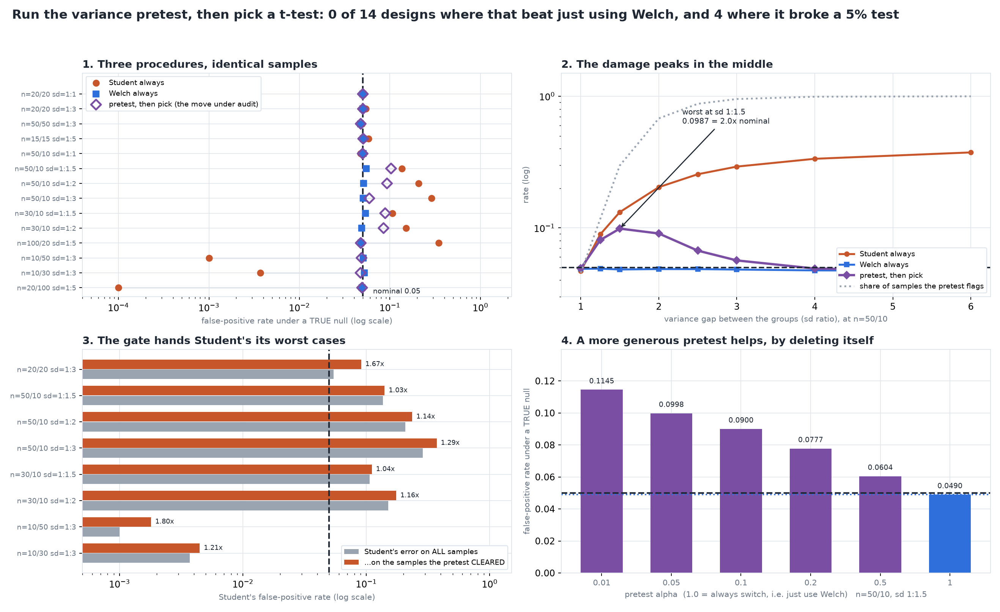

# The Assumption-Pretest Cost

[](https://colab.research.google.com/github/phoebefu6/phoebe-the-builder/blob/main/data-science-cookbook/assumption-pretest-cost/demo.ipynb)
[](https://mybinder.org/v2/gh/phoebefu6/phoebe-the-builder/main?labpath=data-science-cookbook/assumption-pretest-cost/demo.ipynb)

> "We checked the variances first." Run Levene, then pick Student's or Welch's. Across 14 measured designs that two-stage move never once beat simply using Welch, and on four of them it turned a 5% test into a 10% one.

## The problem

Testing an assumption and then choosing a test based on the answer is **one procedure, not two**.
The only honest way to describe it is to measure what *it* does - not what its two branches do
separately. Two things make it worse than it looks, and both are measurable rather than arguable.

**The pretest reads the same numbers the t-test does.** Levene's decision is a function of the
sample variances. Student's pooled standard error is a function of the same sample variances. So
"the pretest passed" is not a random subset of your samples - it is the subset whose variance
ratio *happened to look small*, which is exactly the subset where the pooled estimate flatters
itself. The selection is correlated with the statistic it selects.

**The pretest has a power curve.** At a moderate variance gap it misses most of the time, and a
moderate gap is precisely where Student's has already begun to fail.

Every design below has both groups drawn with the **same mean**, so the null is exactly true and
every rejection counted is a false positive by construction. Nothing here is an argument.

## What it found

**14 designs, 4 pretests, 4 population shapes, 20,000 replicates a cell.**

### 1. The headline

| | |
|---|---|
| designs where the two-stage move beat unconditional Welch **at all** | **1 of 14** - and it won by 0.0005, a seventh of one interval half-width |
| designs where it beat Welch **by more than the measurement error** | **0 of 14** |
| designs where **unconditional Welch** left the `[0.045, 0.055]` band | **0 of 14** |
| designs where the **two-stage procedure** left the band | **4 of 14**, peaking at 0.1029 - 2.1x nominal |

`gated_beats_welch` is a real comparison that can come out either way - the test suite asserts it
returns `True` on a synthetic cell built for it - and across this grid it does not.

### 2. The three procedures on identical samples

| design | pretest fires | Student always | Welch always | pretest, then pick |
|---|---|---|---|---|
| n=20/20 sd 1:1 | 0.040 | 0.0502 | 0.0500 | 0.0502 |
| n=20/20 sd 1:3 | 0.975 | 0.0544 | 0.0502 | 0.0503 |
| n=50/10 sd 1:1 | 0.044 | 0.0476 | 0.0506 | 0.0500 |
| **n=50/10 sd 1:1.5** | 0.303 | 0.1361 | 0.0549 | **0.1029** |
| **n=50/10 sd 1:2** | 0.676 | 0.2064 | 0.0511 | **0.0928** |
| n=50/10 sd 1:3 | 0.954 | 0.2873 | 0.0505 | 0.0592 |
| **n=30/10 sd 1:1.5** | 0.246 | 0.1067 | 0.0536 | **0.0886** |
| **n=30/10 sd 1:2** | 0.598 | 0.1509 | 0.0488 | **0.0850** |
| n=100/20 sd 1:5 | 1.000 | 0.3463 | 0.0476 | 0.0476 |
| n=10/50 sd 1:3 | 0.945 | 0.0010 | 0.0505 | 0.0486 |
| n=20/100 sd 1:5 | 1.000 | 0.0001 | 0.0493 | 0.0493 |

### 3. The mechanism: the gate hands Student's its worst cases

Split the samples by what the pretest said, and look at Student's error **only on the ones it
cleared**. If the pretest were doing its job, that subset would be the safe one.

| design | share the pretest cleared | Student overall | Student on the cleared ones | ratio |
|---|---|---|---|---|
| n=20/20 sd 1:3 | 0.025 | 0.0544 | 0.0909 | **1.67x** |
| n=50/10 sd 1:2 | 0.324 | 0.2064 | 0.2352 | 1.14x |
| n=50/10 sd 1:3 | 0.046 | 0.2873 | 0.3717 | **1.29x** |
| n=30/10 sd 1:2 | 0.402 | 0.1509 | 0.1747 | 1.16x |
| n=10/50 sd 1:3 | 0.056 | 0.0010 | 0.0018 | **1.80x** |

Every ratio above 1.00 is the procedure running backwards. A sample where the small group's
variance came out low both **passes the pretest** and **understates the pooled standard error** -
they are the same event. The gate is not filtering the dangerous cases out. It concentrates them.

### 4. The danger zone is a moderate gap, not a large one

n=50/10, walking the variance ratio:

| sd ratio | pretest fires | pretest, then pick | vs nominal |
|---|---|---|---|
| 1.00 | 0.045 | 0.0491 | 0.98x |
| 1.25 | 0.117 | 0.0809 | 1.62x |
| **1.50** | 0.298 | **0.0987** | **1.97x** |
| 2.00 | 0.679 | 0.0906 | 1.81x |
| 3.00 | 0.954 | 0.0566 | 1.13x |
| 6.00 | 1.000 | 0.0471 | 0.94x |

The shape is the point, and it is **not monotone**. At a 6:1 gap the procedure is fine - because
the pretest always fires and it has silently become unconditional Welch. At no gap there is
nothing to get wrong. The damage lives in the middle, which is exactly where the pretest returns
p > 0.05 and the analyst writes down *"variances were checked and found equal."*

### 5. Raising the pretest alpha helps, by deleting the pretest

| pretest alpha | fires | pretest, then pick | vs Welch |
|---|---|---|---|
| 0.01 | 0.145 | 0.1145 | +0.0655 |
| 0.05 | 0.298 | 0.0998 | +0.0508 |
| 0.20 | 0.528 | 0.0777 | +0.0288 |
| 0.50 | 0.751 | 0.0604 | +0.0115 |
| **1.00** | 1.000 | **0.0490** | +0.0000 |

The standard advice for a low-power screening test is to run it at a generous alpha. It does help,
monotonically. What it converges on is alpha = 1.0 - the pretest always firing - which *is*
unconditional Welch. The fix converges on deleting the step.

### 6. Two of the four pretests are reading shape, not variance

All four run on groups whose variances are **identical**, so every number here should be 0.05:

| population | Levene (mean) | Brown-Forsythe (median) | Bartlett | F-test |
|---|---|---|---|---|
| normal | 0.059 | 0.042 | 0.053 | 0.053 |
| t5 (heavy tails) | 0.054 | 0.038 | **0.155** | **0.155** |
| lognormal (skewed) | **0.111** | 0.046 | **0.226** | **0.226** |
| uniform (light tails) | 0.057 | 0.034 | **0.004** | **0.004** |

Bartlett and the F-test move in **both** directions with tail weight - 0.226 on skew, 0.004 on
light tails - which is the signature of a shape detector, not a liberal test. The mean-centred
Levene is inflated on skew at 0.111; the median-centred Brown-Forsythe (which is what a bare
`scipy.stats.levene` call actually gives you) is the one that holds, slightly conservatively.

**And at equal group sizes Bartlett and the F-test are the same test** - Spearman correlation
1.000000 and identical decisions on every sample. Their p-values differ; their verdicts do not.
"We also ran an F-test" is not corroboration.

### 7. Negative result: on a balanced design the question nearly evaporates

At n=20/20 with a **3:1** variance gap, Student's runs at 0.0544 - barely outside the band. At
n=15/15 with a **5:1** gap it runs at 0.0577. The pretest fires on 97.5% and 99.3% of those
samples respectively, to fix a problem that is almost not there. Unequal *n* is the precondition
for the whole failure mode; the variance ratio alone is not.

### 8. The failure nobody audits

Flip which group is bigger and Student's goes the other way: at n=20/100 with a 5:1 gap it runs at
**0.0001**. A false-positive audit calls that safe. With a real effect present, Student's detects
it 0.2273 of the time where Welch gets **0.7889** - a deficit paid for entirely in findings you
never see. This is why the power section marks each row as `ok`, `inflated` or `conservative`:
an inflated test's apparent power advantage is just the inflation restated, while a conservative
test's deficit is a real, honestly-paid cost. Collapsing both into "not comparable" throws away
the one that is a finding.



## Business Impact

- **Before:** an analyst runs Levene, reads p = 0.31, writes "variances were homogeneous
  (Levene, p = 0.31)" in the methods section, and uses the pooled t-test. On a 50-vs-10 design
  with a 1.5:1 spread difference, that sentence is describing a procedure operating at twice its
  stated false-positive rate - and the pretest's clean bill of health is part of the cause, not a
  mitigation.
- **After:** the decision rule is one line and needs no test. **Use Welch's t-test.** It was
  inside the band on every design in this grid, including all five where Student's was fine, and
  its cost when Student's would have been valid is the thing the sibling build already measured
  (Day 174: 0.0000 power lost at n=50/50, 0.0013 at n=20/20).
- **Estimated ROI:** removes one step, one paragraph of methods text, and one class of silent
  error. The cost of keeping it is the four broken designs above and, worse, the false
  reassurance - a pretest that passes is treated as evidence, and it is the opposite.

## Tech Stack

Python 3.11, numpy, scipy (`ttest_ind`, `levene`, `bartlett`, `f`), matplotlib, Streamlit, pytest,
Docker. No data set - the whole point is a null that is exactly true, which only simulation gives.

## Demo

**[Run the interactive demo notebook →](demo.ipynb)** - pre-rendered with outputs, or click the
Colab/Binder badges above to run it live. Its headline rows use the study's own seeds and
replicate count, so they **are** the cells in `evidence.txt`, number for number - enforced by
`test_notebook_design_list_matches_the_library_in_ORDER`.

For the Streamlit app, where you set your own design and the Monte-Carlo runs live:

```bash
pip install -r requirements.txt
streamlit run app.py
```

To regenerate every number in this README:

```bash
python evidence.py     # writes evidence.txt and results.json (~4 min)
python make_chart.py   # writes the audit figure from results.json
pytest                 # 48 tests
```

## How the harness keeps itself honest

Every statistic is checked against scipy to 1e-12 - including the hand-rolled F-test, the only one
not lifted straight out of the library. The calibration cell (Student's on a balanced,
equal-variance, normal design) is **exact**, so it must read 0.0500, and it does. Verdicts are 99%
Wilson intervals, never point estimates. Both ends of the pretest-alpha sweep are known-answer
anchors: alpha = 1.0 must reproduce Welch **exactly** and alpha = 0 must reproduce Student's
exactly, both asserted.

Three things were caught by writing the tests rather than by reading the output:

- **A "win" that was measurement error.** The grid produced one cell where the two-stage procedure
  was nominally closer to nominal than Welch - by 0.0005, about a seventh of the 99% interval
  half-width. Reporting "1 of 14" would have been reading the noise as a result, so the headline
  uses `gated_beats_welch_materially`, which requires the gap to exceed the measurement.
- **A power table comparing tests that do not control Type I.** Student's "detects more" on four
  of the power rows because it rejects more of *everything*, including when nothing is there.
  Each row now carries its null-direction, and only `ok` rows are a comparison.
- **The report contradicting its own flag.** The first draft collapsed inflated and conservative
  into one "not comparable" label and then argued in prose that a conservative row *was*
  comparable. Inflated and conservative are opposite findings; they do not share a label.

## Learning Connection

The seam [`t-test-variants`](../t-test-variants) (Day 174) explicitly left open - it measured
Student vs Welch *unconditionally* and excluded the conditional procedure, which needed its own
build to measure honestly.

Companion to [`normality-test-trap`](../normality-test-trap) (Day 175), which does this job for
the *normality* pretest and scored that gate at sensitivity 0.81 / specificity 0.38. Same shape of
error, different assumption: a screening test whose power curve runs the wrong way relative to the
thing it screens for.

A note on duplication: `wilson()` and the interval-based verdict rule appear in both builds. That
is deliberate - each build must run standalone from a bare Colab link, so it cannot import a
sibling. The rule is duplicated *across* builds and has exactly one copy *within* this one; the
chart and the notebook read `pretest.py`'s verdict instead of recomputing it, which is the failure
the sibling build shipped and had to fix.

## Impact Note

- **Who benefits:** anyone who has been taught to screen assumptions before choosing a test -
  which is the standard curriculum.
- **Potential risks:** "skip the pretest" is not "skip thinking", and this grid is one assumption,
  two groups, and one alternative test. Welch is not universally safe either - the sibling build
  found it runs at 0.0952 on strongly skewed data with unequal n, and this build's own app will
  show you Welch at 0.0755 on lognormal data at n=50/10. The finding is that *the pretest* is not
  what fixes that; a simulation at your own design is.
