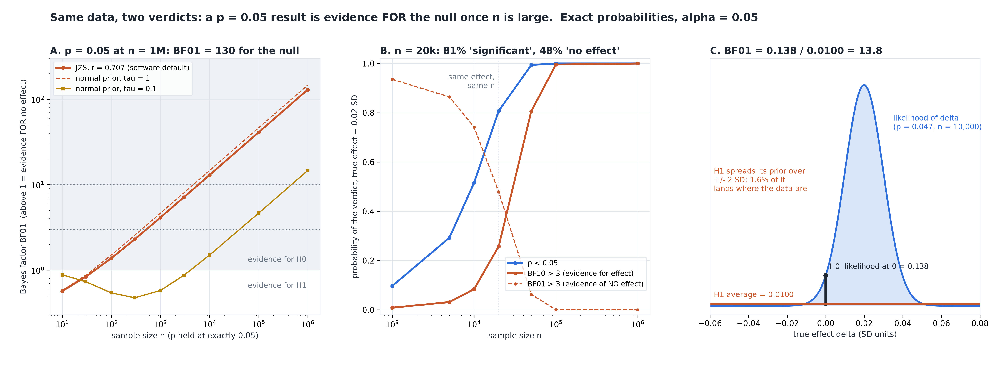

# Two Analysts, One Dataset, Two Verdicts

[](https://colab.research.google.com/github/phoebefu6/phoebe-the-builder/blob/main/data-science-cookbook/bayes-vs-p/demo.ipynb)
[](https://mybinder.org/v2/gh/phoebefu6/phoebe-the-builder/main?labpath=data-science-cookbook/bayes-vs-p/demo.ipynb)

> One analyst reported "significant, p = 0.047", the other ran a Bayesian test on the same numbers and reported "strong evidence of no effect" - and nobody could say which of them was wrong.



## The short version

10,000 observations, a true effect of 0.02 SD, one-sample t-test.

| analysis of the same 10,000 numbers | result |
|---|---|
| t-test | t = 1.991, **p = 0.0465** -> "significant" |
| JZS Bayes factor, r = 0.707 (the JASP / BayesFactor / pingouin default) | **BF01 = 12.2** -> "strong evidence of no effect" |

Neither analyst made a mistake. They answered different questions. The p-value asks how surprising the
data would be if the effect were exactly zero: fairly surprising. The Bayes factor asks whether "zero"
or "an effect of about the size the prior expects" predicted the data better: zero did, by 12 to 1,
because the effect is real but tiny. This is **Lindley's paradox**, and at large n it is not a corner
case.

Every study number is **exact**, not simulated. The study model is a normal mean with known unit SD, so
z = mean * sqrt(n) is exactly N(delta * sqrt(n), 1). Against H1: delta ~ N(0, tau^2) the Bayes factor has
a closed form, and "BF01 > k" is the event |z| < threshold - so every verdict probability is a normal
integral. Real data use the t statistic and the JZS Bayes factor, by quadrature.

## What the numbers say

**Hold the p-value at exactly 0.05 and grow n** (BF01 above 1 = evidence FOR no effect):

| n | 10 | 100 | 1,000 | 10,000 | 100,000 | 1,000,000 |
|---|---:|---:|---:|---:|---:|---:|
| JZS, r = 0.707 | 0.57 | 1.38 | 4.13 | 13.0 | 41.1 | **130** |
| normal prior, tau = 1 | 0.58 | 1.50 | 4.64 | 14.7 | 46.3 | 146 |
| normal prior, tau = 0.1 | 0.88 | 0.54 | 0.58 | 1.50 | 4.64 | 14.7 |

**When the null is true** (tau = 1): the p-test's false-positive rate is 0.05 at every n. The share of
those "significant" results that the Bayes factor calls null:

| n | 100 | 1,000 | 10,000 | 1,000,000 |
|---|---:|---:|---:|---:|
| P(p < 0.05 and BF01 > 1) / P(p < 0.05) | 38% | 83% | **95%** | 99.6% |

The findings:

1. **p = 0.05 is weak evidence at any n, and evidence for the null at most n.** Under the unit-information
   prior (tau = 1) a result at exactly p = 0.05 favours the null from **n = 42**, 3:1 from n = 415, 10:1
   from n = 4,655. Even p = 0.005, the "redefine statistical significance" threshold, tips over at
   n = 2,634. The Bayes factor at fixed p grows like sqrt(n) (checked: x3.162 per decade).
2. **There is a ceiling, and it is low.** Pick the normal prior AFTER seeing the data, to flatter H1 as much
   as possible, and p = 0.05 is worth at most **BF10 = 2.11** (closed form exp((z^2-1)/2)/z, confirmed by
   search). The broader Sellke-Bayarri-Berger bound 1/(-e p ln p) gives 2.46. "1 in 20" is about 2 to 1.
3. **Negative result: the Bayes factor is not a p-value fix.** For a real 0.02 SD effect at n = 20,000 the
   p-test finds it **81%** of the time; the Bayes factor says "evidence of NO effect" (BF01 > 3) **48%** of
   the time. It is not broken - on a prior expecting effects near 1 SD, 0.02 really is close to zero - but
   it swaps false positives for false "no effect" verdicts on small true effects. For the same 80% chance
   of a verdict for the effect it needs **1.41x** the sample at delta = 0.5 and **2.21x** at delta = 0.05.
4. **The verdict is a property of the prior as much as the data.** The exemplar's one dataset gives BF01 =
   0.76, 1.41, 2.77, 6.90, 13.8, 27.6 as tau goes 0.05, 0.1, 0.2, 0.5, 1, 2. A prior that expects effects of
   0.05 SD calls it weak evidence *for* an effect.

**Recommendation:** at large n report the effect size and its interval first; neither "significant" nor
"BF01 = 12" alone tells a reader whether 0.02 SD matters. If you report a Bayes factor, state and justify
the prior scale from the domain before the data arrive, and show how the factor moves across a range of
scales (the app does this). If you report a p-value at n in the tens of thousands, do not call p = 0.04
"strong evidence".

## Calibration

- Normal-prior Bayes factor, closed form vs explicit quadrature over the prior (18 cases, n = 10 to 100k):
  max |log gap| **1.3e-15**
- JZS Bayes factor, quadrature over g vs an independent quadrature over delta through the noncentral t
  (9 cases): **1.6e-13**
- JZS vs `pingouin.bayesfactor_ttest`: **5.7e-12**
- t-test decisions vs `scipy.stats.ttest_1samp`: **0 mismatches in 400**
- Raw N(delta, 1) Monte Carlo, 20,000 reps on 5 designs x 3 verdicts: **15 of 15** inside their 99% Wilson
  interval.
- Tests also show the checks *can* fail: the closed form must not match the quadrature at another tau, the
  two JZS routes must not match at another r, and replicates drawn at the wrong effect must land outside the
  interval.
- **Two engine defects caught on the first run**, both in the function behind finding 1. BF01 at fixed p is
  U-shaped in n (it dips below 1 before it rises), and a root search over the whole range can land on the
  descending crossing; and the function returned the log-n the search ran on instead of n. The first run
  printed "n = 3.7" beside a table showing BF01 = 0.58 at n = 10, which is how it was caught. It now brackets
  from the curve's minimum at n tau^2 = z^2 - 1 and returns n, with a test for each.

## Business Impact
- **Before:** at product scale (tens of thousands of users per arm) a p = 0.04 result gets shipped as a
  finding, or a Bayesian dashboard and a frequentist one disagree and the meeting argues about methods
  instead of the effect.
- **After:** enter n and p (or paste values). You get the p-value, the JZS Bayes factor, the factor across
  six prior scales, and a verdict that names which of the four cases you are in - including Lindley's.
- **Estimated ROI:** one avoided "win" that was 0.02 SD of noise-sized effect, or one hour of method debate
  per disputed readout.

## Tech Stack
Python, NumPy, SciPy (`integrate.quad`, `optimize.brentq`, `stats.nct`, `ttest_1samp`), pingouin
(calibration), Matplotlib, Streamlit, pytest

## Demo

**[Run the interactive demo notebook →](demo.ipynb)**. It is pre-rendered with outputs, or use the
Colab/Binder badges above to run it live. The study numbers are exact, so the notebook reproduces them to
the digit; only its Monte Carlo cross-check runs at 4,000 reps.

```bash
pip install -r requirements.txt
python evidence.py      # ~4 seconds, writes evidence.txt + results.json
python make_chart.py    # the audit figure; fails if any label overlaps another or leaves its panel
streamlit run app.py    # enter your own n and p, or raw values, and move the prior
pytest -q               # 27 tests
```

## Learning Connection
Built while studying Bayesian hypothesis testing (Jeffreys-Zellner-Siow Bayes factors, Rouder et al. 2009;
Lindley 1957; Sellke, Bayarri and Berger 2001).
Applies: marginal likelihoods in closed form, verdict regions as intervals on z, two independent quadrature
routes to one integral, calibrating against a third-party implementation.

## Impact Note
- **Who benefits:** analysts reading A/B tests at large n, teams running Bayesian and frequentist tooling
  side by side, and reviewers who need to know why the two disagree
- **Potential risks:** a Bayes factor is only as defensible as its prior; tuning r until the answer looks
  right is the Bayesian version of p-hacking. The study model assumes a normal mean with known SD; the
  app's t-based JZS factor relaxes the known SD but still assumes roughly normal data, and it is a test of
  "zero vs not zero" - use an interval or an equivalence test when the question is whether an effect is
  big enough to matter.
