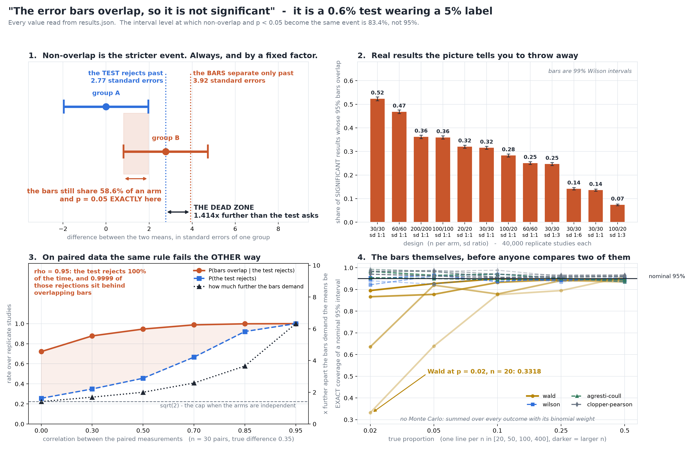

# Do the Error Bars Overlap?

[](https://colab.research.google.com/github/phoebefu6/phoebe-the-builder/blob/main/data-science-cookbook/ci-overlap-fallacy/demo.ipynb)
[](https://mybinder.org/v2/gh/phoebefu6/phoebe-the-builder/main?labpath=data-science-cookbook/ci-overlap-fallacy/demo.ipynb)

> "The error bars overlap, so it is not significant" throws away up to half of the real results on the chart - and on paired data it fails the other way.



## The short version

Two independent estimates with standard errors `s1`, `s2`:

| event | happens when |
|---|---|
| the 95% bars stop overlapping | `|d| > 1.96 * (s1 + s2)` |
| the test rejects at 0.05 | `|d| > 1.96 * sqrt(s1^2 + s2^2)` |

Since `s1 + s2 >= sqrt(s1^2 + s2^2)`, non-overlap is always the **stricter** event. Bars apart
implies significant; significant does **not** imply bars apart.

All closed form, no simulation:

| | equal standard errors |
|---|---:|
| how much further apart the bars demand the means be | **1.414x** |
| bar level at which "don't touch" and `p < 0.05` are the same event | **83.4%**, not 95% |
| overlap two 95% bars may still have at exactly `p = 0.05` | **58.6%** of an arm |
| size of the overlap rule read as a test | **0.0056** - a 0.6% test with a 5% label |

The rule is **most wrong on the design everyone trusts** - equal n, equal spread - and gets less
wrong as the groups become lopsided. "A little overlap is fine" has no number: the permitted
overlap runs from 58.6% of an arm down to 6.3% as the SD ratio goes from 1 to 30.

## The dead zone, measured

95% t-intervals per group, Welch test, normal data, 40,000 replicate studies a design:

| n1/n2 | sd ratio | power | P(overlap given significant) | 99% CI |
|---|---|---:|---:|---|
| 30/30 | 1:1 | 0.64 | **0.524** | [0.515, 0.532] |
| 60/60 | 1:1 | 0.69 | 0.468 | [0.460, 0.476] |
| 200/200 | 1:1 | 0.80 | 0.362 | [0.355, 0.369] |
| 30/30 | 1:3 | 0.79 | 0.247 | [0.240, 0.253] |
| 100/20 | 1:3 | 0.90 | 0.074 | [0.070, 0.078] |

On the 30/30 design, **52% of the studies that found a real difference** would be thrown away by a
reader applying the overlap rule to the same chart. The dead zone shrinks with power, so it is
worst at the effect sizes marginal enough to argue about.

**The fix is a level, not a correction.** Draw the bars at the matching level and the two
verdicts disagree on 0.07-0.31% of replicates at equal standard errors (1.2-1.6% at unequal ones,
where t multipliers make the algebra approximate) instead of 11-33% at 95%.

## The reversal: paired data

n = 30 pairs, true difference 0.35, bars drawn per arm as they always are:

| correlation | bars demand x further than the test | P(test rejects) | P(overlap given rejects) |
|---:|---:|---:|---:|
| 0.00 | 1.41 | 0.256 | 0.722 |
| 0.50 | 2.00 | 0.456 | 0.946 |
| 0.85 | 3.65 | 0.922 | 0.998 |
| 0.95 | **6.32** | **1.000** | **0.9999** |

Independent groups cap the rule's slack at `sqrt(2)`. Correlation removes the cap. The test is
certain; the bars sit on top of each other; **nothing on the chart shows which case you are in.**

## The bars themselves - exact coverage

For a proportion, coverage can be summed over every possible count with its binomial weight, so
these numbers have **no Monte Carlo error**:

| method | worst coverage (nominal 0.95) | cells below 0.90 of 20 |
|---|---:|---:|
| Wald `p +/- 1.96 sqrt(p(1-p)/n)` | **0.332** (p = 0.02, n = 20) | 9 |
| Wilson | 0.922 | 0 |
| Agresti-Coull | 0.935 | 0 |
| Clopper-Pearson | 0.955 | 0 |

A Wald bar on zero events has **zero width** - a dot that cannot overlap anything - so the rule's one
guarantee reverses: with a 40-case arm at a 1% rate, bars "apart" while the test refuses to
reject on 0.67 of outcome pairs. Wilson, Agresti-Coull and Clopper-Pearson never reverse.

*Negative result:* Wald coverage is not monotone in n. On 3 of 5 rates a larger sample has worse
coverage than a smaller one, so no sample size makes a Wald bar safe to read at a low rate.

## Business Impact

- **Before:** a dashboard shows two segments with overlapping bars, the review calls it noise, and
  a real 0.6-SD lift is shelved - or a paired before/after chart with overlapping bars gets
  presented as "no change" while the paired test is overwhelming.
- **After:** the chart either draws the interval for the difference, or states its bar level and
  whether the groups are paired. The tool tells a reviewer, for their chart, whether the picture
  and the test agree.
- **Estimated ROI:** one wrongly-shelved result per quarter. The rule discards between 7% and 52%
  of real, significant results across the designs measured.

## Tech Stack

Python · NumPy · SciPy · Matplotlib · Streamlit · pytest · Docker

## Demo

**[Run the interactive demo notebook →](demo.ipynb)** — pre-rendered with outputs, or click the
Colab/Binder badges above to run it live.

For the Streamlit app, where you drag two bars around and watch the picture and the test disagree:

```bash
pip install -r requirements.txt
streamlit run app.py
```

To regenerate every number here:

```bash
python evidence.py     # writes evidence.txt + results.json
python make_chart.py   # the audit figure, gated on a painted-geometry self-check
pytest -q              # 36 tests
```

## How this is kept honest

- **Calibration first.** When bars and test share their standard errors the theorem forbids a gap
  without significance: 0 violations in 1,000,000 replicates. Then the premise is broken on purpose
  (bars from a design-time SE, test from the observed variance) and the guarantee fails on 4 of 5
  designs, up to 0.178 - so the harness can report both outcomes.
- **Exact where possible.** Geometry and every proportion number is closed form or a full
  enumeration; the enumeration is checked once against brute-force simulation.
- **Verdicts are intervals.** Every Monte Carlo rate carries a 99% Wilson interval.
- **One source of numbers.** Chart, app and notebook read `results.json` or the library's own
  seeds; none of them decides a verdict of its own.
- **The chart measures itself, then saves.** `make_chart.py` asserts no text box collides with
  another or with a legend in panels 1, 3 and 4 before writing the PNG. The first version ran the
  check *after* saving, so a failing layout still left a finished-looking figure on disk. Moved in front, it caught
three collisions the first render had shipped.

## Learning Connection

Built while working through interval estimation and the relationship between confidence intervals
and hypothesis tests (Schenker & Gentleman 2001; Cumming & Finch 2005 on reading error bars).
Applies: turning a visual heuristic into a decision rule with a measurable size, exact computation
over a discrete outcome space, and simulation calibration against a proven theorem.

## Impact Note

- **Who benefits:** anyone who reads, reviews or draws a chart with error bars - analysts, product
  reviewers, research leads.
- **Potential risks:** the honest reading is *overlap is not evidence of no difference*, not
  *overlap never matters*. Non-overlap at the same level is still a valid (conservative) sign of
  significance for independent groups - the one guarantee this build confirms rather than attacks.

## Siblings in this domain

| build | interrogates |
|---|---|
| [`p-value-dance`](../p-value-dance) | what p does under replay |
| [`effect-size-reader`](../effect-size-reader) | an **estimate** of the effect |
| [`nonparametric-swap`](../nonparametric-swap) | which **test** to run |
| [`prediction-interval`](../prediction-interval) | an interval for a **future observation** |
| **this one** | a **picture** of two intervals, and the inference read off it |
