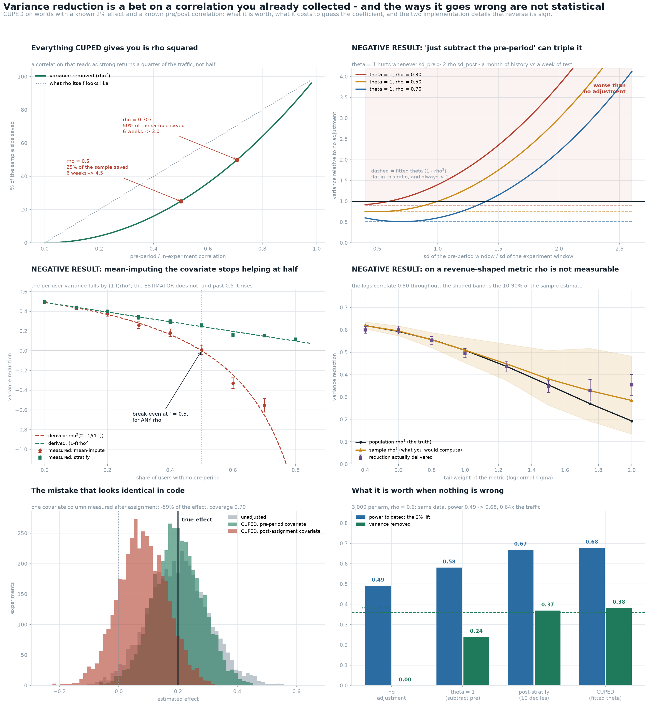

# CUPED Variance

[](https://colab.research.google.com/github/phoebefu6/phoebe-the-builder/blob/main/data-science-cookbook/cuped-variance/demo.ipynb)
[](https://mybinder.org/v2/gh/phoebefu6/phoebe-the-builder/main?labpath=data-science-cookbook/cuped-variance/demo.ipynb)

> The test needs six weeks, and somebody says CUPED will halve it. The first claim is arithmetic. The second is a claim about a correlation nobody has measured yet - and it is only true at a correlation of 0.707, because everything variance reduction can ever return is that correlation squared.

**Day 166 - Data Science Cookbook.** CUPED and the four adjustments people reach for instead, measured on worlds with a known 2% effect and a known pre/post correlation: what the pre-period is worth, what it costs to guess the coefficient instead of fitting it, and the two implementation details - a missing-data policy and a column timestamp - that reverse the sign of the whole exercise. 57 tests, a six-panel figure, and a notebook that rebuilds all of it from numpy and scipy.



> **What it is worth, stated honestly.** At rho = 0.6 and 3,000 users per arm, CUPED takes the same experiment from power **0.494** to **0.678** on identical data, and needs **0.644x** the traffic for the same power. Predicted reduction rho^2 = **0.3600**; measured on 6,000 null experiments, **0.3516 +/- 0.0097**. Every adjuster compared here is unbiased and covers at nominal - they differ only in spread, which is both the point and the whole risk.
>
> **The saving is rho SQUARED.** A correlation of 0.5 - which reads as a strong relationship - returns **25%** of the sample, so a six-week test becomes **4.5** weeks, not three. "CUPED halves your test" is a statement about **rho = 0.7071**, not about CUPED. The first thing to compute is not the adjustment; it is the correlation, on last quarter's data, before anybody promises a timeline.
>
> **NEGATIVE RESULT: "just subtract the pre-period" can triple the variance.** theta = 1 is the instinct - each user's own before-value, subtracted - and it is CUPED with the coefficient guessed instead of fitted. `Var(Y - X) = sd_post^2 + sd_pre^2 - 2 rho sd_pre sd_post`, which exceeds `Var(Y)` whenever `sd_pre > 2 rho sd_post`. With a pre-window twice as wide as the test window and rho = 0.40 the closed form is **3.4000** and the measurement is **3.4961** - the test now needs three and a half times the traffic - while *fitting* the same column's coefficient returns **0.1623**. A month of history against a week of test is the normal case.
>
> **NEGATIVE RESULT: mean-imputing the missing covariate stops helping at exactly 50% new users, for any rho.** Users with no pre-period get the mean; every implementation does this, and every write-up says the reduction becomes `(1-f)rho^2`. That is the **per-user** variance. The estimator is a difference of arm **means**, and once imputed, the arm's covariate mean is the mean of the *returning* users only - variance `sigma^2/(n(1-f))`, not `sigma^2/n`. Working it through leaves
>
> ```
> reduction = rho^2 * (2 - 1/(1-f))
> ```
>
> which is **zero at f = 0.5 and negative beyond**, independent of rho (verified to 1e-12 at rho = 0.3, 0.5, 0.7, 0.9). At 60% new users mean-imputation is a variance **increase** (derived -0.2450, measured -0.2232 +/- 0.035) where the textbook figure says +0.196; at 80% it multiplies the variance by **2.42x**. Treating "has a pre-period" as a stratum recovers the textbook promise exactly (**0.0841 +/- 0.010** against 0.0980 at f = 0.8). The fix is three lines and nobody ships it.
>
> **NEGATIVE RESULT: on a revenue-shaped metric you cannot measure rho at all.** CUPED runs on the Pearson correlation of the metric *as reported*, not of its log. With the logs correlating 0.80 throughout, the reported-scale correlation falls from **0.7795** at lognormal sigma 0.5 to **0.4391** at sigma 2.0 - and the *sample* correlation, the number you would compute to plan with, reads **0.5315 +/- 0.126**: biased up **21%**, and wide enough that two honest analysts on the same table would quote correlations 0.3 apart. The delivered reduction (**0.3669 +/- 0.028**) is 3.0 Monte Carlo errors from the sample rho^2 and further still from the population one, because at that tail weight the sample variance is itself set by a handful of users. The honest reading is not "CUPED beats rho^2 on heavy tails" - it is that neither the planning number nor the delivered number is measurable to the precision anyone quotes them at.
>
> **The mistake that looks identical in code.** Every result above needs the covariate to predate randomisation. Point the same three lines at a covariate the treatment also moved - same-period engagement, a metric the variant changed - and the adjustment removes the treatment effect as if it were noise: the estimate comes out **-59.2%**, coverage falls to **0.7003** against a nominal 0.95, and power falls from **0.506** to **0.169**. Lower than doing nothing. Variance reduction and effect destruction are the same operation pointed at different columns, and only the column's timestamp tells them apart - which makes it a data-contract question, not a statistics question.
>
> **NEGATIVE RESULT: the two things people actually worry about are free.** Estimating theta separately per arm, the variant everyone is warned about, gives an estimate **3.18e-07** from the pooled one - even under a multiplicative effect, where theta genuinely differs between arms - because randomisation puts `E[xbar_t - xbar_c]` at zero, so whatever coefficient multiplies it has nothing to bias. And "you need a lot of data to fit theta" costs **0.007** of size at **20 users per arm** (0.0650 against 0.0580 unadjusted) while already delivering **0.3402** of the promised 0.36; by 100 per arm the cost has vanished (size 0.0472, coverage 0.9528). Both worries are answerable in an afternoon. Neither is the thing that breaks it.
>
> **What it fixes besides variance, and the half it cannot touch.** A pre-period covariate also removes chance imbalance in itself, so CUPED quietly repairs composition damage the covariate can *see*. Two filters, each removing 10% of the treatment arm: dropping the lowest pre-period users overstates the effect by **+237%** unadjusted and **+2.0%** after CUPED; dropping the lowest *residual* users overstates it by **+312%** and CUPED leaves **+312%**. Same count gone, one repaired and one untouched. So CUPED corrects exactly the bias its covariate explains and none of the rest - a reason to run it, and not a reason to stop checking the split ([Day 165](../srm-detector/)).

## Business Impact

- **Before:** the pre-period is either ignored, or subtracted raw, or fed in with missing values filled at the mean, and the timeline promise is made from a half-remembered "CUPED halves it". Three of those four choices can make the experiment slower than no adjustment at all, and the fourth destroys the effect estimate if one covariate column is on the wrong side of the assignment timestamp.
- **After:** the correlation is measured before the promise, the coefficient is fitted, "has a pre-period" is a stratum rather than an imputation, the covariate table has a hard cutoff at assignment time, and the report carries the reduction that was **measured** next to the rho^2 that was **promised**.
- **Estimated ROI:** at rho = 0.6 that is 36% of the traffic per experiment, returned for free and for good. The failures it avoids are larger than the gain it delivers: a 3.5x variance increase from guessing the coefficient, a 2.4x increase from imputing at the mean with a mostly-new user base, and a 59% understatement of the effect from one mistimed column.

## Where this sits

Third build in **experimentation and causal inference**. [`peeking-cost`](../peeking-cost/) (Day 164) priced *when you look*; [`srm-detector`](../srm-detector/) (Day 165) asked what a clean check on *who ended up in which arm* is worth. This one is about *needing fewer users in the first place* - the only one of the three that makes an experiment cheaper rather than more honest, and the one with the most ways to be implemented backwards.

It is **not** [`sample-size-calc`](../sample-size-calc/) (Day 123, how many users a test needs) - it is how to need fewer of them. Not [`ab-test-calc`](../../analytics-accelerator/ab-test-calc/) (Day 23, runs one test) and not [`stat-test-advisor`](../stat-test-advisor/) (Day 111, which test). Section 8's cross-link to Day 165 is the interesting seam: a variance tool turns out to repair a specific class of bias, which is a reason to run it and not a reason to trust it further than the covariate reaches.

## Tech Stack

Python 3.10+, numpy, scipy, pandas, matplotlib, Streamlit, pytest. No data files, no API keys, no network.

## What it does

Eight sections in `evidence.py`. Every number above is printed by it and asserted in `test_cuped.py`.

### 1. The whole result is rho^2 - and the null holds first

`theta*` checked against `rho * sd_post / sd_pre`; measured reduction against `rho^2`; size and coverage for all six adjusters under no effect at all. A variance-reduction harness with a broken null cannot measure a reduction, only report one - and the failure mode makes the method look *better*.

### 2. The saving is rho squared, not rho

The traffic multiplier and the week count across rho, plus the correlation needed for a given saving.

### 3. theta = 1

Four `(sd_pre, sd_post, rho)` combinations against the closed form, with a bootstrap error on each measured ratio.

### 4. Mean-imputation versus stratification

The derived `rho^2(2 - 1/(1-f))` against the textbook `(1-f)rho^2` and against both measurements, across six new-user shares; the break-even verified independent of rho.

### 5. Heavy tails

Population Pearson correlation from the closed form, the sample correlation with its spread, and the delivered reduction with its bootstrap error, across four tail weights.

### 6. A covariate from after assignment

The same adjuster on the same world with one column moved to the wrong side of randomisation.

### 7. The free worries

Per-arm theta against pooled theta under a multiplicative effect; size, coverage and reduction from 20 to 3,000 users per arm.

### 8. Composition damage

Two filters removing the same 10% of the treatment arm, one visible to the covariate and one not.

## Two things this build got wrong first

**A reduction needs an error bar, and the first one was too small.** Section 3's measured ratio sat 5.6% above the closed form, which looked like a broken derivation. The Monte Carlo error was being estimated by splitting the trials into twelve batches and taking the standard error of the batch means - but a ratio of two sample variances is a skewed, nonlinear statistic, and that estimator has roughly 20% error of its own, so it lands either side of the truth and cannot adjudicate a 5% gap. Re-running the same world at T = 40,000 put the measured ratio on the closed form to four decimals (2.0444 and 2.0500 across two seeds against 2.0500), so the gap was noise. `reduction_with_mc` now bootstraps over trials, and `test_the_error_estimate_scales_like_one_over_root_t` asserts the error behaves like a standard error rather than decoration.

**A claim that held on one seed did not hold on the next.** An early test asserted that the batch estimator understates the bootstrap one "by about half", which was true on the seed it was written against and false on the next. It is now replaced by the two things that *are* verifiable: that the error scales like 1/sqrt(T), and that the high-trial-count ratio lands on the closed form to 1.5%. Same lesson as Day 165, where a one-seed "all five tests agree exactly" became a measured 6-in-4,000.

## How to run

```bash
pip install -r requirements.txt

python evidence.py            # the measured argument, ~45s
python -m pytest -q           # 57 assertions, ~30s
python make_chart.py          # the six-panel figure
streamlit run app.py          # your rho, your new-user share, your pre-window width
```

**[Run the interactive demo notebook →](demo.ipynb)** - pre-rendered with all outputs, or click the Colab / Binder badges above to run it live.

## Learning Connection

Built working through variance reduction for the FDE portfolio's experimentation section, from Deng, Xu, Kohavi & Walker (2013). Applies: control-variate estimation, the algebra of a difference of adjusted arm means, missing-data policy as a variance question rather than a bias one, lognormal moment relationships, bootstrap standard errors on a nonlinear statistic, and the habit of deriving the closed form before trusting the simulation that agrees with it.

## Impact Note

- **Who benefits:** anyone sizing an online experiment, and anyone maintaining the pre-period feature table it reads from.
- **Potential risks:** the reference world is a bivariate normal with equal means, and the bias figures in section 8 come from one specific two-stratum selection. The *identities* are general - `rho^2`, `rho^2(2 - 1/(1-f))`, `Var(Y-X)/Var(Y)`, the lognormal moment relation - and each is asserted in closed form as well as measured. The percentages attached to particular worlds are not, and section 5 exists to show that on a heavy-tailed metric even the planning correlation is not knowable to the precision people quote. The reading to avoid is that CUPED makes an experiment more trustworthy: it makes it cheaper, and it corrects only the imbalance its covariate can name.
