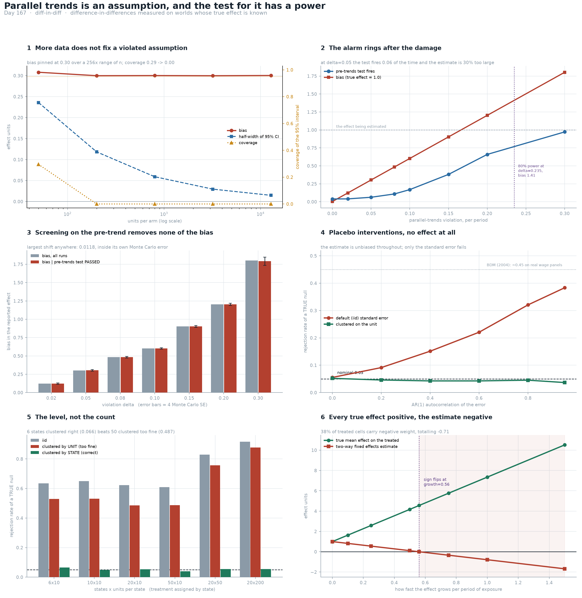

# Diff In Diff

[](https://colab.research.google.com/github/phoebefu6/phoebe-the-builder/blob/main/data-science-cookbook/diff-in-diff/demo.ipynb)
[](https://mybinder.org/v2/gh/phoebefu6/phoebe-the-builder/main?labpath=data-science-cookbook/diff-in-diff/demo.ipynb)

> We could not randomise this one, so we compared the change in the group that got the policy against the change in the group that did not, and checked that the lines looked parallel beforehand. That check is a hypothesis test, and a hypothesis test has a power - this one is nearly blind to exactly the violation that ruins the answer.

**Day 167 - Data Science Cookbook.** Difference-in-differences measured on worlds whose true treatment effect is known to be 1.00: what the pre-trends plot can actually see, what screening on it is worth, what serial correlation does to the standard error, why the clustering *level* matters more than the count, and how two-way fixed effects returns a negative coefficient on a panel where every single true effect is positive. 44 tests, a six-panel figure, and a notebook that rebuilds all of it from numpy and scipy.



> **The bias has no `n` in it.** Break parallel trends with a per-period slope `δ` on the treated group and the bias is exactly `δ × (mean post period − mean pre period)`. At `δ = 0.05` on a 12-period panel that is **0.300** against a true effect of 1.00, and it stays at **0.3004** across a 256-fold range of sample size while the standard error falls from **0.1203** to **0.0075**. Coverage of the 95% interval goes **0.295 → 0.000**. A bigger sample does not make a DiD more credible - it makes the same wrong number more precise, until the interval stops containing the truth at all.
>
> **The alarm rings after the damage.** The joint Wald test on four lead coefficients is correctly calibrated (size **0.039** under the null). At `δ = 0.05` - already 30% bias, coverage already **0.052** - it fires **0.062** of the time, barely above its own false-alarm rate. At `δ = 0.10` the estimate is 60% too large and the test still *passes* **83%** of the time. The violation it detects 80% of the time is `δ = 0.235`, by which point the estimate is **1.41** against a truth of 1.00. The pre-trends plot only becomes a reliable alarm once the answer it guards is off by more than the answer itself.
>
> **NEGATIVE RESULT: screening on the pre-trend removes none of the bias.** The number that matters is the bias among runs that *passed*, because those are the ones that reach a slide deck. At `δ = 0.05` it is **0.3031** against **0.3030** unconditional. Across every `δ` the largest shift conditioning produces is **0.0118**, which is **0.84** of its own Monte Carlo standard error - so the honest statement is that conditional and unconditional bias are the *same* to the precision this run can resolve, in either direction. Not "pre-testing helps a little", not "pre-testing hurts": it does nothing, because the test reads noise in the leads while the bias lives in the trend. This is the mechanism behind Roth's (2022) *pre-test with caution*, measured rather than cited.
>
> **What raises the power is time, not units - and it can be priced.** Five pre-periods gives power **0.075** at `δ = 0.05`, indistinguishable from the test's own size. Twelve gives **0.666**; 1,600 units per arm gives **0.678**. So going from 5 pre-periods to 12 buys what a **16-fold** increase in sample buys, and the pre-periods are usually already in the warehouse. Both levers work - that is the useful part, because it means "we only have four pre-periods" is a budgetable problem rather than a shrug.
>
> **NEGATIVE RESULT: serial correlation breaks the standard error on data with no effect at all.** Placebo interventions, true effect exactly zero. The estimate is fine everywhere (**+0.0011** at `ρ = 0.80`). The *default* standard error is not: a nominal 0.05 test rejects a true null **0.321** of the time at `ρ = 0.80` - **6.4x** nominal - and **0.383** at `ρ = 0.95`. Clustering on the unit returns it to **0.045**. This reproduces Bertrand-Duflo-Mullainathan (2004); their 0.45 came from real wage series with stronger dependence than a plain AR(1) produces, so treat this as a lower bound on what a real panel does to you.
>
> **NEGATIVE RESULT: the received warning is about the cluster COUNT, and the failure is the LEVEL.** Tested directly, the cluster-robust test with a `t(G-1)` reference is close to correct all the way down to **six** clusters (**0.0545**) when treatment varies at the level being clustered - the 42-cluster rule of thumb simply did not bite in this design. Now assign the policy to a **state**, make the rows people, and cluster on the row: **0.486** against a nominal 0.05. Clustering by state gives **0.053**. The unit-clustered SE recovered only **24%** of the distance from the iid SE (0.623) to correct, so "we clustered our standard errors" is not a statement about anything until it says *what by*. And it gets **worse with data** - 200 units per state instead of 10 takes it from **0.486** to **0.878**, because extra rows inside a state carry no extra information about the state and the wrong formula counts them anyway. **Six states clustered right (0.066) beats fifty clustered one level too fine (0.487) by a factor of 7.**
>
> **NEGATIVE RESULT: every true effect positive, the estimate negative.** With staggered adoption and an effect that *grows with exposure* - the most ordinary heterogeneity there is - FWL gives `E[β_twfe] = Σ w_it τ_it` with `w_it = D̃_it / ΣD̃²`, and `Σ w_it = 1` exactly (verified to **1.000000000000000**, identity closing to **3.9e-16**). Nothing makes an individual weight positive. On a two-cohort panel, **38.5%** of treated cells carry negative weight, totalling **−0.714**. The smallest true effect in the data is **1.00**, the largest **8.50**, the mean **4.173** - and TWFE returns **0.107**, outside the range of every individual effect in the panel. Push exposure growth past **0.560** per period and the coefficient is *negative* while every true effect is strictly positive. Every negative weight sits in one block: the early cohort's periods after the late cohort adopts, where an already-treated group is serving as the control.
>
> **The design's fragility is computable before the outcome column is opened.** Minimising `Var(τ)` subject to `Σ w τ = 0` and `mean(τ) = ATT` gives `sd_min = |ATT| · sd(w) / |mean(w) − Σw²|`, linear in the ATT - so the number worth quoting is the ratio. This design tolerates heterogeneity only up to **0.409 ×** its own ATT; referenced to the true ATT of 4.17 that is sd **1.71**, and the panel carries **2.14**. The ratio comes from the adoption dates alone.
>
> **The fix is a `WHERE` clause.** Estimate each cohort against units **not yet treated** at `t`, base period `g−1`, then average over treated cells. On a panel carrying a never-treated cohort: truth **4.1731**, TWFE **2.5726** (−38.4%), not-yet-treated ATT **4.1731** (gap **0.00e+00**). With noise over 400 draws: TWFE bias **−1.594**, ATT bias **+0.005**, at **2.2x** the standard deviation. The correction costs some variance and removes all of the bias. Where no clean comparison exists, the effect honestly *cannot* be estimated - which is information, and is exactly what TWFE spends a negative weight to paper over.
>
> **NEGATIVE RESULT: levels and logs are different assumptions, and they disagree on the SIGN.** Parallel in levels and parallel in logs both hold only if `(Yt0 − Yc0)(Yc1/Yc0 − 1) = 0` - i.e. only if the groups start level or the control does not move. With a control going 100→120 and a treated baseline of 200, the two counterfactuals are **220.0** and **240.0**, so every observed value in between makes the levels DiD positive and the log DiD negative. Two worlds, 1,500 draws each: in A (multiplicative trend, true effect −5%) the log spec is right **100%** of the time and the levels spec calls it positive **100%** of the time; in B (additive trend, true effect +10 units) it reverses exactly. Sign clash **100%** in both. Same estimator, same three lines of code, opposite verdict on the direction of a policy.
>
> **And that last one is the only assumption here that is genuinely testable.** A wrong scale *is* a parallel-trends violation, so unlike the assumption itself it leaves a footprint in the pre-period whenever the common trend moves during it. Run the joint lead test on `Y` **and** on `log Y`: in world A it fires **1.000** on levels and **0.035** on logs; in world B, **0.032** and **0.999**. The scale that passes its own pre-trend test is the scale the data supports, and it costs one extra line. Caveat with teeth: on a **flat** pre-period both scales pass, both stay defensible, and the sign of the reported effect becomes the analyst's choice rather than the data's.

## Business Impact

- **Before:** a DiD lands as a coefficient, a star, and a pre-trends plot that "looks flat". None of those three carries the information needed to believe it: the plot's power is unstated, the standard error's clustering level is unstated, and if adoption was staggered the coefficient can be outside the range of every effect in the data - possibly with the wrong sign.
- **After:** the report carries the pre-window length and the smallest violation it could have caught; the bias that the smallest *undetectable* violation would imply, in the units of the effect; what the SE is clustered by and why; for staggered designs the negative-weight share, the heterogeneity tolerance ratio, and the not-yet-treated estimate printed beside the TWFE one; and the outcome scale argued for before the regression, with its pre-trends test run both ways.
- **Estimated ROI:** the failures avoided are the whole return. A 30% overstatement that survives its own diagnostic and gets *more* significant with sample size; a placebo test that fires 32% of the time at a nominal 5%; a wrong-level cluster that gets worse as the dataset grows; a sign-flipped policy verdict from a staggered rollout. Every one of them is a property of the **design**, computable from the adoption dates and the panel shape before the outcome column is opened - and none of them shows up in the regression output.

## Where this sits

Fourth build in **experimentation and causal inference**. [`peeking-cost`](../peeking-cost/) (Day 164) priced *when you look*; [`srm-detector`](../srm-detector/) (Day 165) asked what a clean check on *who ended up in which arm* is worth; [`cuped-variance`](../cuped-variance/) (Day 166) asked how to need *fewer users*. All three assumed randomisation held. **This is the first one that does not** - and the assumption that replaces it cannot be tested, only bounded.

It is **not** [`ab-test-calc`](../../analytics-accelerator/ab-test-calc/) (Day 23, runs one clean test), not [`stat-test-advisor`](../stat-test-advisor/) (Day 111, which test), and nothing to do with [`schema-diff`](../../data-infra-toolkit/schema-diff/), [`data-diff`](../../data-quality-governance/data-diff/) or [`metric-diff`](../../analytics-engineering-bi/metric-diff/) - those compare rows, this compares *changes*. The seam worth noticing: Day 164 found that a valid 0.05 test can still overstate an effect by 50%, and Day 165 found that a passing health check is not evidence. This build is the same shape a third time - a correctly calibrated diagnostic that is nearly blind to the thing it is there to catch - which is starting to look less like three coincidences and more like the default state of a published robustness check.

## Tech Stack

Python 3.10+, numpy, scipy, pandas, matplotlib, Streamlit, pytest. No data files, no API keys, no network.

## What it does

Eight sections in `evidence.py`. Every number above is printed by it and asserted in `test_did.py`.

### 1. The estimator is an identity plus one assumption

Four means. Under parallel trends, unbiased - and with one common adoption date the four-means estimator and the two-way FE regression are the *same* estimator to **1.8e-15**, so the regression buys standard errors and not identification. Then the bias closed form, and the coverage collapse as `n` grows.

### 2. What the pre-trends test can see

Size under the null, power against the violation, and the bias the same violation produces - side by side. Plus the exchange rate between pre-periods and units, so "we only have four pre-periods" becomes a budget question.

### 3. Pre-testing is not a filter

The bias among runs that *passed*, against its own Monte Carlo error. The disciplined finding is a null: the screen is uncorrelated with the harm, so it cannot remove the harm, and this run cannot resolve a direction.

### 4. Serial correlation breaks the standard error

Placebo interventions on AR(1) panels, `ρ` from 0.0 to 0.95. The estimate never moves; the default SE fails badly and the cluster-robust one holds.

### 5. The clustering level, not the count

Two experiments: few clusters *at the level treatment varies* (fine down to six), and the same test *one level too fine* (10x over-rejection, worse with more data).

### 6. Staggered adoption and negative weights

The FWL weight identity, checked to machine precision; where the negative weights sit and why; the exposure-growth rate at which the sign flips; and the heterogeneity tolerance ratio derived from the weights alone.

### 7. The fix

Group-time ATT against not-yet-treated units. Exact recovery without noise, unbiased with it, and an explicit note on what happens when no clean comparison exists.

### 8. Levels or logs

The impossibility condition, the counterfactual window where the two specs disagree in sign, two mirror-image worlds where each spec is wrong in exactly one - and the one diagnostic in this whole build that actually works.

## Run it

```bash
pip install -r requirements.txt
python evidence.py                 # the eight-section measurement, ~70s
python -m pytest -q test_did.py    # 44 assertions behind every number
python make_chart.py               # the six-panel figure
streamlit run app.py               # drive a design and watch what it can/cannot see
```

**[Run the interactive demo notebook →](demo.ipynb)** - pre-rendered with outputs, or click the Colab/Binder badges above to run it live.

## Learning Connection

Built while working through causal inference for non-randomised settings. Applies: the Frisch-Waugh-Lovell theorem as a practical tool rather than a lemma (every estimator here is a two-way within transform plus one regressor); pre-test power as a first-class quantity; cluster-robust inference and the level at which treatment actually varies; and the modern staggered-DiD literature - Goodman-Bacon (2021) and de Chaisemartin & D'Haultfœuille (2020) on TWFE weights, Callaway & Sant'Anna (2021) on group-time ATT, Roth (2022) on pre-testing, Bertrand-Duflo-Mullainathan (2004) on serial correlation. The weight identity and the heterogeneity bound are rederived in `did.py` rather than quoted, which is why they can be checked to 1e-16.

## Impact Note

- **Who benefits:** anyone reporting the effect of something that could not be randomised - a policy rollout, a pricing change by region, a feature shipped market by market - and anyone reviewing such a claim who wants to know which of its numbers are load-bearing.
- **Potential risks:** the sharpest one is misreading section 3. "Pre-testing does nothing" is a finding about a *screen*, not permission to skip the pre-trends plot: the plot still shows the shape of a violation, and section 8 shows the one case where it is decisive. The second is treating the tolerance ratio (0.409 here) as a property of DiD rather than of this particular design - it is computed per design, and yours may be far more or far less robust. The third is the reverse of the first: nothing here says DiD is unusable. It says the assumption is untestable, its diagnostic is weak, and the honest response is to publish the bound rather than the reassurance.
