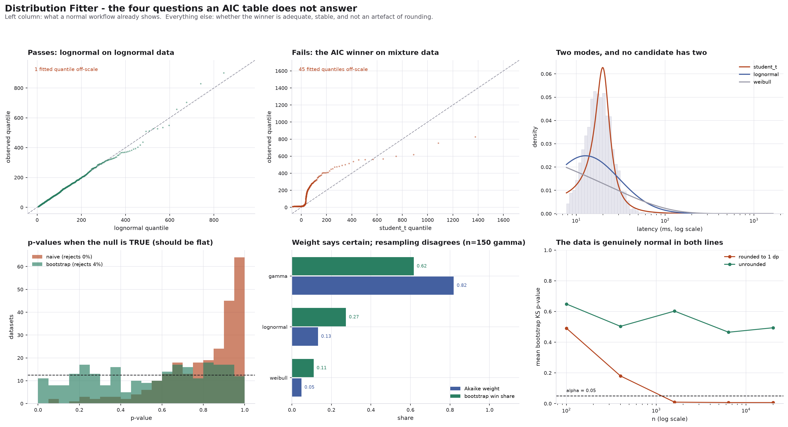

# Distribution Fitter

[](https://colab.research.google.com/github/phoebefu6/phoebe-the-builder/blob/main/data-science-cookbook/distribution-fitter/demo.ipynb)
[](https://mybinder.org/v2/gh/phoebefu6/phoebe-the-builder/main?labpath=data-science-cookbook/distribution-fitter/demo.ipynb)

> Fitting ten distributions and ranking them by AIC is four lines of scipy. The ranking will always produce a winner - including when the data came from something that is not on the list. AIC answers a relative question and gets read as an absolute one, and the goodness-of-fit test people reach for to check it is silently broken by the act of fitting.

**Day 136 - Data Science Cookbook.** MLE fits for ten families, AIC/AICc/BIC ranking, a parametric-bootstrap KS test that is actually calibrated, bootstrap selection stability, and a verdict that is willing to say nothing fits.



## Business Impact

- **Before:** an analyst fits candidates with `scipy.stats.<dist>.fit`, ranks by AIC, sees `lognormal` on top with an Akaike weight of 1.00, sanity-checks it with `ks_1samp(x, dist.cdf, args=params)`, gets p = 0.90, and ships the fitted quantiles into a capacity model. Every step of that is standard practice. Two of them are wrong.
- **After:** the same table, plus an absolute test that a wrong family fails, plus a resampled win share, plus a verdict that distinguishes "this is the distribution" from "this is the nearest thing in a list that does not contain the distribution".
- **Estimated ROI:** on the bundled bimodal latency column, the AIC winner arrives with weight **1.000** and a **100%** bootstrap win share - and understates the p99 by **30%** while overstating the p99.9 by **490%**. Nothing in the AIC table flags it; the absolute test rejects every candidate at the resolution floor.

## What it does

Five mechanisms, in the order they matter.

### 1. The naive KS p-value has no power once you fit the parameters

`scipy.stats.ks_1samp(x, dist.cdf, args=fitted_params)` compares the data against a CDF **that was chosen to be close to that data**, then judges the distance against a reference distribution that assumes the parameters were fixed in advance. Estimation shrinks the distance; the reference does not know that.

Simulate 200 datasets **from the family being tested**, so the null hypothesis is true by construction. A calibrated test rejects 5% of the time and its p-values are uniform, averaging 0.5:

```
setting                         n  reject naive   reject boot   mean p nv   mean p bt
-------------------------------------------------------------------------------------
normal (null is true)         200         0.000         0.025       0.806       0.533
lognormal (null is true)      200         0.000         0.033       0.780       0.473
normal on student_t data      400         0.530         0.970       0.088       0.013
-------------------------------------------------------------------------------------
rows 1-2: null TRUE, target = alpha. row 3: null FALSE, higher is better.
```

The naive test rejects a true null **0.0%** of the time and averages **0.79** instead of 0.5. That is not conservatism you can bank - it is estimation shrinkage showing up as fake evidence *for* the null, and a test that never rejects a true null has no power left for a false one. On row 3, where rejection is the correct answer, it finds **53%** of the departures the bootstrap finds **97%** of.

The fix is a parametric bootstrap, and the whole content of the fix is one word - **refit**:

```python
for b in range(B):
    xs    = dist.rvs(*fitted_params, size=n)   # simulate from the fitted model
    fit_b = dist.fit(xs)                       # <-- refit, on the simulated sample
    D_b   = ks_distance(xs, dist.cdf, fit_b)   # this D enjoys the same shrinkage
```

Simulating and then comparing against the *original* fitted CDF reproduces the textbook null and is just as wrong. Refitting each replicate reproduces the shrinkage the observed distance also got, which is what makes the two comparable. (This is the Lilliefors construction, generalised past the normal.) The p-value uses the add-one estimator `(1 + #{D_b >= D_obs}) / (1 + B)`, because with B replicates you cannot resolve below `1/(B+1)` and the number should not pretend otherwise.

### 2. AIC always produces a winner, including when nothing fits

`latency_ms` in the bundled book is a two-component mixture - a fast path and a slow path. No single-family fit can represent that, and the candidate list contains no mixtures. AIC does not care:

```
family        k      logLik         AIC     dAIC  weight    KS D  p naive  p boot   win%
----------------------------------------------------------------------------------------
student_t     3    -5287.23    10580.45     0.00   1.000  0.1459    0.000   0.005   100% *
lognormal     2    -5533.77    11071.54   491.09   0.000  0.2262    0.000   0.005     0% *
pareto        2    -5625.28    11254.57   674.11   0.000  0.2954    0.000   0.005     0% *
...
----------------------------------------------------------------------------------------
* rejected by the bootstrap KS test at alpha=0.05
excluded: beta         1200 value(s) outside (0, 1)
```

Weight 1.000, win share 100%, delta-AIC of 491 to the runner-up. Every confidence signal an AIC table can emit is maxed out, and the answer is wrong. The clean lognormal column produces **the same shape of output** - the `p boot` column is the only one that separates them.

So the tool leads with the verdict rather than the ranking:

> **NO ADEQUATE FIT.** Every candidate is rejected by the bootstrap KS test at alpha=0.05. `student_t` is the AIC winner, which makes it the least-bad of a set that does not contain the answer - a ranking, not a fit.

**And "least-bad" is not harmless**, because nobody ships a distribution - they ship a tail quantile off it:

```
family                         p99       err       p99.9       err
------------------------------------------------------------------
student_t   AIC winner       355.7      -30%      5577.3     +490%
lognormal                    214.8      -58%       421.2      -55%
weibull                      280.1      -45%       452.9      -52%
gamma                        250.9      -51%       380.1      -60%
------------------------------------------------------------------
empirical p99 = 510.4, empirical p99.9 = 944.7
```

Every candidate understates p99 by 30-58%; the winner then overstates p99.9 by nearly 6x while the others halve it. There is no safe direction to round and no constant to multiply by.

### 3. Support is a constraint, not a nuisance

A lognormal cannot describe a column containing zero - not "fits badly", *cannot*, because the density is zero below the origin. The tempting move is to drop the offending rows and fit anyway, which silently changes the dataset: an AIC computed on 419 rows is not comparable to one computed on 900.

Out-of-support families are therefore **excluded with a reason**, and the reason names the row count so you can tell a real constraint from a data bug:

```
excluded: lognormal    481 value(s) <= 0; support is x > 0
excluded: beta         481 value(s) outside (0, 1)
```

The same accounting discipline applies inside the table. scipy always returns a `loc` and a `scale` whether or not they were free, so a family fit with `floc=0` returns three numbers while estimating two. Miscounting that shifts the family's AIC by exactly 2 per parameter - the same size as the "delta-AIC > 2" rule everyone uses to declare a winner. There is a test that checks the declared `n_free` against what scipy actually estimated, for all ten families.

### 4. A free location parameter rewards the wrong family more than the right one

`lognorm.fit(x)` estimates three parameters, not two. Positive-support families here are fit with `floc=0`, and that choice is worth defending. Below: data generated from `gamma(2.4, scale=18)` with **loc = 0**, so the third parameter has nothing to find.

```
family      role             dlogLik     AIC pin    AIC free   loc hat    min(x) AIC pick
-----------------------------------------------------------------------------------------
gamma       true family         0.00     11107.4     11109.4     0.044     1.668   pinned
lognormal   wrong family       45.22     11223.7     11135.3   -13.370     1.668     free
weibull     wrong family        -inf     11112.4         inf     2.876     1.668  INVALID
-----------------------------------------------------------------------------------------
```

Three different failures, none of them "it recovers zero":

- **gamma** is the true family. The parameter buys ~0 log-likelihood, so AIC's +2 penalty correctly rejects it. This is the case the textbook describes.
- **lognormal** is wrong, and the shift lets it imitate a gamma - so it gains **45 log-likelihood units** and its 3-parameter version beats its own 2-parameter version by 88 AIC points. The reward for the extra parameter **scales with how wrong the family is**, which is precisely backwards in a contest meant to identify the right one.
- **weibull** is worse than either. The 3-parameter MLE is unbounded as `loc` approaches `min(x)` from below; the optimiser walks toward that singularity and steps over it, returning `loc = 2.876` against `min(x) = 1.668`. Observed data points then have zero density under the fitted model and the log-likelihood is `-inf`. It is not a bad fit - it is not a probability model for this data at all.

Mixing pinned and unpinned fits in one AIC table scores all three of these against each other as though they were comparable.

### 5. Goodness of fit is a question about n

Every real measurement is rounded - prices to cents, durations to milliseconds, ages to years. Rounding makes the data discrete, which makes the ECDF a step function with visible jumps, which inflates the KS distance for reasons that have nothing to do with shape.

Below, the data is **genuinely normal in every row**. Only `n` and the rounding change:

| n | rounding | tie fraction | KS D | p bootstrap | verdict |
|---|---|---|---|---|---|
| 100 | 1 dp | 0.630 | 0.0887 | 0.085 | keep |
| 400 | 1 dp | 0.877 | 0.0378 | 0.169 | keep |
| 1600 | 1 dp | 0.963 | 0.0399 | **0.005** | **REJECT** |
| 6400 | 1 dp | 0.989 | 0.0234 | **0.005** | **REJECT** |
| 20000 | 1 dp | 0.996 | 0.0220 | **0.005** | **REJECT** |
| 20000 | none | 0.000 | 0.0052 | 0.254 | keep |

The KS distance barely moves. The reference distribution shrinks like `1/sqrt(n)` while the rounding artefact stays put, so past roughly n=1600 the true family is rejected on the rounding alone - and the unrounded control at the same n is not.

This is not a bug in the test. It is the test correctly answering a question nobody wanted to ask. Past a few thousand rows, "is this exactly normal" is always answerable and always no; the useful question becomes "is the departure big enough to matter downstream", which is about your loss function, not a p-value. Hence the tie diagnostic runs *before* anything else and says so in plain words:

```
n = 1200,  unique = 452,  tie fraction = 0.623
values are rounded to 1 decimal place(s) - the data is discrete, every continuous fit
is an approximation
WARNING: heavy ties. The KS statistic is inflated by the ECDF's jumps regardless of
shape, so a rejection here is evidence about rounding, not about the family.
```

### Plus: Akaike weight vs bootstrap selection stability

The Akaike weight is a transformation of one dataset's delta-AIC, routinely read as "the probability this is the best model". The bootstrap win share measures that intent directly - resample the rows, rerun the whole comparison, count first places:

```
      n  AIC winner   dAIC(true)    w(true)   win%(true) win%(winner)
---------------------------------------------------------------------
    100  gamma              0.00      0.719          44%          44%
    400  weibull            1.41      0.331          38%          62%
   1600  gamma              0.00      0.999          87%          87%
   6400  gamma              0.00      1.000         100%         100%
---------------------------------------------------------------------
true family = gamma
```

The n=400 row is the useful one. The AIC winner is **weibull**, with the true gamma trailing by dAIC = 1.41 - under the usual "delta below 2 means indistinguishable" convention, a tie you would report as a tie. The win shares say something more actionable: neither family holds a majority, so there is no winner to report at all. On a separate n=150 gamma sample the weight puts **0.82** on gamma while resampling has it winning **0.62** of the time; twenty points of confidence that exist only because the delta was computed once.

The verdict refuses to call a winner "stable" below a 60% win share, and says so in the sentence rather than in a footnote.

## The sample book

Four generated telemetry columns, each carrying a different lesson, and four genuinely different verdicts:

| column | truth | what the tool says |
|---|---|---|
| `session_seconds` | lognormal | `lognormal`, not rejected (p=0.65), stable at 100% |
| `basket_value` | gamma, rounded to cents | `gamma`, not rejected (p=0.30), 86% stable, **with a ties warning** |
| `latency_ms` | two-component mixture | **NO ADEQUATE FIT**; winner labelled least-bad |
| `daily_return` | Student-t (df=4) | `student_t`, not rejected; `normal` rejected, and `logistic` rejected at p=0.015 despite a naive p of 0.47 |

That last one is the quiet case. A conventional goodness-of-fit check keeps `logistic` for a returns model, where the tail is the entire point.

## Tech Stack

Python 3.10+, numpy, scipy, matplotlib, pandas, Streamlit, Docker. No database, no network, no sklearn. The fitting core is `scipy.stats` plus 700 lines of accounting, and 530 lines of tests holding it to its claims.

## Demo

**[Run the interactive demo notebook →](demo.ipynb)** - pre-rendered with all outputs and five charts, or click the Colab/Binder badges above to run it live. The notebook writes `fitting.py` and `evidence.py` to disk from embedded source, so it is self-contained without a clone step and there is no second copy of the logic to drift.

For the Streamlit app:

```bash
pip install -r requirements.txt
streamlit run app.py
```

Reproduce every number above:

```bash
python3 test_fitting.py     # 22 tests over the fitting core
python3 test_evidence.py    # 10 tests over the experiments
python3 make_chart.py       # the six-panel audit figure
```

## Files

| file | what it is |
|---|---|
| `fitting.py` | families, MLE fits, information criteria, bootstrap KS, selection stability, diagnostics, verdict |
| `evidence.py` | the six experiments the README quotes, each seeded and parameterised |
| `test_fitting.py` | 22 tests, including the free-parameter accounting check and the calibration claim |
| `test_evidence.py` | 10 tests asserting the *direction* of each effect, not the noisy magnitude |
| `app.py` | Streamlit UI - verdict first, ranking second |
| `make_chart.py` | the audit figure |
| `build_notebook.py` | generates `demo.ipynb` with both modules embedded |

## Learning Connection

Built while working through goodness-of-fit theory and the model-selection literature - specifically Lilliefors' correction for estimated parameters, and Burnham & Anderson on what Akaike weights are and are not conditional on.

Applies: parametric bootstrap construction, type-I error calibration as a testable property, nested-model parameter accounting, boundary MLE pathologies, and the general habit of pairing every relative measure with an absolute one.

## Impact Note

- **Who benefits:** anyone reading a tail quantile off a fitted distribution - capacity planning, SLA setting, risk modelling, simulation input modelling, insurance severity curves.
- **Potential risks:** the bootstrap KS test is calibrated for *continuous* families with parameters estimated by MLE from the same sample. It is not valid for heavily tied data (the tool warns and tells you to read the ranking instead), for censored or truncated samples, or for parameters estimated by anything other than the fit used inside the bootstrap loop. "Not rejected" means not rejected at this sample size - it is never a proof of the family, and at large n it will reject the truth over an artefact you do not care about. The candidate set is also a choice: none of these ten families is a mixture, and the tool can only ever tell you that your list is inadequate, never what should have been on it.

---

Part of [phoebe-the-builder](https://github.com/phoebefu6/phoebe-the-builder) - Day 136, Data Science Cookbook.
