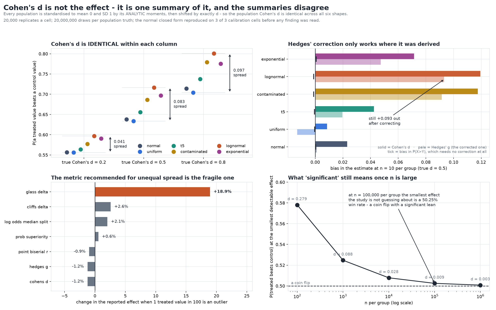

# Cohen's d Is Not the Effect. It Is One Summary of It, and the Summaries Disagree

[](https://colab.research.google.com/github/phoebefu6/phoebe-the-builder/blob/main/data-science-cookbook/effect-size-reader/demo.ipynb)
[](https://mybinder.org/v2/gh/phoebefu6/phoebe-the-builder/main?labpath=data-science-cookbook/effect-size-reader/demo.ipynb)

> "d = 0.5, a medium effect" is read as a fact about how big something is - so this holds d exactly fixed, changes nothing but the shape of the distribution, and asks the other effect-size metrics whether they agree.



## The trick that makes this measurable

Every population here is standardised to population mean 0 and population SD 1 using its
**analytic** moments - never sample ones - and the treated group is then shifted by exactly `d`.
So the population Cohen's d is **exactly `d` for every shape**: normal, uniform, heavy-tailed,
contaminated, skewed, all of them.

That means any disagreement between the other metrics cannot be a difference in how big the effect
is. It is the metrics answering different questions.

Calibration first: for normal data the probability of superiority has a closed form,
`Phi(d/sqrt(2))`, and the reference sampler reproduces it on **3 of 3** cells to within Monte Carlo
error. No other shape has a closed form, which is why the rest of this build exists.

The four sibling builds in this domain ([`t-test-variants`](../t-test-variants),
[`normality-test-trap`](../normality-test-trap),
[`assumption-pretest-cost`](../assumption-pretest-cost), [`p-value-dance`](../p-value-dance)) all
interrogate the **test**. This one leaves the test alone and interrogates the **estimate**.

## What it found

### 1. One effect size, six shapes, six different answers

P(a treated value beats a control value), at population truth, 20,000,000 draws each:

| shape | d = 0.2 | d = 0.5 | d = 0.8 |
|-------|--------:|--------:|--------:|
| normal | 0.5564 | 0.6381 | 0.7142 |
| uniform | 0.5562 | 0.6338 | 0.7042 |
| t5 | 0.5638 | 0.6557 | 0.7377 |
| contaminated | 0.5773 | 0.6862 | 0.7791 |
| lognormal | 0.5968 | **0.7166** | 0.8010 |
| exponential | 0.5907 | 0.6967 | 0.7754 |
| **spread** | **0.041** | **0.083** | **0.097** |

A "medium" effect of d = 0.5 is routinely glossed as *"the treated case beats the control about
64% of the time"*. That is correct for normal data and for nothing else here. On lognormal data
the same d means **71.7%**.

**This differs from what the sibling `normality-test-trap` found about the t-test.** There,
symmetric non-normality was harmless and skew was the whole problem. Here both matter and both
move the answer the *same way* - the contaminated population is perfectly symmetric and still
reads 0.686 against normal's 0.638. A heavy tail inflates the SD that d divides by, so a shift of
"one d" is a larger shift relative to the bulk of the distribution, where the comparisons actually
happen. **Robustness of the test and robustness of the effect size are different questions.**

### 2. Hedges' correction only works where it was derived

Cohen's d is biased upward at small n and Hedges' *g* corrects it - under normality. Bias at
n = 10, true d = 0.5:

| shape | d-hat bias | g bias | P(X>Y) bias | correction removed it? |
|-------|-----------:|-------:|------------:|:----------------------:|
| normal | +0.0232 | +0.0011 | +0.0003 | yes |
| uniform | +0.0085 | −0.0130 | −0.0004 | no (overshoots) |
| t5 | +0.0425 | +0.0196 | −0.0006 | no |
| contaminated | +0.1176 | +0.0915 | −0.0011 | no |
| lognormal | +0.1194 | **+0.0932** | −0.0011 | no |
| exponential | +0.0715 | +0.0473 | +0.0007 | no |

On lognormal data the *corrected* estimate is still +0.093 out. The excess comes from the sample
SD, which a skewed sample underestimates in exactly the draws where the sample mean is also low.
Meanwhile **P(X>Y) is unbiased to within 0.0011 on every shape at n = 10** - the rank summary
needs no small-sample correction because it never divides by an estimated SD.

**Negative result:** the noise swamps the bias anyway. At n = 20 on normal data the bias in d-hat
is +0.0108 while its standard deviation across replicates is 0.334 - a ratio of 3.2%. Applying
Hedges' correction and then reporting a point estimate with no interval is polishing the third
decimal of a number whose first decimal is not settled.

### 3. The metric recommended for unequal spread is the one that breaks

1% of the treated values replaced with +10 SD, pointing the *same way* as the effect:

| metric | change |
|--------|-------:|
| **glass delta** | **+18.9%** |
| cliffs delta | +2.6% |
| log odds median split | +2.1% |
| prob superiority | +0.6% |
| point biserial r | −0.9% |
| hedges g | −1.2% |
| cohens d | −1.2% |

Glass's delta divides by the **control** group's SD, which the contamination never touches - so
the numerator grows and the denominator does not. Cohen's d barely moves, because its pooled SD
absorbs the same outlier that inflated the mean. The safer-sounding choice is the fragile one, and
it fails upward: it reports a *larger* effect.

### 4. What "significant" is still capable of meaning

| n per group | smallest d at 50% power | as a win rate |
|------------:|------------------------:|--------------:|
| 100 | 0.279 | 57.8% |
| 1,000 | 0.088 | 52.5% |
| 10,000 | 0.028 | 50.8% |
| **100,000** | **0.0088** | **50.25%** |
| 1,000,000 | 0.0028 | 50.08% |

At n = 100,000 per group the smallest effect the study is not guessing about is a **50.25% win
rate** - a coin flip with a statistically significant lean. Going the other way: d = 0.01 needs
**156,979 per group** for 80% power, and d = 0.2 needs 394.

**A defect this build hit and nearly shipped.** `scipy.stats.nct` (1.17.1) returns **nan** - not
an error, not a warning - at 3 of the sample sizes probed, from n = 1,000 to n = 10,000. A nan is
silently `False` in every comparison, so `power >= target` reads as *"not powerful enough"* and a
monotone binary search walks straight past the answer and returns a larger, entirely plausible
number. The first version of this table said d = 0.5 needs **n = 11,417** per group. The real
answer is 64.

The fix is a normal-approximation fallback, trusted only because it is measured: across every n
where the exact form *is* finite the two formulas differ by at most 0.0164 (at n = 5), and once
df ≥ 400 - far below where the nan band starts - by at most **4.6e-05**. The search is now a
helper that asserts its own monotonicity at both ends and raises rather than returning a number.

### 5. "Never dichotomise" is a claim about normal data

True d = 0.4, n = 200. A null cell is run first, and a power comparison is only read where **both**
tests hold a nominal 5% - an over-rejecting test detects more of everything, so its power lead
would be the inflation restated.

| shape | power, t-test | power, median split | winner | split has the power of |
|-------|-------------:|--------------------:|:------:|----------------------:|
| normal | 0.9767 | 0.8996 | t | n = 133 (33% thrown away) |
| uniform | 0.9784 | 0.6608 | t | n = 72 (64% thrown away) |
| t5 | 0.9760 | 0.9775 | – | n = 198 |
| exponential | 0.9785 | 0.9807 | – | n = 204 |
| contaminated | 0.9750 | 0.9961 | **split** | n = 269 (**35% more** data) |
| lognormal | 0.9708 | 0.9980 | **split** | n = 295 (**48% more** data) |

Only **6 of 12** rows are comparable at all, and the reason is itself a finding: the median-split
test is **anticonservative at n = 50**, rejecting a true null at 0.0696–0.0736 against a nominal
0.05, on every shape tested. Before dichotomising costs you any power, it costs you the error rate
you thought you had.

Among the readable rows the t-test wins 2 and the split wins 2. The rule is real - it is just not
a rule about dichotomisation. It is a rule about matching the yardstick to the shape of what you
measured, which is what section 1 said in different words.

## The through-line

Every finding here is the same mistake in a different costume: treating a **summary** as if it
were the **thing**.

| what gets said | what was actually measured |
|----------------|----------------------------|
| "d = 0.5, a medium effect" | a ratio whose denominator means six different things |
| "we used Hedges' g, which is unbiased" | unbiased on normal data; +0.093 out on skewed data |
| "we used Glass's delta because the variances differ" | the metric that moves 19% on one bad value |
| "p < 0.05, so it's real" | at n = 100,000, a 50.25% win rate |
| "we dichotomised, which is conservative" | a test running at 0.07 under a true null |

## Business Impact
- **Before:** an effect size is reported as one number with a Cohen benchmark attached, and the
  reader converts it to an intuition ("beats the control about two-thirds of the time") that is
  only valid for a distribution nobody checked.
- **After:** the magnitude is reported in units the reader can act on - a win rate - with the
  shape stated, an interval attached, and the metric chosen to match the data rather than the
  convention.
- **Estimated ROI:** ~2 hours/week of re-litigated results per analyst, and the larger saving is
  the decisions not taken on a "large effect" that was a heavy tail in the denominator.

## Tech Stack
Python 3.11, NumPy, SciPy (`mannwhitneyu`, `ttest_ind`, `nct`, `norm`), pandas, matplotlib,
Streamlit, pytest, Docker. No data files - every number is generated from a seed.

## Demo

**[Run the interactive demo notebook →](demo.ipynb)** - pre-rendered with outputs, or click the
Colab/Binder badges above to run it live.

For the Streamlit app:
```bash
pip install -r requirements.txt
streamlit run app.py
```

Regenerate everything:
```bash
python evidence.py        # -> evidence.txt, results.json
python make_chart.py      # -> effect_size_reader_audit.png / .svg
python build_notebook.py && python -m nbconvert --to notebook --execute demo.ipynb --output demo.ipynb
pytest                    # 56 tests
```

## How this build is wired

- `effectsize.py` is the only engine, and it owns the **design lists** as well as the maths. The
  seed is the index into those lists, so the notebook, the chart and `evidence.txt` are reading
  one study rather than three samples of it.
- `demo.ipynb` embeds the engine **by AST extraction at build time**, so it holds the library's
  own source text character for character. A test executes that extracted block and checks every
  requested name survived - which is how the extractor's tuple-target bug
  (`BAND_LO, BAND_HI = ...` was silently dropped) went from a NameError several minutes into
  nbconvert to a one-second test failure.
- Every rate comparison goes through a **99% Wilson interval**, never a point estimate, and every
  power comparison is gated on both procedures controlling Type I.
- Every predicate a finding is stated as is shown **capable of returning either answer**. Both
  dichotomisation verdicts fire on real rows; the disagreement predicate is tested against shapes
  that genuinely agree.
- Seeds are **indices, never `hash()`**. An earlier draft seeded from `hash((shape, d))`, and
  Python salts string hashing per process - so the study silently produced different numbers on
  every run. `results.json` is now byte-identical across processes, and that is checked.

## Learning Connection
Built while studying effect-size reporting and the standardised-mean-difference literature
(Cohen's benchmarks and their non-empirical origin; Hedges' small-sample correction; Cliff's delta
and the common-language effect size; Cohen 1983 on the cost of dichotomisation). Applies:
population standardisation by analytic moments, Mann-Whitney U as a probability, noncentral-t
power, and the discipline of stating a finding as a falsifiable predicate rather than a paragraph.

## Impact Note
- **Who benefits:** anyone who reports or reads an effect size - analysts writing up experiments,
  PMs converting "d = 0.4" into an expected business impact, and reviewers deciding whether a
  result is worth acting on.
- **Potential risks:** read as "effect sizes are meaningless", this would do harm - the build
  argues the opposite. d is a perfectly good instrument with a stated denominator; the failure is
  reporting it without one. The fix is to name the metric, name the shape, and give the magnitude
  in units someone can act on, not to stop measuring magnitude.
